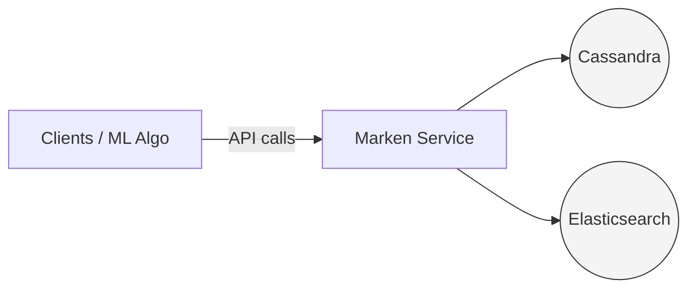
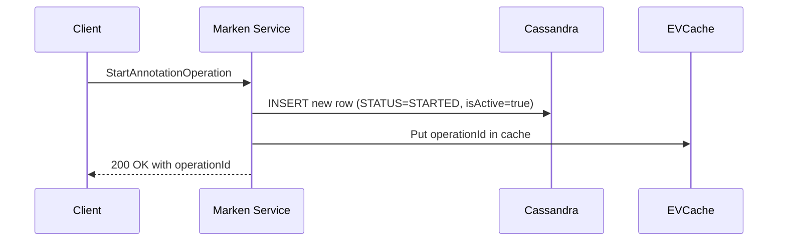
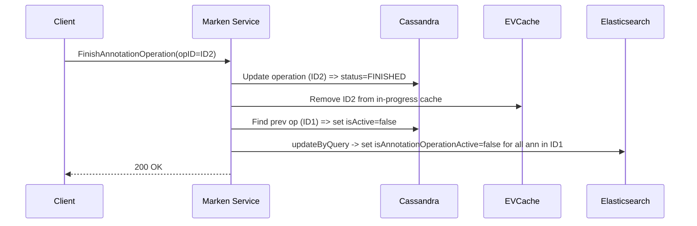

aliases: [Data Ingestion Pipeline, Operation Management, Netflix Marken, Cassandra & ES Architecture]
tags: [data engineering, big data, Cassandra, Elasticsearch, annotation operations, Netflix]
## Overview
This note provides a **technical deep dive** into how Netflix’s **Marken** service handles **data ingestion** using an **Operation Management** model to ensure **transaction-like** semantics for bulk annotation workflows. We discuss:

- **Annotations**  
- **Annotation Operations (Ops)**  
- **Cassandra & Elasticsearch** integration  
- **APIs** for starting, writing, and finishing operations  
- **Search** filtering logic (active/inactive states)  
- **Error handling** and **future plans**

---

## Table of Contents
1. [Introduction](#introduction)  
2. [Annotation Operations](#annotation-operations)  
3. [Marken Architecture](#marken-architecture)  
4. [Data Model & Cassandra Tables](#data-model--cassandra-tables)  
5. [Elasticsearch Indexing](#elasticsearch-indexing)  
6. [APIs & State Management](#apis--state-management)  
   - [StartAnnotationOperation](#startannotationoperation)  
   - [UpsertAnnotationsInOperation](#upsertannotationsinoperation)  
   - [FinishAnnotationOperation](#finishannotationoperation)  
   - [Search API](#search-api)  
7. [Error Handling & Resiliency](#error-handling--resiliency)  
8. [Future Work](#future-work)  

---

## Introduction
At Netflix, **media-focused machine learning algorithms** and other teams generate large volumes of **annotations** (e.g., objects recognized in a video, transcript segments, language tags, etc.). These annotations are stored in **Marken**, a system that uses:

- **Cassandra** as the **source of truth**  
- **Elasticsearch** for **rich, low-latency search**  

### Key Challenge
When new annotations (e.g., results from a ML model run) are generated:

- We want them to appear *atomically* once fully written, rather than partially overwriting old data.  
- We want to **avoid** updating or deleting old annotations mid-run.  

Hence, **Operation Management** ensures:

1. **Multiple** annotations can be created in a single “operation.”  
2. Clients only **see** new annotations once the entire operation is **finished**.  
3. Old annotations are **deactivated** in a single step.

---

## Annotation Operations
Consider a use case:  
1. **Algorithm run #1** detects 500 objects in a video → store as new annotations in Marken.  
2. **Algorithm run #2** (an updated model) detects 600 objects → store them as well.  

**Desired Behavior**:
- Before run #1 completes, no objects appear in searches.  
- After run #1 completes, 500 objects appear.  
- While run #2 is in progress (partial writes), searchers **still see** the old 500 objects.  
- After run #2 finishes, searches show 600 objects, and the old 500 are no longer “active.”

This resembles (though not exactly) a **distributed transaction**.  

### Naive Solutions
- Write different runs to **different databases** → too expensive, not scalable.  
- Write to **files** → low-latency search becomes challenging.  

### Why Cassandra & Elasticsearch?
- Marken uses Cassandra for high write throughput, linear scalability, and as the **source of truth**.  
- Elasticsearch provides advanced **search capabilities** (e.g., text, filters, aggregations) at **low latency**.

---

## Marken Architecture
The Marken architecture (simplified) can be visualized as follows:



- **Cassandra**: Stores **Annotation** and **AnnotationOperation** objects.  
- **Elasticsearch**: Indexes annotations for **search**.  

> **Goal**: Decouple **producer flows** (algorithm teams) from **consumer flows** (downstream apps) in a way that partial writes are invisible to consumers.

---

## Data Model & Cassandra Tables
An **Annotation Operation** object has:

```json
{
  "annotationOperationKeys": [
    {
      "annotationType": "string",           // ❶ e.g. "Objects"
      "annotationTypeVersion": "integer",   // version of the annotation schema
      "pivotId": "string",                  // e.g. file ID or SHA
      "operationNumber": "integer"          // ❷ auto-increment
    }
  ],
  "id": "UUID",                             // unique operation ID
  "operationStatus": "STARTED",            // ❸ can be STARTED, FINISHED, CANCELED
  "isActive": true                         // ❹ boolean indicating if operation is active
}
```

1. **AnnotationType**, **AnnotationTypeVersion**: Identify the schema.  
2. **PivotId**: Unique key identifying the file or variant.  
3. **OperationNumber**: Auto-increment for each new operation.  
4. **OperationStatus**: Workflow state.  
5. **IsActive**: Whether annotations from this operation are visible/searchable.

### Cassandra Tables
1. **AnnotationOperationById**  
   - Primary row for `AnnotationOperation` objects.
2. **AnnotationIdByAnnotationOperationId**  
   - Stores relationships between an operation ID and all annotation IDs associated with it.

> In addition, auxiliary tables may exist for reverse indexing or scanning all operations for admin jobs.

---

## Elasticsearch Indexing
Every annotation is **indexed** in Elasticsearch with two fields relevant for operation management:

1. **annotationOperationId** (the operation’s UUID)  
2. **isAnnotationOperationActive** (boolean indicating if the operation is active)

Thus, each annotation doc in ES might look like:

```json
{
  "annotationId": "abc123",
  "annotationOperationId": "op12345-uuid",
  "isAnnotationOperationActive": true,
  ...
}
```

---

## APIs & State Management

### 1. StartAnnotationOperation
Initiates an operation. Example request:

```bash
POST /annotation/operation/start
{
  "annotationOperationKeys": [
    {
      "annotationType": "Objects",
      "annotationTypeVersion": 1,
      "pivotId": "movie123",
      "operationNumber": 2
    }
  ]
}
```

**Logic**:
1. Writes a new record in **Cassandra** with `operationStatus = STARTED` and `isActive = true`.  
2. The new operation ID is stored in **EVCache** (an in-memory distributed cache) so we can quickly identify "in-progress" ops during searches.

**Diagram**:


---

### 2. UpsertAnnotationsInOperation
Clients call this to write or update annotations in bulk. Example:

```bash
POST /annotation/operation/upsert
{
  "operationId": "op12345-uuid",
  "annotations": [
    {"id":"a1", "content":"..."},
    {"id":"a2", "content":"..."}
  ]
}
```

**Logic**:
1. Verify operation is in **STARTED** state.  
2. Insert these annotations in Cassandra (source of truth).  
3. Record the operation-annotation relationship in `AnnotationIdByAnnotationOperationId`.  
4. Index them in **Elasticsearch** with `annotationOperationId` and `isAnnotationOperationActive=true`.

> **Note**: Typically 2k–5k annotations per operation. Clients can parallelize calls.

**Visualization**:

```mermaid
flowchart LR
    A[Upsert Annotations] --> B{Check Operation Status}
    B -->|STARTED| C[Cassandra: Insert Annotation]
    C --> D[ES Indexing (isActive=true)]
```

---

### 3. FinishAnnotationOperation
Completes the operation. Example:

```bash
POST /annotation/operation/finish
{
  "operationId": "op12345-uuid"
}
```

**Actions**:
1. **Current Operation** (ID2):
   - Mark `operationStatus = FINISHED`  
   - Keep `isActive = true`
   - Remove ID2 from EVCache (since it’s no longer in STARTED state)
2. **Previous Operation** (ID1) that was active for the same pivot/annotationType:
   - Mark `isActive = false` in Cassandra  
   - Use `updateByQuery` in ES to set `isAnnotationOperationActive=false` for all annotations from ID1

**Diagram**:


---

### 4. Search API
When clients query Marken for annotations, we **exclude**:
- Annotations whose operation `isAnnotationOperationActive=false`  
- Annotations whose operations are in **STARTED** state

**Implementation**:
1. Add a filter in ES queries to skip `isAnnotationOperationActive=false` docs.
2. Check EVCache for **STARTED** operations. If an annotation belongs to an op in STARTED state, exclude it.  
   - This is done by caching “annotation IDs in progress” or entire operation IDs.

**Pseudocode**:
```plaintext
# Search filter
WHERE isAnnotationOperationActive = true
AND annotationId NOT IN (IDs belonging to STARTED ops from EVCache)
```

**Performance**:
- The EVCache lookup keeps search latency low (< 100ms).  

---

## Error Handling & Resiliency
1. **Cassandra** = source of truth. If a Cassandra write fails, the API call fails.  
2. **Elasticsearch** update issues (e.g., `updateByQuery` fails due to cluster issues):  
   - Retry logic with backoff.  
   - SQS queue to reattempt after some interval.  

**Table**: Potential Errors & Mitigations

| Error Type                            | Mitigation                                                    |
|---------------------------------------|---------------------------------------------------------------|
| Cassandra Write Failure               | Fail API call (atomic integrity).                            |
| ES Indexing Failure                   | Async retry logic, SQS-based re-queue, or fallback alerts.   |
| EvCache Inconsistency                 | Periodically reconcile EVCache with Cassandra states.        |

---

## Future Work
- **Single High-Level API**:  
  - Instead of calling 3 APIs (Start, Upsert, Finish), provide a one-call solution with S3 blob references for annotation data.
- **Workflow Abstraction**:  
  - Possibly integrate with Netflix orchestration platforms (e.g. Maestro) for advanced pipeline automation.
- **Rollbacks**:  
  - Explore ways to easily revert an operation if needed (similar to “CANCELED” ops but with a user-friendly approach).

---

## Final Thoughts
This **Operation Management** design in Marken ensures a near **transactional** experience on top of Cassandra & Elasticsearch. It supports:

1. **Producer** (ML teams) writing 2k–5k annotations in a single run.  
2. **Consumers** (front-end or search apps) seeing old versions until the new operation is **fully** complete.  
3. **Low-latency** queries via ES with minimal overhead using ephemeral caching for in-progress states.

By decoupling **annotation producers** from **search consumers**, we gain both **consistency** and **scalability** without adopting a heavy, full-fledged transaction manager. Future enhancements aim to simplify the developer experience even further.

```