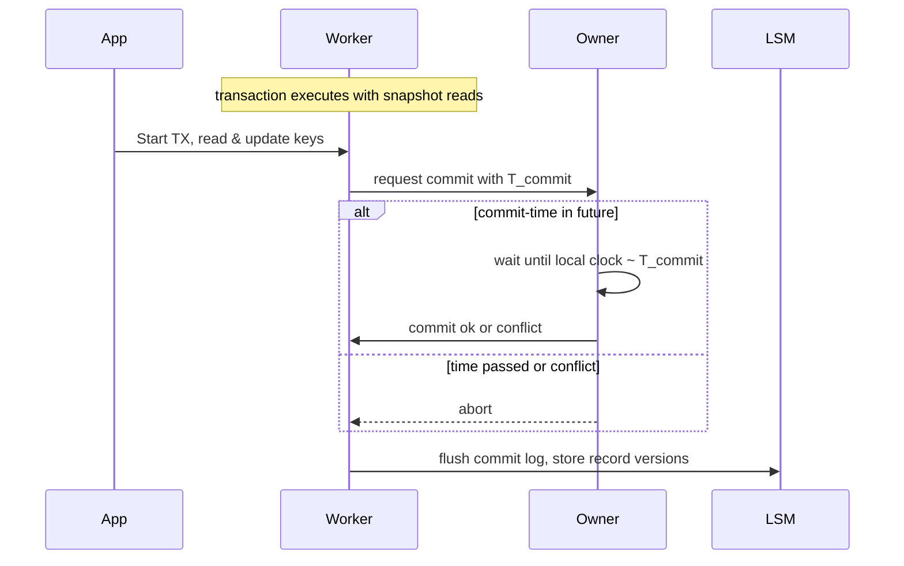

aliases: [Scalable OLTP in the Cloud, Pat Helland, Snapshot Isolation, BIG DEAL]
tags: [oltp, distributed-systems, mvcc, concurrency, cloud, paper-summary]
## Table of Contents
1. [Overview and Motivation](#overview-and-motivation)
2. [Snapshot Isolation (SI) as the "BIG DEAL"](#snapshot-isolation-si-as-the-big-deal)
3. [Dividing Responsibilities: DB vs. Application](#dividing-responsibilities-db-vs-application)
4. [Why Current MVCC Databases Struggle to Scale](#why-current-mvcc-databases-struggle-to-scale)
5. [Proposed Rethinking: Owners, Workers, and LSM](#proposed-rethinking-owners-workers-and-lsm)
   1. [Owner Servers](#owner-servers)
   2. [Worker Servers](#worker-servers)
   3. [LSM Servers](#lsm-servers)
6. [Transaction Execution & Commit Protocol](#transaction-execution--commit-protocol)
7. [Time, External Consistency, and Massive Scale](#time-external-consistency-and-massive-scale)
8. [Implications for Application Design](#implications-for-application-design)
9. [Commentary & Debates around MVCC Contention](#commentary--debates-around-mvcc-contention)
   1. [Franck Pachot’s Critique](#franck-pachots-critique)
   2. [Counterpoints & Implementation Nuances](#counterpoints--implementation-nuances)
   3. [Further App-Level Concerns](#further-app-level-concerns)
10. [Key Takeaways](#key-takeaways)
11. [Sample Code & Visualizations](#sample-code--visualizations)
    1. [Mermaid Diagrams](#mermaid-diagrams)
    2. [Pseudo-Code for Worker-Owner Commit Flow](#pseudo-code-for-worker-owner-commit-flow)
12. [References & Further Reading](#references--further-reading)

---
## 1. Overview and Motivation
**Question**: *“What are the asymptotic limits to scaling cloud OLTP systems?”*
Pat Helland’s paper from **CIDR ’24** argues that the solution lies in a **joint** or “**BIG DEAL**” arrangement between the **database** and the **application**. Specifically:
- The DB uses **Snapshot Isolation (SI)** to provide concurrency for disjoint updates.
- The application **must avoid** frequent concurrent updates to the **same** key.  
- By “not stepping on each other’s toes,” each side can scale effectively.
### Historical Context
- Early database systems used **strict** isolation levels (serializable).  
- Over time, systems **relaxed** isolation to meet **performance** and **scalability** demands, culminating in widespread use of **Read Committed Snapshot Isolation (RCSI)** and other forms of SI.

---
## 2. Snapshot Isolation (SI) as the "BIG DEAL"
- SI means each transaction sees a **consistent snapshot** of data (no blocking reads).
- Writers still need some concurrency control over updated records, but readers see data “as of” a timestamp. 
- This approach is **“just enough”** for many OLTP apps, while allowing **high throughput**.

### Real-World OLTP Example
- Suppose you have an e-commerce system. In SI, you might see an “older version” of an item’s stock, and updates from others come in concurrently. 
- The system can remain correct as long as we design for possible “stale reads” or asynchronous updates.

---

## 3. Dividing Responsibilities: DB vs. Application
### The “BIG DEAL” Contract
1. **Scalable DB**: 
   - Will *not* coordinate (i.e., no cross-partition overhead) for transactions that update **disjoint** sets of keys.
   - Data store only requires row-level locking if two transactions hit **the same key**.
2. **Scalable App**: 
   - Must design such that it **avoids** frequent concurrent updates to **the same** key. 
   - Rethink synchronous aggregations or global counters (like TPC-C “account balance” rows).

### Consequences for the Application
- Reads do **not** return an exact “NOW” value; they see a *snapshot in the past*. 
- The app needs to be OK with occasional **transaction aborts**. 
- “**Fuzzy**” or **“blurry”** data is tolerated. E.g., “Usually ships in 24 hours,” or “stats are updated nightly.”

---

## 4. Why Current MVCC Databases Struggle to Scale
Despite MVCC being a boon for concurrency, Pat enumerates several reasons that “**reads & writes fight**” at scale:

1. **“Current” version** overhead  
   - The “home location” of a row (e.g., partition or index entry) must handle the latest version. Readers checking for the latest version can cause locks or latches.
2. **Coordination in indexes**  
   - B+Trees or other structures might require concurrency control if a range is being modified or scanned.
3. **Online Repartitioning**  
   - Data movement of “hot” keys across partitions is complicated. A single “home” for data means we must do a lot of overhead to reassign the key’s physical location.

**Result**: Even in an MVCC system, wide-scale concurrency can lead to high overhead as operations converge on “the current version.”

---

## 5. Proposed Rethinking: Owners, Workers, and LSM
The paper suggests an architecture that breaks from the “key-home” model:

1. **Owner Servers**  
   - Partition data by key-range + time-range, responsible for concurrency control (detect conflicting updates).
   - Dynamically re-partition for scaling.

2. **Worker Servers**  
   - Each worker handles SQL queries/transactions for an application session. 
   - Maintains its own **transaction log**. 
   - As load grows, add more workers. A single transaction is executed on one worker server.

3. **LSM Servers**  
   - Store historical **record-versions** in a time-sorted manner.
   - Each flush from the workers incorporates new record-versions (with commit timestamps).

### Key Idea
- There is **no single “home location”** for a record. 
- The “**owner**” for concurrency control is ephemeral, based on `(key-range, time-range)`.
- The “**worker**” actually runs the TX and picks a commit time.  
- The “**LSM**” organizes older versions and can scale horizontally to store the entire history.

---

## 6. Transaction Execution & Commit Protocol
1. **Application** interacts with a **worker** to run a transaction: 
   - Snapshotted reads (time = T_something).
   - Updates or row-lock requests.
2. Worker chooses a **future commit time** and logs the transaction’s changes in its local log.
3. Worker calls **owner servers** for each updated key to verify no conflicts. 
   - If the clock on the owner has passed that commit time or a conflicting update was seen, the TX aborts.
   - Otherwise, the owner “waits” until local time matches the proposed commit time → approves commit if no conflicts by then.
4. Worker finalizes the commit in its local log → success.
5. The data eventually flushes to the **LSM** for persistent storage, labeled with the final commit time.

**Row-Locks**: 
- If the app wants to ensure a more synchronous concurrency approach for the same record, it can request row-locks. This can degrade performance if many TXs contending for the same record. 
- The system still runs a final OCC (Optimistic Concurrency Control) check at commit time.

---

## 7. Time, External Consistency, and Massive Scale
- The system leans heavily on **physical time** to define snapshots and commit times.
- External consistency means if TX1 commits before TX2 starts, TX2 *must* see TX1’s changes. 
- The **owner** enforces this by ensuring the commit time is recognized in the future relative to other commits.

**Intra-Datacenter**:  
- Clock skew is minimal, feasible to have a consistent time reference.

**Geo-Scale**:  
- Larger latencies, potential clock sync overhead. 
- The architecture could still hold, but the commit-time logic might wait for clocks or use larger margins for correctness.

---

## 8. Implications for Application Design
- **Apps** must handle “**blurry**” snapshots. A transaction sees a slightly older state, potentially ignoring in-flight writes.
- **No frequent collisions** on the same record if you want infinite scale. 
- As Pat explains, many TPC benchmarks forced synchronous aggregates — real apps at scale either drop this or do it asynchronously. 
- Domain-specific solutions might let the system “lie” a bit. E.g., partial knowledge about inventory, shipping times, finances, etc.

---

## 9. Commentary & Debates around MVCC Contention
Pat’s paper asserts that typical **MVCC** implementations (Postgres, Oracle, SQL Server, etc.) cause “infighting” when retrieving the current record version. This has spurred some debate:

### 9.1. Franck Pachot’s Critique
- Argues that **MVCC** is specifically designed so readers can avoid contending with writers. 
- Oracle and Postgres store older versions (heap or rollback segments), so reading a snapshot is straightforward: you do **not** need to grab the “current” version. 
- “**No** need to lock for read.” This speeds up concurrency.

### 9.2. Counterpoints & Implementation Nuances
- Pat claims: “Even if you store older versions in separate structures, to locate the correct version you start from the current pointer or index entry.” That might cause short latches or concurrency overhead. 
- Postgres does store “pointers” from the old version to the new, but an index-based read might still refer to the latest TID (tuple ID).
- The severity of overhead depends on the DB engine’s approach and the query type (index lookups vs. table scans).

### 9.3. Further App-Level Concerns
- For globally “hot” keys, row-level locking or repeated concurrency checks can hamper scale. 
- The solution: **No** concurrency on that key → implies app-level sharding or domain logic changes.

---

## 10. Key Takeaways
1. **The BIG DEAL**: DB + App share concurrency obligations. If your app design ensures minimal collisions on the same key, the DB can scale by ignoring cross-shard coordination for disjoint updates.
2. **Snapshot Isolation** rules, but you **must** accept “no NOW,” possible aborts, row-lock complexities if you do concurrency on the same key.
3. **Pat’s Proposed Architecture**:
   - **Owners** for concurrency (time-based).
   - **Workers** for transaction logs & runtime. 
   - **LSM** for large-scale versioned storage.
4. **Implementation** can be complicated, especially with multi-datacenter time sync, but the approach is a step towards truly massive OLTP scale.

---

## 11. Sample Code & Visualizations

### 11.1. Mermaid Diagrams
#### Overall Architecture
```mermaid
flowchart TB
    A[Application Servers] -->|SQL TX calls| W(Worker Server)
    W -->|proposed updates| O(Owner Servers<br>key-range + time-range)
    O -->|validate or abort| W
    W -->|commit logs| LSM(LSM Storage)
    LSM -->|historical data read| W
    note over W: Local TX Log
    note over O: Concurrency checks
    note over LSM: Store record versions by (time, key)
```

#### Worker-Owner Communication


### 11.2. Pseudo-Code for Worker-Owner Commit Flow

```python
# Worker receives a set of queries and updates for a TX:
def run_transaction(tx_ops):
    # 1) read under snapshot isolation
    read_time = current_time() - small_epsilon
    snapshot_data = fetch_snapshot(tx_ops.read_keys, read_time)
    
    # 2) apply business logic
    updated_keys, row_locks = plan_updates_and_locks(tx_ops, snapshot_data)
    
    # 3) propose a future commit time
    proposed_commit_time = current_time() + small_delta
    
    # 4) for each updated key, consult the owner
    for key in updated_keys:
        result = consult_owner_for_commit(key, proposed_commit_time)
        if not result.success:
            rollback()
            return "ABORT"
    
    # 5) all owners accepted => finalize in worker log
    transaction_log.append((tx_ops, proposed_commit_time))
    flush_to_LSM_async(tx_ops, proposed_commit_time)
    
    return "COMMIT"


def consult_owner_for_commit(key, tcommit):
    current_owner_time = owner_local_clock(key.range)
    if current_owner_time > tcommit:
        return Response(success=False, reason="time passed")
    # Wait until local clock ~ tcommit
    wait_until(tcommit - current_owner_time)
    # final conflict check
    if detect_conflict(key, tcommit):
        return Response(success=False, reason="conflict")
    return Response(success=True)
```

---

## 12. References & Further Reading
- **Paper**: “Scalable OLTP in the Cloud: What’s the BIG DEAL?” by Pat Helland (CIDR 2024).
- **Related**: “Is Scalable OLTP in the Cloud a Solved Problem?” (CIDR 2023).
- **MVCC** background:
  - [Postgres Docs on MVCC](https://www.postgresql.org/docs/current/mvcc.html)
  - [Oracle Consistent Reads Explanation](http://oracleinaction.com/consistent-reads-in-oracle-part-i/)
- **TPC Benchmarks** (TPC-A, TPC-B, TPC-C): [TPC.org](https://www.tpc.org/)

```markdown
> **Obsidian Usage Tips**  
> - Create backlinks to `[[Snapshot Isolation]]` or `[[MVCC debates]]`.  
> - Use the code snippets for teaching concurrency control in a distributed system.  
> - Link the "Owner/Worker/LSM" references to your notes on distributed-systems architecture or time-based concurrency.  
> - Tag with `#OLTP`, `#DistributedDB`, `#PatHelland` for quick cross-referencing.
```
```