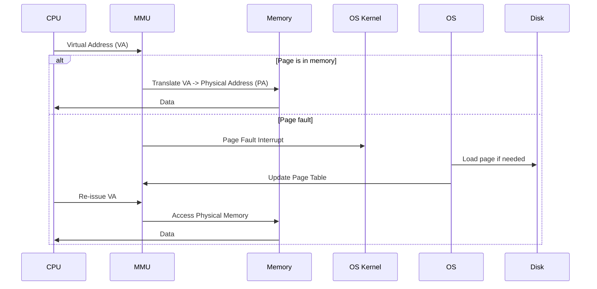

https://strikefreedom.top/archives/memory-management-virtual-memory

aliases: [Virtual Memory, Paging, TLB, Page Table, Inverted Page Table]
tags: [Computer Architecture, Memory, Operating Systems]

> **Author**: Pan Shao  
> **Posted**: 04-18-2021  
> **Last Updated**: 06-06-2024  
> **Views**: 29476  
> **Word Count**: 7544 (~12.5 minutes reading time)  

**Introduction**  
Virtual memory is a foundational concept in modern computer systems. It efficiently manages limited physical memory, allowing larger virtual address spaces for processes while reducing programming errors. Virtual memory impacts everything from hardware design to file systems and process/thread scheduling. A thorough understanding helps developers write efficient, safe programs.

---
## 1. Computer Memory Overview

An **ideal** memory would be:
1. **Extremely fast** (faster than CPU instruction execution).
2. **Large capacity** (store all data required).
3. **Low cost** (affordable at large scales).

In reality, no single technology meets all three optimally. Hence, computers use a **memory hierarchy**:

```mermaid
flowchart LR
   R[Registers] --> C[Cache (L1, L2, L3)]
   C --> M[Main Memory (DRAM)]
   M --> D[Disk/SSD]
```

1. **Registers**: The fastest, but extremely limited (KB or less).
2. **Cache**: CPU cache (L1, L2, L3), larger than registers but still small, faster than main memory.
3. **Main Memory**: DRAM. Larger capacity (GB scale), slower than cache, but still relatively fast.
4. **Disk**: Even larger (GB-TB scale), but orders of magnitude slower.

---

## 2. Main Memory & Physical Memory

When people say “physical memory,” they typically mean the **RAM modules** on the motherboard. This is the “main memory” (DRAM) the CPU directly addresses (via the memory bus).

---

## 3. Virtual Memory

### 3.1 Motivation
As applications demand more memory than physically available, we need an abstraction that:
1. **Isolates** each process’s memory from others (reducing errors).
2. **Allows** processes to exceed actual physical memory via on-demand swapping to disk.

**Virtual memory (VM)** is exactly this intermediate layer.

### 3.2 The Core Principle
> “Any problem in CS can be solved by adding an extra layer of indirection.”  

Virtual memory:
- Provides each process a **continuous virtual address space**.
- Slices virtual memory into **pages** (e.g., 4KB each).
- Maps pages to **physical memory** frames (also 4KB) dynamically during execution.
- If a program tries to access a page not in physical memory, the OS **page-faults**, loads (or “swaps in”) the needed page from disk, possibly swapping out another page to free space.

Thus, processes see an illusion of large, contiguous memory, while the OS efficiently manages the smaller real memory plus disk.

---

## 4. Page Table

### 4.1 Definition
A **page table** is a data structure mapping **virtual page numbers (VPN)** to **physical page frame numbers (PPN)**. Each entry is a **page table entry (PTE)** storing:
- **PPN**: The physical frame base address.
- **Valid bit**: 1 if page is in memory, 0 if not (page-fault on access).
- **Protection bits**: e.g., read-only or read-write.
- **Modified bit (Dirty bit)**: set if page has been written.
- **Accessed bit**: set if page has been read/written recently.
- **Cache disable**: for special memory (e.g., hardware registers).

### 4.2 Address Translation Flow



1. **CPU** issues virtual address.
2. **MMU** checks page table:
   - If valid, map to **physical address**.
   - If invalid, **page fault** → OS kernel routine. Possibly swap out a page, load the needed page from disk, update page table, re-run the instruction.

---

## 5. Virtual Memory & Cache

When a CPU uses both **virtual memory** and a **CPU cache**, address translation often happens as:

1. CPU issues **virtual address**.
2. **MMU** translates to **physical address** (possibly TLB-assisted).
3. The **physical address** is used to index the CPU cache.  
4. If **cache miss**, the main memory is accessed.

---

## 6. Speeding Up Translation & Page Table Optimizations

### 6.1 TLB (Translation Lookaside Buffer)

**TLB** is a **cache** for page table entries, crucial for performance. Without TLB, every memory reference would require a page-table lookup in memory. TLB stores recently accessed PTEs so that if the same virtual page is referenced again, the physical address is retrieved instantly.

**TLB Hit**:
- No extra memory lookups for the page table. Just translate quickly.

**TLB Miss**:
- Must fetch PTE from memory, then store it in TLB. Possibly evict older PTE.

### 6.2 Multi-level Page Table

As processes have large virtual address spaces (e.g. 32-bit: 4GB, 64-bit: even bigger), a single linear page table can be huge. **Multi-level page tables** break this into layers:

```mermaid
flowchart LR
    A[Virt Addr (VPN1, VPN2, ... VPO)] --> B[Level1 PT]
    B --> C[Level2 PT...]
    ... --> N[PPN + offset]
```

- If a page is unused, we don’t allocate lower-level page tables for it.
- Reduces memory overhead significantly.

### 6.3 Inverted Page Table

Instead of storing a **VPN → PPN** map, an **inverted page table** (IPT) stores **PPN → (VPN, processID)**. This is beneficial if the ratio (virtual space)/(physical memory) is large (common in 64-bit systems). However, it complicates lookups (needing a hash structure to find which PPN corresponds to a given VPN). TLB is essential to keep translation fast (hits bypass the slow hash lookup).

---

## 7. Summary

**Virtual Memory** provides:
- **Logical abstraction** of large, continuous memory for each process.
- **Isolation** among processes (no accidental overlap).
- **Efficiency** by only loading pages actually used into physical memory.
- **Mechanisms**: page table, TLB for acceleration, and multi-level or inverted page tables to handle large address spaces gracefully.

### Key Points

1. **Page Table**: Maps virtual pages to physical frames + attribute bits.  
2. **TLB**: Speeds translation by caching PTEs.  
3. **Multi-Level / Inverted Page Table**: Solve the overhead of huge page tables.  

**Finally**, the OS also has a **page replacement algorithm** (e.g. LRU) to decide which pages to swap out to disk when memory is full. That’s an entirely separate topic but an essential part of how VM works in practice.

---

## 8. References & Further Reading

- **Modern Operating Systems** by Andrew S. Tanenbaum  
- **Computer Systems: A Programmer’s Perspective** by Randal E. Bryant & David R. O’Hallaron  
- [Linux Virtual Memory Documentation](https://www.kernel.org/doc/html/latest/admin-guide/mm/index.html)  
- [x86-64 Paging Documentation (Intel Manual)](https://www.intel.com/content/www/us/en/developer/articles/technical/intel-sdm.html)  

```