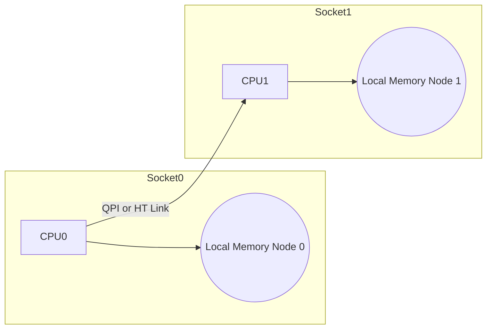

aliases: [NUMA, UMA, SMP, Nehalem, QPI, HyperTransport]
tags: [Computer Architecture, NUMA, Memory Hierarchy, Multiprocessors]

https://frankdenneman.nl/2016/07/07/numa-deep-dive-part-1-uma-numa/
## Overview
- **Core Topic**: **Non-Uniform Memory Access (NUMA)** architecture in modern multiprocessing servers, contrasting with older **UMA** (Uniform Memory Access) designs.
This article explains why systems moved from a shared bus and uniform memory architecture to **NUMA** with point-to-point interconnects and integrated memory controllers, improving scalability for large multiprocessors.
---
## 1. Non-Uniform Memory Access (NUMA)
### 1.1 Basic Idea
In NUMA systems:
- Each CPU has **local memory** (attached to its own memory controller).
- Access to remote CPU’s memory is **higher latency** and **lower bandwidth** due to traversal of an interconnect link.
Modern OSes (like **ESXi**) handle NUMA automatically, but to optimize performance for virtual machines or big data applications, correct sizing and awareness of local vs. remote memory is crucial.
### 1.2 Historical Motivation
Systems used to have a single memory pool and a bus connecting multiple CPUs → **UMA**. But bus bandwidth and broadcast snoop protocols hamper scalability. As CPU-to-memory speed gaps grew, caching strategies and protocols (like **write invalidate** snoops) helped but eventually the **bus** approach couldn’t keep up with large numbers of processors. Hence the shift to **NUMA**.

---
## 2. Evolution from UMA to NUMA

### 2.1 UMA (Uniform Memory Access)

**Uniform** means each CPU has roughly the same memory access time. Typically:
1. CPUs connect via a **front-side bus** to a **Northbridge** with a memory controller.
2. The Northbridge also connects to an **I/O controller**.

**Drawbacks**:
- Limited bus bandwidth.
- Additional CPUs degrade per-CPU bandwidth.  
- At scale, the Northbridge becomes a bottleneck.

**Diagram** (UMA bus-based SMP):

```mermaid
flowchart LR
    A[CPU1] -- FSB --> N[Northbridge<br>(Memory Controller)]
    B[CPU2] -- FSB --> N
    N --> M[Memory]
    N --> I[IO Controller]
```

### 2.2 Transition to NUMA

To scale beyond a few CPUs, three major changes happened:

1. **Non-Uniform Memory**: Each CPU has its **own** memory controller + memory banks → local or remote memory.  
2. **Point-to-Point** interconnect: e.g., **AMD HyperTransport**, **Intel QPI** (QuickPath). No more single shared bus.  
3. **Scalable Cache Coherency**: More sophisticated snoop protocols to handle many cores.

**NUMA** first emerged in HPC (e.g., SGI supercomputers). Then AMD introduced **Opteron** (2003) with integrated memory controllers, popularizing NUMA in enterprise servers. Intel responded with **Nehalem** (~2008), moving memory controllers on-die and using QPI links.

---
## 3. Example: Local vs. Remote Memory

In a 2-socket system:



- Access from CPU0 to Mem0 is **local** → low latency.  
- Access from CPU0 to Mem1 is **remote** → must cross the CPU1 link.

Hence "non-uniform" access times.

---

## 4. Point-to-Point Interconnect

- **AMD**: HyperTransport.  
- **Intel**: QPI (QuickPath Interconnect).  

**Intel Nehalem** replaced the front-side bus with QPI, integrated memory controllers into each CPU, introduced a modular “Uncore” design. Subsequent generations (Westmere, Sandy Bridge, Ivy Bridge, Haswell, Broadwell...) improved speeds and added more advanced ring interconnects for on-die cache slices.

**QPI** speeds from 6.4 GT/s to 9.6 GT/s provide up to 38.4 GB/s per link in the Broadwell era (2016).

---

## 5. Scalable Cache Coherence

**Sandy Bridge** introduced a ring on-die interconnect for L3 cache slices. Each core has a slice, and the ring allows any core to access any slice. The ring design scales better than older direct-wire paths.

**Snoop** traffic grows as cores increase. Protocols must handle distributed caches across multiple sockets. This leads to advanced **snoop filtering**, hierarchical snoops, etc. Part 3 of this series will detail this more deeply.

---

## 6. SUMA (Sufficiently Uniform Memory Architecture)

If **node interleaving** is enabled in BIOS, the system “interleaves” memory from each node in a round-robin manner, presenting a single memory address space (like UMA). This is called **SUMA**. The hardware equally distributes memory pages across all nodes, so every CPU sees “almost uniform” latencies, but in practice you lose the **fast** local advantage.

**Benchmarks** with Intel Memory Latency Checker show that SUMA can degrade performance vs. pure NUMA, especially under load. The system “looks” uniform but you’re consistently traversing QPI links.

**Conclusion**: Usually, you want **NUMA** mode enabled for best performance and minimal cross-node traffic.

---

## 7. Microarchitecture Examples: Nehalem → Broadwell

Intel’s CPU microarchitectures (notably “ticks” and “tocks”):

| Microarch  | Branding        | Year  | Cores | L3(LLC) | QPI GT/s | Mem Freq     | Change | nm   |
|------------|-----------------|-------|-------|---------|---------|-------------|--------|-----:|
| Nehalem    | x55xx           | 2008  | 4     | 8 MB    | 6.4     | DDR3-1333(3x)| Tock   | 45nm |
| Westmere   | x56xx           | 2010  | 6     | 12 MB   | 6.4     | DDR3-1333(3x)| Tick   | 32nm |
| SandyBrdge | E5-26xx v1      | 2012  | 8     | 20 MB   | 8.0     | DDR3-1600(4x)| Tock   | 32nm |
| IvyBridge  | E5-26xx v2      | 2013  | 12    | 30 MB   | 8.0     | DDR3-1866(4x)| Tick   | 22nm |
| Haswell    | E5-26xx v3      | 2014  | 18    | 45 MB   | 9.6     | DDR3-2133(4x)| Tock   | 22nm |
| Broadwell  | E5-26xx v4      | 2016  | 22    | 55 MB   | 9.6     | DDR3-2400(4x)| Tick   | 14nm |

With **Nehalem** in 2008, Intel introduced integrated memory controllers + QPI → a new “true” NUMA design. Later architectures refined that approach, improved QPI speeds, and expanded core counts & L3 slices.

---

## 8. Conclusion & Next Steps

NUMA organizes a system so each CPU has local memory. This drastically reduces memory bus contention and improves scalability vs. older UMA. However, it leads to “non-uniform” latencies. Operating systems and hypervisors must be **NUMA-aware** to place workloads near their memory.

**This series** looks at:
1. *Part 1*: From UMA to NUMA (this post).
2. *Part 2*: System architecture deeper dive.
3. *Part 3*: Cache coherence protocols & uncore designs.
4. *Part 4*: Local memory optimization strategies.
5. *Part 5*: ESXi VMkernel NUMA constructs.

**Key Points**:
- UMA (Uniform Memory Access) used a single memory controller and bus, limited in scalability.
- NUMA introduced local memory per CPU + point-to-point links (like QPI/HT).
- Node Interleaving → SUMA merges memory again, but often reduces performance benefits of local memory.
- For best performance on modern multi-socket servers, **leverage** NUMA effectively and ensure workloads are pinned or sized so they primarily use local memory.

---

## References & Further Reading

- [NUMA Deep Dive Series (Part 0, Part 2, Part 3...)](#)  
- [Intel Nehalem and QPI Documentation](https://www.intel.com/)  
- [AMD Opteron & HyperTransport Whitepapers](https://developer.amd.com/)  
- [Memory Latency Checker (Intel)](https://www.intel.com/)  
- [ESXi NUMA Tuning Guides](https://docs.vmware.com/)  

```