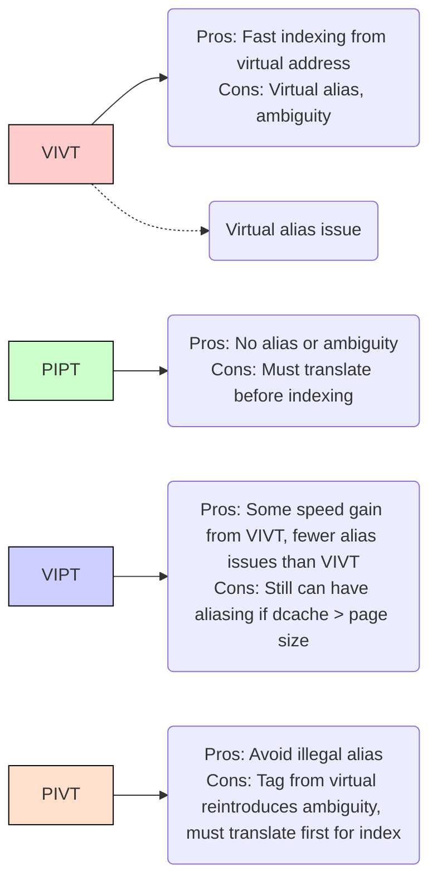

## Overview
Modern computer systems use both **CPU caches** and **virtual memory** for performance and memory management, respectively. However, these two subsystems can occasionally interact in tricky ways. This set of notes details four major cooperation modes between the CPU cache and virtual memory. We will explore each mode in depth, discuss their respective advantages and disadvantages, and finally examine how the Linux kernel manages CPU caches under various architectures.  
**Key Definitions & Symbols**

| Symbol | Description                          |
|-------:|--------------------------------------|
| N = 2^n | Size of virtual address space       |
| M = 2^m | Size of physical address space      |
| P = 2^p | Page size (bytes)                   |
| VPO     | Virtual page offset (bytes)         |
| VPN     | Virtual page number                 |
| PPO     | Physical page offset (bytes)        |
| PPN     | Physical page number                |

For a 32-bit system (n = 32) with:
- **Page size** P = 4 KB = 2^12  
- **Virtual address range**: 32 bits, so VPO = [11:0], VPN = [31:12]  
- **Physical address** also has PPO = [11:0] because the page sizes in virtual and physical memory are the same.  
- **Cache line size** = 64 bytes = 2^6, so the **cache line offset** = [5:0].  

---

## Four Cooperation Modes

### 1. VIVT (Virtually Indexed, Virtually Tagged)

#### Basic Concept

- **Index** and **tag** for the CPU cache are both taken from the **virtual address**.
- Provides the **fastest** cache lookups because the CPU can directly check its cache (using the virtual address) **before** consulting the MMU (Memory Management Unit).
- However, because **different virtual addresses** can map to the **same physical address**, there can be collisions in the cache and ambiguity issues.  

#### Virtual Aliasing

- In VIVT, **virtual alias** means:
  - Two (or more) different virtual addresses map to the **same** physical address but end up in **different** cache lines if their **index** bits differ.
  - This can lead to **stale data** if both cache lines are present with different data for the same physical address.
- **Legal alias**: If the CPU cache size is **≤ page size**, the overlapping bits between virtual and physical addresses ensure that the same physical address always uses the **same index**.  
- **Illegal alias**: If the CPU cache size is **> page size**, the index bits extend beyond the offset bits that are identical in virtual vs. physical addresses. Hence, multiple virtual addresses could yield different cache indices yet point to the same physical address.

##### Example

Imagine a **4 KB dcache** with a **64B** cache line size:
- Total number of cache lines = 4096 / 64 = 64 = 2^6
- Index bits = [11:6], which is also within the overlapping [11:0] offset region.
- Different processes that map the **same** physical address but have different virtual addresses will still end up using the **same** index = no inconsistency.

Now imagine an **8 KB dcache**:
- Total number of cache lines = 8192 / 64 = 128 = 2^7
- Index bits = [12:6], which spills beyond [11:0].
- Two different virtual addresses that map to the same physical address can produce **different** cache indices (one might be `[12:6] = 1000000` in binary = 64, another `[12:6] = 0000000` in binary = 0).  
- This results in storing the **same** physical data in **two different** cache lines = potential inconsistency.

#### Virtual Ambiguity

- In VIVT, both the **index** and **tag** come from the virtual address. A single virtual address is expected to map to one physical address, but if a process’s page table changes or multiple processes run, the **tag** might no longer be correct.
- **Fix**: Frequent flushing of the CPU cache and TLB on context switches or when page tables are updated.

#### Current Usage

- Historically, VIVT was popular in **older** CPU designs.
- As cache and OS complexities grew, the overhead of flushing and the complexities of handling virtual alias and ambiguity became significant.
- Modern CPU designs have mostly abandoned VIVT.

---

### 2. PIPT (Physically Indexed, Physically Tagged)

#### Basic Concept

- **Index** and **tag** are both taken from the **physical address**.
- This completely **avoids** the virtual alias and virtual ambiguity problems because the physical address is globally unique.

#### Pros & Cons

- **Pro**:  
  - No illegal aliasing or ambiguity, since the physical address is a unique reference.  
  - The kernel can be simplified because it does not need heavy “flush on context switch” logic.  
- **Con**:  
  - The CPU **must** translate the virtual address to physical **before** using the cache.  
  - This translation can slow down cache lookups, although TLBs help mitigate this.

#### Current Usage

- Many **high-end** or **modern** CPUs use PIPT because hardware has gotten fast enough to absorb the extra translation cost, and the elimination of complex kernel-level alias handling is a huge advantage.

---

### 3. VIPT (Virtually Indexed, Physically Tagged)

#### Basic Concept

- **Index** is taken from the **virtual address**.
- **Tag** is taken from the **physical address**.
- A **compromise** solution that combines parts of VIVT and PIPT.

#### Process Flow

1. CPU gets the **virtual address**.  
2. Split the address into two parts:
   - **Index** bits → go directly to the cache controller to locate a cache line.
   - **Remaining** bits → go to the MMU for translation to a partial physical address (the tag portion).
3. Compare the fetched **tag** from the cache line with the **physical** tag from the MMU translation for a hit or miss.

#### Advantages

- Faster lookups than PIPT alone (similar to VIVT) since indexing uses the virtual address.  
- Less ambiguity than VIVT because the **tag** is still from the physical address → prevents confusion about which physical address is actually cached.

#### Disadvantages

- Still **can** have virtual alias issues if the cache size is **> page size**.
- May require **two** MMU translations in worst-case scenarios:
  1. First to check the tag for the final cache hit determination.
  2. Another if there is a cache miss, to fetch data from memory.

#### Current Usage

- **Mid-range** CPU architectures often use VIPT.  
- If the dcache **≤ 4KB**, no virtual alias issues arise because index bits remain in the overlap region. Then VIPT behaves effectively like a PIPT but with faster indexing.

---

### 4. PIVT (Physically Indexed, Virtually Tagged)

- **Index** from the **physical address**, **tag** from the **virtual address**.
- Almost no one uses PIVT because:
  - Index from physical → as slow as PIPT.  
  - Tag from virtual → reintroduces the ambiguity issue from VIVT.  
  - Only advantage is it avoids illegal aliasing, but the cost of potential ambiguity is too high.  

---

## Kernel CPU Cache Management

In Linux, two functions commonly appear in kernel code to deal with **cache coherency** issues:

- **`flush_dcache_folio()`**
- **`flush_dcache_page()`**

These exist primarily to handle **virtual alias** and **ambiguity** problems in VIVT and VIPT architectures. On PIPT systems, they often do nothing or only do minimal bookkeeping.

### Example: m68k Architecture

Below is a snippet from the `m68k` architecture, which is **old** and uses either VIVT or VIPT-like caches:

```c
/* Push the page at kernel virtual address and clear the icache */
/* RZ: use cpush %bc instead of cpush %dc, cinv %ic */
static inline void __flush_pages_to_ram(void *vaddr, unsigned int nr)
{
	if (CPU_IS_COLDFIRE) {
		unsigned long addr, start, end;
		addr = ((unsigned long) vaddr) & ~(PAGE_SIZE - 1);
		start = addr & ICACHE_SET_MASK;
		end = (addr + nr * PAGE_SIZE - 1) & ICACHE_SET_MASK;
		if (start > end) {
			flush_cf_bcache(0, end);
			end = ICACHE_MAX_ADDR;
		}
		flush_cf_bcache(start, end);
	} else if (CPU_IS_040_OR_060) {
		unsigned long paddr = __pa(vaddr);

		do {
			__asm__ __volatile__("nop\n\t"
					     ".chip 68040\n\t"
					     "cpushp %%bc,(%0)\n\t"
					     ".chip 68k"
					     : : "a" (paddr));
			paddr += PAGE_SIZE;
		} while (--nr);
	} else {
		unsigned long _tmp;
		__asm__ __volatile__("movec %%cacr,%0\n\t"
				     "orw %1,%0\n\t"
				     "movec %0,%%cacr"
				     : "=&d" (_tmp)
				     : "di" (FLUSH_I));
	}
}

#define flush_dcache_page(page) \
	__flush_pages_to_ram(page_address(page), 1)

#define flush_dcache_folio(folio) \
	__flush_pages_to_ram(folio_address(folio), folio_nr_pages(folio))
```

### Example: ARM Architecture

On **ARM**, these functions handle the possibility of **VIPT** or **VIVT** caches:

```c
void flush_dcache_folio(struct folio *folio)
{
	struct address_space *mapping;

	/*
	 * The zero page is never written to, so never has any dirty
	 * cache lines, and therefore never needs to be flushed.
	 */
	if (is_zero_pfn(folio_pfn(folio)))
		return;

	if (!cache_ops_need_broadcast() && cache_is_vipt_nonaliasing()) {
		if (test_bit(PG_dcache_clean, &folio->flags))
			clear_bit(PG_dcache_clean, &folio->flags);
		return;
	}

	mapping = folio_flush_mapping(folio);

	if (!cache_ops_need_broadcast() &&
	    mapping && !folio_mapped(folio))
		clear_bit(PG_dcache_clean, &folio->flags);
	else {
		__flush_dcache_folio(mapping, folio);
		if (mapping && cache_is_vivt())
			__flush_dcache_aliases(mapping, folio);
		else if (mapping)
			__flush_icache_all();
		set_bit(PG_dcache_clean, &folio->flags);
	}
}
```

> The function checks if the cache is VIPT-nonaliasing. If so, it can delay flushes. Otherwise, it explicitly flushes the cache.

### Example: ARM64 Architecture

On **ARM64**, which typically uses **PIPT**:

```c
void flush_dcache_folio(struct folio *folio)
{
	if (test_bit(PG_dcache_clean, &folio->flags))
		clear_bit(PG_dcache_clean, &folio->flags);
}

void flush_dcache_page(struct page *page)
{
	flush_dcache_folio(page_folio(page));
}
```

> It **only** clears a page-flag bit (`PG_dcache_clean`) and leaves the heavy lifting of cache maintenance to other parts of the kernel code if needed.

---

## Why & When These Flushes Occur

When the kernel copies data between **user space** and **kernel space**, it invokes:
- `flush_dcache_folio()` for **reads**  
- `flush_dcache_page()` for **writes** (often twice)

### Read Path Snippet

```c
static inline int mapping_writably_mapped(struct address_space *mapping)
{
	return atomic_read(&mapping->i_mmap_writable) > 0;
}

	writably_mapped = mapping_writably_mapped(mapping);

	...

	if (writably_mapped)
		flush_dcache_folio(folio);

	copied = copy_folio_to_iter(folio, offset, bytes, iter);
```

- If this page is **writably mapped** in any process’s address space (i.e., `i_mmap_writable > 0`), we **might** have a virtual alias problem → flush the dcache first.

### Write Path Snippet

```c
if (mapping_writably_mapped(mapping))
    flush_dcache_page(page);

copied = copy_page_from_iter_atomic(page, offset, bytes, i);

flush_dcache_page(page);
```

- For **writes**:
  1. Before copying: flush if aliasing is possible.  
  2. After copying: flush because the page is now “dirty” in the CPU cache.

---

## Visualizing the Modes



---

## Conclusion

- **VIVT**:  
  - Fastest **lookups** but problematic aliasing/ambiguity. Historically used, now mostly **obsolete**.  
- **PIPT**:  
  - Most **robust**; no alias or ambiguity issues. Slightly slower lookups. **Widely used** on high-end hardware.  
- **VIPT**:  
  - **Compromise** solution; speeds up lookups relative to PIPT but retains potential aliasing issues. Common in **mid-tier** hardware. If dcache ≤ page size, effectively zero alias headache.  
- **PIVT**:  
  - Rarely used, theoretical mode that inherits the worst of both worlds.  

In the Linux kernel, the **cache flushing functions** (`flush_dcache_page()`, `flush_dcache_folio()`) are essential for VIVT/VIPT systems. On PIPT systems, these are generally **no-ops** or minimal “page-flag” manipulations.  
Ultimately, hardware progression and the desire to avoid excessive kernel complexity have steered most modern architectures towards **PIPT** (or well-constrained VIPT) designs.  

```  
┌─────────────────────────────────────┐
│   "In the end, simpler is better,  │
│   and PIPT is the simplest route   │
│   to consistent cache coherence."  │
└─────────────────────────────────────┘
```
