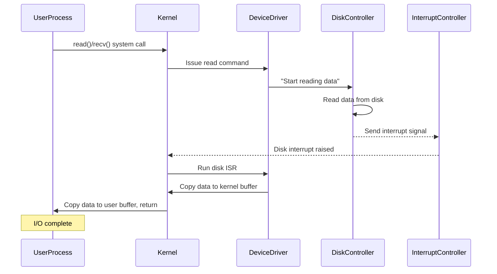

In Linux (and other Unix-like operating systems), there are **three major I/O modes**:

1. **Program-Controlled (Polling) I/O**  
2. **Interrupt-Driven I/O**  
3. **DMA (Direct Memory Access) I/O**

Below we’ll detail each mode, give examples of how they work, and then summarize the general I/O process in Linux.

---

## 1. Program-Controlled I/O

Also known as **busy waiting** or **polling** I/O.

### How It Works

1. A user process issues a system call, e.g., `read()` or `recvfrom()`, which **traps** into the kernel.
2. The kernel routine corresponding to that system call calls into the **device driver**.
3. The device driver repeatedly **polls** the device status (by reading some device register or return code) in a loop until the device is ready.
4. Once the device is ready or the data transfer completes, the device driver copies data from the device into kernel memory (or from kernel to device for writes).
5. The device driver returns control to the kernel, which returns to user space.

#### Example: `recvfrom()` (Simplified)
```c
// userspace code
#include <sys/types.h>
#include <sys/socket.h>

int main() {
    char buf[1024];
    ssize_t ret;

    // Suppose we want to receive data from a socket
    ret = recvfrom(sockfd, buf, sizeof(buf), 0, NULL, NULL);

    // The kernel: the above call triggers the following sequence:
    // 1. Trap into kernel
    // 2. Kernel checks device driver for network device
    // 3. Driver polls hardware to see if data arrived
    // 4. Copies data to kernel buffer, then to 'buf' in user space
    // 5. Returns to user space
    // ret now contains the number of bytes received
    return 0;
}
```

### Pros and Cons

- **Pros**  
  - Simple to implement.
  - Predictable flow: the CPU actively “knows” what’s happening.
- **Cons**  
  - The CPU is **busy-waiting**, so it cannot handle other tasks in parallel.
  - Not efficient if I/O devices are slow.

---

## 2. Interrupt-Driven I/O

### Core Idea

Instead of constantly polling the device, the CPU issues a request and is **interrupted** when the device has finished its work.

### Step-by-Step Flow

1. **User Process Issues `read()`**  
   - The process calls `read()`, `recv()`, etc. and drops into **kernel mode**.  
2. **Notify Device**  
   - The kernel (via the device driver) writes a “read command” to the device controller’s register, e.g., telling the disk to read a block.  
3. **Device Reads Data into Device Buffer**  
   - The disk controller starts reading data from the disk into its **internal buffer**.  
4. **Device Sends Interrupt**  
   - Once the read completes, the disk controller signals an **interrupt** to the CPU (via the interrupt controller).  
   - If a higher-priority interrupt is being processed, this interrupt may be delayed briefly.  
5. **Interrupt Controller Identifies Device**  
   - The interrupt controller notes that the disk device triggered the interrupt.  
6. **CPU Interrupt Handling**  
   - The CPU stops its current work, **pushes** the current registers (PC, PSW, etc.) onto the stack, and jumps to the **disk interrupt service routine**.  
   - The disk interrupt service routine copies data from the disk controller’s buffer into a **kernel buffer** in main memory.  
7. **CPU Copies Data to User Buffer**  
   - Finally, the CPU copies data from the **kernel buffer** to the **user buffer**.  
8. **Return**  
   - The system call returns to user mode.

#### Diagram: Interrupt-Driven I/O



### Pros and Cons

- **Pros**  
  - More efficient than polling: The CPU can do other work while the device operates.  
- **Cons**  
  - The CPU still copies data from the device buffer to kernel buffer, and then from the kernel buffer to user space.  
  - Interrupt overhead: Handling many interrupts can be expensive.

---

## 3. DMA (Direct Memory Access) I/O

### Core Idea

Offloads data transfers **directly** between the device and system memory to a **DMA controller**, reducing CPU involvement.

1. **CPU Configures DMA Registers**  
   - The CPU writes the target memory address (kernel buffer), the device address, and the data length to the **DMA controller**’s registers (like MAR, ADR, WC, etc.).  
2. **Device Work**  
   - The device (e.g., a disk controller) reads data from the disk into its internal buffer.  
3. **DMA Transfer**  
   - The DMA controller signals the device to transfer data **directly** into main memory (the kernel buffer). The CPU is not involved in this bulk copying.  
4. **Interrupt**  
   - Once the DMA finishes, the DMA controller **interrupts** the CPU.  
5. **User Buffer Copy**  
   - The CPU then only needs to copy from the kernel buffer to the user buffer (or vice versa for writes).

#### Step-by-Step Example

1. **User calls `read()`**: Goes to the kernel, sets up DMA registers (MAR, ADR, WC).  
2. **DMA + Device**: Disk controller reads from disk → buffer → DMA sends data to kernel buffer.  
3. **Interrupt**: DMA raises an interrupt when done.  
4. **User Buffer Copy**: CPU copies data from the kernel buffer to user space.  
5. **Return**: Switch back to user mode.

#### Visual Flow: DMA I/O

```mermaid
flowchart TD
    A[User Process calls read()] --> B[Kernel sets DMA controller registers<br>- MAR, ADR, WC, etc.]
    B --> C[Disk controller reads from disk to device buffer]
    C --> D[DMA transfers data from device buffer to kernel buffer]
    D --> E[DMA completes, sends interrupt]
    E --> F[Interrupt Service copies data to user buffer]
    F --> G[read() returns, user mode]
```

### Pros and Cons

- **Pros**  
  - Reduces CPU burden during the bulk data transfer between device & memory.  
  - Faster overall throughput for large I/O.  
- **Cons**  
  - Still requires **some** CPU copy (kernel buffer ↔ user buffer).  
  - Hardware complexity (need a DMA controller, specialized buses, etc.).

---

## General I/O Process in Linux

In Linux, the basic system calls for I/O are:

```c
#include <unistd.h>

ssize_t read(int fd, void *buf, size_t count);
ssize_t write(int fd, const void *buf, size_t count);
```

### Example: Reading from Disk and Writing to Network

1. **`read()`**  
   - User → Kernel (context switch #1)  
   - **DMA** (disk → kernel buffer)  
   - **CPU** copies (kernel buffer → user buffer)  
   - Return to user mode (context switch #2)
2. **`write()`**  
   - User → Kernel (context switch #3)  
   - **CPU** copies (user buffer → kernel buffer)  
   - **DMA** (kernel buffer → network card)  
   - Return to user mode (context switch #4)

Hence, there are **4 context switches** and **4 total copy operations** (2 CPU copies + 2 DMA copies).  

**Key Observations**  
- DMA **reduces** the CPU copy overhead (compared to purely interrupt-driven) but does not eliminate it.  
- The CPU still copies data between kernel buffers and user buffers. This cost can be substantial.  
- Later optimizations (like **zero-copy**) aim to reduce or eliminate some of these CPU copying steps.

---

## Summary and Next Steps

We’ve covered:

- **Three Basic I/O Modes** in Linux-like systems:  
  1. **Program-Controlled (Polling) I/O**  
  2. **Interrupt-Driven I/O**  
  3. **DMA I/O**  

- **Traditional Linux I/O stack** involves:  
  1. **System calls** (`read()`, `write()`)  
  2. **Context switches** between user mode & kernel mode  
  3. **DMA** transfers to offload device ↔ memory data movement  
  4. **CPU** copies to move data between kernel buffers and user buffers  

In total, these steps can be quite costly for high-frequency I/O.  
**Zero-copy** and other techniques aim to reduce the number of CPU copies, which we’ll explore next.

> *"This is just the tip of the iceberg for Linux I/O internals. By peeking under the hood, we gain insight into why certain optimizations, like zero-copy, are so valuable."*

So let’s take a short break. Once you’re ready, we’ll delve deeper into **zero-copy technology** and how it further optimizes the Linux I/O path.

```
───────────────────────────────
 “An I/O operation can travel
 through many layers, but each
 step can be optimized—some
 even eliminated—to achieve
 better performance."
───────────────────────────────
```
```