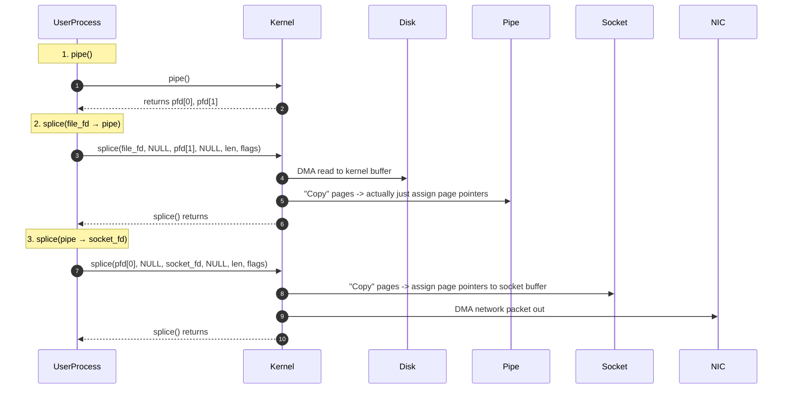

In **Linux kernel 2.6.17**, a new system call **`splice()`** was introduced as an alternative to `sendfile()` for zero-copy data transfers. It allows transferring data between **two file descriptors** (one of which must be a pipe) with minimal or **no** CPU copying in the data path.

---
## 1. Rationale & Comparison with `sendfile()`
**`sendfile() + DMA Scatter/Gather`** can avoid most CPU copies, but it still has two drawbacks:

1. **Hardware Requirement**  
   - Scatter/Gather might require specialized hardware (NICs, disk controllers) for maximum benefit.
2. **`sendfile()` Input Restriction**  
   - **Pre-2.6.33**: The output file descriptor (`out_fd`) had to be a **socket**.  
   - **Post-2.6.33**: `out_fd` can be any file descriptor, but the **input** (`in_fd`) must still be a **regular file**.

In many scenarios, you want to send or receive data between arbitrary file descriptors (e.g., **sockets**, **pipes**, **devices**). This is where **`splice()`** shines.  

> **Key Feature**: `splice()` can transfer data between any two FDs, but **one** of them **must** be a pipe.  

Moreover, in the **Linux 2.6** series, `sendfile()`’s internal implementation was refactored to use `splice()` as a helper for actual data movement.

---

## 2. `splice()` API

```c
#define _GNU_SOURCE         /* See feature_test_macros(7) */
#define _FILE_OFFSET_BITS 64
#include <fcntl.h>
#include <unistd.h>

/*
 * Create a pipe:
 *   pipe(pipefd);
 *   pipe2(pipefd, flags); // variant with extra flags
 *
 * Transfer data between two FDs:
 *   splice(int fd_in, loff_t *off_in,
 *          int fd_out, loff_t *off_out,
 *          size_t len, unsigned int flags);
 */
```

- **`fd_in`, `fd_out`**: Input and output file descriptors (exactly one **must** be a pipe).  
- **`off_in`, `off_out`**: Optional pointers to file offsets for the input and output FDs.  
- **`len`**: Number of bytes to transfer in this call.  
- **`flags`**: A bitmask controlling splice behavior:  

  | Flag               | Description                                                                                                                                   |
  |--------------------|-----------------------------------------------------------------------------------------------------------------------------------------------|
  | `SPLICE_F_MOVE`    | Attempt to *move* pages instead of copying. Not guaranteed. Was buggy in 2.6.21 and effectively disabled, but still present for future rework. |
  | `SPLICE_F_NONBLOCK`| Make `splice()` non-blocking (if the endpoints are also set `O_NONBLOCK`).                                                                    |
  | `SPLICE_F_MORE`    | Indicates more data will follow in subsequent calls (especially useful when output FD is a **socket**).                                       |

**Note**: Although original kernel developers discussed removing the “must-be-a-pipe” restriction, that hasn’t happened yet—over a decade later.

---

## 3. Typical Usage Pattern

1. **Create a Pipe** (if you don’t already have one):
   ```c
   int pfd[2];
   pipe(pfd); // pfd[0] = read end, pfd[1] = write end
   ```

2. **`splice()` from File → Pipe**:
   ```c
   // Transfer up to 4096 bytes from file_fd to pfd[1]
   ssize_t bytes = splice(file_fd, NULL, pfd[1], NULL, 4096, SPLICE_F_MOVE);
   // The 'bytes' is how many bytes have been spliced into the pipe
   ```

3. **`splice()` from Pipe → Socket**:
   ```c
   // Transfer 'bytes' from pfd[0] to socket_fd
   bytes = splice(pfd[0], NULL, socket_fd, NULL, bytes, SPLICE_F_MOVE | SPLICE_F_MORE);
   ```

This achieves a **zero-copy** or near-zero-copy data path within the kernel.  

### Example Flow



**Observations**:
- We have **two `splice()`** calls → **three** total system calls if you include `pipe()` (or **two** if the pipe is created elsewhere).  
- **No** actual data copying occurs in the kernel. Instead, kernel structures point to the **same** pages.  
- **DMA** does the heavy lifting (disk→kernel buffer, kernel buffer→NIC).  

At first glance, it seems this solution has **more** calls than `sendfile()`. However, the **internal** design avoids the extra CPU copy that `sendfile()` typically performs (disk file → kernel buffer → socket buffer). Instead, `splice()` uses pipe pages as a clever intermediate to “redirect” data.  

---

## 4. Pipe Internals

A **pipe** in Linux is essentially an **in-memory FIFO**. Internally:

- The pipe has a **circular buffer** of **16 pages** (by default).  
- Each page is described by a `pipe_buffer` structure, holding:  
  - A **page pointer** (`struct page *`),  
  - **offset** and **len**,  
  - Additional flags and an `ops` pointer for special handling.

```c
struct pipe_buffer {
    struct page *page;       // Points to the physical memory page
    unsigned int offset;     // Offset in that page
    unsigned int len;        // Length of data in that page
    const struct pipe_buf_operations *ops;
    unsigned int flags;
    unsigned long private;
};

struct pipe_inode_info {
    struct mutex mutex;
    wait_queue_head_t wait;
    unsigned int nrbufs, curbuf, buffers;
    ...
    struct pipe_buffer *bufs; // the array of pipe_buffer
    ...
};
```

When **writing** data to a pipe with **traditional** I/O (`write(pfd[1], data, n)`) there’s an actual **memory copy** from user buffer → pipe’s kernel pages. But with `splice()`, the kernel does **not** copy the payload. Instead, it simply **assigns** page references to `pipe_buffer`s. This is the essence of zero-copy in `splice()`.

---

## 5. How `splice()` Works Internally

### 5.1 `do_splice()` & Friends

The main code flow in the kernel (simplified):

1. **`do_splice()`**: entry point for the system call. Checks whether `fd_out` is a pipe or not.  
2. **`do_splice_to()`**: invoked if we’re writing into a pipe. Calls `splice_read()` on the `in_fd`.  
3. **`generic_file_splice_read()`**: If `in_fd` is a **file**, it either finds the pages in the **page cache** or reads them from disk (DMA). Then it builds a `splice_pipe_desc` that contains references to these pages.  
4. **`splice_to_pipe()`**: The pipe’s `pipe_buffer` array is populated with references to these page frames (`page`, `offset`, `len`), with **no** data copy.  

Similarly, `do_splice_from()` handles reading from a pipe to another file descriptor.

### 5.2 Zero-Copy Trick

```c
// snippet from splice_to_pipe()
buf->page   = spd->pages[page_nr];
buf->offset = spd->partial[page_nr].offset;
buf->len    = spd->partial[page_nr].len;
```

No actual data copy → only **metadata** (addresses, offsets) is placed into the pipe’s buffer descriptor.

---

## 6. `splice()` vs. `sendfile()`

### Pros of `splice()`

1. **Fully Zero-Copy**  
   - With the right setup, `splice()` can avoid **all** CPU copies.  
2. **Arbitrary FDs**  
   - You can transfer data between many file descriptor types (file, socket, device), so long as **one** is a pipe.  
3. **Flexible**  
   - Splitting large data flows into segments with multiple `splice()` calls.  
4. **Under the Hood**  
   - Even `sendfile()` now often calls an internal process-specific pipe + `splice()` to do the work.

### Cons or Caveats

1. **Must Use a Pipe**  
   - The API forces user space to create and manage a pipe FD. (Though kernel devs planned to remove this restriction, it hasn’t happened yet.)  
2. **Extra System Calls**  
   - Typically you do `pipe()` + two `splice()` calls → more calls than a single `sendfile()`.  
3. **Pipe Size Limit**  
   - 16 pages (64 KB by default) can cause blocking if data is larger and you don’t use `O_NONBLOCK`.  
4. **Non-Blocking Quirk**  
   - For truly non-blocking behavior, you must set `O_NONBLOCK` on the FDs **and** pass `SPLICE_F_NONBLOCK`.  
   - Kernel 5.1+ automatically sets `SPLICE_F_NONBLOCK` if the pipe itself is `O_NONBLOCK`, but older kernels do **not**.

### Why Does `splice()` Appear to Need More Steps?

- **`sendfile()`**: One system call, 2–3 copies in total (including the CPU copy if scatter/gather is not used).  
- **`splice()`**: Typically, 2 calls to transfer (file→pipe, pipe→socket), plus `pipe()` creation = 3 calls.  

**But**: `splice()` can fully avoid the **CPU copy** if hardware-based copying (DMA or other zero-copy) is used. In many modern kernels, `sendfile()` is actually just a specialized wrapper around a **kernel-internal** pipe + `splice()`.  

---

## 7. Implementation Details: `sendfile()` Calls `splice()`

Inside the kernel source:

```c
SYSCALL_DEFINE4(sendfile, int, out_fd, int, in_fd, off_t __user *, offset, size_t, count)
{
    loff_t pos;
    off_t off;
    ssize_t ret;

    // If 'offset' is provided, read it from user space
    if (offset) {
        get_user(off, offset);
        pos = off;
        // do_sendfile(...) does the real work
        ret = do_sendfile(out_fd, in_fd, &pos, count, MAX_NON_LFS);
        // ...
        return ret;
    }
    // ...
    return do_sendfile(out_fd, in_fd, NULL, count, 0);
}
```

Then `do_sendfile()`:

```c
static ssize_t do_sendfile(int out_fd, int in_fd, loff_t *ppos,
                           size_t count, loff_t max)
{
    // ...
    opipe = get_pipe_info(out.file, true);
    if (!opipe) {
        // If 'out_fd' isn't a pipe, we do a direct splice
        retval = do_splice_direct(in.file, &pos, out.file, &out_pos, count, fl);
    } else {
        // If 'out_fd' is a pipe, we can splice directly
        retval = splice_file_to_pipe(in.file, opipe, &pos, count, fl);
    }
    // ...
}
```

Then **`do_splice_direct()`** simply creates (or reuses) an internal **per-thread** pipe if needed and calls `splice()` to move data from `in` to `out`.

---

## 8. Performance Tips & Tricks

1. **Reusing Pipes**  
   - If you call `splice()` frequently, you might want to **cache** pipes instead of creating/destroying them each time. This is what high-performance proxies like **HAProxy** do.  
2. **Non-Blocking I/O**  
   - Pass `SPLICE_F_NONBLOCK`, ensure both FDs are `O_NONBLOCK`. Otherwise, `splice()` may block.  
   - Kernel ≥ **5.1** automatically sets `SPLICE_F_NONBLOCK` if the pipe is `O_NONBLOCK`, but older kernels do not.  
3. **64 KB Pipe Limit**  
   - The default limit is 16 pages (4 KB each). Large splices may stall if the pipe is full.  
   - Sometimes you can tune the pipe capacity with `/proc/sys/fs/pipe-max-size`, but not all kernels allow arbitrary values.

---

## 9. Summary

**`splice()`** is a flexible, powerful zero-copy mechanism:

- **Pros**:  
  1. Allows zero-copy data transfer between arbitrary file descriptors (socket ↔ file, file ↔ file, etc.) as long as **one** FD is a pipe.  
  2. Eliminates CPU copies by reusing the **pipe_buffer** metadata trick.  

- **Cons**:  
  1. Requires user-space to manage an extra pipe FD.  
  2. Typically needs two `splice()` calls to move data from FD A → pipe → FD B.  
  3. Must handle non-blocking logic carefully.  

### The Big Picture

- **`mmap()`** and **`sendfile()`**: simpler for file→socket; still often do at least one CPU copy unless scatter/gather is used.  
- **`splice()`**: truly zero-copy in many scenarios, but more complicated usage.  
- Under the hood, **Linux** internally uses `splice()`-like logic for high-speed copies. Even `sendfile()` can rely on a hidden pipe.  

---

## 10. Visual Cheat Sheet

```mermaid
flowchart TB
    A((File FD)) -->|splice(file_fd -> pipe)| B[(Kernel Pipe)]
    B -->|splice(pipe -> socket_fd)| C((Socket FD))
    style A fill:#ccffcc,stroke:#000,stroke-width:1px
    style B fill:#ffccee,stroke:#000,stroke-width:1px
    style C fill:#cccfff,stroke:#000,stroke-width:1px

    classDef step fill:#ffffff,stroke:#555,stroke-width:1px

    A:::step
    B:::step
    C:::step

    classDef kernel fill:#f6f6f6,stroke:#000,stroke-width:1px
    classDef user fill:#ebffeb,stroke:#000,stroke-width:1px

    note bottom of B: "Pipe" is a ring of 16 pages. 'splice()' sets <br/>pipe_buffer pointers to existing kernel pages.

    Note right of C: Zero or minimal CPU copying
```

---

## 11. Final Thoughts

1. **`splice()`** overcame some limitations of `sendfile()` by supporting **arbitrary** FDs (with the pipe constraint).  
2. Internally, it uses **pipe buffers** for a zero-copy approach, assigning **page references** instead of copying payload data.  
3. **Performance** can be excellent, especially if you reuse pipes and handle blocking properly.  
4. The kernel devs originally promised to remove the pipe FD requirement, but that plan remains unfinished.  

> *“`splice()` is a hidden gem in the Linux I/O stack, enabling flexible zero-copy with a bit of extra plumbing.”*

```  
────────────────────────────────────────
 "With splice(), we have a tool to move
 data around the kernel without forcing
 CPU copies. It's like sendfile() but
 more flexible—yet not fully simplified."
────────────────────────────────────────
```
```