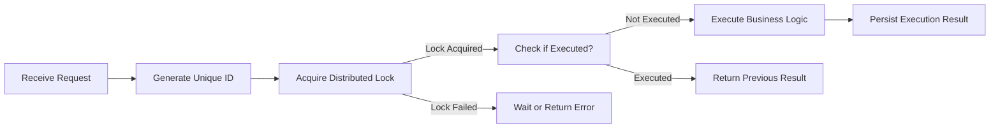
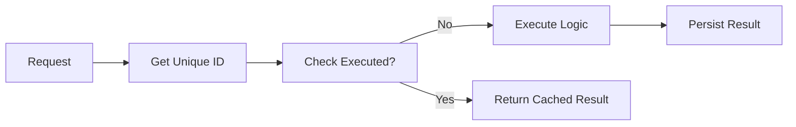
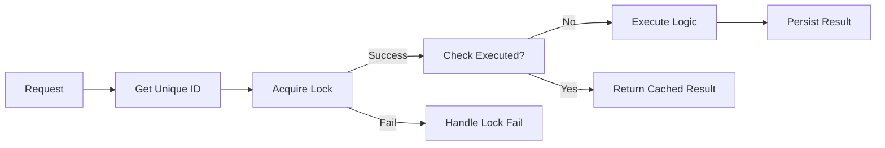

## Overview
- **Date**: 2020-01-05  
- **Reading Time**: ~3 minutes  
- **Context**: Detailed notes about idempotence—origin, necessity, and implementation strategies.  
- **Key Topics**:  
  - Mathematical background of idempotence  
  - Need for idempotence in distributed systems  
  - Identifying identical requests  
  - Common solutions (e.g., tokens, resource + reqNo)  
  - Concurrency problems and distributed locks  
  - Database “deduplication table” approach  
- **Primary Source**: [developer.mozilla.org on HTTP idempotent methods](https://developer.mozilla.org/en-US/docs/Web/HTTP/Methods)
---
## 1. What Is Idempotence?
### 1.1 Mathematical Origin
In mathematics, an **idempotent** element satisfies:  
$f(f(x)) = f(x)$
This means applying the function `f` multiple times yields the same result as applying it once.
### 1.2 Programming / HTTP Context
In the programming world—especially in HTTP—the common description is:
> *An operation is idempotent if repeating it multiple times yields the same overall effect as doing it once.*

**Side note**: HTTP `GET` is often considered idempotent because multiple `GET` requests typically do not change server state. However, if the server logs each request or updates analytics counters, there **is** a side-effect—yet, we still typically call `GET` idempotent **from the business perspective**.
### 1.3 Possible Confusion
- If **idempotence** is interpreted strictly as “the same request returns the same result every time,” then caching the first request’s result might appear to suffice.  
- However, changes to data between repeated calls can make results differ. Does that break idempotence?  
- A more **accurate** definition:
  > *Idempotence means that the **side-effects** of executing the same request once or multiple times are the same.*

**Quote from MDN**:  
> “An HTTP method is idempotent if an identical request can be made once or several times in a row with the same effect while leaving the server in the same state.”

---

## 2. Why Do We Need Idempotence?

### 2.1 Distributed Systems, Retries & Network Timeouts
Consider an **Order Service** → **Payment Service** flow:
1. The user submits an order creation request.
2. The order service creates the order and calls the payment service for payment.
3. Network timeout occurs, so the order service retries the payment request.

If the **Payment Service** is **not** idempotent, the user might be charged multiple times.

### 2.2 Message Middleware & Re-delivery
Modern systems often use **message brokers** (e.g., Kafka, RabbitMQ) for asynchronous workflows:
- Messages will be **retried** if no acknowledgment is received within a certain timeframe.  
- Without idempotent message consumption, repeated deliveries could lead to duplicated, inconsistent, or incorrect data (even financial losses).

Thus, **idempotent interfaces** are crucial to avoid negative outcomes in distributed systems.

---

## 3. How to Implement Idempotence

### 3.1 Identifying Identical Requests
To achieve idempotence, we must **recognize** when two requests are “the same.” There are a few strategies:
1. **System-to-System Calls**  
   - Pass in a **`resource`** and a **`reqNo`** (request number).  
   - For example: `(resourceId, requestId)` makes the request uniquely identifiable.
2. **Front-End to Back-End**  
   - The front-end requests a **token** (persisted on the server), then **every** request must carry that token.  
   - The server identifies the request by this token.
3. **Hashing / MD5**  
   - Use specific input parameters (e.g., user ID, order details) to compute an MD5 hash as the unique ID.  
   - Example code snippet (Pythonic pseudo-code):
     ```python
     import hashlib

     def generate_unique_id(**kwargs):
         # Combine specific params into a string
         raw_str = "|".join(str(kwargs[k]) for k in sorted(kwargs.keys()))
         return hashlib.md5(raw_str.encode('utf-8')).hexdigest()
     ```
---
### 3.2 Query Execution Status
After generating a **unique identifier** for the request, the next step is:
1. **Query whether the request has been executed**.  
2. If it has, **return** the stored result or success response.  
3. If it has not, **execute** the business logic.
However, concurrency issues can arise.

---
## 4. Handling Concurrency
### 4.1 Version v1 (Naive Approach)

- **Problem**: If two threads simultaneously check and see “not executed,” both proceed to execute the logic → breaks idempotence.
---
### 4.2 Version v2 (Distributed Lock)

- This approach uses a **distributed lock** (e.g., **Redis** or **Zookeeper**):
  1. Before checking the “executed” status, lock on the unique ID.  
  2. If lock is acquired, then proceed to check and possibly execute the logic.  
  3. Release the lock after finishing.
- **Caveat**: If the **lock** mechanism fails (e.g., lock expiration, network partition), concurrency issues remain possible.

---
### 4.3 Database Deduplication Table
An alternative or complementary approach:
1. Use a **database table** specifically for deduplication.  
2. The **unique ID** is stored in a column with a **UNIQUE constraint**.  
3. On receiving a request, attempt to **insert** a row with that unique ID.  
   - **If insert succeeds**, the request is new; proceed with business logic.  
   - **If insert fails** (violates unique constraint), the request was processed; return the previous result or skip.
**Sample SQL**:
```sql
CREATE TABLE request_dedup (
    req_id VARCHAR(64) NOT NULL,
    status TINYINT NOT NULL DEFAULT 0,
    result VARCHAR(255),
    UNIQUE KEY (req_id)
);

-- Inserting logic (pseudo-code)
INSERT INTO request_dedup (req_id, status, result) VALUES (#{unique_id}, 0, '')
/* If fails -> it's a duplicate */
```
- This approach relies on the **database** to handle concurrency (ACID properties).  
- The biggest downside is performance overhead on the DB, especially under high throughput.

---
## 5. Example Implementation Flows
### 5.1 Using a Distributed Lock + DB
1. **Generate** a unique ID (e.g., `resource + reqNo`).  
2. **Try** to acquire a distributed lock (e.g., Redis `SETNX`).  
3. **Check** in the deduplication table if this request has been executed.  
   - If not, insert a new row to mark it as in-process.  
4. **Execute** business logic (e.g., deduct payment).  
5. **Update** the deduplication table result (or remove it, depending on the design).  
6. **Release** the lock.  
### 5.2 Using Only DB Unique Constraints
1. **Generate** a unique request ID.  
2. **Insert** into `request_dedup` table:
   ```sql
   INSERT INTO request_dedup(req_id, ...) VALUES (#{unique_id}, ...)
   ```
3. If **insertion fails**, treat as **duplicate** and query final result.  
4. If **insertion succeeds**, run business logic, store the result.  

This is simpler but can be heavier on the database.

---
## 6. Summary of Key Points
1. **Idempotence** ensures repeated operations lead to the same final state.  
2. **Identifying identical requests** is crucial:
   - Use request ID (`reqNo`) + resource or tokens, or hashing input parameters.  
3. **Concurrency** must be handled:
   - Simple check-before-insert can cause race conditions.  
   - Solutions: **distributed locks**, **unique constraints** in DB, or both.  
4. **Trade-offs**:
   - Lock-based approach depends on correct lock handling (timeouts, etc.).  
   - DB-based approach is simpler but might be a bottleneck under high concurrency. 

---
## 7. Visual References
**Version v1: Naive**  



**Version v2: Distributed Lock**  



---

## 8. Code Snippets

### 8.1 Generating a Unique Request ID (Python)
```python
import hashlib
import time
import uuid

def generate_request_id(resource, user_id):
    # Possibly include a timestamp or a random factor
    raw_str = f"{resource}-{user_id}-{time.time()}-{uuid.uuid4()}"
    return hashlib.md5(raw_str.encode('utf-8')).hexdigest()
```

### 8.2 Deduplication Table Insert (MySQL)
```sql
CREATE TABLE IF NOT EXISTS request_dedup (
    req_id VARCHAR(64) NOT NULL,
    result VARCHAR(255),
    created_at TIMESTAMP DEFAULT CURRENT_TIMESTAMP,
    UNIQUE KEY (req_id)
);

-- Insert logic
INSERT INTO request_dedup(req_id, result) VALUES(#{req_id}, '')
```

### 8.3 Distributed Lock with Redis (Pseudo-code)
```python
import time
import redis

r = redis.Redis()

def acquire_lock(lock_key, lock_value, ttl=10):
    # NX: Only set the key if it does not already exist
    # EX: Set expire time in seconds
    return r.set(lock_key, lock_value, ex=ttl, nx=True)

def release_lock(lock_key, lock_value):
    # Ensure we only release the lock if lock_value matches
    script = """
    if redis.call("get", KEYS[1]) == ARGV[1] then
        return redis.call("del", KEYS[1])
    else
        return 0
    end
    """
    return r.eval(script, 1, lock_key, lock_value)
```

---

## 9. Final Thoughts
1. **Idempotence** is vital in distributed systems to avoid duplicating operations and corrupting state.  
2. A **unique identifier** and **some form of concurrency control** (distributed lock or DB constraint) form the backbone of any robust solution.  
3. **Always test** under concurrent scenarios—especially critical for payment or financial transactions.

---

## 10. References & Further Reading
- [MDN on Idempotent HTTP Methods](https://developer.mozilla.org/en-US/docs/Web/HTTP/Methods)
- [[Redis Distributed Locks]]
- [[Database Unique Constraints]]
- [What Is a Dead Letter Queue? (Message Middleware)](https://en.wikipedia.org/wiki/Dead_letter_queue)
```