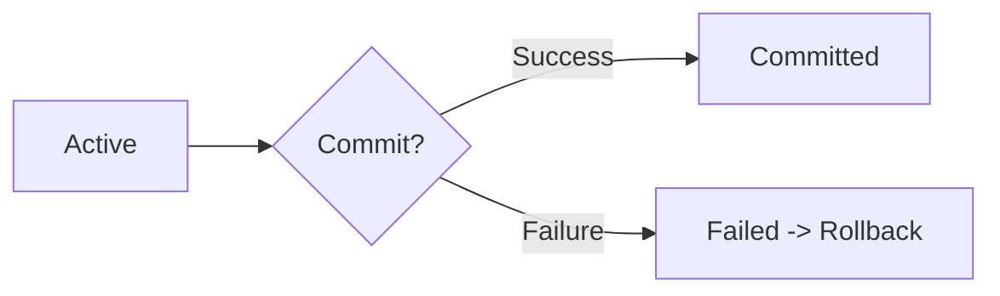
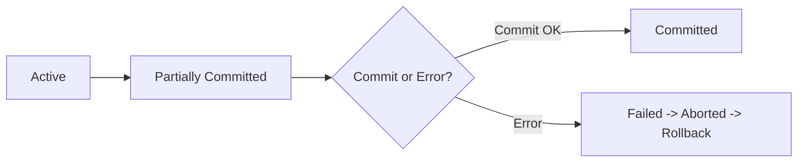
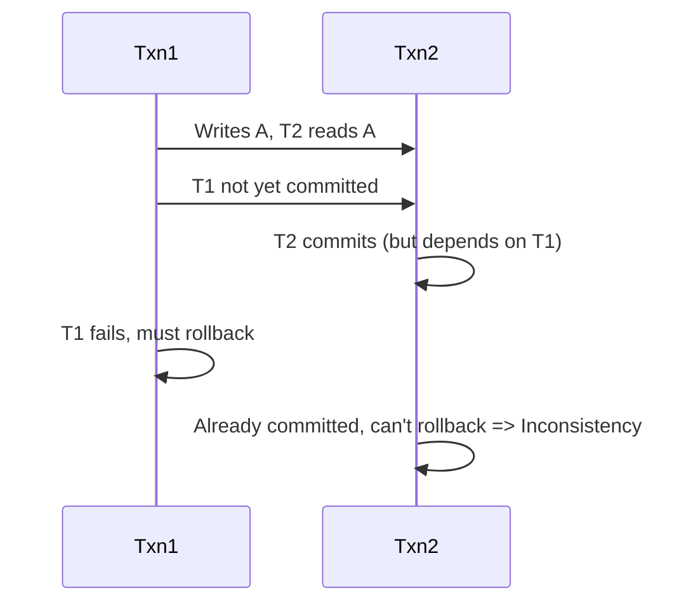
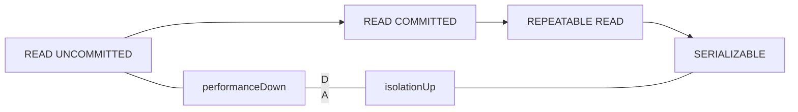
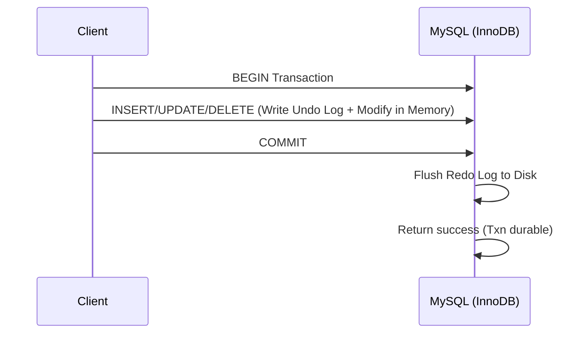

https://draveness.me/mysql-transaction/
## Overview
- **Date**: 2017-08-20  
- **Tech Stack**: MySQL, PostgreSQL, RDBMS  
- **Key Topics**:  
  - **ACID** properties (Atomicity, Consistency, Isolation, Durability)  
  - **Rollback Log (Undo Log)**  
  - **Redo Log**  
  - **Transaction Isolation Levels**  
  - **Concurrency Control** (Locks, Timestamps, MVCC)  
- **Goal**: Understand **how MySQL implements transactions** and how the fundamental database logs (undo, redo) enforce the **ACID** properties.  

---
## 1. Transaction Basics
### 1.1 What Is a Transaction?
A **transaction** is the **basic unit of concurrency** in a database: a sequence of operations (SQL statements) that either all succeed (commit) or all fail (rollback). In MySQL (and other relational databases), transactions must follow the **ACID** properties:
- **Atomicity**: All or nothing—either the transaction completes fully, or none of its effects persist.
- **Consistency**: The database remains in a valid state before and after the transaction.
- **Isolation**: Concurrent transactions shouldn’t interfere in a way that breaks each transaction’s correctness.
- **Durability**: Once committed, the transaction’s effects are permanently recorded—even if the system crashes.
---
## 2. Atomicity
### 2.1 Introduction to Atomicity
> *“All operations in a transaction are either completely executed or not executed at all.”*  

If a transaction fails partway, the database must revert to the state before the transaction began. This rollback mechanism is at the heart of atomicity.
### 2.2 Rollback (Undo) Log
MySQL implements atomicity primarily through the **rollback log** (often called the **undo log**).  
- **Rollback log** records *before* images of modified data (logical changes).  
- If a transaction aborts (fails or is explicitly rolled back), MySQL **undoes** any changes by reversing them using the undo log.
1. **Write-Ahead Logging**: The undo log entry is persisted **before** applying changes to data. This ensures that if a crash occurs mid-transaction, MySQL can revert partial updates upon restart.
2. **Logical Rollback**: Each `INSERT` is undone by a `DELETE`, each `UPDATE` undone by an opposite `UPDATE`, etc.
### 2.3 Transaction States
At a high level, transactions have three “macro” states:
1. **Active**: Executing.
2. **Committed**: All statements finished successfully.
3. **Failed**: Something went wrong; needs a rollback.

Zooming in, the detailed states might include *Partially Committed*, *Aborted*, etc. The following diagrams illustrate the conceptual difference:

**High-Level (Atomic) View**  


**Detailed (Non-Atomic) View**  

---
## 3. Durability
### 3.1 Redo Log
**Durability** ensures that once a transaction is committed, its effects persist even if the system crashes. MySQL uses a **redo log** to record all changes that need to be applied to the data files on disk.
1. **In-Memory Buffer (Redo Log Buffer)**  
   - Temporary holding area for redo records before flushing to disk.
2. **On-Disk File (Redo Log File)**  
   - Persistent store for redo entries.
#### Write Sequence
1. **InnoDB** modifies data in a memory buffer (the buffer pool).  
2. **Generate** redo log entries and store them in the **redo log buffer**.  
3. On **transaction commit**, flush the redo log buffer to the **redo log file** on disk.  
4. Finally, the updated pages may be written to the data files (lazy writing).

**Diagram**:

- **Atomic Sector Writes**: InnoDB uses 512-byte log blocks that align with disk sectors, helping prevent partial writes.  
- **Crash Recovery**: If MySQL crashes, it replays redo logs upon startup to ensure committed transactions are not lost.
### 3.2 Undo vs. Redo
- **Undo (Rollback) Log**: Reverts changes from incomplete transactions for **atomicity**. 
- **Redo Log**: Replays committed changes that aren’t fully persisted, ensuring **durability**.
Together, they form the **transaction log** (or the “write-ahead” logs), which guarantee:
1. **Atomicity** – incomplete transactions can be rolled back.  
2. **Durability** – committed data can be recovered if a crash interrupts the final disk write.

---
## 4. Isolation

### 4.1 The Need for Isolation
When transactions run in **parallel**, they can conflict. Without proper isolation, issues like **nonrecoverable schedules** or **cascading rollbacks** can arise, causing severe inconsistencies.

#### Nonrecoverable Schedule Example


**Recovery** requires that if T2 depends on T1, T2 cannot commit before T1 commits.

#### Cascading Rollback
If T1 fails, all transactions reading data from T1 (and their subsequent dependents) may have to roll back as well. This is **cascading** and can be expensive.

### 4.2 Concurrency Control Mechanisms

1. **Lock-Based**  
   - **Shared Lock**: Multiple readers allowed (no writing).  
   - **Exclusive Lock**: Only one writer; no other reads or writes allowed on that resource.  
2. **Timestamp-Based**  
   - Each row has a **read** and **write** timestamp.  
   - Transactions proceed optimistically, then check timestamps upon commit.  
3. **MVCC (Multi-Version Concurrency Control)**  
   - Multiple versions of a row exist.  
   - Readers can access older snapshots without blocking writers.  
   - MySQL (InnoDB) implements MVCC using **undo logs**; PostgreSQL uses a different approach but similar concept.

### 4.3 Transaction Isolation Levels
**SQL Standard** defines four levels (from weaker to stronger isolation):

1. **READ UNCOMMITTED**  
   - Dirty read is possible (reading uncommitted data).
2. **READ COMMITTED**  
   - Prevents dirty reads, but **non-repeatable reads** can occur.
3. **REPEATABLE READ** *(MySQL’s default)*  
   - Prevents non-repeatable reads but might allow **phantom reads**.
4. **SERIALIZABLE**  
   - Full isolation; behaves as if transactions run sequentially (potentially lower performance).

**Performance vs. Isolation**  

- As you move right, you increase isolation but reduce concurrency/throughput.

---

## 5. Consistency

### 5.1 ACID Consistency
> *If a transaction starts with the database in a consistent state, it must end with the database in a consistent state (assuming correct application logic).*

- **Integrity Constraints** (PK, FK, Unique constraints) remain valid throughout.  
- **Application Logic** must ensure that transactions do not produce invalid states (e.g., transferring money must debit one account and credit another).

### 5.2 CAP Consistency
This is a **different** concept in **distributed systems** (Consistency-Availability-Partition tolerance). **ACID consistency** and **CAP consistency** are not the same.

> “When discussing consistency, confirm whether you mean ACID’s integrity constraints or CAP’s data replication consistency.”

---

## 6. Putting It All Together

1. **Atomicity**  
   - Ensured by the **undo log**. Any partial changes can be rolled back.
2. **Consistency**  
   - Combination of **correct transaction logic** and built-in integrity constraints.
3. **Isolation**  
   - Achieved via **locking**, **MVCC**, or **timestamp** concurrency controls.  
   - Configurable **isolation levels** to balance performance vs. correctness.
4. **Durability**  
   - Achieved via the **redo log**. Committed data is safely persisted.

**High-Level Transaction Flow**  


---

## 7. Example: Simplified Transaction Demo

```sql
-- Suppose we have an accounts table:
CREATE TABLE accounts (
    account_id INT PRIMARY KEY,
    balance DECIMAL(10,2)
);

-- Sample transaction to transfer 100 from account 1 to account 2
START TRANSACTION;
  UPDATE accounts SET balance = balance - 100 WHERE account_id = 1;
  UPDATE accounts SET balance = balance + 100 WHERE account_id = 2;
COMMIT;
```

1. **Undo Log**: Records “before image” of both rows.  
2. **Redo Log**: On commit, MySQL writes redo entries describing changes to `balance` in each account.  
3. **Isolation**: If another transaction tries to read or update these rows concurrently, InnoDB’s MVCC or locks manage concurrency.  
4. **Atomicity**: If something fails between the two `UPDATE`s, a rollback will undo them both.  
5. **Durability**: After the commit flushes the redo log, the new balances persist.

---

## 8. Summary

- **Transactions** are the fundamental building blocks for **safe** and **correct** database updates.  
- **ACID**:
  1. **Atomicity** → Undo logs.  
  2. **Consistency** → Integrity constraints + correct transaction logic.  
  3. **Isolation** → Locking, MVCC, concurrency control.  
  4. **Durability** → Redo logs.  
- **MySQL InnoDB** uses two core logs to implement ACID: **undo log** (rollback) and **redo log** (commit persistence).  
- **Isolation** levels range from weaker (READ UNCOMMITTED) to stronger (SERIALIZABLE). MySQL defaults to **REPEATABLE READ**.  
- **Consistency** in ACID is different from consistency in the **CAP** theorem.  

---

## 9. References & Further Reading

1. **Database System Concepts** (Silberschatz, Korth, Sudarshan), Chapter 14 for transaction states.  
2. **MySQL Documentation** – [InnoDB Transaction Model](https://dev.mysql.com/doc/refman/8.0/en/innodb-transaction-model.html)  
3. **PostgreSQL Docs** – [MVCC in PostgreSQL](https://www.postgresql.org/docs/current/mvcc.html)  
4. [CAP Theorem (Wikipedia)](https://en.wikipedia.org/wiki/CAP_theorem)

```