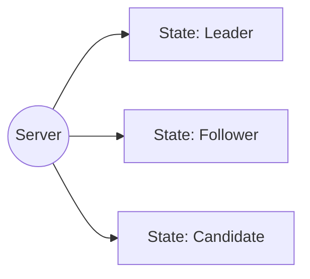

https://draveness.me/etcd-introduction/
## Overview
- **Date**: 2018-10-22  
- **Category**: Distributed System, etcd, Raft, Database Coordination  
- **Key Topics**:  
  - etcd overview  
  - Comparison with ZooKeeper  
  - gRPC/Protobuf usage  
  - Raft consensus algorithm (Leader election, log replication, safety)  
  - etcd’s internal node architecture and message handling  
  - Application scenarios  
---
## 1. Introduction to etcd
etcd is often described as a **reliable distributed key-value store** that can store crucial data (configuration, service discovery information, distributed coordination signals) for a cluster. It’s comparable in purpose to **ZooKeeper**, but with a slightly different focus:
1. **etcd**: 
   - “A distributed reliable key-value store for the most critical data of a distributed system.”
   - Emphasizes a simple KV interface using **gRPC**.
2. **ZooKeeper**:
   - “A centralized service for maintaining configuration information, naming, providing distributed synchronization, and group services.”
### 1.1 Key Points
- etcd provides a **gRPC** interface, which can be consumed directly via **Protobuf** messages, or through the official CLI `etcdctl`.
- Typical usage involves running **3–5 etcd nodes** to achieve high availability via the **Raft** consensus algorithm.
```proto
service KV {
  rpc Range(RangeRequest) returns (RangeResponse) {
      option (google.api.http) = {
        post: "/v3beta/kv/range"
        body: "*"
      };
  }

  rpc Put(PutRequest) returns (PutResponse) {
      option (google.api.http) = {
        post: "/v3beta/kv/put"
        body: "*"
      };
  }
}
```
> *Excerpt of etcd’s Protobuf definition for the KV service.*

---
## 2. Raft in etcd
Since etcd is typically used to store configuration and other critical data, **availability** is crucial. A cluster of **3–5 etcd nodes** forms a high-availability group. Under the hood, **Raft** is used to maintain data consistency across nodes:
### 2.1 Brief Recap of Raft
- **Raft** is a consensus algorithm designed to be easier to understand and implement than Paxos.
- A Raft cluster has nodes in **Leader**, **Follower**, or **Candidate** states at any given time. Usually:
  - Exactly **1 Leader**
  - The rest are **Followers**
  - **Candidate** is a temporary state when elections occur
- Time is divided into **terms**. Each term has **one election** for a Leader. If a Leader fails, a new term starts with a new election.



**In etcd**, the Raft module is crucial to replicate logs across nodes, ensuring consistent state.

---
## 3. Node Election in etcd (Raft)
When you start an etcd cluster, each node runs through the **Raft** protocol steps. Let’s see how etcd implements **node** initialization and the main loop.
### 3.1 Node Initialization
```go
// https://github.com/etcd-io/etcd/blob/main/raft/node.go (simplified snippet)
func StartNode(c *Config, peers []Peer) Node {
    r := newRaft(c)
    r.becomeFollower(1, None)
    r.raftLog.committed = r.raftLog.lastIndex()

    // Add peers to the cluster
    for _, peer := range peers {
        r.addNode(peer.ID)
    }

    n := newNode()
    go n.run(r) // Start the main loop in a goroutine
    return &n
}
```
1. **`newRaft(c)`** creates the Raft instance with the given config.
2. **`becomeFollower(1, None)`** sets the node’s initial state to **Follower** with term = 1.
3. **`n.run(r)`** starts a loop that listens for messages and timers.

### 3.2 The Main Loop

```go
// https://github.com/etcd-io/etcd/blob/main/raft/node.go (simplified)
func (n *node) run(r *raft) {
    lead := None

    for {
        select {
        case m := <-n.recvc:  // 1) Receive Raft messages from other nodes
            r.Step(m)
        case <-n.tickc:      // 2) Timer tick triggers
            r.tick()
        case <-n.stop:       // 3) Stop signal
            close(n.done)
            return
        }
    }
}
```

- **`recvc`**: channel of inbound Raft messages (RPC-like events from peers).
- **`tickc`**: channel for **timer** ticks.
- **`stop`**: channel to terminate the node.
---
## 4. Raft’s Timers & Heartbeats
### 4.1 Timers in etcd’s Raft
When a node transitions to **Follower**, it calls `becomeFollower(...)` which sets its timer to **`tickElection()`**:
```go
func (r *raft) tickElection() {
    r.electionElapsed++

    if r.promotable() && r.pastElectionTimeout() {
        r.electionElapsed = 0
        // Trigger an election
        r.Step(pb.Message{From: r.id, Type: pb.MsgHup})
    }
}
```
- If a Follower node goes too long without hearing from a Leader, it sends itself **`MsgHup`** to start an election.

Meanwhile, a **Leader** uses **`tickHeartbeat()`**:
```go
func (r *raft) tickHeartbeat() {
    r.heartbeatElapsed++
    r.electionElapsed++

    if r.heartbeatElapsed >= r.heartbeatTimeout {
        r.heartbeatElapsed = 0
        // Broadcast heartbeat to all followers
        r.Step(pb.Message{From: r.id, Type: pb.MsgBeat})
    }
}
```
### 4.2 Heartbeat Processing
**Leader**:
- On `MsgBeat`, calls `bcastHeartbeat()` to send `MsgHeartbeat` to each Follower.
- Each `MsgHeartbeat` resets Follower timeouts.

```go
func (r *raft) sendHeartbeat(to uint64, ctx []byte) {
    commit := min(r.getProgress(to).Match, r.raftLog.committed)
    m := pb.Message{
        To:     to,
        Type:   pb.MsgHeartbeat,
        Commit: commit,
        Context: ctx,
    }
    r.send(m)
}
```

**Follower**:
- On receiving `MsgHeartbeat`, it resets `electionElapsed`, sets `lead = m.From`, and replies to the Leader.

```go
func stepFollower(r *raft, m pb.Message) error {
    switch m.Type {
    case pb.MsgHeartbeat:
        r.electionElapsed = 0
        r.lead = m.From
        r.handleHeartbeat(m)
    // ...
    }
    return nil
}
```

If a node is in **Candidate** state and receives a `MsgHeartbeat` from some Leader, it **becomesFollower** again, acknowledging the real Leader:

```go
func stepCandidate(r *raft, m pb.Message) error {
    switch m.Type {
    case pb.MsgHeartbeat:
        r.becomeFollower(m.Term, m.From)
        r.handleHeartbeat(m)
    }
    // ...
    return nil
}
```

---

## 5. Election Process

When a node sees no Leader heartbeats for a while, it times out and triggers an election with `MsgHup`. That calls `campaign(...)`.

```go
func (r *raft) Step(m pb.Message) error {
    // ...
    switch m.Type {
    case pb.MsgHup:
        if r.state != StateLeader {
            if r.preVote {
                r.campaign(campaignPreElection)
            } else {
                r.campaign(campaignElection)
            }
        }
    }
    // ...
    return nil
}
```
**Pre-vote** is a step to prevent repeated term inflation in 2-node scenarios. Let’s look at the main **election** logic.

### 5.1 Campaign

```go
func (r *raft) campaign(t CampaignType) {
    r.becomeCandidate()
    // Vote for itself
    if r.quorum() == r.poll(r.id, voteRespMsgType(voteMsg), true) {
        // If only one node in cluster, become Leader immediately
        r.becomeLeader()
        return
    }
    // Broadcast MsgVote to all other nodes
    for id := range r.prs {
        if id == r.id {
            continue
        }
        r.send(pb.Message{
            Term:  r.Term,
            To:    id,
            Type:  pb.MsgVote,
            Index: r.raftLog.lastIndex(),
            LogTerm: r.raftLog.lastTerm(),
        })
    }
}
```

### 5.2 Voting

**Followers** check if they can vote:

```go
func (r *raft) Step(m pb.Message) error {
    // ...
    switch m.Type {
    case pb.MsgVote, pb.MsgPreVote:
        canVote := r.Vote == m.From || (r.Vote == None && r.lead == None)
        upToDate := r.raftLog.isUpToDate(m.Index, m.LogTerm)

        if canVote && upToDate {
            // Grant vote
            r.send(pb.Message{To: m.From, Term: m.Term, Type: pb.MsgVoteResp})
            r.electionElapsed = 0
            r.Vote = m.From
        } else {
            // Reject
            r.send(pb.Message{To: m.From, Term: r.Term, Type: pb.MsgVoteResp, Reject: true})
        }
    }
    // ...
    return nil
}
```

**Candidate** collects vote responses `MsgVoteResp`:

```go
func stepCandidate(r *raft, m pb.Message) error {
    switch m.Type {
    case pb.MsgVoteResp:
        gr := r.poll(m.From, m.Type, !m.Reject) 
        if gr == r.quorum() {
            // Enough votes -> become leader
            r.becomeLeader()
            r.bcastAppend()
        }
    }
    return nil
}
```
- **`r.poll(...)`** updates the local votes table. If the count of granted votes >= quorum, the node declares itself Leader.

---

## 6. Next Steps in Raft: Log Replication & Safety

While this note focuses heavily on the **Leader Election** portion in etcd, Raft also handles:
1. **Log Replication**: The Leader appends entries to its log and sends them to Followers, ensuring a consistent log across the cluster.
2. **Safety**: Various rules (e.g., the “Leader completeness” property, “State Machine Safety”) guarantee that once a log entry is committed, all future Leaders have that entry in their log.

etcd implements these steps in the same `raft` package, using methods like `appendEntries`, `handleAppendEntries`, `bcastAppend`, and so forth.

---

## 7. etcd Storage Module (Brief Overview)

Underneath, etcd uses **BoltDB** (or an evolved version named **bbolt**) for persistent storage. Key points:
- **MVCC** style: etcd can retain historical versions of keys.
- On each commit from Raft, etcd applies the updates to its local BoltDB.
- Offers watchers, transactions, leases, and more at the KV layer.

---

## 8. Typical Application Scenarios

- **Service Discovery**: Applications register themselves with etcd, providing their IP/port. Clients query etcd to discover available service endpoints.
- **Configuration Management**: Centralized key-value configuration (similar to ZooKeeper). Clients watch on config keys for real-time updates.
- **Distributed Coordination**: Leader election for microservices or other cluster-level tasks, using etcd’s concurrency API with locks, leases, etc.
- **Kubernetes**: etcd is the **primary data store** for all cluster states (pods, services, config maps, etc.).

---

## 9. Summary

1. **etcd** is a **reliable distributed KV store** often used for critical cluster data.
2. **Raft** forms the **backbone** of etcd’s replication mechanism:
   - A single Leader handles writes, replicates to Followers.
   - Elections happen on Leader failure or timeout.
3. etcd’s implementation details:
   - A central `node.run(...)` loop receiving messages, timeouts.
   - Heartbeats keep followers in sync, elections occur when they expire.
4. Data is **persisted** using an embedded bbolt/boltdb engine, ensuring durability.
5. etcd is widely used in **production** for service discovery, config management, and as a central “source of truth” in distributed systems like **Kubernetes**.

---

## 10. References & Further Reading

- [Official etcd Documentation](https://etcd.io/docs)
- [Raft Paper: *In Search of an Understandable Consensus Algorithm*](https://raft.github.io/)
- [ZooKeeper vs etcd Comparison](https://zookeeper.apache.org)  
- [etcd Source Code on GitHub](https://github.com/etcd-io/etcd)  
- [BoltDB/bbolt on GitHub](https://github.com/etcd-io/bbolt)

```