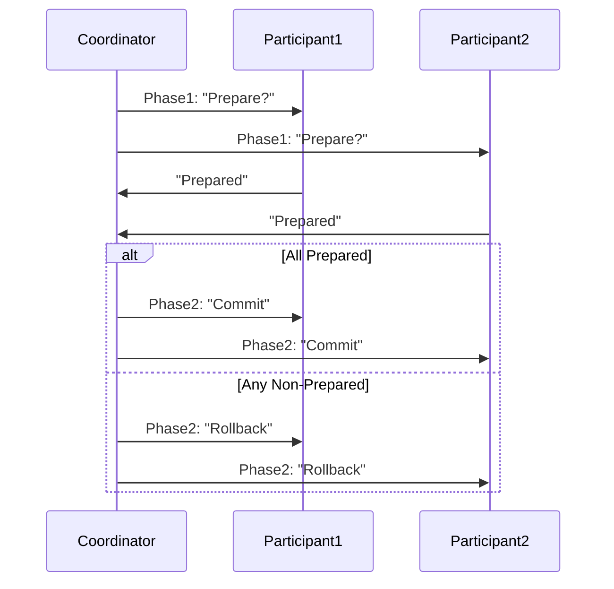

> **Original**:  
> This article is forwarded from [Technology World](http://www.jasongj.com/big_data/two_phase_commit/) , the original link is:  
> [http://www.jasongj.com/big_data/two_phase_commit/](http://www.jasongj.com/big_data/two_phase_commit/)  
https://github-com.translate.goog/guevara/read-it-later/issues/1124?_x_tr_sl=auto&_x_tr_tl=en&_x_tr_hl=en
## 1. Introduction to Distributed Transactions
In **distributed transactions**, multiple resources (e.g., multiple databases or message queues) participate in a single transaction. The goal is to ensure **ACID** properties (Atomicity, Consistency, Isolation, Durability) across all these resources. 

- **Local transactions**: confined to a single database’s ACID properties.  
- **Distributed transactions**: expand these guarantees to multiple, physically distinct resources.  

### 1.1 Why Distributed Transactions?
- A single operation might require updates to multiple databases (or DB + JMS queue).  
- We want to ensure *all updates commit or none do* (atomicity).  

### 1.2 Key Challenges
- Each resource has its **own** local transaction mechanism.  
- No single resource can see the internal state of another resource’s transaction.  
- We introduce a **coordinator** (Transaction Manager) to orchestrate the global commit or rollback.

---

## 2. Distributed Transaction Implementation Mechanisms

### 2.1 ACID in PostgreSQL (Local)
| ACID        | Implementation in PostgreSQL |
|-------------|------------------------------|
| Atomicity   | MVCC                         |
| Consistency | Constraints (PK, FK, etc.)  |
| Isolation   | MVCC                         |
| Durability  | WAL                          |

### 2.2 ACID in Distributed Context
When multiple PostgreSQL databases (or other resource managers) participate, each one provides consistency, isolation, and durability locally. However, **atomicity** across them needs an extra layer:

| Distributed ACID | Implementation (with PostgreSQL as participant)  |
|-------------------|-------------------------------------------------|
| Atomicity        | MVCC + **Two-Phase Commit** (2PC)                |
| Consistency      | Local constraints (PK, FK, etc.)                 |
| Isolation        | Local MVCC                                       |
| Durability       | Local WAL                                        |

Thus, **two-phase commit** (2PC) ensures *global* atomicity.

---

## 3. Two-Phase Commit (2PC)

### 3.1 Ensuring Atomicity in Distributed Systems

**Problem**:  
Each node (DB, JMS, etc.) sees only its own local transaction. Without coordination, they can’t be sure if others want to commit or roll back.

**Solution**:  
Introduce a **coordinator** that orchestrates the commit/rollback across all participants. All participants do the same final action—either *all commit* or *all rollback*.

---

### 3.2 XA Specification

**XA** is an industry-standard interface from **X/Open**. It defines how a **Transaction Manager** (coordinator) talks to **Resource Managers** (like databases). Key interfaces:

1. **xa_open / xa_close**: Open/close connection to resource manager.  
2. **xa_start / xa_end**: Start/end a local transaction branch.  
3. **xa_prepare / xa_commit / xa_rollback**: The 2PC protocol steps (prepare → commit/rollback).  
4. **xa_recover**: Recovery for in-doubt transactions (pre-committed but not completed).

Major databases (Oracle, DB2, PostgreSQL, etc.) implement XA.  

**Transaction Manager** = the “coordinator” controlling the global transaction boundaries and orchestrating commits or rollbacks.

---

### 3.3 Two-Phase Commit Principle

**High-level**:  
1. **Prepare (Voting) Phase**: Coordinator asks each participant, “Can you commit?”  
   - If participant is ready, responds **Prepared**.  
   - Otherwise, responds **Non-Prepared**.  
2. **Commit (Execution) Phase**:  
   - If *all* participants answered Prepared, coordinator broadcasts **commit**.  
   - If *any* participant answered Non-Prepared, coordinator broadcasts **rollback**.

**Interaction**:



---

### 3.4 Prerequisites for 2PC

- **Reliable network** (though not always 100% in reality; 2PC assumes no permanent partition).  
- Crashed nodes eventually recover.  
- Each participant logs transaction steps in **WAL** (stable storage).  
- On recovery, a participant can figure out from WAL whether it was in a prepared state or not.

---

### 3.5 Fault Tolerance in 2PC

1. **Participant Crash** while coordinator is still up:  
   - If participant doesn’t respond with *Prepared*, coordinator will **rollback** the transaction.  
   - If participant crashed *after* it had committed, upon recovery it can consult logs.  

2. **Coordinator Crash** while participants are up:  
   - A new coordinator can be elected or the same coordinator recovers from log and re-issues commit/rollback.  

3. **All Crash**:  
   - If coordinator + participants all crashed after some commits were done, on recovery they consult logs.  
   - If only some participants got the commit message, and others + coordinator were in doubt, they must eventually discover the final outcome once the node with the commit record recovers.

**Hence** 2PC doesn’t fully solve all *network partition* or indefinite crash issues, but it’s a practical, widely used approach.

---

## 4. JTA (Java Transaction API)

### 4.1 Overview

**JTA** defines a *standard Java interface* for distributed transactions. It models the XA architecture:

- `javax.transaction.TransactionManager` = the global coordinator API.  
- The actual underlying transaction service is often a vendor-specific or open-source library (JBoss, Atomikos, etc.).

### 4.2 Common JTA Providers

- **J2EE containers** (like JBoss, GlassFish) embed their own JTA manager.  
- **Independent JTA**: e.g., **JOTM**, **Atomikos**, for non-J2EE environments.

---

## 5. PostgreSQL Two-Phase Commit Interface

PostgreSQL offers explicit statements:

1. **`PREPARE TRANSACTION 'txid'`**  
   - Prepares current transaction for 2PC.  
   - The local transaction is *disconnected* from the session.  
   - Saved on disk so that it can survive a crash.

2. **`COMMIT PREPARED 'txid'`**  
   - Commit the prepared transaction identified by `'txid'`.  

3. **`ROLLBACK PREPARED 'txid'`**  
   - Roll back the prepared transaction `'txid'`.  

#### Example

```sql
BEGIN;
CREATE TABLE demo(a TEXT, b INT);
PREPARE TRANSACTION 'the_first_prepared_transaction';
SELECT * FROM pg_prepared_xacts;
```
- Checking `pg_prepared_xacts` shows the prepared transaction info:
  ```sql
  transaction | gid                            | prepared                     | owner | database
  ----------- | ------------------------------ | ---------------------------- | ----- | --------
  23970       | the first prepared transaction | 2016-08-01 20:44:55.816267+08 | casp | postgres
  ```

After exiting the session, the transaction remains in `pg_prepared_xacts`. Then:

```sql
ROLLBACK PREPARED 'the_first_prepared_transaction';
SELECT * FROM pg_prepared_xacts; 
-- (no rows)
```
**Observations**:
- The prepared transaction’s locks remain until commit/rollback.  
- `PREPARE TRANSACTION` is **not** allowed if the transaction used temporary tables or “WITH HOLD” cursors.  
- Setting changes (`SET search_path`, etc.) remain session-scoped, unaffected by 2PC commit.  
- `max_prepared_transactions` must be > 0 in `postgresql.conf` to enable 2PC.

---

## 6. JTA + PostgreSQL Two-Phase Commit (Atomikos Example)

Below is an example using **Atomikos** as the JTA provider and **PostgreSQL** on two different hosts as resources.

```java
@Path("/jta")
public class JTAResource {
    private static final Logger LOGGER = LoggerFactory.getLogger(JTAResource.class);

    @GET
    @Path("/{commit}")
    public String test(@PathParam("commit") boolean isCommit)
       throws NamingException, SQLException, NotSupportedException, SystemException {

       UserTransaction userTransaction = null;

       try {
         Context context = new InitialContext();
         userTransaction = (UserTransaction) context.lookup("java:comp/UserTransaction");
         userTransaction.setTransactionTimeout(600);

         userTransaction.begin();

         DataSource ds1 = (DataSource) context.lookup("java:comp/env/jdbc/1");
         Connection xaCon1 = ds1.getConnection();

         DataSource ds2 = (DataSource) context.lookup("java:comp/env/jdbc/2");
         Connection xaCon2 = ds2.getConnection();

         Statement st1 = xaCon1.createStatement();
         Statement st2 = xaCon2.createStatement();

         st1.execute("UPDATE casp.test SET qtime = current_timestamp, value = 1");
         st2.execute("UPDATE casp.test SET qtime = current_timestamp, value = 2");

         // Decide based on isCommit
         if (isCommit) {
             userTransaction.commit();
             return "commit";
         } else {
             userTransaction.rollback();
             return "rollback";
         }

       } catch (Exception ex) {
         if (userTransaction != null) {
             userTransaction.rollback();
         }
         LOGGER.error("Distributed TX failed:", ex);
         throw new WebApplicationException("failed", ex);
       }
    }
}
```
**Note**:
- We code to the **JTA interface** (`UserTransaction`) rather than Atomikos classes directly.  
- The Atomikos config is typically in `context.xml`:

```xml
<Context>
   <Transaction factory="com.atomikos.icatch.jta.UserTransactionFactory" />

   <Resource name="jdbc/1"
             auth="Container"
             type="com.atomikos.jdbc.AtomikosDataSourceBean"
             factory="com.jasongj.jta.util.EnhancedTomcatAtomikosBeanFactory"
             uniqueResourceName="DataSource_Resource1"
             minPoolSize="2"
             maxPoolSize="8"
             testQuery="SELECT 1"
             xaDataSourceClassName="org.postgresql.xa.PGXADataSource"
             xaProperties.databaseName="postgres"
             xaProperties.serverName="192.168.0.1"
             xaProperties.portNumber="5432"
             xaProperties.user="casp"
             xaProperties.password=""/>

   <Resource name="jdbc/2"
             auth="Container"
             type="com.atomikos.jdbc.AtomikosDataSourceBean"
             factory="com.jasongj.jta.util.EnhancedTomcatAtomikosBeanFactory"
             uniqueResourceName="DataSource_Resource2"
             minPoolSize="2"
             maxPoolSize="8"
             testQuery="SELECT 1"
             xaDataSourceClassName="org.postgresql.xa.PGXADataSource"
             xaProperties.databaseName="postgres"
             xaProperties.serverName="192.168.0.2"
             xaProperties.portNumber="5432"
             xaProperties.user="casp"
             xaProperties.password=""/>
</Context>
```
- Each `<Resource>` definition tells Atomikos how to connect to each PostgreSQL instance using **PGXADataSource**.

---

## 7. Summary

1. **Distributed Transactions**: Extend local transaction ACID to multiple resource managers.  
2. **Two-Phase Commit (2PC)**:  
   - *Phase 1*: “Are you prepared?”  
   - *Phase 2*: “Commit” or “Rollback” for all participants.  
3. **XA**: Industry standard from X/Open for 2PC between a **Transaction Manager** (coordinator) and **Resource Managers**.  
4. **JTA**: Java’s standard API for distributed transactions, abstracting XA resource interactions.  
5. **PostgreSQL**: Provides statements (`PREPARE TRANSACTION`, `COMMIT PREPARED`, `ROLLBACK PREPARED`) to implement the 2PC protocol.  
6. **Example**: We used **Atomikos** + **PostgreSQL** to manage a distributed transaction.

---

## 8. References & Further Reading

- **Original Article**: [Technology World - “Two-Phase Commit”](http://www.jasongj.com/big_data/two_phase_commit/)  
- PostgreSQL Docs on [Two-Phase Commit](https://www.postgresql.org/docs/current/sql-prepare-transaction.html)  
- [XA Specification Overview](https://en.wikipedia.org/wiki/X/Open_XA)  
- [Atomikos Documentation](https://www.atomikos.com/Documentation)  
- [JTA (Java Transaction API) Spec](https://javaee.github.io/javaee-spec/javadocs/javax/transaction/package-summary.html)  

```