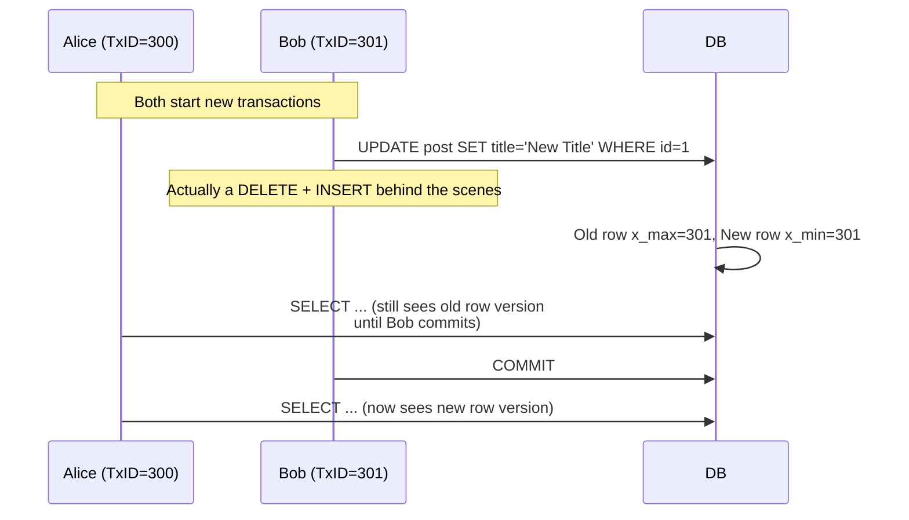
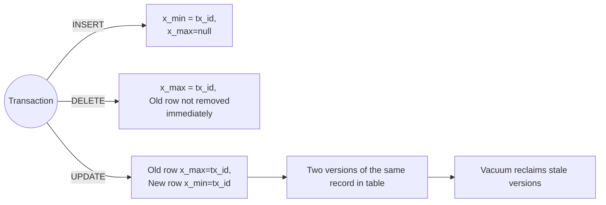

https://vladmihalcea.com/how-does-mvcc-multi-version-concurrency-control-work/
## Overview
- **Author**: [Vlad Mihalcea](https://vladmihalcea.com)  
- **Context**: Explanation of how MVCC operates, focusing on **PostgreSQL**.  
- **Key Topics**:  
  - MVCC fundamentals  
  - Differences from Two-Phase Locking (2PL)  
  - PostgreSQL row-versioning details (`x_min` and `x_max`)  
  - Practical examples: **INSERT**, **DELETE**, **UPDATE** under MVCC  

> **Side note**: Tools like **Hypersistence Optimizer** can automatically detect JPA and Hibernate performance issues. This helps developers focus on more enjoyable tasks rather than debugging production concurrency issues.

---

## 1. Introduction

### 1.1 Concurrency Control Strategies
In **Concurrency Control** theory, there are two broad categories of handling conflicts:
1. **Avoid them** via **pessimistic locking** (e.g., 2PL – Two-Phase Locking).  
2. **Allow conflicts** but detect them with **optimistic locking** (e.g., **logical clocks**, **MVCC**).

Given the prevalence of MVCC in relational databases (and beyond), this note dives into **how MVCC works** with PostgreSQL as a primary example.

### 1.2 MVCC Goal
Traditional ACID definitions *implied* **serializability** and used 2PL:
- Every **read** → shared lock.
- Every **write** → exclusive lock.
- Shared locks allow other reads but block writes; exclusive locks block both reads & writes.

Excessive locking → **contention** → poor scalability.  
**MVCC** aims to reduce locking overhead so that:
- **Readers don’t block Writers**  
- **Writers don’t block Readers**  

The only blocking scenario: **two transactions** concurrently modifying the **same row**. A row being modified remains locked until that transaction commits or rolls back.

**Key Idea**: By maintaining multiple versions of rows, read queries can see a **past** state while a writer transaction holds a lock on the **new** row version.

---

## 2. PostgreSQL MVCC Implementation

In **PostgreSQL**, row versions are stored **directly** in the table. By contrast, Oracle/MySQL might keep old row versions in an **undo log**.

### 2.1 Extra Columns: `x_min` and `x_max`
Each row has two special columns:
- **`x_min`**: The **transaction ID** that **inserted** the row.  
- **`x_max`**: The **transaction ID** that **deleted** the row.  

**Transaction IDs** (TxIDs) are 32-bit integers. To avoid overflow, PostgreSQL relies on **VACUUM**:
- Reclaims storage for old row versions no longer in use.
- Manages **transaction ID wraparound**.

> **Important**: Never disable VACUUM. That can lead to catastrophic TxID wraparound issues.

---

## 3. INSERT Example with MVCC

```mermaid
sequenceDiagram
    participant A as Alice (TxID=100)
    participant B as Bob (TxID=101)
    note over A,B: Both start new transactions
    A->>DB: INSERT INTO post(...) VALUES(...); <br> x_min = 100
    note over A: Alice transaction not yet committed
    B->>DB: SELECT ... (can't see Alice's row <br> under default READ COMMITTED)
    A->>DB: COMMIT
    B->>DB: SELECT ... (now sees row <br> x_min = 100 committed)
```

1. **Alice** starts Tx (TxID=100).  
2. She **inserts** a row. → `x_min = 100`, `x_max = NULL` (or no deletion).  
3. Under **Read Committed**:
   - **Bob** cannot see the new row until **Alice** commits.  
4. After **Alice** commits, Bob’s next queries see the new row.  

**Row Visibility Rules**:
- If your TxID > row’s `x_min` (and row is committed), you can see that row.
- For uncommitted or in-progress transactions, visibility also depends on isolation level.  

---

## 4. DELETE Example with MVCC

```mermaid
sequenceDiagram
    participant A as Alice (TxID=200)
    participant B as Bob (TxID=201)
    note over A,B: Both start new transactions
    B->>DB: DELETE FROM post WHERE id=123; <br> x_max=201
    note over B: Bob not yet committed
    A->>DB: SELECT ... (still sees row <br> x_max=201 not committed)
    B->>DB: COMMIT
    A->>DB: SELECT ... (can't see row anymore <br> x_max=201 committed)
```

1. **Bob** (TxID=201) deletes a row → sets that row’s `x_max=201`.  
2. Until Bob commits, **Alice** can still see the old row version.  
3. After Bob commits, the row is invisible to other transactions.  

**Physical** row removal isn’t immediate; **VACUUM** reclaims old row versions.  

**Row Visibility**:
- If your TxID > row’s `x_max` (and the row is committed as deleted), you **cannot** see that row version.

---

## 5. UPDATE Example with MVCC



Under MVCC, an **UPDATE** is effectively:
1. Mark old row as **deleted** (`x_max = 301`).
2. Insert a **new row** with `x_min=301`.

Until Bob commits, other transactions see the **old version**.

---

## 6. Why MVCC Improves Concurrency

By maintaining multiple versions:
- **Readers** don’t block on write locks. They just read older versions if a writer is in progress.
- **Writers** don’t block readers for the same reason.

Hence, it’s more **scalable** than pure 2PL. However, it’s vital to note that certain anomalies can still occur depending on **isolation levels** (e.g., phantom reads in Repeatable Read or read skew in Snapshot Isolation).

**Anomalies** can differ from a strict 2PL environment, so understanding MVCC is essential to reason about concurrency and correctness in your database.

---

## 7. Conclusions

**MVCC** offers:
1. **Less contention** between readers and writers.  
2. **Multiple versions** of rows so older transactions can see a **snapshot** of data at their start time (Repeatable Read / Serializable) or statement time (Read Committed).  

**Key Points**:
- Each row has `x_min` and `x_max` in PostgreSQL.  
- `INSERT` sets a row’s `x_min`; `DELETE` sets `x_max`; `UPDATE` is effectively a `DELETE + INSERT`.  
- **VACUUM** is crucial for cleaning up stale versions and preventing TxID wraparound.  

Thus, while 2PL might seem more straightforward, MVCC is not difficult to grasp. But to use it effectively, you **must** understand how row visibility rules apply under various isolation levels.



**Further Reading**:
- [PostgreSQL Official Docs on MVCC](https://www.postgresql.org/docs/current/mvcc.html)
- [ACID Properties and Isolation Levels](https://en.wikipedia.org/wiki/Isolation_(database_systems))
- [Vacuum and Transaction ID Wraparound](https://www.postgresql.org/docs/current/routine-vacuuming.html)
- [Vlad Mihalcea’s Blog](https://vladmihalcea.com)
```