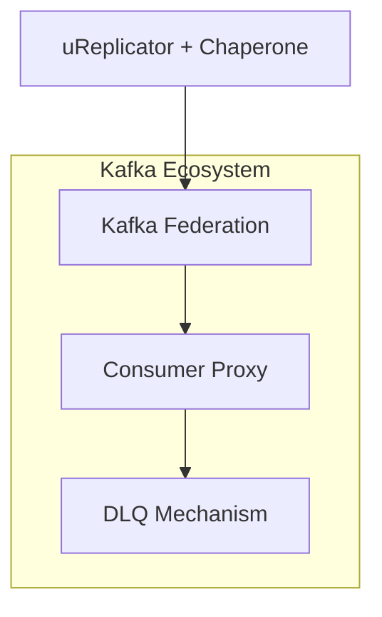
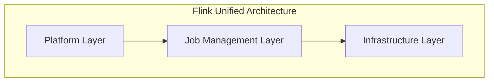
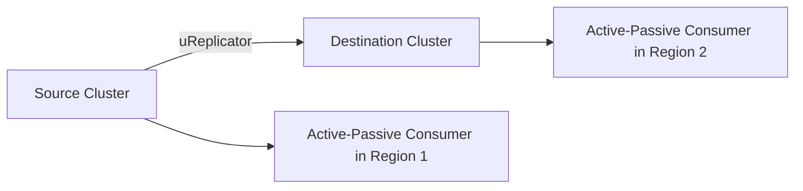

**Authors**: Yupeng Fu, Chinmay Soman (Uber, Inc.)  
**Published**: *Proceedings of the 2021 International Conference on Management of Data (SIGMOD ’21), June 20–25, 2021*  
**Paper Link**: [arXiv:2104.00087v1 [cs.DC]](https://arxiv.org/abs/2104.00087)
## Table of Contents
1. [Introduction](#introduction)
2. [Requirements](#requirements)
3. [Abstractions](#abstractions)
4. [System Overview](#system-overview)
   1. [Apache Kafka for streaming storage](#apache-kafka-for-streaming-storage)
   2. [Apache Flink for stream processing](#apache-flink-for-stream-processing)
   3. [Apache Pinot for OLAP](#apache-pinot-for-olap)
   4. [HDFS for archival store](#hdfs-for-archival-store)
   5. [Presto for Interactive Query](#presto-for-interactive-query)
5. [Use Cases Analysis](#use-cases-analysis)
   1. [Analytical Application: Surge Pricing](#analytical-application-surge-pricing)
   2. [Dashboards: UberEats Restaurant Manager](#dashboards-ubereats-restaurant-manager)
   3. [Machine Learning: Real-time Prediction Monitoring](#machine-learning-real-time-prediction-monitoring)
   4. [Ad-hoc Exploration: UberEats Ops Automation](#ad-hoc-exploration-ubereats-ops-automation)
   5. [Summary of Use Cases](#summary-of-use-cases)
6. [All-Active Strategy](#all-active-strategy)
   1. [Active-Active Setup](#active-active-setup)
   2. [Active-Passive Setup](#active-passive-setup)
7. [Backfill](#backfill)
8. [Related Work](#related-work)
9. [Lessons Learned](#lessons-learned)
   1. [Open-source Adoption](#open-source-adoption)
   2. [Rapid System Development and Evolution](#rapid-system-development-and-evolution)
   3. [Ease of Operation and Monitoring](#ease-of-operation-and-monitoring)
   4. [Ease of User Onboarding and Debugging](#ease-of-user-onboarding-and-debugging)
10. [Conclusion](#conclusion)
11. [Future Work (Mentioned in the Paper)](#future-work-mentioned-in-the-paper)

---

## Introduction
Uber’s business operates on a massive scale of real-time data generated from riders, drivers, restaurants, and other services. Uber deals with **petabytes of data per day** and requires making decisions within **seconds** for use cases such as:
- **Customer incentives**
- **Fraud detection**
- **Machine learning (ML) model predictions**
- **Real-time analytics and dashboards**

### Key Points
- **3 core areas** of real-time data processing:
  1. **Messaging platform** (asynchronous communication)
  2. **Stream processing** (computational logic on streaming data)
  3. **OLAP** (analytical queries in near real-time)
- **3 fundamental scaling challenges**:
  1. **Scaling data** (exponential growth, multi-region)
  2. **Scaling use cases** (varied requirements: consistency vs. availability vs. freshness)
  3. **Scaling users** (engineers, data scientists, ops, and executives)

The paper outlines Uber’s **overall real-time data architecture**, focusing on **open-source** components (Kafka, Flink, Pinot, Presto, HDFS) and Uber’s **custom enhancements**.


> **Figure 1**. High-level data flow at Uber’s infrastructure (schematic).

---

## Requirements
Different real-time applications come with **competing requirements**, including:

1. **Consistency**
   - Zero data loss, deduplication, data quality certification, especially for financial dashboards or mission-critical logs.
2. **Availability**
   - 99.99% uptime requirement for real-time systems.
   - E.g., dynamic pricing must never fail for driver–rider matching.
3. **Data Freshness**
   - **Seconds-level freshness**: events available for querying within a few seconds.
4. **Query Latency**
   - p99 latency **under 1 second** in many user-facing dashboards (e.g., UberEats Restaurant Manager).
5. **Scalability**
   - Petabytes daily volume from thousands of microservices, multi-region architecture.
6. **Cost**
   - Uber is a low-margin business; cost optimization is critical.
7. **Flexibility**
   - Both programmatic (API) and declarative (SQL) interfaces.
   - Push-based vs. pull-based consumption, real-time alerts vs. ad-hoc analytics.

**Trade-off Example**: 
- In **dynamic pricing**, **freshness** and **availability** take priority over **consistency** (due to the CAP theorem).
---
## Abstractions
A conceptual **layered model** of Uber’s real-time analytics stack (see Figure 2 in the paper):

1. **Storage**  
   - Generic object/blob store with **read-after-write** guarantees (e.g., HDFS).
2. **Stream**  
   - Publish-subscribe system for **low-latency** reads/writes (e.g., Kafka).
3. **Compute**  
   - Arbitrary computation layer for streaming/batch (e.g., Flink).
4. **OLAP**  
   - Near real-time analytical database for **aggregations, group by, order by** (e.g., Pinot).
5. **SQL**  
   - Full SQL interface on top of OLAP/Compute (e.g., Presto).
6. **API**  
   - Programmatic access for advanced use cases or external integrations.
7. **Metadata**  
   - Centralized store for data schemas and schema evolution (backward compatibility checks, etc.).


---

## System Overview
Below is the **high-level architecture** of the real-time data platform at Uber (Figure 3 in the paper). The **core open-source technologies** are:

- **Apache Kafka** (streaming storage / messaging)
- **Apache Flink** (stream processing)
- **Apache Pinot** (real-time OLAP)
- **HDFS** (archival storage)
- **Presto** (interactive queries)

### Apache Kafka for Streaming Storage
- **Adopted in 2015** for high throughput, low latency, and wide adoption in the open-source community.
- **Massive scale**: trillions of messages and multiple petabytes per day, enabling event propagation to **both** batch and real-time systems.

#### Uber’s Kafka Enhancements
1. **Cluster Federation**  
   - Hides physical cluster details; a “logical cluster” is exposed to clients.
   - **Metadata server** for transparent routing.
   - Automatic topic migration to new clusters without user restarts.
2. **Dead Letter Queue (DLQ)**  
   - Unprocessable messages are offloaded to a separate “dead letter” topic without blocking main consumption.
3. **Consumer Proxy**  
   - Push-based dispatching to gRPC endpoints.  
   - Eliminates complex client library upgrades.  
   - Overcomes the consumer group size limitation, enabling higher parallelism.
   
   ```text
   +---------+        +---------------+
   | Kafka   |  --->  | ConsumerProxy |  --->  user-registered gRPC service
   +---------+        +---------------+
   ```
4. **Cross-Cluster Replication (uReplicator)**  
   - **Open sourced** by Uber.  
   - Adaptive rebalancing algorithm and high reliability.  
   - **Chaperone** auditing service for end-to-end data integrity checks.



---

### Apache Flink for Stream Processing
- **Chosen over Storm, Spark, Samza** due to robust state management, low latency, and active community.
- At Uber, used for:
  - **SQL-based** streaming (FlinkSQL).
  - **Low-level APIs** for advanced use cases.

#### Key Uber Contributions
1. **FlinkSQL**  
   - Integrated with **Apache Calcite** to compile SQL → Flink job.  
   - Resource estimation, auto-scaling, job failure recovery mechanisms.  
   - Users from diverse backgrounds (data scientists, ops, engineers) can create streaming jobs with **basic SQL**.

2. **Unified Architecture**  
   - Single platform for both SQL-based and API-based workloads.  
   - **3 layers**:
     1. Platform layer: organizes business logic.
     2. Job management layer: validation, deployment, monitoring, job metadata.
     3. Infrastructure layer: physical clusters, storage for state checkpoints.



---

### Apache Pinot for OLAP
- **Columnar** store with multiple indexing strategies (inverted, range, sorted, startree).
- Supports both **real-time** (from streaming) and **offline** (from batch segments).
- *Why Pinot over Elasticsearch or Druid?*
  - Lower memory/disk footprint.
  - Faster query latency with specialized indexes.

#### Uber Enhancements
1. **Upsert Support**  
   - Real-time updates, e.g., fare corrections, status updates.  
   - **Shared-nothing solution**: same primary key → same partition → same node → concurrency without a single point of failure.
2. **Full SQL Support**  
   - **Pinot + Presto** integration for subqueries, joins, and advanced SQL.  
   - Predicate pushdowns, partial aggregations for sub-second query latency.
3. **Ecosystem Integrations**  
   - Schema service (auto schema inference).  
   - FlinkSQL sink (push transforms into Pinot).  
   - Workflow management (Spark → Pinot offline tables).
4. **Peer-to-peer Segment Recovery**  
   - Eliminates the single controller bottleneck.  
   - Asynchronous replication from server replicas instead of centralized store.

---

### HDFS for Archival Store
- **All data** (raw logs in Avro) eventually lands in HDFS.  
- **Compaction** merges them into Parquet for offline analytics (Hive, Presto, Spark).  
- Also used by Flink (checkpointing) and Pinot (segment archival).

---

### Presto for Interactive Query
- **MPP engine** with in-memory processing.  
- Extensible **Connector API** → includes a **Pinot connector** for real-time data.  
- Allows **predicate, projection, aggregation** pushdown to Pinot to leverage indexing.

**Example** (pseudo-code showing pushdown optimization):

```sql
-- Presto query
SELECT city, COUNT(*) as total_trips
FROM pinot_realtime_table
WHERE is_completed = true
GROUP BY city
ORDER BY total_trips DESC
LIMIT 10
```

**Connector logic** (hypothetical snippet in Java):
```java
public class PinotConnector {
  ...
  @Override
  public ConnectorSplitSource getSplits(...) {
      // Evaluate if we can pushdown this filter and aggregation
      // If yes, build Pinot broker request
  }
  ...
}
```

---

## Use Cases Analysis

### Analytical Application: Surge Pricing
- Real-time dynamic pricing to **balance driver supply and rider demand**.
- Ingests data from Kafka, processes in Flink with ML, writes to a **key-value store** for fast lookups.
- **Prioritizes** data **freshness** and **availability** over strict consistency (late events are ignored).

### Dashboards: UberEats Restaurant Manager
- **Dashboard** for restaurant owners to see order patterns, customer feedback, etc.
- **Low query latency** + **seconds-level freshness** → built on Pinot (with pre-aggregations).
- **Trade-off**: partial aggregations in Flink reduce query overhead in Pinot, but reduce query flexibility.

### Machine Learning: Real-time Prediction Monitoring
- **ML model monitoring** pipeline that joins predictions with observed outcomes (labels).
- **High volume** (thousands of models, each with hundreds of features).
- Uses Flink for large-scale aggregation + Pinot for real-time dashboards.
- Pre-aggregation reduces query overhead over massive time-series data.

### Ad-hoc Exploration: UberEats Ops Automation
- Need to run **ad-hoc** queries on real-time data (Pinot) via Presto.
- Once an insight is found, convert it into production rule-based automations.
- Example: COVID safety rules, real-time capacity limits, automatically messaging restaurants/couriers.

### Summary of Use Cases

| Use Case                                  | Components Used              | Key Trade-offs               |
|-------------------------------------------|------------------------------|------------------------------|
| Surge Pricing                             | Kafka, Flink, KV Store       | Freshness & availability > consistency |
| UberEats Restaurant Manager              | Kafka, Flink, Pinot          | Pre-aggregation for low-latency |
| Real-time ML Prediction Monitoring       | Kafka, Flink, Pinot          | Large scale, pre-aggregation |
| UberEats Ops Automation (Ad-hoc + prod)  | Pinot, Presto, Flink (optional) | Ad-hoc → automation |

---

## All-Active Strategy
**Multi-region** deployments for disaster recovery:

### Active-Active Setup
- Each region runs its own Flink job with the same logic.
- Kafka aggregated globally, each region sees the same data.  
- Example: Surge Pricing uses **active-active** with an “update service” in each region; one region designated as primary (others are hot-standby).  
- **State** in each region converges because they process the same global data stream.


> Surge pricing pipeline in active-active setup

### Active-Passive Setup
- Only **one** region is consuming from Kafka at a time.  
- Upon region failure, consumer offset is **synced** to another region using an **offset sync job** + `uReplicator` → minimal data loss and consistent consumption point.



---

## Backfill
**Common scenarios** requiring reprocessing old data:
- New pipeline testing or new ML model training
- Fixing a bug in an existing real-time app
- Changing stream processing logic

### Approaches
1. **SQL-based** (Lambda-like)  
   - Single SQL code compiles to **two** Flink jobs: one real-time, one batch (DataStream vs. DataSet).
2. **API-based (Kappa+)**  
   - Same streaming **code** for real-time and batch, but reads data from offline store (Hive) instead of Kafka.  
   - Must handle out-of-order data and higher throughput via buffering, throttling, etc.

---

## Related Work
- **Messaging**: Kafka vs. RabbitMQ vs. Pulsar. Uber relies heavily on Kafka with custom enhancements.
- **Stream Processing**: Storm, Samza, Spark Streaming, Heron, etc. Uber concluded Flink is best for backpressure handling, checkpointing, low overhead.
- **Real-time OLAP**: Pinot vs. Druid vs. Elasticsearch. Pinot chosen for lower memory/disk usage, specialized indexing, real-time ingestion with upserts.
- **SQL Systems**: Presto, Hive, Spark SQL, etc. Presto chosen for MPP in-memory approach, flexible connectors, easy pushdowns.

---

## Lessons Learned

### Open-source Adoption
- **Faster iteration** using existing community code base.
- **Challenges**: open-source tools often require significant **customization** (e.g., Kafka consumer proxy, Pinot upsert, FlinkSQL layer).
- Carefully integrating with **Uber’s infrastructure** (e.g., containerization, security, language support).

### Rapid System Development and Evolution
- **Monorepo approach** + standardized interfaces → detect breakages early.
- **Thin clients** to simplify upgrades and multi-language support.
- **CI/CD** pipelines for continuous testing (both open-source updates and internal changes).

### Ease of Operation and Monitoring
- Large-scale environment → heavy emphasis on **automation** (auto-scaling, auto-healing).
- Declarative frameworks for cluster expansions, failover, and resource rebalancing.
- Rich monitoring and alerting (cluster-wide + per-topic/job dashboards).

### Ease of User Onboarding and Debugging
- **Central metadata repository** for schemas, lineage.
- **Automated data auditing** (Chaperone + event metadata).
- **Self-serve** UIs for creating Kafka topics, FlinkSQL jobs, or Pinot tables with minimal engineering overhead.

---

## Conclusion
- Uber’s real-time data infrastructure is built primarily on **open-source** components (Kafka, Flink, Pinot, Presto, HDFS).
- **Enhanced** with proprietary features (federation, upserts, auto-scaling, offset sync, consumer proxy).
- Supports **multiple petabytes** of data per day, powering mission-critical workloads (dynamic pricing, machine learning, fraud detection, etc.).
- **Trade-offs**: high availability vs. consistency, push-based vs. pull-based, pre-aggregation vs. flexible queries, single region vs. multi-region.

---

## Future Work (Mentioned in the Paper)
- **Multi-region expansions** (on-prem + cloud) for Kafka.
- **Unified batch + streaming** semantics (Flink unification).
- **Low-latency joins** in Pinot (lookup joins).
- **Semi-structured data** (JSON) ingestion natively in Pinot.
- **Zero-downtime Flink job restarts** for critical pipelines.

---
```

> **How to use these notes in Obsidian**:
> 1. Create a new note and paste the entire markdown content.
> 2. Use Obsidian’s [[wiki-link]] or tag features to connect to other notes about streaming, Kafka, Flink, etc.
> 3. Add your own highlights, color-coded callouts, or block references for deeper commentary.
> 4. For quick reference, you can fold/unfold headings in Obsidian’s Outline panel. 
> 5. Insert additional code blocks in the relevant sections if you want to experiment with real FlinkSQL or Kafka client code. 
> 6. Enjoy automated backlinks for your other real-time data topics and link to these sections for your PhD or engineering notes!

