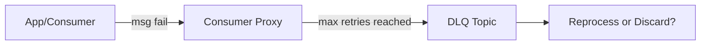

**Context**: This note further extends and complements the previously documented notes on the *Real-time Data Infrastructure at Uber*. It highlights more in-depth details about **error handling**, **monitoring**, **metadata management**, **data lineage**, and **multi-tenant challenges**. These insights come from the same research paper and the ecosystem described therein.

## Table of Contents
1. [Error Handling & Recovery Strategies](#error-handling--recovery-strategies)
2. [Monitoring & Alerting Frameworks](#monitoring--alerting-frameworks)
3. [Metadata Management & Schema Evolution](#metadata-management--schema-evolution)
4. [Data Lineage & Auditing](#data-lineage--auditing)
5. [Multi-Tenant Resource Management](#multi-tenant-resource-management)
6. [Active-Passive Offset Sync Internals](#active-passive-offset-sync-internals)
7. [Real-Time OLAP Query Patterns](#real-time-olap-query-patterns)
8. [Security & Access Control Considerations](#security--access-control-considerations)
9. [Additional Future Directions](#additional-future-directions)

---

## 1. Error Handling & Recovery Strategies

**Key Points**  
- **Fault Tolerance** is a first-class requirement at Uber’s scale.  
- **Downtime** can have direct financial and reputational implications.  

### Consumer-Side vs. Platform-Side Handling
- **Consumer-Side**:  
  - Some teams build custom logic to handle partial failures in the application layer itself.  
  - *Example*: If 99% of messages are processed successfully, they commit offsets, and funnel the 1% of problematic messages to a **dead letter queue (DLQ)**.
- **Platform-Side**:  
  - Kafka **Consumer Proxy** handles retries, circuit breakers, and final rerouting to DLQ.  
  - **Flink** uses checkpointing + state restore. On error, it attempts rollback to the last stable checkpoint, preserving “at-least-once” semantics.

### Example: DLQ Pattern

- **Reprocessing** can happen later if the user decides it’s critical data; otherwise, they are archived or monitored for debug purposes.

---

## 2. Monitoring & Alerting Frameworks

Given the **high throughput** and **business-critical** nature of Uber’s pipelines:

1. **Metrics**  
   - Standard metrics from each system (Kafka, Flink, Pinot, Presto).  
   - Custom metrics for each user pipeline: e.g., message counts, processing latency, error rates.

2. **Dashboards**  
   - Automated generation of Grafana dashboards for each pipeline and cluster.  
   - Fine-grained time windows (5s, 1m, 5m, etc.) to catch spikes quickly.

3. **Alerting**  
   - Severity-based notification (e.g., Slack, PagerDuty).  
   - **Autoscaling triggers** if CPU or memory usage stays high for certain thresholds.

### Example Monitoring Dashboard Concept

| Metric                   | Description                                  | Typical Threshold or SLA  |
|--------------------------|----------------------------------------------|---------------------------|
| Kafka consumer lag       | # unprocessed messages in topic partitions  | < 10,000 (depending on job scale) |
| Flink checkpoint time    | Duration of last successful checkpoint       | < 10 seconds             |
| Pinot real-time ingestion delay | Time from event creation to segment indexing | < 1 minute               |
| Query p95 latency        | Latency of OLAP queries at p95              | < 1 second               |

---

## 3. Metadata Management & Schema Evolution

**Centralized Schema Service**  
- **Single source of truth** for all real-time and offline datasets at Uber.  
- Maintains **versioned schemas** with backward-compatibility checks.  

### Schema Evolution Workflow
1. A user proposes a schema change (adding a column, changing data type, etc.).  
2. The **schema service** checks compatibility with existing consumers (including FlinkSQL and Pinot ingestion).  
3. On approval, the updated schema version is rolled out to Kafka, Pinot, Hive, etc.

**Benefits**  
- Eliminates the “unknown field” or “type mismatch” errors at large scale.  
- Smooth transitions for user pipelines.

---

## 4. Data Lineage & Auditing

### Data Lineage
- **Lineage Graph**: Tracks the journey of each event from:
  - **Producer (client)** → **Kafka** (regional + aggregate) → **Flink** transformations → **Pinot / HDFS**.  
- Allows users to see **where** data is coming from and **who consumes it**.

### Auditing with Chaperone
- **Chaperone** collects key statistics (e.g., number of unique events) from each stage in the pipeline.  
- Compares them in near real-time:
  - If there’s a mismatch beyond a certain tolerance, it raises an **alert**.
- This ensures **no data loss** or duplicates that exceed the standard tolerances for mission-critical data flows.

---

## 5. Multi-Tenant Resource Management

With **thousands of teams** at Uber:

- **Kafka Quotas**  
  - Each topic and client group is assigned a read/write throughput quota.  
  - Prevents runaway jobs from saturating the cluster.
- **Flink Job Priorities**  
  - High-priority jobs (e.g., real-time pricing) get guaranteed CPU/memory share.  
  - Lower-priority jobs can be preempted or throttled during spikes.
- **Pinot Multi-Tenancy**  
  - Separate **server tenant** for real-time ingestion vs. offline ingestion.  
  - Isolation avoids ingestion spikes affecting critical queries.

**Examples**  
```yaml
kafka_quota:
  project: "fraud_detection"
  read_mb_per_sec: 500
  write_mb_per_sec: 1000
flink_job_priority:
  job_name: "surge_pricing"
  priority: HIGH
pinot_tenants:
  - name: "realtime_tenant"
    memory_limit_gb: 2000
  - name: "offline_tenant"
    memory_limit_gb: 3000
```
*(Hypothetical YAML snippet for resource configs.)*

---

## 6. Active-Passive Offset Sync Internals

**Offset Sync Service** specifically addresses **active-passive** use cases requiring strong consistency:

1. **uReplicator** replicates messages from the source region to the destination region.  
2. It periodically **checkpoint** source offsets to an active-active DB.  
3. An **offset sync job** in the destination region reads that DB to set the consumer’s offset to a known consistent point.  

**Failover**:  
- If the primary region fails, the destination region looks up the last known offset map and **resumes** exactly from there, avoiding data duplication or large gaps.

---

## 7. Real-Time OLAP Query Patterns

From Uber’s experience, queries in Pinot can be categorized as:

1. **Time-Series Aggregation**  
   - e.g., Count or Sum per minute/hour/day.  
   - Often with filtering by city, product type, or status.  
2. **Top K / Ranking**  
   - e.g., “What are the top 10 busiest areas in the last 15 minutes?”.  
   - Pinot’s sorted index or star-tree index can accelerate this significantly.
3. **Drill-Down / Slice-and-Dice**  
   - OLAP-style dimension exploration, often used in dashboards or internal BI tools.

**Performance Tuning**  
- Use specialized indexes (inverted for equality filters, range indexes for numeric ranges, star-tree for group-by aggregates).  
- Pre-aggregations in Flink to reduce data cardinality.

---

## 8. Security & Access Control Considerations

### Authentication & Authorization
- All writes to Kafka require **service identity** verification.  
- Flink jobs also run under certain service accounts in Uber’s internal orchestration system (e.g., container-based deployments).  
- Pinot’s queries can be restricted per user/team with row-level or column-level filters in some advanced cases.

### GDPR / Compliance
- Data retention and **right-to-be-forgotten** laws → partitioned data lifecycles.  
- Ensures old topics or segments are removed systematically.

---

## 9. Additional Future Directions

1. **Tiered Storage for Kafka**  
   - Potentially offload cold segments to cheaper object storage (S3/HDFS) for longer retention.  
   - The proxy/federation layers would still serve hot data from local brokers.

2. **Streaming + Batch Unified in Flink**  
   - Ongoing improvements in Apache Flink to unify `DataStream` and `DataSet` APIs.  
   - Simplify backfill pipelines even further.

3. **Micro-Batching in Pinot**  
   - Investigate micro-batching ingestion to reduce overhead in real-time tables and possibly support smaller hardware footprints.

4. **Global Low-Latency Joins**  
   - Expand Pinot’s **lookup join** to handle partially distributed dimension tables, enabling richer real-time analytics.

---

```markdown
> **Usage in Obsidian**  
> - Attach or link this note to your main `Real-time Infrastructure at Uber` note for deeper details on error handling, schema management, and more.  
> - Tag sections like `#error-handling` or `#monitoring` so you can quickly navigate from other big data notes.  
> - If building your own real-time stack, create separate pages for each concept (e.g., `Kafka Federation`, `Pinot Upsert`) and [[link]] these headings for a richer knowledge graph.  
> - Keep an eye on the “Additional Future Directions” section to compare with ongoing open-source developments in Kafka, Flink, and Pinot communities.
```
