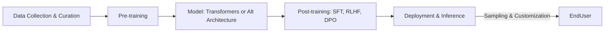

aliases: ["chapter-2-understanding-foundation-models", "foundation-models", "transformers"]
tags: ["AI-engineering", "notes", "foundation-models"]

This note summarizes key ideas from **Chapter 2** of “AI Engineering: Understanding Foundation Models.” You’ll learn about:

1. **What** foundation models are.
2. **Why** training data distribution is critical.
3. **Which** architectural decisions (transformers and beyond) shape model performance and usability.
4. **How** post-training aligns models with human preference.
5. **What** sampling is, and why it’s essential for understanding AI’s probabilistic outputs.

---

## 1. Why Understand Foundation Models?

- Even if you don’t **train** your own LLM from scratch, having a **high-level** grasp helps you:
  1. **Choose** which model is best for your application (e.g., Llama 2 vs. GPT-4).
  2. **Adapt** it correctly (e.g., via finetuning, data curation).
  3. **Diagnose** or explain phenomena like hallucinations or inconsistent outputs.

- **Foundation model training** is extremely **complex** and **expensive**. Only a few organizations master it at the largest scale. Many details remain **closed source** or protected by **NDAs**.

**Key influences** on a model’s capabilities:

1. **Training Data** (quality and quantity)  
2. **Model Architecture & Size**  
3. **Post-training** (alignment with humans)  
4. **Sampling** (how outputs are generated)

---
## 2. Training Data
### 2.1 Data Distribution Matters
- A model is **only as good** as the data it sees.
- If **no** Vietnamese text is in training data, the model **won’t** handle Vietnamese tasks well.
- Typically, large-scale LLMs rely on **internet-scale** data (e.g., **Common Crawl**, **C4**).
- Internet data often includes **misinformation**, **low-quality** text, or domain coverage that may **not** align with your exact needs.

> **Tip**: Curating or **filtering** data for your domain can drastically improve performance.

### 2.2 Multilingual Models
- **English** dominates the internet (~46% of Common Crawl).
- Many languages (e.g., **Telugu**, **Punjabi**, **Swahili**) are vastly **under-represented**, leading to poorer performance.
- GPT-4 (and many LLMs) show much **lower** results on MMLU or math tasks in certain under-represented languages.
- Even **tokenization** can inflate cost/latency in some languages (Burmese can take ~10× more tokens than English).
![[Screenshot 2025-03-17 at 10.51.55 AM.png]]
![[Screenshot 2025-03-17 at 10.52.05 AM.png]]
![[Screenshot 2025-03-17 at 10.54.05 AM.png]]
#### Approaches
1. **Train specialized models** (e.g., ChatGLM for Chinese, Jais for Arabic).
2. **Translation pipelines** (but can lose nuance, especially with relationships, pronouns, or domain-specific jargon).
![[Screenshot 2025-03-17 at 10.53.50 AM.png]]
### 2.3 Domain-Specific Models
- Large general-purpose models (GPT, Llama, etc.) see a broad mix of public internet text/images.
- For specialized tasks (e.g., **drug discovery**, **cancer screening**), public data is often lacking or unavailable (privacy, cost).
- **Domain-specific** foundation models (e.g., AlphaFold, BioNeMo, Med-PaLM2) can significantly outperform general LLMs in specialized tasks.

**Key takeaway**: 
- High-quality, domain-specific data can yield better outcomes than simply training on more, low-quality, general data. 
- Chapter 8 covers advanced **data engineering** techniques.

---

## 3. Modeling
![[Screenshot 2025-03-17 at 10.54.21 AM.png]]
Once you have training data, you decide **how** to structure your model:
![[Screenshot 2025-03-17 at 10.55.02 AM.png]]
1. **Architecture** (transformers, RNN-based, SSM-based, or hybrids)
2. **Model Size** (number of parameters, e.g., 7B vs. 175B)
3. **Other Factors** (e.g., how to handle inference cost, memory constraints)
These design choices **directly** affect:
- **Deployment feasibility** (GPU memory, latency, scaling).
- **Performance** on certain tasks.
- **Compatibility** with **post-training** methods (RLHF, DPO, etc.).
---
## 4. Transformer Architecture (Overview)

> **Note**: This section references a deeper dive into **transformers** and **attention** from earlier content. 

- **Transformers** dominate language-based foundation models.
- They overcame limitations of RNNs (bottlenecked by sequential processing) by using **attention** for parallelism.
- Not the only architecture—**RWKV**, **SSMs** (state space models)(Mamba, Jamba), etc., are emerging alternatives—but **transformers** remain the mainstay.
- https://github.com/BlinkDL/RWKV-LM
- https://arxiv.org/abs/2110.13985
---
## 5. Post-Training (Review)
**Pre-training** → the model learns broad knowledge from (often) messy data, but might be:
- Not aligned with **user** intentions (just next-token prediction).
- Potentially containing **toxic**, **biased**, or **incorrect** patterns.

**Post-training** → aligns the model to **human preference**:
1. **Supervised Finetuning (SFT)** on carefully curated (prompt, response) pairs.
2. **Preference Finetuning** (e.g., RLHF, DPO) to refine how it responds to user queries or avoid harmful content.
3.  [_reinforcement learning from human feedback_](https://oreil.ly/iJG1q)
4. 1. [DPO](https://arxiv.org/abs/2305.18290) (Direct Preference Optimization) (used by [Llama 3](https://arxiv.org/abs/2407.21783)), and [_reinforcement learning from AI feedback_](https://arxiv.org/abs/2309.00267) (RLAIF) (potentially used by [Claude](https://arxiv.org/abs/2212.08073)).

---

## 6. Sampling (Why It Matters)

**Sampling** = how a model **chooses** the next token among many possibilities. This can drastically affect:

- **Creativity** vs. **consistency**.
- Probability of **hallucinations**.
- Behavior under repeated or slightly varied prompts.

### Key Sampling Techniques

1. **Temperature**  
   - High T → more diverse/creative responses.  
   - Low/zero T → deterministic, possibly repetitive or “safe.”
2. **Top-p / Nucleus Sampling**  
   - Only sample from tokens whose cumulative probability is ≥ p.
3. **Beam Search**, **Top-k**  
   - Explore multiple high-probability token paths or confine sampling to top-k tokens.

**Understanding** sampling helps address:
- **Inconsistency**: same question, different outputs.
- **Hallucinations**: output not grounded in training data or reality.

---

## 7. Putting It All Together

### 7.1 High-Level Workflow for a Foundation Model



1. **Data**: Large-scale web corpora (Common Crawl), plus curated domain/language data.  
2. **Pre-training**: Self-supervised on billions/trillions of tokens.  
3. **Post-training**: 
   - **Supervised** data (instruction tuning).  
   - **Preference** finetuning (RLHF/DPO).  
4. **Inference**: Control outputs with **sampling** (temp, top-p, etc.).  
5. **Deployment**: Evaluate resource constraints (7B vs. 70B params).
### 7.2 Implications for AI Engineering
- **Model selection**: Based on language, domain, or specialized tasks.  
- **Adaptive strategies**: If the chosen model underperforms on domain-specific tasks or languages, consider:
  - Domain-specific finetuning.
  - Additional curated data.  
- **Sampling**: Tweak for different user experiences (creative vs. factual answers).
---
## 8. Code & Examples (Illustrative)
### 8.1 Language Distribution Analysis
Below is an example snippet (pseudo-code) for analyzing language proportions in a text corpus:

```python
from langdetect import detect
from collections import Counter

def analyze_language_distribution(text_samples):
    counts = Counter()
    for text in text_samples:
        try:
            lang = detect(text)
            counts[lang] += 1
        except:
            counts["unknown"] += 1
    return counts

# Suppose we load a sample of data from Common Crawl or another source
sample_texts = ["This is English text", "这是中文文本", "Ceci est un texte en français"]
lang_counts = analyze_language_distribution(sample_texts)
print(lang_counts)
```

**Result** might show `'en': 1, 'zh-cn': 1, 'fr': 1`, etc. You can compare these proportions to your target domain/language needs.
### 8.2 Checking Token Counts by Language
```python
import tiktoken  # openai's tiktoken, if you have it
enc = tiktoken.get_encoding("cl100k_base")  # example GPT-4 encoding

text = "မြန်မာစာ"  # Burmese
tokens = enc.encode(text)
print("Text:", text, "Num tokens:", len(tokens))
```

- Notice how Burmese or Hindi often yields more tokens than English or Spanish for the same meaning.

---

## 9. Conclusion

### Key Points

1. **Training Data**  
   - The largest factor in what a model can do.  
   - Internet data is ubiquitous but **noisy** and not necessarily domain- or language-perfect.

2. **Model Architecture & Size**  
   - Transformers are ubiquitous in LLMs, but alternatives (e.g., RWKV, SSM) are emerging.  
   - Size matters for **deployment** (cost, GPU memory, latency).

3. **Post-Training**  
   - Needed to align with **user preferences** and mitigate toxic or biased behavior.  
   - Common methods: SFT + RLHF or DPO.

4. **Sampling**  
   - Decisive factor in **creativity**, **consistency**, and **hallucination** risk.  
   - Under-appreciated but crucial to controlling final outputs.

### Next Steps

- **Data engineering** (Chapter 8) for domain/language improvement.  
- **Detailed architectural** deep-dives (Transformer internals, alternative architectures).  
- **Evaluation** (Chapters 3–4) to measure models’ performance, consistency, safety, and more.