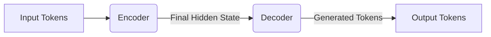

aliases: [transformer-architecture]
tags: [transformers, seq2seq, attention, llm, deep-learning]
## Overview
The **transformer architecture** is a neural network design that rose to prominence by addressing limitations in sequence-to-sequence (seq2seq) models, which were based primarily on recurrent neural networks (RNNs). Transformers were introduced in the paper **“Attention Is All You Need”** (Vaswani et al., 2017) and have since become foundational to modern large language models (LLMs) such as GPT, BERT, Llama, and many others.

---
## Background: Seq2Seq

### Seq2Seq at a Glance

**Seq2seq (Sequence-to-Sequence)** models transform an input sequence (e.g., a sentence in English) to an output sequence (e.g., the translated sentence in French). Introduced in 2014, seq2seq architectures achieved impressive success on tasks such as:
- **Machine Translation** (e.g., used by Google Translate in 2016)
- **Text Summarization**

A basic seq2seq setup has two main components:

1. **Encoder**: Processes the input tokens sequentially, producing a final hidden state representing the entire input.
2. **Decoder**: Uses the encoder’s hidden state and previously generated tokens to generate the next output token.
![[Screenshot 2025-03-17 at 10.42.56 AM.png]]

While seq2seq was a major breakthrough, it had two main issues:
1. **Information Bottleneck**: Vanilla seq2seq used only the encoder’s **final hidden state** to inform the decoder about the entire input. This is akin to summarizing a book in a single paragraph and then trying to answer questions about it using only that paragraph.
2. **Sequential Processing**: RNNs process tokens in a strict sequence, hindering parallelization, which slows training and inference for long sequences.

---
## Transformer Breakthrough
### Key Advantages
The **transformer** model introduced attention in a way that removes the dependence on RNNs. It addresses seq2seq issues by:
1. **Allowing Direct Access to Any Input Token**: Rather than relying on a final hidden state, the attention mechanism enables the model to look at any input token (like any page of a book) at every decoding step.
2. **Parallelizing Input Processing**: Since it no longer uses RNNs for the encoder or decoder input, the tokens can be processed in parallel, significantly speeding up training and inference (for the input/prefill stage).
However, the transformer decoder is usually **autoregressive**, so it still needs to generate output tokens one-by-one. This is called the **sequential output bottleneck**.
### Transformer Inference Steps
For modern large language models (LLMs), inference happens in **two** main steps:
1. **Prefill**  
   - Processes all input tokens **in parallel**.
   - Creates intermediate states (the Key and Value vectors for each token).
2. **Decode**  
   - Generates one output token at a time, feeding each newly generated token back into the model (in an autoregressive manner).
---
![[Screenshot 2025-03-17 at 11.19.45 AM.png]]
## Attention Mechanism
### Intuition
The **attention mechanism** is the core of the transformer. It decides how much attention to give each input token (or previously generated token) when predicting the next token.
Think of:
- **Query (Q)** as the question or current decoding state.
- **Key (K)** as a way to identify each previous token (like a page number).
- **Value (V)** as the information/content of each token (like the actual page’s content).
When generating a new token, the transformer:
1. Takes the **query** vector \( Q \) of the current decoding step.
2. Computes a similarity score between \( Q \) and each **key** vector \( K \).
3. Uses those similarity scores to weigh the **value** vectors \( V \).
4. Produces a weighted combination of the values, which informs the model about the relevant context.
### Example Visualization
Imagine a short conversation in English followed by Spanish punctuation. The attention would decide how relevant each token (`How`, `are`, `you`, `?`, `¿`) is for predicting the next token.

```text
"How are you ? ¿"
                 ^
                 +-- (predict next token here)
```

The mechanism looks up which tokens to emphasize most when creating the next token. The official “Attention Is All You Need” diagram often shows multiple attention heads focusing on different tokens.

### Mathematical Formulation

1. We have **weight matrices**: 
   - \( W_K \), \( W_V \), \( W_Q \) 
2. For each token embedding \( x \):
   ```text
   K = x W_K
   V = x W_V
   Q = x W_Q
   ```
3. For multi-head attention, we **split** these into multiple heads. Each head operates on a smaller dimension, then they are **concatenated** back and projected via an **output projection** matrix.

A common attention calculation is the **scaled dot-product** attention:

$\text{Attention}(Q, K, V) = \text{softmax}\!\Big(\frac{QK^\top}{\sqrt{d_k}}\Big)V$

where \( d_k \) is the dimensionality of the key vectors.

### Why It’s Memory-Intensive

For a sequence of length \( N \):
- We need \( N \) keys and \( N \) values.
- Each new query (for each of the \( N \) output tokens) must attend to all \( N \) existing keys.
- Storing and computing dot products with these large matrices is the reason why transformers can be expensive for very large context lengths.

---
![[Screenshot 2025-03-17 at 11.20.13 AM.png]]
## Transformer Block
A **transformer** is built from **stacked transformer blocks**. Each block has primarily two sub-modules:
1. **Attention Module**  
   - Multi-Head Attention (MHA)
   - Parameters: \( W_K, W_Q, W_V, W_{O} \)
   - Each attention module consists of four weight matrices: query, key, value, and output projection.
2. **MLP (Feedforward) Module**  
   - One or more fully connected (linear) layers
   - Typically separated by a **nonlinear activation** such as **ReLU** or **GELU** (GPT2 / 3)

Inside each block, we usually also see **layer normalization** (not always in the same order, but commonly “Pre-LN” or “Post-LN” variants).
### Block Diagram

```mermaid
flowchart TB
    A[Input x_{l-1}] --> MHA(Multi-Head Attention)
    MHA --> Add1[Add & Norm]
    Add1 --> FFN(Feedforward Network)
    FFN --> Add2[Add & Norm]
    Add2 --> Output x_l
```

Where:
- **MHA** = Multi-Head Attention
- **FFN** = Feedforward Network (MLP)

---
## Full Model: Before and After Blocks
1. **Token + Positional Embeddings**  
   - Convert tokens into embeddings (using an **embedding matrix**).
   - Add positional information to these embeddings (so the model knows which token is first, second, etc.).

2. **Stack of Transformer Blocks**  
   - Repeated \( L \) times (e.g., 32 layers, 80 layers, etc.).
   - Each block has attention + MLP.

3. **Output Layer (Unembedding or Model Head)**  
   - Projects the final hidden states to the vocabulary dimension.
   - Produces probabilities for each token in the vocabulary via a softmax.

### Parameter Count Drivers
The main factors influencing the model’s **parameter count** are:
- **Number of Layers (Blocks)**
- **Model Hidden Dimension** (size of embeddings, attention heads, etc.)
- **Feedforward Layer Dimension** (often 2–4× the hidden dimension)
- **Vocabulary Size**

A **larger** hidden dimension or **more** layers generally yields a **larger** model.

---
## Llama Model Dimensions (Examples)

Below is a table summarizing some Llama 2 and Llama 3 models:
![[Screenshot 2025-03-17 at 11.21.28 AM.png]]

| Model        | \# Transformer Blocks | Model Dim | Feedforward Dim | Vocab Size | Context Length |
| ------------ | --------------------- | --------- | --------------- | ---------- | -------------- |
| Llama 2-7B   | 32                    | 4096      | 11008           | 32K        | 4K             |
| Llama 2-13B  | 40                    | 5120      | 13824           | 32K        | 4K             |
| Llama 2-70B  | 80                    | 8192      | 22016           | 32K        | 4K             |
| Llama 3-7B   | 32                    | 4096      | 14336           | 128K       | 128K           |
| Llama 3-70B  | 80                    | 8192      | 28672           | 128K       | 128K           |
| Llama 3-405B | 126                   | 16384     | -               | -          | -              |

**Notes**:
- Llama 3 can extend context length up to 128K tokens, which heavily influences memory usage for key/value storage but does **not** necessarily increase parameter count drastically.
- “Feedforward Dim” is typically ~2–4× the Model Dim, sometimes more.

---

## Example: PyTorch Implementation Snippets

Below are simplified code snippets to illustrate the core transformer modules in **PyTorch**. These are **not** production-ready but serve as an educational example.

### 1. Multi-Head Self-Attention

```python
import torch
import torch.nn as nn
import math

class MultiHeadAttention(nn.Module):
    def __init__(self, embed_dim, num_heads):
        super().__init__()
        assert embed_dim % num_heads == 0, "embed_dim must be divisible by num_heads"
        self.embed_dim = embed_dim
        self.num_heads = num_heads
        self.head_dim = embed_dim // num_heads

        # Weight matrices for Q, K, V
        self.W_q = nn.Linear(embed_dim, embed_dim)
        self.W_k = nn.Linear(embed_dim, embed_dim)
        self.W_v = nn.Linear(embed_dim, embed_dim)

        # Final linear layer after heads are concatenated
        self.out_proj = nn.Linear(embed_dim, embed_dim)

    def forward(self, x):
        # x shape: [batch_size, seq_len, embed_dim]
        B, T, E = x.shape

        # Compute Q, K, V
        Q = self.W_q(x)  # [B, T, E]
        K = self.W_k(x)
        V = self.W_v(x)

        # Reshape to (batch_size, seq_len, num_heads, head_dim)
        Q = Q.reshape(B, T, self.num_heads, self.head_dim)
        K = K.reshape(B, T, self.num_heads, self.head_dim)
        V = V.reshape(B, T, self.num_heads, self.head_dim)

        # Permute to [B, num_heads, T, head_dim] for easier batch operations
        Q = Q.permute(0, 2, 1, 3)
        K = K.permute(0, 2, 1, 3)
        V = V.permute(0, 2, 1, 3)

        # Scaled dot-product attention
        # scores shape: [B, num_heads, T, T]
        scores = torch.matmul(Q, K.transpose(-2, -1)) / math.sqrt(self.head_dim)
        attn_weights = torch.softmax(scores, dim=-1)
        attn_output = torch.matmul(attn_weights, V)  # [B, num_heads, T, head_dim]

        # Re-permute and reshape
        attn_output = attn_output.permute(0, 2, 1, 3).contiguous()
        attn_output = attn_output.reshape(B, T, E)  # [B, T, embed_dim]

        # Final linear
        out = self.out_proj(attn_output)
        return out
```
**Key Points**:
1. We create separate Q, K, V by projecting the input through linear layers.
2. We split them into multiple heads for parallel attention.
3. We compute scaled dot-product attention.
4. We combine and project back to `embed_dim`.
### 2. Feedforward Network (MLP)
```python
class FeedForward(nn.Module):
    def __init__(self, embed_dim, ffn_dim):
        super().__init__()
        self.net = nn.Sequential(
            nn.Linear(embed_dim, ffn_dim),
            nn.GELU(),
            nn.Linear(ffn_dim, embed_dim)
        )

    def forward(self, x):
        return self.net(x)
```

**Notes**:
- Uses **GELU** activation (commonly used in GPT-2 and GPT-3).
- A typical ratio is `ffn_dim = 4 * embed_dim` (but this varies).
### 3. Transformer Block

```python
class TransformerBlock(nn.Module):
    def __init__(self, embed_dim, num_heads, ffn_dim):
        super().__init__()
        self.ln1 = nn.LayerNorm(embed_dim)
        self.attn = MultiHeadAttention(embed_dim, num_heads)
        self.ln2 = nn.LayerNorm(embed_dim)
        self.ffn = FeedForward(embed_dim, ffn_dim)

    def forward(self, x):
        # Attention + Residual
        x = x + self.attn(self.ln1(x))
        # Feedforward + Residual
        x = x + self.ffn(self.ln2(x))
        return x
```

**Pre-LN** version: we apply layer normalization **before** attention and feedforward.

### 4. Putting It All Together (Toy Model)

```python
class SimpleTransformer(nn.Module):
    def __init__(self, vocab_size, embed_dim, num_heads, ffn_dim, num_layers, max_seq_len):
        super().__init__()
        self.token_emb = nn.Embedding(vocab_size, embed_dim)
        self.pos_emb = nn.Embedding(max_seq_len, embed_dim)
        self.blocks = nn.ModuleList([
            TransformerBlock(embed_dim, num_heads, ffn_dim) 
            for _ in range(num_layers)
        ])
        self.ln_f = nn.LayerNorm(embed_dim)
        # Final projection to vocab (logits)
        self.head = nn.Linear(embed_dim, vocab_size)

    def forward(self, x):
        # x shape: [batch_size, seq_len]
        B, T = x.shape
        positions = torch.arange(0, T, dtype=torch.long, device=x.device).unsqueeze(0)
        # Add token and positional embedding
        tok_emb = self.token_emb(x)          # [B, T, embed_dim]
        pos_emb = self.pos_emb(positions)    # [1, T, embed_dim]
        h = tok_emb + pos_emb

        # Pass through transformer blocks
        for block in self.blocks:
            h = block(h)

        # Final layer norm
        h = self.ln_f(h)
        logits = self.head(h)  # [B, T, vocab_size]
        return logits
```

You can use a smaller `vocab_size`, `embed_dim`, `num_heads`, `ffn_dim`, and `num_layers` to experiment with a toy setup that can overfit on small datasets (like a toy language modeling dataset) to understand the concepts thoroughly.

---

## Visualizations

### 1. Seq2Seq vs. Transformer
Here’s a conceptual figure showing **seq2seq** (top) and **transformer** (bottom). 

```
Seq2Seq (RNN-based):
    [x1 -> x2 -> x3 -> ... -> xN] --> Encoder --> Hidden State --> Decoder -> [y1, y2, ...]

Transformer (Attention-based):
    [x1, x2, x3, ..., xN] -> Parallel Attention -> <Some representation> ->  Autoregressive Decoder
                                                                      -> [y1, y2, ...]
```

---

## Summary

- **Transformers** replaced RNN-based seq2seq models by introducing **attention** to reference any input token at any time.
- They can **parallelize** input processing, making them more efficient for training on large text corpora.
- The core operation, **attention**, relies on **Q, K, V** vectors that let the model decide which tokens to focus on.
- **Multi-head attention** helps the model attend to different aspects of the input simultaneously.
- Each **transformer block** is primarily an **attention** module + an **MLP** module, often with **layer normalization** and **residual connections**.
- Modern **LLMs** (e.g., GPT, Llama) stack many such blocks, with varying hidden dimension sizes, feedforward expansions, and vocab sizes.
- Key challenges include **memory usage** (especially at large context lengths) and the **autoregressive decoding** bottleneck in inference.
---
## Further Reading
1. **Vaswani et al. (2017)** – _Attention Is All You Need_
2. **Bahdanau et al. (2014)** – _Neural Machine Translation by Jointly Learning to Align and Translate_ (introduced the original attention concept with RNNs).
3. **Google Neural Machine Translation (GNMT)** – 2016 modernization of seq2seq with attention.
4. **Agarap (2018)** – _Deep Learning using Rectified Linear Units (ReLU)_.
5. **Hendrycks and Gimpel (2016)** – _Gaussian Error Linear Units (GELU)_.

---
## References & Footnotes

1. **Sequential Processing Limitations**: For an input of length 200, RNN-based seq2seq must handle all tokens one by one; transformers do this in parallel for the encoder side.  
2. **Attention Origins**: Attention was introduced in 2014 by Bahdanau et al., used by Google in GNMT (2016), and only after Vaswani et al. (2017) was it shown that RNNs could be removed entirely.  
3. **Llama Family**: Llama 2 context length is 4K; Llama 3 extends to 128K.  
4. **Output Projection**: Also known as the unembedding layer or model “head.”  
5. **Context Length**: Typically limited by positional embeddings or by advanced techniques that allow for more flexible contexts.