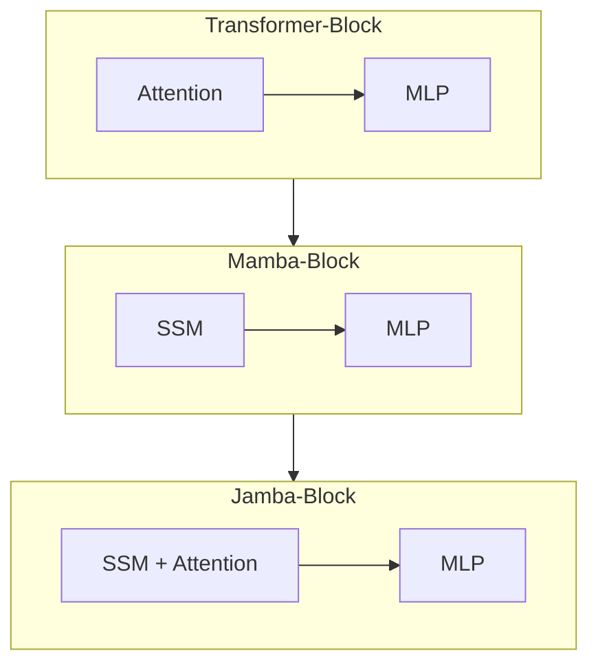

aliases: ["other-model-architectures", "model-scale", "mixture-of-experts", "SSM"]
tags: ["AI-engineering", "architectures", "LLM", "notes", "scaling-laws"]

This note covers **alternative model architectures** beyond transformers, along with important concepts related to **model size**, **training compute (FLOPs)**, **mixture-of-experts**, and **scaling laws**. While transformers continue to dominate the AI landscape, there are promising new architectures—particularly for long-context tasks—and crucial design considerations when scaling model size.

---
## 1. Alternative Architectures Beyond Transformers
![[Screenshot 2025-03-17 at 11.22.20 AM.png]]
### 1.1 Historical Perspective
Since **AlexNet** (2012) reignited interest in deep learning, many architectures have come and gone:
- **Seq2seq** (2014–2018) for machine translation and summarization
- **GANs** (2014–2019) for image generation, style transfer, etc.
- **Transformers** (2017–present) remain “sticky” and have become central to modern LLMs
### 1.2 The Challenge of Surpassing Transformers
The transformer’s success is due to:
1. **Heavy Optimization**: Over six years of intense industrial and research optimization.
2. **Hardware Compatibility**: Transformers run efficiently on GPUs/TPUs that exploit matrix multiplications at scale.

Any new architecture must:
- Perform well at **large scale** (billions+ parameters).
- Run efficiently on **hardware** that organizations already use (e.g., GPU clusters).
- Offer compelling advantages in speed, memory, or capability.
### 1.3 RWKV: RNNs with Parallel Training
**RWKV** (Peng et al., 2023) is an RNN-based model trained with parallelization techniques. Key points:
- **No intrinsic context limit** (unlike transformers, which have a fixed context length).
- In practice, performance at very long contexts still depends on how effectively the model leverages memory.
### 1.4 State Space Models (SSMs)
**State space models (SSMs)** (Gu et al., 2021a) show promise in modeling extremely **long-range dependencies** in sequences. They have evolved to address efficiency and scalability.
1. **S4** (Gu et al., 2021b):  
   - “Structured State Spaces for Sequence”  
   - Made SSMs more efficient for handling long sequences.
2. **H3** (Fu et al., 2022):  
   - Introduces a mechanism (similar in spirit to attention) to recall early tokens and compare tokens across sequences.  
   - More efficient than transformer’s attention for long sequences.
3. **Mamba** (Gu and Dao, 2023):  
   - Scales SSMs to **3B parameters**.  
   - Outperforms transformers of the same size, and **matches** performance of transformers twice its size.  
   - Linear-time scaling w.r.t. sequence length.  
   - Shows improvements on million-length sequences.
4. **Jamba** (Lieber et al., 2024):  
   - A **hybrid** that interleaves Mamba layers and transformer layers.  
   - Scales up to **52B total parameters** (12B active).  
   - Maintains strong performance on both standard and **long-context** tasks (up to 256K tokens).  
   - Smaller memory footprint compared to standard transformers.
#### 1.4.1 Visualizing the Layers
Below is a simplified conceptual diagram comparing **Transformer**, **Mamba**, and **Jamba** blocks (adapted from “Jamba: A Hybrid Transformer–Mamba Language Model” (Lieber et al., 2024)):


- **Transformer-Block**: Multi-head self-attention + feedforward MLP.
- **Mamba-Block**: SSM-based approach + feedforward MLP.
- **Jamba-Block**: Hybrid approach (some state-space + some attention) + MLP.
---
## 2. Model Size
### 2.1 Parameter Count
Models are often identified by their **parameter count**:
- **Llama-13B** has 13 billion parameters.
- Larger parameter counts **generally** provide higher capacity and better performance *given sufficient training data*.

> **Note**  
> Newer-generation models can outperform older-generation models of the same size due to improved training techniques, data curation, and architecture tweaks.  
> Example: **Llama 3-8B** (2024) outperforms **Llama 2-70B** (2023) on certain benchmarks.
### 2.2 The Memory Footprint

Storing a model’s parameters requires memory:
- For a **7B**-parameter model in **16-bit** precision: $\(7 \times 10^9 \times 2\text{ bytes} = 14 \text{ GB}\).$
- Real usage is often higher due to **optimizer states**, **activations**, and **inference overhead**.
### 2.3 Sparse Models & Mixture-of-Experts (MoE)
A **sparse model** has many parameters that are zero or otherwise inactive. This can reduce memory and computation needs.

**Mixture-of-experts (MoE)**:
- The model is partitioned into multiple “experts,” each with its own parameters.
- Only a subset of these experts is active for each token or sequence.  
- **Mixtral 8×7B**: 8 experts, each 7B parameters → “56B parameters” total, but some are shared, resulting in ~46.7B. Only 12.9B parameters are active per token.

This significantly lowers compute cost per token. Effectively, you get:
- “Big” parameter count for **capacity**  
- “Smaller” active parameter usage for **efficiency**
### 2.4 Data Size and Quality
A model’s success depends not only on parameter count but also on **dataset size** (in tokens) and **data quality**.  
- **Llama 1** trained on **1.4T tokens**  
- **Llama 2** on **2T tokens**  
- **Llama 3** on **15T tokens**

**RedPajama-v2** has **30T tokens**, roughly **450M books** or **5,400×** Wikipedia.

---
## 3. Training Compute & FLOPs
### 3.1 What Are FLOPs?
- **FLOP** = Floating Point Operation  
- **FLOPs** = A *count* of the total floating point operations needed for a task.  
- **FLOP/s** (or “FLOPS”) = Floating point operations *per second* (hardware speed).

**GPT-3-175B** required $\approx 3.14 \times 10^{23}$ FLOPs for training.  
If you have **256 H100s** (each ~5.2 × 10^18 FLOPs/day at 100% utilization), it would take ~236 days at peak.
### 3.2 Cost Example

Assume:
- $\$2 / \text{hour}  per  H100$
- 256 H100s
- 70% utilization

**GPT-3-175B** cost:  
$\$2 / (\text{H100}\cdot\text{hour}) \times 256 \times 24 \times 256 \,\text{days} / 0.7$  $\approx \$4.14 \,\text{million}$
### 3.3 Three Key Numbers for Model Scale

1. **# Parameters** – Proxy for capacity.  
2. **# Training Tokens** – Proxy for how much data it sees.  
3. **# FLOPs** – Proxy for training cost.

**FLOPs** stands for **Floating Point Operations** (sometimes called “floating point operations”) and typically appears in two closely related contexts:

1. **FLOPs (plural)** as a **count** of how many floating point operations a given task (like training or running a model) requires.  
2. **FLOP/s (“FLOPs per second”)** as a **measure of hardware speed**, i.e., how many floating point operations a processor can do per second.

Here’s a breakdown:

- A **floating point operation** is basically any arithmetic calculation (addition, subtraction, multiplication, etc.) performed on numbers in *floating point format*.  
- **FLOPs** are used to measure the computational effort needed for a certain task (e.g., training a large language model might require \(10^{23}\) FLOPs).  
- **FLOP/s** (often confusingly also written as **FLOPS**) is a hardware metric. For instance, a GPU might be capable of \(10^{12}\) floating point operations per second (1 teraflop/s), which tells you how fast it can crunch those operations.

In AI/ML contexts, FLOPs are especially common for:
- **Estimating Training Costs**  
  You can estimate how many times you’ll multiply matrices and vectors to train a huge neural network. If you know your hardware’s FLOP/s rating and your utilization (efficiency), you get a rough idea of **how long** and **how expensive** training might be.
- **Comparing Model Complexity**  
  Two models that do the “same” task might need different amounts of computation per forward or backward pass. You can compare them by calculating the FLOPs each requires.
Essentially, **FLOPs** give a standardized way to talk about “how much math” (how many arithmetic operations) a particular process—like training a model or running inference—requires.
---
## 4. Inverse Scaling
Sometimes, **bigger models** can do worse on certain tasks:
- Anthropic (2022) found that more **alignment** training sometimes led to less alignment on specific issues.  
- NYU’s **Inverse Scaling Prize** (2023) sought tasks where bigger models degrade.  
  - 11 third-prize winners found tasks with *small test sets* where large models performed worse.  
  - No “real-world” large-failure tasks awarded first or second prize.
---
## 5. Scaling Law: Chinchilla
**Chinchilla scaling law** (DeepMind, 2022) gives a guideline for **compute-optimal** training:
- Number of training tokens ~ **20×** model size.
- Increase model size and dataset size **in tandem**. Doubling model size → double data size.
**Example**:  
- A **3B**-parameter model ideally trains on **60B** tokens.
This law is derived under:
1. Dense, standard architecture assumptions.
2. Human-generated (or mostly) data.
### 5.1 Practical Deviations
- Some teams prefer *smaller* models for **usability** and **inference cost** advantages.  
- The law doesn’t directly account for *sparsity* or *synthetic data*.  
- In real production, business decisions and user adoption often trump pure performance.
---
## 6. Scaling Extrapolation & Emergent Abilities
### 6.1 Hyperparameter Tuning at Scale
- Training massive models once is often the only feasible option due to **cost**.  
- **Scaling extrapolation** attempts to predict optimal hyperparameters (e.g., learning rate, batch size) from smaller model experiments.  
- Emergent abilities complicate extrapolation because some capabilities appear only at large scale and may not be observable in smaller, cheaper experiments.
### 6.2 Example
- Microsoft & OpenAI (2022) successfully transferred hyperparameters from a **40M**-parameter model to a **6.7B**-parameter model.

---
## 7. Scaling Bottlenecks
1. **Training Data**:  
   - We may soon exhaust high-quality **internet text**.  
   - The web increasingly contains **AI-generated** text (risk of data contamination).

2. **Electricity & Hardware**:  
   - Data centers already use ~1–2% global electricity, projected 4–20% by 2030.  
   - This caps future growth in hardware scale unless electricity supply expands dramatically.
### 7.1 Proprietary Data & Access Restrictions
- Websites (Reddit, Stack Overflow) are restricting data scraping.  
- Large companies striking exclusive data deals (e.g., publishers, news outlets).  
- Proprietary data as **competitive advantage** in the AI arms race.
### 7.2 AI-Generated Training Data
- Training on AI outputs can lead to a model “forgetting” original patterns or amplifying errors (Shumailov et al., 2023).  
- The extent of quality degradation from partial AI data is an open question.

---
## 8. Code Examples
### 8.1 A Toy Mixture-of-Experts (MoE) Module in PyTorch

Below is a simplified conceptual snippet (not fully optimized):

```python
import torch
import torch.nn as nn
import torch.nn.functional as F

class Expert(nn.Module):
    def __init__(self, input_dim, hidden_dim):
        super().__init__()
        self.fc1 = nn.Linear(input_dim, hidden_dim)
        self.act = nn.ReLU()
        self.fc2 = nn.Linear(hidden_dim, input_dim)
    
    def forward(self, x):
        # x shape: [batch_size, seq_len, input_dim]
        out = self.fc1(x)
        out = self.act(out)
        out = self.fc2(out)
        return out

class Router(nn.Module):
    """
    A simple gating function to choose which experts to use for each token.
    For demonstration, we choose the top-1 or top-k experts based on a gating score.
    """
    def __init__(self, input_dim, num_experts):
        super().__init__()
        self.num_experts = num_experts
        self.gate = nn.Linear(input_dim, num_experts)
    
    def forward(self, x):
        # x shape: [batch_size, seq_len, input_dim]
        logits = self.gate(x)  # [batch_size, seq_len, num_experts]
        # For simplicity, pick top-1 expert
        weights = F.softmax(logits, dim=-1)  # [B, T, E]
        return weights

class MOELayer(nn.Module):
    def __init__(self, input_dim, hidden_dim, num_experts):
        super().__init__()
        self.experts = nn.ModuleList([
            Expert(input_dim, hidden_dim) 
            for _ in range(num_experts)
        ])
        self.router = Router(input_dim, num_experts)

    def forward(self, x):
        # x: [batch_size, seq_len, input_dim]
        weights = self.router(x)  # [B, T, num_experts]
        
        # Compute each expert
        expert_outs = []
        for i, expert in enumerate(self.experts):
            expert_out = expert(x)  # [B, T, input_dim]
            expert_outs.append(expert_out)
        expert_outs = torch.stack(expert_outs, dim=-1)  # [B, T, input_dim, num_experts]

        # Weighted sum across experts
        # weights: [B, T, E], expert_outs: [B, T, input_dim, E]
        # Expand weights to align shapes
        weights_expanded = weights.unsqueeze(2)  # [B, T, 1, num_experts]
        out = (expert_outs * weights_expanded).sum(dim=-1)  # [B, T, input_dim]

        return out
```

Key takeaways:
- **`Expert`**: A simple feedforward sub-network.
- **`Router`**: Learns a distribution over experts for each token.
- **Top-1 gating**: In real setups, you might choose top-2 or another approach to reduce routing variance and **load balancing** issues.

### 8.2 Estimating FLOPs in PyTorch

A simplistic example to measure approximate FLOPs for a forward pass:

```python
import torch
import torch.nn as nn
from fvcore.nn import FlopCountAnalysis

model = MOELayer(input_dim=1024, hidden_dim=2048, num_experts=8)
x = torch.randn(4, 128, 1024)  # batch_size=4, seq_len=128

flop_analyzer = FlopCountAnalysis(model, x)
print(f"Approx FLOPs: {flop_analyzer.total()}")
```

> **Note**  
> FLOP counting can be tricky, and third-party libraries differ in how they measure. This is a rough estimate.

---

## 9. Conclusion
- **Transformers** still reign, but alternative architectures (e.g., **RWKV**, **SSMs** like **Mamba**, or hybrids like **Jamba**) show promise—especially for **long-sequence** tasks.
- **Model size** (params) + **data size** (tokens) + **FLOPs** (training cost) are three core signals of a model’s capability and computational demands.
- **Sparse models** and **MoE** can achieve large “headline” parameter counts with smaller active usage, potentially reducing inference/training cost.
- **Scaling laws** (e.g., Chinchilla) guide how to allocate compute optimally, but real-world trade-offs can lead to smaller or specialized models.
- **Data** constraints and **electricity** constraints pose practical limits on indefinite scale-ups.
- Emergent abilities and alignment complexities add layers of difficulty in predicting behavior at massive scales.
As AI engineers, it’s critical to:
1. Understand the **trade-offs** in choosing or developing new architectures.
2. Be aware of the **scaling laws** and constraints (data, compute, cost).
3. Keep an eye on **sparse** and **long-sequence** approaches for next-generation breakthroughs.
---
## References & Further Reading
1. **AlexNet** (Krizhevsky, Sutskever, and Hinton, 2012)  
2. **Attention Is All You Need** (Vaswani et al., 2017)  
3. **RWKV** (Peng et al., 2023)  
4. **S4** – _“Efficiently Modeling Long Sequences with Structured State Spaces”_ (Gu et al., 2021b)  
5. **H3** – _“Hungry Hungry Hippos”_ (Fu et al., 2022)  
6. **Mamba** – _“Mamba: Linear-Time Sequence Modeling with Selective State Spaces”_ (Gu and Dao, 2023)  
7. **Jamba** – _“A Hybrid Transformer–Mamba Language Model”_ (Lieber et al., 2024)  
8. **Chinchilla** – _“Training Compute-Optimal Large Language Models”_ (DeepMind, 2022)  
9. **Scaling Extrapolation** – Microsoft & OpenAI (2022)  
10. **Inverse Scaling Prize** – Anthropic, NYU (2023)  
11. **Data Bottleneck** – (Villalobos et al., 2022), (Shumailov et al., 2023)  
12. **AI Infrastructure** – (Patel, Nishball, and Ontiveros, 2024)  