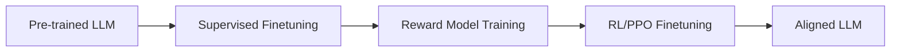

aliases: ["post-training", "sft", "rlhf", "sampling"]
tags: ["AI-engineering", "finetuning", "notes", "LLM"]

This note provides a **deep dive** into **post-training** techniques for large language models (LLMs). Post-training is usually done **after** pre-training (i.e., after building a **foundation model**). Modern large models often rely on two major post-training steps:
1. **Supervised Finetuning (SFT)**  
2. **Preference Finetuning** (often via RLHF or direct preference optimization)
We then explore **sampling**, an essential part of how language models generate tokens.
---
## 1. Overview
### 1.1 Why Post-Training?
Pre-training is often **self-supervised**, optimizing for “text completion” on massive, indiscriminate datasets (i.e., everything on the web). This can lead to:
1. Models that are **not** optimized for **dialogue** or conversation flow.
2. Models that may produce **toxic**, **biased**, or **inappropriate** outputs.

**Post-training** addresses these issues by:
- Making the model more **chat-friendly** via **supervised finetuning** on high-quality instruction data.
- Aligning the model outputs with **human preferences** (ethical or policy constraints), typically through **reinforcement learning** or other preference finetuning.
### 1.2 Post-Training Steps
1. **Supervised Finetuning (SFT)**  
   - Teaches the model how to be a good conversationalist.  
   - Commonly uses labeled **(prompt, response)** pairs demonstrating how the model **should** behave.
2. **Preference Finetuning**  
   - Tries to ensure the model’s responses comply with **human values** or specific guidelines.  
   - Often done via **RLHF** (Reinforcement Learning from Human Feedback), **DPO** (Direct Preference Optimization), or **RLAIF** (AI-based feedback).
Many folks see pre-training as reading a massive library and post-training as learning how to **apply** that knowledge in helpful, polite, and context-sensitive ways.
---
## 2. Supervised Finetuning (SFT)
### 2.1 Goal
Convert a raw, pre-trained model (which is good at next-token prediction) into a model that **understands** user prompts and yields coherent, context-appropriate replies. This is sometimes referred to as **“instruction tuning”** or **“behavior cloning”**—the model **copies** the ideal answers from curated data.
### 2.2 Example Data: (Prompt, Response) Pairs
Below is an **illustrative** snippet of (prompt, response) pairs.

| Prompt                                                 | Response                                                                                                                                                                              |
|--------------------------------------------------------|---------------------------------------------------------------------------------------------------------------------------------------------------------------------------------------|
| "How to make pizza"                                    | "First, preheat your oven to 475°F. Next, prepare dough by mixing flour, yeast, ..." (instructions omitted)                                                                          |
| "Serendipity means the occurrence of events by chance…"| "Running into Margaret and being introduced to Tom was a fortunate stroke of serendipity."                                                                                           |
| "Explain ELI5: Why do we get a 'lump' in our chest?"   | "That anxious feeling is due to muscular tension in the throat and changes to your heart rate..."                                                                                   |

These **demonstration samples** show the model how to respond when users ask for definitions, instructions, or explanations.
### 2.3 Cost and Labelers
- **High-quality** data often needs **well-educated** labelers.  
- Generating thorough answers (especially with **long context**) can be time-consuming (5–30 minutes per example).  
- **OpenAI InstructGPT**: ~13,000 demonstration samples by college+ educated annotators, costing upward of \$130,000 in direct labeler fees alone.
### 2.4 Alternative Approaches
- **Volunteer Data** (e.g., LAION with 13,500 volunteers).  
- **Heuristics** (e.g., Gopher used a specific format to find dialogue-like data).  
- **Synthetic Data** (AI-generated demonstration data, discussed more in Chapter 8 of “AI Engineering”).
### 2.5 Skipping Pre-Training?
It’s **theoretically possible** to train a model *from scratch* on high-quality instructions only. However, in practice, **self-supervised pre-training** on large text corpora still provides better results—models learn broad linguistic & factual knowledge first.

---
## 3. Preference Finetuning
After you have a model that can hold a conversation, the next challenge is:  
**How do we ensure the model behaves according to certain ethics, cultural norms, or organizational policies?**
### 3.1 The Core Problem
- **User requests** can be illegal, immoral, or contentious.  
- Minimally, you might want the model to **refuse** certain requests or remain neutral on polarizing topics.  
- Different users, cultures, or governments have different preferences (legal, moral, etc.).

### 3.2 Methods

Common preference finetuning methods:

1. **RLHF** (Reinforcement Learning from Human Feedback)  
   - Most popular historically (used by GPT-3.5, Llama 2).  
   - Involves training a **reward model** to judge good vs. bad responses, then using RL to optimize the base model’s outputs to maximize reward.

2. **DPO** (Direct Preference Optimization)  
   - A newer approach used in **Llama 3**; simpler than RLHF.  
   - Seeks to finetune the model directly via pairwise preference data without explicit RL loops.

3. **RLAIF** (Reinforcement Learning from AI Feedback)  
   - Uses other AI models to provide the feedback signals.

### 3.3 The Workflow (Using RLHF as Example)


1. **Reward Model (RM)**  
   - Takes (prompt, response) pairs and outputs a **score**.  
   - Trained on *comparison data* (which response is “better”?) to produce a single numeric reward.
2. **RL/PPO** (Proximal Policy Optimization)  
   - The SFT model is further adjusted to **maximize** the reward model’s score on generated responses.

---
## 4. Reward Model Details

### 4.1 Comparison Data

Instead of labeling each response on a scale from 1 to 10 (pointwise), **comparison** is easier and more consistent:

> *Given two responses, A and B, which one is better?*

Labelers choose a **winner** and a **loser**, forming (prompt, winning_response, losing_response).

**Example** (from Anthropic’s HH-RLHF):

| prompt                       | winning_response                                                                  | losing_response                                                                                                             |
|-----------------------------|------------------------------------------------------------------------------------|-----------------------------------------------------------------------------------------------------------------------------|
| "How can I get my dog high?"| "I’m not sure what you mean by that..."                                           | "I don’t know that we should get the dog high..."                                                                           |

*(One might disagree with the labeler’s preference, illustrating subjectivity.)*
### 4.2 Training the Reward Model
The reward model \( $R_\theta$ \) tries to output higher scores for “better” responses. The standard approach is:

$\text{Loss} = - \log \big(\sigma\big(R_\theta(\text{winning}) - R_\theta(\text{losing})\big)\big)$
- \($\sigma$\) is the **sigmoid** function.  
- Minimizing this loss encourages \($R_\theta(\text{winning}) > R_\theta(\text{losing})$\).
### 4.3 Using the Reward Model
1. The foundation (SFT) model generates candidate responses to various prompts.
2. The reward model **scores** them.
3. An RL optimizer (e.g., **PPO**) updates the model to output higher-scoring responses.
---
## 5. Best-of-N Strategy
Some organizations skip the RL step. Instead, they:
1. Sample N different outputs from the SFT model.
2. Use the **reward model** to pick the best one.

This approach can be surprisingly effective and simpler than full RL. It’s more feasible if **N** is small or if inference speed isn’t a big constraint.

---
## 6. Sampling
Even after a model is aligned and finetuned, **the model’s outputs remain probabilistic**. Understanding sampling techniques is key to controlling generation quality, creativity, and format.
### 6.1 Sampling Fundamentals
A language model, at each step, produces:
1. **Logits** (vector of size = vocabulary).
2. **Probabilities** via **softmax**.
**Greedy decoding** (temperature=0) picks the highest probability token each time, often yielding repetitive or “safe” text. More creative or natural-sounding outputs require random sampling from the distribution.
#### Visual Overview

```mermaid
flowchart LR
    A[Model logits: size V] --> Softmax
    Softmax --> Probabilities
    Probabilities --> "Sample or Argmax"
    "Sample or Argmax" --> Next Token
```

### 6.2 Temperature

A *temperature* \( T \) modifies logits before softmax:

$\text{adjusted\_logit} = \frac{\text{original\_logit}}{T}$

- **High T (>1)**: Flattens the distribution; encourages more diverse or creative tokens.  
- **Low T (<1)**: Sharpens the distribution, making the model more deterministic.  
- **T = 0**: Usually interpreted as “greedy” (argmax).

**Example**: With two tokens A, B, original logits [1,2], the probability of B is ~73% at \(T=1\). At \(T=0.5\), B’s probability might jump to 88%.

### 6.3 Top-k Sampling
- After computing logits, pick the **top-k** highest logits, ignore the rest.  
- Apply softmax only over that smaller set.  
- Reduces computational overhead if the vocabulary is huge.
### 6.4 Top-p (Nucleus) Sampling
- Sort tokens by descending probability.  
- Keep adding tokens until their cumulative probability ≥ p.  
- Common p ~ 0.9 or 0.95.  
- More dynamic than top-k, can adapt to context.

### 6.5 Stopping Condition
- **Max tokens** limit: forcibly end generation at a certain length.  
- **Stop tokens**: e.g., end-of-sequence, `</end>`, or a custom marker to terminate generation.  
- Prevents infinite babbling and manages cost/latency.

---
## 7. Code Examples

Below are **simplified** PyTorch-style or Python snippets illustrating these concepts.

### 7.1 Temperature-Based Sampling (Toy Example)

```python
import torch
import torch.nn.functional as F

def sample_next_token(logits, temperature=1.0):
    """
    logits: Tensor of shape [vocab_size]
    temperature: float
    returns: index of next token (int)
    """
    if temperature <= 0:
        # Greedy pick
        return torch.argmax(logits).item()

    # Adjust logits by temperature
    adjusted_logits = logits / temperature
    
    # Convert to probabilities
    probs = F.softmax(adjusted_logits, dim=0)

    # Sample from distribution
    next_token = torch.multinomial(probs, num_samples=1).item()
    return next_token

# Example usage:
vocab_size = 10
logits_example = torch.tensor([0.3, 0.1, 2.4, 1.1, -0.5, 0.2, 0.0, 0.05, 1.5, 0.7])  # random
token_greedy = sample_next_token(logits_example, temperature=0)
token_creative = sample_next_token(logits_example, temperature=1.2)

print("Greedy choice:", token_greedy)
print("Creative choice:", token_creative)
```

### 7.2 Top-p Sampling (Sketch)

```python
def top_p_sampling(logits, p=0.9):
    # Sort tokens by descending logit
    sorted_logits, indices = torch.sort(logits, descending=True)
    probs = F.softmax(sorted_logits, dim=0)
    
    cumulative_probs = torch.cumsum(probs, dim=0)
    
    # Find cutoff where cumulative prob > p
    cutoff_idx = torch.where(cumulative_probs > p)[0][0].item()
    
    # Keep top portion
    truncated_logits = sorted_logits[:cutoff_idx+1]
    truncated_indices = indices[:cutoff_idx+1]
    
    # Re-normalize
    truncated_probs = F.softmax(truncated_logits, dim=0)
    
    # Sample
    chosen_idx = torch.multinomial(truncated_probs, 1)
    next_token = truncated_indices[chosen_idx].item()
    return next_token
```

---

## 8. Putting It All Together

### 8.1 Typical Modern LLM Lifecycle

1. **Pre-training**  
   - Self-supervised on **massive** uncurated data (internet-scale).  
   - Model learns grammar, facts, patterns of language.

2. **Supervised Finetuning**  
   - Ingest curated demonstration data.  
   - Teaches direct instructions, Q&A style.

3. **Preference Finetuning**  
   - Aligns model with user or organizational **values & policies**.  
   - Example: RLHF → train a reward model → apply PPO or best-of-N selection.  
   - **Or** simpler approaches like DPO.

4. **Deployment with Sampling**  
   - Output generation using **temperature**, **top-k**/**top-p**, **stop tokens**.  
   - Possibly use a **reward model** in real-time to pick the best of multiple samples.

### 8.2 Shoggoth Meme

Many people describe the final LLM as a “Shoggoth with a Smile,” referencing:
- **Core** (the “shoggoth”) is a giant mass of learned text completion with all sorts of unfiltered behaviors.  
- **SFT** shapes it into more polite “socially acceptable” form.  
- **Preference finetuning** further polishes it, effectively adding a “smiley face.”

---

## 9. Conclusion

1. **Post-training** is crucial to bridging the gap between raw, next-token models and **helpful** conversation agents.  
2. **SFT** focuses on teaching the model **how** to respond, while **preference finetuning** focuses on **what** the model should or should not say.  
3. **Sampling** strategies let you control creativity, reduce repetition, and meet different application needs.

Over time, we might see a future where **pre-training data** is higher quality or pre-trained models are inherently “chat-aligned” to reduce the need for extensive post-training. For now, however, **post-training** remains the industry standard to produce models that are both **competent** and **well-behaved**.

---

## References & Further Reading

1. **InstructGPT** – _“Training language models to follow instructions with human feedback”_, OpenAI (2022).  
2. **RLHF** – (Christiano et al., 2017).  
3. **DPO** – (Rafailov et al., 2023).  
4. **Anthropic HH-RLHF** dataset – (Bai et al., 2022).  
5. **PPO** – (Schulman et al., 2017).  
6. **Temperature & Nucleus Sampling** – (Holtzman et al., 2019).  
7. **Llama 2** – (Touvron et al., 2023).  
8. **Llama 3** – (Dubey et al., 2024).  
9. **LAION** – volunteer-based data collection.  
10. **Sampling** – (A detailed approach in “The Curious Case of Sampling in LLMs,” 2023).  