> **Scope**  
> * Darwin 20 → 23 tested (Big Sur → Sonoma) but concepts apply back to 10.6 and forward to current betas.  
> * Focus on on-disk structures, VFS integration, mount flags, tooling, and RE hooks so you can build parsers, fuzzers, or kernel shims later.

---
### 1 · Partitions & Volume Topology
#### 1.1 GUID Partition Table (GPT)
```
┌───────────────────────────────────────┐
│ PMBR (LBA 0) 0xEE protective MBR      │
├───────────────────────────────────────┤
│ GPT Header (LBA 1)                    │
├───────────────────────────────────────┤
│ 128 × Partition Entries (LBA 2-33)    │
├──────────────────────┬───────────────┤
│          …           │  Backup GPT   │
└──────────────────────┴───────────────┘
```
* 128-byte entries; CRC32 over header + table.  
* Apple reserves `0x48465300-0000-11AA-AA11-00306543ECAC` **(HFS+)** and `7C3457EF-0000-11AA-AA11-00306543ECAC` **(APFS)**.

#### 1.2 macOS Disk Layout ≥ 10.15
```
disk0s2  GPT:   [EFI]  [APFS Container]  (optionally MSR / Boot Camp)
             |
             └─ APFS Container disk1          (physical-store=disk0s2)
                ├─ Preboot       (signed boot manifests)
                ├─ Recovery      (3 GB, baseOS.dmg)
                ├─ VM            (swapfiles & memimage)
                ├─ Macintosh HD  (❄️ sealed system, read-only)
                └─ Macintosh HD - Data (writable user data)
```
*Two-volume model* introduced in Catalina mirrors **iOS root/data** split; SSV seal (Merkle tree) makes `Macintosh HD` immutable at runtime.  

#### 1.3 Benefits of the Split  

| Property | System Vol | Data Vol |
|----------|------------|----------|
| Update w/o userdata | ✔ | — |
| Wipe factory reset  | — | ✔ |
| Run-time writable   | ✖ (`ro`) | ✔ |
| Content Protection  | — | Optional (`cp-protect`) |

---

### 2 · XNU VFS Layer & Filesystem KEXTs

```mermaid
graph LR
subgraph Kernel
  vfs[VFS Layer] -->|vnode_t*| fsdriver(HFS+/APFS/NFS/… kext)
  fsdriver --> pmap[Pmap I/O]
end
```


| Component | Notes |
|-----------|-------|
| `struct vfsops` | per-FS mount/quotactl/sync etc. |
| `struct vnodeops` | open/lookup/read/write/fsync… |
| Kext ID pattern | `com.apple.filesystems.<fstype>` |
| List loaded FS kexts | `kextstat | grep filesystems` |

**Skeleton kext** (build with Xcode KDK):
```c
#include <sys/mount.h>
#include <sys/vnode_if.h>
static struct vfsops myfs_vfsops = {
    .vfs_mount = myfs_mount,
    .vfs_unmount = myfs_unmount,
    .vfs_root = myfs_root,
    /* … */
};
KMOD_EXPLICIT_DECL(com.example.myfs, "1.0", &myfs_vfsops);
```
`IORegistryEntry` not needed; FS kexts attach to VFS, not IOKit.

---

### 3 · Native macOS Filesystems
#### 3.1 HFS+ / HFSX
* B-tree metadata (Catalog, Extents, Attributes, Allocation).  
* Journal = circular buffer after volume header (`.journal`).  
* **HFS+** = case-insensitive; **HFSX** = case-sensitive (flag in VH).  

#### 3.2 APFS (>= 10.12 / iOS 10.3)
```
Container Superblock (NX) → Spaceman blocks → B-tree (object map) → Volumes
```
* 64-bit block addresses, copy-on-write everywhere.  
* **Snapshots & Clones** = cheap; each file is an `inode + dstream + extents`.  
* `fs_info apfs /dev/diskXsY` shows checkpoint states.  
* Crypto: per-file keys wrapped with volume key (effortless FDE).

---

### 4 · Optical & Emulated Media
| FS | Driver | Details |
|----|--------|---------|
| **CD9660** | `cd9660.fs` (read-only) | ISO9660 Level 3 + Joliet + RR. |
| **UDF 2.60** | `udf.fs` | DVD/Blu-Ray; limited to read on macOS. |
| **CDDAfs** | `cddafs.fs` | Presents *tracks* as AIFFs; auto-names from Music DB.<br>`afplay /Volumes/CD/...` streams PCM. |

`jtool2 -v /Volumes/Disc/.TOC.plist` dumps TOC metadata (see screenshot).

---

### 5 · Network Filesystems
| FS | Kernel / User Component | Protocol rev | Notes |
|----|-------------------------|--------------|-------|
| **ACfs (Xsan)** | kext | Fibre-channel SAN | Clustered metadata controller. |
| **AFPfs** | user-mode (`mount_afp`) + `afpfs.kext` | AFP 3.4 | Deprecated post-10.9. |
| **NFS** | `nfs`, `nfsiod` | v3 & v4 | macOS uses AutoFS. |
| **SMBfs** | `smbfs.kext` + `mount_smbfs` | SMB 3.x | Signed & encrypted channels. |
| **FTPfs** | `ftpfs_agent` (pseudo-fs) | — | Translates VFS ops → FTP cmds. |
| **WebDAVfs** | `webdavfs.kext` + `webdavfs_agent` | RFC 2518 | Used by iCloud Drive & Back-to-My-Mac days. |

---

### 6 · DOS / Windows Interop
* **FAT12/16/32 & exFAT** – full R/W via `msdosfs.kext`.  
* **NTFS** – read-only stock; 3rd-party drivers (Paragon, FUSE) implement R/W by supplying an alternate `ntfs.kext`.

Mount sample:
```bash
sudo mount -t ntfs -o rw,auto,nobrowse /dev/disk2s1 /Volumes/NTFS
```

---

### 7 · Mount Flags Cheat-Sheet
| Flag | Effect | Kernel Symbol |
|------|--------|---------------|
| `journaled` | enable journal (HFS+) | `MNT_JOURNALED` |
| `nosuid` | ignore set-uid bits | `MNT_NOSUID` |
| `nodev` | disallow device files | `MNT_NODEV` |
| `noatime` | don’t update atime | `MNT_NOATIME` |
| `protect` | NSPersonalDataProtection (class C/D) | `MNT_CPROTECT` |
| `nobrowse` | hide from Finder GUI | `MNT_DONTBROWSE` |

---

### 8 · Toolbox for Low-Level Work
| Task | Command/Call |
|------|--------------|
| List mounts & flags | `mount` / `getmntinfo()` |
| New APFS volume | `diskutil apfs addVolume disk1 APFS MyData` |
| Manually fsck | `fsck_apfs -q /dev/disk1s6` |
| Create custom FS bundle | `/System/Library/Filesystems/<name>.fs` structure (Contents/Resources + mount helper) |
| Inspect on-disk structs | `apfs.util -pV /dev/rdisk1s5` (KDK only) |
| Live patch FS code | `LLDB + kextload --symbols-only`, or manually via KTRR-aware patcher on Apple Silicon. |

---

### 9 · Reverse-Engineering & Project Ideas
1. **APFS Container Parser (Rust)**  
   * read NXSB, walk `spaceman_free_queue`, reconstruct snapshots.  
   * deliver as a `libapfs` crate usable from `ggez` *(GUI viewer)*.

2. **macFUSE VFS Monitor**  
   * User-land FS that mirrors another mount and logs every `VNOP_*` call with latency.  
   * Inject into the VFS layer via `mount_fusefs` with `allow_other`.

3. **Journaling Fuzzer**  
   * fuzz `hfs_trim_jnl` / `apfs_jobj` replay sequences with honggfuzz; target `fsck_*` binaries first, then kernel (with KTRR disabled in virtualised Mac VM).

4. **Forensics Plug-in**  
   * Pull out `.OfflineFiles` from SMB shares; correlate M1 time-stamp ticks (GCC nano-epoch) ↔ UNIX epoch + nanoseconds.

---

### Appendix A · Code Snippets

#### A.1 Minimal mount helper (user-space `.fs` bundle)
```c
int main(int argc, char* argv[])
{
    struct mntopt optv[] = {
        { "nobrowse", 0, NULL, 0 }, { NULL, 0, NULL, 0 }
    };
    return mount("myfs", argv[2],
                 MNT_RDONLY|MNT_DONTBROWSE,
                 optv);
}
```

#### A.2 Reading a vnode’s UBC info (kernel)
```c
ubc_info_t info = vnode->v_ubcinfo;
if (info && (info->ui_flags & UI_HASPAGER)) {
    printf("pager size = 0x%llx\n", (uint64_t)info->ui_size);
}
```

---

### 🧭  Quick Reference Table (Cheat-Sheet)

| FS Type | Read | Write | Journaling | Snapshots | Case-sens | Encryption | Max file |
|---------|------|-------|------------|-----------|-----------|------------|----------|
| HFS+    | ✔   | ✔ | Optional | ✖ | opt | FDE (CoreStorage) | 8 EB |
| APFS    | ✔   | ✔ | Copy-on-write | ✔ | opt | ✅ (native) | 8 EB |
| NTFS (stock) | ✔ | ✖ | ✔ | ✖ | opt | 3rd-party | 16 EB |

---

### ☑️ Key Takeaways
* GPT is universal; learn to parse headers to bootstrap any forensic tool.  
* macOS migrated from monolithic **HFS+** → **APFS** with sealed, snapshot-based root; every low-level project must handle both.  
* VFS abstractions keep kexts tiny; intercept at vnode or mount layer depending on goals.  
* Mount flags (`protect`, `nobrowse`, etc.) offer quick hardening levers; replicate them in test harnesses.  
* Reverse engineering FS code is easiest in userland (`**fsck_*` first) before poking kernel paths guarded by KTRR/PAC.

Dive in — the filesystems world is the perfect playground for mixing hardware, kernel, and user-mode skills on macOS.