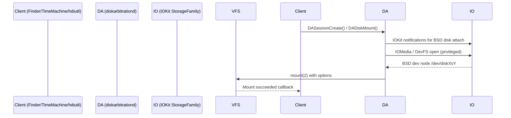

### 0 · Quick-Scope
| Area | Why Kernel/RE Folks Care |
|------|-------------------------|
| **DiskArbitration.framework** | Privileged mount orchestration; attack surface for TOCTOU & SIP bypass. |
| **ACLs / File Flags / xattrs** | Fine-grained metadata used by Gatekeeper, SIP, FDE, compression. You must replicate/strip when building custom mounters or forensic extractors. |
| **Transparent Compression & Resource Forks** | Implemented in VFS, not FS-specific; understanding flags/xattr triggers avoids data-loss when replaying images to bare metal. |

---

## 1 · Disk Arbitration Overview

#### 1.1 Players



#### 1.2 `diskarbitrationd` Mach Interface (MIG)  
*(extracted from `/System/Library/Frameworks/DiskArbitration.framework/Versions/A/Resources/diskarbitrationd.defs`)*  

| Msg# | Call | Purpose (superset) |
|------|------|--------------------|
| 0 | `_DAServerDiskCopyDescription` | BSD-name → CFDictionary (size, UUID, bus-type …) |
| 3 | `_DAServerDiskIsClaimed` | Returns kDAReturnBusy if another client claimed. |
| 8 | `_DAServerSessionCopyCallbackQueue` | Get pending callbacks for session. |
| 10| `_DAServerSessionQueueRequest` | Enqueue mount/eject/unmount. |
| 12| `_DAServerSessionRegisterCallback` | Register dissenter / approval callback. |
| 17| `_DAServerrmdir` | **Darwin 17+**: server-side `rmdir(2)` (for APFS firm-links). |

*The public C API is a wrapper; you can craft MIG messages by hand with `mach_msg()` for fuzzing.*

#### 1.3 Verbose Tracing

```bash
# copy the plist, add "-d" arg
sudo cp /System/Library/LaunchDaemons/com.apple.diskarbitrationd.plist /tmp
sudo plutil -replace ProgramArguments -json '["/usr/libexec/diskarbitrationd","-d"]' /tmp/com.apple.diskarbitrationd.plist
sudo launchctl unload /System/Library/LaunchDaemons/com.apple.diskarbitrationd.plist
sudo launchctl load /tmp/com.apple.diskarbitrationd.plist
tail -f /var/log/diskarbitrationd.log
```

*Log shows full mount choreography, requestor PID, dissenter reasons, etc.*

#### 1.4 Bypassing DA (direct IOKit attach)

```bash
sudo hdik -nomount test.dmg        # IOConnectCallStructMethod ⇒ IOHDIXController
diskutil mount readOnly /dev/disk5 # optional
```

*Since Catalina the `com.apple.private.diskimages.kext.user-client-access` entitlement is required; binaries possessing it: `hdiutil`, `hdik`, `diskimages-helper`, `/usr/bin/nbdst`.*

**Research idea**: craft a malicious `IOHDIXController` user-client call sequence omitting the VFS mount to alter root-readonly volume overlays (cf. CVE-2017-2533 race).

---

## 2 · UNIX Permissions → macOS ACLs

| Classic bits | Limitations |
|--------------|-------------|
| `u/g/o` triad only  | No per-user multi-entry, no deny rules |
| `rw-/r--/r--` | Cannot express append-only, delete-child, etc. |

#### 2.1 ACL CLI Samples

```bash
touch report.pdf
chmod +a "staff allow read" report.pdf
chmod +a "admin allow write,delete,append" report.pdf
ls -le report.pdf
```
Output shows `0: user:staff allow read` etc.

#### 2.2 Programmatic Enumeration

```c
#include <sys/acl.h>
acl_t acl = acl_get_file("report.pdf", ACL_TYPE_EXTENDED);
acl_print(stdout, acl, ACL_TEXT_VERBOSE);
acl_free(acl);
```

*Apple extends POSIX draft ACL with additional flags (e.g., `ACL_FLAG_NO_INHERIT`).*

---

## 3 · File Flags (fchflags)

| Flag | arg | User/Super? | Meaning |
|------|-----|-------------|---------|
| `UF_NODUMP` | nodump | user | Exclude from `dump(8)` |
| `UF_IMMUTABLE` | uchg | user | File cannot be modified/renamed even by root unless cleared in single-user |
| `UF_COMPRESSED`| compressed | kernel-set | Backed by decmpfs transparent compression |
| `SF_RESTRICTED`| restricted | super | SIP-enforced; modifications require com.apple.rootless.* entitlement |
| `SF_DATAVAULT` | datavault | super | Files readable only with entitlement (used by Notes.app) |

```bash
sudo chflags uchg secrets.txt
# Attempting to edit will yield EPERM
sudo chflags nouchg secrets.txt
```

---

## 4 · Extended Attributes (xattr)

#### 4.1 Anatomy

```
namespace = user / system / com.apple
name      = reverse DNS
value     = blob (<= 64 KiB each)
```

| Common xattr | Function |
|--------------|----------|
| `com.apple.quarantine` | Gatekeeper; format `0081;5fd09d8a;Safari;` |
| `com.apple.lastuseddate#PS` | Spotlight last-open timestamp |
| `com.apple.decmpfs` | Transparent compression header |
| `com.apple.ResourceFork` | Classic resource fork data |
| `com.apple.cs.CodeSignature` | Detached CD hash for FAT binaries on iOS |

#### 4.2 Flagged Attributes (`xattr_name#<flag>`)

| Suffix | Constant | Meaning |
|--------|----------|---------|
| `P` | `XATTR_FLAG_NO_EXPORT` | Don’t copy in AirDrop/iCloud |
| `C` | `XATTR_FLAG_NO_CONTENT_DEPENDENT` | Invalid if file data changes |
| `N` | `XATTR_FLAG_NEVER_PRESERVE` | Strip on copy |
| `S` | `XATTR_FLAG_SYNCABLE` | Sync to iCloud |

*C library: `fgetxattr()` / `fsetxattr()`; higher-level copyfile(3) honors flags.*

---

## 5 · Transparent Compression (decmpfs)

* Introduced 10.6; stored entirely as **xattr + UF_COMPRESSED** flag.  
* Compression algorithms: `kdecmpfs_type_zlib(3)`, `lzvn(7)`, `lzss`.  

#### 5.1 Inspecting

```bash
ls -lO Applications/Mail.app/Contents/MacOS/Mail
# flags: restricted,compressed
xattr -p com.apple.decmpfs ... | hexdump -C | head
```

#### 5.2 Force recompress

```bash
ditto --hfsCompression /path/in /path/out
afscexpand Mail > /dev/null              # decompress (root only)
```

---

## 6 · Resource Forks & Alternate Data Streams

```bash
# Add resource fork manually
echo meta > file/..namedfork/rsrc
xattr -p com.apple.ResourceFork file     # same data

# C API
fsref_resource_fork_write("icon", ...);  // from Carbon era, still works
```

Modern use-cases: signed app bundles embed legacy resources; malware can stash payload in fork (not mmap-executable by kernel).

---

## 7 · Sample Tooling Snippets

### 7.1  Minimal DiskArbitration Mount Helper (Objective-C)

```objective-c
#include <DiskArbitration/DiskArbitration.h>

void mount_cb(DADiskRef disk, DADissenterRef dis, void *ctx) {
    if (dis) fprintf(stderr,"dissenter: %s\n", DAReturnGetLocalizedDescription(DADissenterGetStatus(dis)));
    CFRunLoopStop(CFRunLoopGetCurrent());
}

int main(int argc, char **argv) {
    DASessionRef sess = DASessionCreate(kCFAllocatorDefault);
    DADiskRef disk = DADiskCreateFromBSDName(kCFAllocatorDefault,sess, argv[1]); // e.g. /dev/disk2s1
    DADiskMount(disk, NULL, kDADiskMountOptionDefault, mount_cb, NULL);
    CFRunLoopRun();
}
```

Compile with `clang -framework DiskArbitration`.

### 7.2  FFI Rust to list all xattrs

```rust
use xattr::FileExt;
let attrs = std::fs::File::open("target")?.list_xattr()?;
for a in attrs { println!("{}", a); }
```

Great base for forensic copier that preserves Apple metadata.

---

## 8 · Security & RE Opportunities

| Vector | Idea |
|--------|------|
| **TOCTOU (CVE-2017-2533)** | race `diskarbitrationd` claim vs. bind-mount over SIP-protected path. |
| **Fake compressed flag** | Clear UF_COMPRESSED but leave decmpfs header → confuse backup utilities. |
| **Hidden ACL deny** | Inject deny ACE for admin to create stealthy file. |
| **Malicious xattr flag** | Abuse `#N` or `#C` to strip quarantine when user copies file. |

---

### 9 · Cheat-Sheet Commands

```bash
# Show mount proposals from DA (needs root)
fs_usage -w -f filesystem diskarbitrationd

# List flags/xattrs for an entire volume
ls -lOe@ /Volumes/Macintosh\ HD | grep -E "restricted|compressed"

# Clear quarantine recursively
xattr -d -r com.apple.quarantine <dir>

# Add deny-write ACE for everyone but you
chmod +a# 0 "everyone deny write" secret.dat
```

---

### 📝 Key Takeaways

1. **Disk Arbitration** centralises all mounts; direct IOKit attach bypasses user-land policy layers, making it prime fuzzing target.  
2. **ACLs & Flags** are the first line of macOS hardening (SIP leverages `restricted` + ACL deny); understand them before forging system images.  
3. **xattrs** carry security (quarantine, CodeSignature) *and* UX (Finder tags); safe copiers must replicate them with `copyfile(3)` flags.  
4. Transparent compression & resource forks are VFS-level — portable across APFS, HFS+, exFAT images if you preserve metadata.  

With these primitives mapped, you can craft reliable low-level tools: custom mounters, forensic extractors, and vulnerability probes for the modern macOS storage stack.