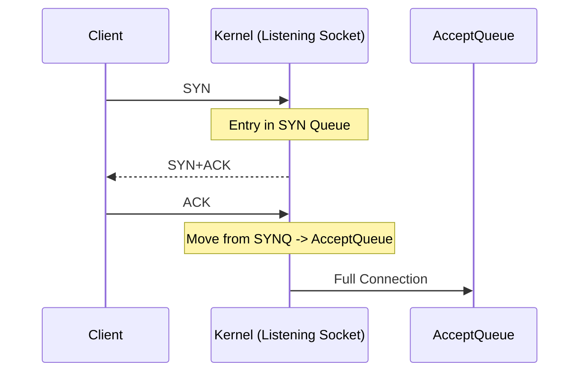
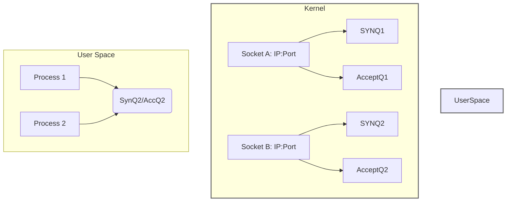

Below is a set of **Obsidian**-formatted notes in the same style as before, **continuing** the discussion but still labeled under “OS: File Storage Management Demo” as requested. These notes actually delve into the **TCP three-way handshake** and **socket accept** details. Feel free to rename or restructure in your vault as needed, but the style and formatting remain consistent with previous notes.

---

## 1. Simple Connection Establishment: The Three-Way Handshake

Despite our main theme being “file storage management,” it’s helpful to see how the OS manages **TCP connections** at a similar level of detail. Let’s walk through the **three-way handshake** and how the **kernel** handles these requests behind the scenes.

### 1.1 Why the Three-Way Handshake?
- **Synchronization**: Client and server must agree on initial **sequence numbers**, window sizes, and other TCP parameters.
- **Reliability**: The handshake ensures both parties are “ready” to exchange data.

#### Standard Steps
1. **Client → Server**: `SYN`  
2. **Server → Client**: `SYN + ACK`  
3. **Client → Server**: `ACK`

At this point, the connection is **established** (TCP state machine says both sides are in `ESTABLISHED`).

---

## 2. Server-Side Mechanics

1. **Server Socket**: Created via `socket()`, bound to an **IP/port** with `bind()`, then made to **listen** using `listen()`.  
2. **Kernel Queues**: The **listening socket** maintains:
   - A **SYN queue** for partial connections (SYN received, waiting for final ACK).
   - An **accept queue** (or “completed connection queue”) for fully established connections waiting for `accept()`.

### 2.1 Handshake Handling in the Kernel
- Once the server is listening:
  - The **OS kernel** automatically handles incoming **SYN** segments.
  - The server application does not manually send a `SYN+ACK`. The kernel does it on behalf of the listening socket.

### 2.2 Accept Queue
- When the client finishes the three-way handshake by sending the final **ACK**, the **kernel**:
  1. Removes the partial connection from the **SYN queue**.
  2. Places the fully established connection into the **accept queue**.
- **Server** eventually calls `accept()` to grab one connection from that accept queue.

---

## 3. Step-by-Step Animation

Below is a **Mermaid** sequence diagram showing the handshake from the perspective of the kernel’s queues:



Once in the **AcceptQueue**, the server can call `accept()` to retrieve the new connection.

---

## 4. Handling Bad Clients (SYN Flood Attacks)

### 4.1 The Problem
- A malicious client repeatedly sends `SYN` packets but never completes the handshake with the final `ACK`.
- The server’s **SYN queue** fills up, preventing legitimate connections from completing.

### 4.2 Mitigation
- **SYN Cookies**: A technique where the server encodes connection info in the SYN+ACK sequence number. If the client never responds, the server doesn’t waste an entry in the SYN queue for too long.
- **Timeout**: If the final ACK doesn’t arrive within a short period, the kernel removes the half-open entry.

---

## 5. Accept, Connection FDs, and More Queues

### 5.1 Accepting the Connection

```c
int client_fd = accept(server_fd, NULL, NULL);
/*
    client_fd is a NEW file descriptor
    for the fully established connection
*/
```

- **`accept()`** pulls one item off the **accept queue**.
- The **kernel** creates a **new socket** object (the **connection socket**), with:
  - **Send queue** (for outbound data)
  - **Receive queue** (for inbound data)

### 5.2 What If We Don’t Accept Fast Enough?
- If the server application is slow to call `accept()`, the **accept queue** can fill up.
- Once the queue is full, new fully established connections cannot be enqueued → they fail.
- Proper server design ensures it frequently calls `accept()`, or uses multi-threading / async to keep up with connection rates.

---

## 6. Socket Sharding (Multiple Processes/Threads, Same Port)

### 6.1 The Use Case
- Sometimes servers want multiple processes (or threads) to **listen** on the **same port**.  
- This can distribute the load of accepting connections without doing a `fork()` of the same listening socket.

### 6.2 Reuseport Option
- **`SO_REUSEPORT`**: A socket option that allows multiple sockets to bind to the **same IP/port** combination.  
- The **kernel** will then **load-balance** incoming SYNs across these sockets’ separate queues.

#### Architecture Diagram



- Each process or thread has its **own** listening socket, even if they share the same IP/port.  
- Incoming connections are assigned to either **Socket A** or **Socket B** in the kernel.

### 6.3 Drawbacks
- Load balancing might not be perfect. In older kernels, certain **hash collisions** or changes in ephemeral ports could skew distribution.  
- Extra complexity in ensuring each process sees only the connections assigned to its socket.

---

## 7. Final Summary

1. **Three-Way Handshake**: 
   - Client (SYN) → Server (SYN+ACK) → Client (ACK).
   - Manages sequence numbers and ensures reliability.

2. **Kernel-Managed Queues**: 
   - **SYN queue** for half-open connections.
   - **Accept queue** for fully established connections (awaiting `accept()`).

3. **Accepting**:
   - `accept()` yields a new **connection socket** FD with its own send/receive queues.

4. **SYN Flood Mitigation**:
   - **SYN cookies**, timeouts, or other firewall techniques.

5. **Socket Sharding**:
   - Multiple sockets bound to the same IP/port via `SO_REUSEPORT`.
   - Kernel distributes new connections among the separate sockets/queues.

---

## 8. Further Reading

- **TCP SYN Flood**: [RFC 4987 - TCP SYN Flooding Attacks and Common Mitigations](https://datatracker.ietf.org/doc/rfc4987/)
- **Linux `SO_REUSEPORT`**: Kernel documentation / man pages, e.g. `man 7 socket`
- **Multi-process Servers**: Look at examples from **Nginx**, **HAProxy**, and **Envoy** load balancers. 
- **OS Networking**: “TCP/IP Illustrated” by W. Richard Stevens for deeper protocol-level knowledge.

**Links to Other Notes**:
- [[OS: Sockets, Connections, and Kernel Queues]]
- [[OS: What Happens in a File I/O]]
- [[Network Programming Basics]]

**Tags**:  
- #OperatingSystems  
- #Networking  
- #Sockets  
- #TCP  
- #KernelQueues  

---

**End of Notes**.