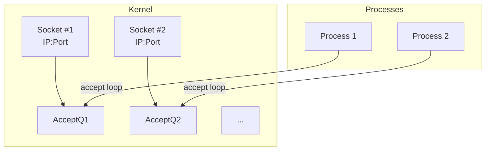

Below are **Obsidian**-formatted notes titled “OS: Socket Programming Patterns,” integrating knowledge from operating systems, concurrency, and backend design. They explore various ways to structure acceptors, listeners, readers, and worker threads/processes. Feel free to copy/paste into your Obsidian vault.
## 1. Overview

Once you understand **socket I/O** at the OS level—listening, accepting, reading, writing—you can assemble different **architectural patterns** to handle large numbers of connections, concurrency, and CPU-bound workloads. These patterns revolve around:

1. **The Listener**: Binds to an IP:port, calls `listen()`.
2. **The Acceptor**: Repeatedly calls `accept()` to create connection sockets.
3. **The Reader / Writer**: Performs `read()` / `write()` on each connection.
4. **Processors / Workers**: Execute application logic once data is parsed (may happen in the same thread or separate threads/processes).

Below, we’ll examine several patterns you might see in **Node.js**, **Nginx**, **memcached**, or custom designs.

---

## 2. Basic Concepts Review

### 2.1 The Listener
- Created by `socket()`, `bind()`, and `listen()`.
- Holds a **listening socket** with **SYN queue** and **accept queue** at the kernel level.

### 2.2 Accepting Connections
- A call to `accept()` returns a new file descriptor for each fully established connection.  
- In multi-threaded or multi-process environments, multiple acceptors may share the same listening socket, or each may have its **own** socket (via `SO_REUSEPORT`).

### 2.3 Reading/Writing
- Each connection’s **send buffer** and **receive buffer** exist in kernel space.  
- The application calls `read()` or `recv()` to move data to user space, and `write()` or `send()` to queue data for transmission.

### 2.4 Worker Processes or Threads
- Once data is in user space, you might parse application protocols (HTTP, custom binary protocols) and pass the request to a **worker** for actual processing or DB queries.

---

## 3. Single-Threaded Acceptor & Processing (Node.js Model)

**Node.js** follows a **single-threaded** approach at the JavaScript level:

1. **One Listener**: A socket bound to the port (e.g., 8080).
2. **One Thread** that:
   - Calls `accept()`.
   - Reads incoming data (the request), possibly using **non-blocking** I/O via **libuv** under the hood.
   - Parses the protocol (HTTP, WebSockets, etc.).
   - Executes user JavaScript callbacks to handle the request.
   - Writes back any responses.

**Pros**:
- Simplicity of code (no explicit threading in user code).
- Good for many I/O-bound workloads.

**Cons**:
- A single thread can become a bottleneck for CPU-bound tasks (though Node can spawn “worker threads” or child processes if needed).

#### Simple Diagram
```mermaid
flowchart TB
    A[Node.js Single Thread] -->|listen(port)| B[Listening Socket]
    B -->|accept() loop| C[Connection FDs]
    C -->|read/parse/exec| A
    A -->|write response| C
```

---

## 4. Single Listener, Multi-Thread Reader/Worker (e.g., memcached)

### 4.1 How It Works
- **One** socket is created by the main process (listener).
- **One** thread handles `accept()` calls, distributing each new connection FD to a **thread pool**.
- Each thread in the pool handles **read** + **write** calls for the assigned connection(s) and performs the protocol logic.

**Pros**:
- Parallel handling of CPU-bound tasks.
- Reduced complexity vs. spawning a process per connection.

**Cons**:
- All accept calls funnel through **one** acceptor → potential lock contention on the accept queue.
- Must handle concurrency (shared data structures) with synchronization or lock-free techniques.

---

## 5. Single Listener, Multiple Processes (Nginx “worker_processes”)

### 5.1 Approach
- **Nginx** typically **forks** multiple worker processes after creating the single listening socket in a master process.  
- **All** workers can call `accept()` on the same socket. The kernel coordinates who gets the next connection.  
- Each worker also reads/writes and processes requests (parses HTTP, etc.).

#### The Mutex Issue
- Accessing the **accept queue** generally requires a mutex in the kernel. Only one worker can succeed with `accept()` at a time. Others block momentarily.

**Pros**:
- Each worker is an isolated process, providing fault isolation.
- Good concurrency on multi-core systems.

**Cons**:
- Lock contention if many workers contending for `accept()`.
- More overhead than threads if you share memory or caches.

---

## 6. Multiple Listeners (Sharding) with `SO_REUSEPORT`

### 6.1 The Idea
- **Each** process (or thread) creates its **own** listening socket on the **same** IP:port, using `setsockopt(SO_REUSEPORT)`.  
- The kernel **load-balances** incoming connections among these sockets.

### 6.2 Benefits
- Each listener has its **own** accept queue → no single accept queue lock.  
- Massive concurrency for high-traffic servers (e.g., **Cloudflare** uses this approach for DDoS resilience).

### 6.3 Diagram



When SYN arrives, the kernel chooses which socket’s queue to place the connection in (based on hashing, flow, etc.).

---

## 7. Breaking Down Processing Stages

### 7.1 Decomposing Tasks
Once you’ve **accepted** a connection and read data, you might need:
1. **Parse** the protocol (HTTP, SSH, custom).
2. **Decrypt** or **Encrypt** if TLS/SSL is used.
3. **Authenticate** or apply business logic.
4. **Store** or **retrieve** data from DB or cache.

These can be separate modules, threads, or even microservices, depending on scale and design.

### 7.2 Offloading Encryption
- SSL/TLS can be offloaded to **hardware accelerators** or dedicated processes if CPU usage is high.  
- Alternatively, in advanced architectures, you might use **kTLS** for in-kernel TLS encryption to avoid extra copies.

### 7.3 Worker Pools
- A typical approach: “**accept** → **read** (plus parse) → **enqueue** a job → **worker pool** picks up the job → does CPU-bound task → writes back.”  
- Eases concurrency by decoupling I/O from CPU tasks.

---

## 8. Putting It All Together: Examples

1. **Node.js**:  
   - Single thread does everything: accept, read, parse, handle logic.  
   - Great for I/O-bound tasks with short CPU usage.

2. **memcached**:  
   - Single main process with listener; multi-threaded approach for concurrency. Each thread handles read/write, parse the memcached protocol, does set/get operations, returns results.

3. **Nginx**:  
   - Master process binds the socket, forks multiple worker processes.  
   - Each worker calls `accept()`.  
   - The kernel ensures only one worker successfully accepts at a time.

4. **SO_REUSEPORT (Envoy, Cloudflare)**:  
   - Each worker has **its own** socket, all bound to the **same** IP:port.  
   - Kernel distributes new connections among them → no accept lock.

5. **Dedicated SSL Terminator**:  
   - A separate process or hardware module to handle encryption/decryption.  
   - The plaintext data is then forwarded to the “real” application for parsing/logic.

---

## 9. Conclusion & Best Practices

- **Choose** a pattern that matches your **traffic** and **workload**:
  - Single-thread loop (like Node.js) for simplicity and high concurrency in I/O-bound scenarios.
  - Multi-process/multi-thread for CPU-heavy tasks or stronger fault isolation.
  - `SO_REUSEPORT` for extremely high connection rates needing minimal contention on accept.
- **Be mindful** of **locking** (accept queue or shared data).
- **Offload** tasks like encryption or big data parsing if that’s a bottleneck.
- **Profile** and measure under real workloads before finalizing your design.

---

## 10. Further Reading

- **Nginx Architecture**: [https://www.nginx.com/resources/wiki/start/topics/tutorials/understanding_nginx_process_model/](https://www.nginx.com/resources/wiki/start/topics/tutorials/understanding_nginx_process_model/)  
- **Node.js libuv**: [https://nodejs.org/en/docs/guides/blocking-vs-non-blocking/](https://nodejs.org/en/docs/guides/blocking-vs-non-blocking/)  
- **memcached**: Concurrency explained in source code docs or [memcached.org](https://memcached.org/).  
- **SO_REUSEPORT**: Kernel docs, e.g. `man 7 socket`, searching for “Reuseport.”

**Links to Other Notes**:
- [[OS: Sending and Receiving Data]]
- [[OS: Sockets, Connections, and Kernel Queues]]
- [[OS: File Storage Management Demo]]
- [[Network Programming Basics]]

**Tags**:
- #OperatingSystems  
- #Sockets  
- #BackendDesign  
- #Concurrency  
- #ServerArchitectures  

---

**End of Notes**.