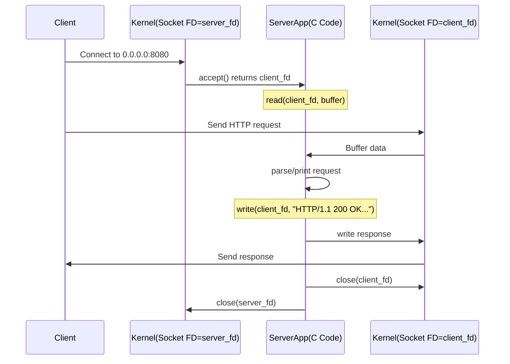

Below is an **Obsidian**-formatted note set titled “OS: Socket Management Demo,” suitable for a **PhD-level engineer**. The notes showcase building a small C-based web server from scratch, highlighting socket creation, binding, listening, and accepting connections. Code snippets, diagrams, tables, and extended commentary are included. Feel free to copy/paste into your Obsidian vault.

In this demo (originally part of a backend performance course), we build a **barebones web server** in pure C. We’ll see:

1. How to **create** a socket.
2. How to **bind** it to a port (and IP address).
3. How to **listen** for incoming connections.
4. How to **accept** a connection and **read** data from it.
5. How to **send** a response back to the client.

By examining system calls (`socket()`, `bind()`, `listen()`, `accept()`, `read()`, `write()`), we can see how typical web frameworks (Node.js, Flask, etc.) operate at a lower level.

---

## 1. Prerequisites

- **C compiler** (GCC or Clang).
- **Basic C knowledge** (but we will explain line by line).
- **Visual Studio Code** or another IDE (optional).
- **Linux**/macOS environment or **Windows** with WSL for Unix socket APIs.

> **Note**: Windows native APIs differ (`winsock2.h`), but similar principles apply.

---

## 2. Project Setup

1. **Create a folder** for the project, e.g. `c-web-server/`.
2. **Inside**, create a file named `c_web_server.c`.
3. **(Optional)** Use an editor like **VSCode** with C/C++ extensions for IntelliSense and debugging.

---

## 3. Skeleton Code

Below is a *minimal* C program that prints “Hello, World” to verify our environment:

```c
#include <stdio.h>

int main() {
    printf("Hello, World!\n");
    return 0;
}
```

- Compile with `gcc c_web_server.c -o c_web_server`
- Run `./c_web_server` → prints `Hello, World!`

Now we’ll expand this into a **listening** server.

---

## 4. Detailed Socket Server Code

Below is a more **complete** snippet showing:
1. **Headers** for socket functions.
2. **Global constants** for buffer size and port.
3. Creation of a listening socket.
4. Binding to `0.0.0.0` on port `8080`.
5. Accepting a single connection, reading a request, sending a response, and closing.

```c
#include <stdio.h>      // For printf, etc.
#include <stdlib.h>     // For exit(), EXIT_FAILURE, etc.
#include <string.h>     // For memset(), strcpy(), etc.
#include <unistd.h>     // For close(), read(), write(), etc.
#include <sys/socket.h> // For socket(), bind(), listen(), accept()
#include <netinet/in.h> // For struct sockaddr_in
#include <arpa/inet.h>  // For htonl(), htons(), etc.

#define MAX_BUFFER 1024
#define PORT 8080

int main() {
    // 1) Create a server socket file descriptor
    int server_fd = socket(AF_INET, SOCK_STREAM, 0);
    if (server_fd < 0) {
        perror("socket creation failed");
        exit(EXIT_FAILURE);
    }

    // 2) Define the server address struct
    struct sockaddr_in server_addr;
    memset(&server_addr, 0, sizeof(server_addr));

    server_addr.sin_family = AF_INET;
    server_addr.sin_addr.s_addr = htonl(INADDR_ANY); // 0.0.0.0
    server_addr.sin_port = htons(PORT);

    // 3) Bind the socket to our specified IP and port
    if (bind(server_fd, (struct sockaddr*)&server_addr, sizeof(server_addr)) < 0) {
        perror("bind failed");
        close(server_fd);
        exit(EXIT_FAILURE);
    }

    // 4) Listen for incoming connections
    if (listen(server_fd, 10) < 0) {
        perror("listen failed");
        close(server_fd);
        exit(EXIT_FAILURE);
    }
    printf("Listening on port %d...\n", PORT);

    // 5) Accept a single connection (blocking call)
    struct sockaddr_in client_addr;
    socklen_t client_len = sizeof(client_addr);
    int client_fd = accept(server_fd, (struct sockaddr*)&client_addr, &client_len);
    if (client_fd < 0) {
        perror("accept failed");
        close(server_fd);
        exit(EXIT_FAILURE);
    }
    printf("Connection accepted!\n");

    // 6) Receive data from client
    char buffer[MAX_BUFFER];
    memset(buffer, 0, MAX_BUFFER);
    ssize_t bytes_read = read(client_fd, buffer, MAX_BUFFER - 1);
    if (bytes_read < 0) {
        perror("read failed");
    } else {
        printf("Received %zd bytes: %s\n", bytes_read, buffer);
    }

    // 7) Send a simple HTTP response
    const char* http_response =
        "HTTP/1.1 200 OK\r\n"
        "Content-Type: text/plain\r\n"
        "Content-Length: 13\r\n"
        "\r\n"
        "Hello, World!";
    write(client_fd, http_response, strlen(http_response));

    // 8) Close client connection
    close(client_fd);
    // 9) Close server socket
    close(server_fd);

    return 0;
}
```

### Explanation

1. **`socket(AF_INET, SOCK_STREAM, 0)`**:  
   - **`AF_INET`**: IPv4.  
   - **`SOCK_STREAM`**: TCP (connection-based).
   - **`protocol=0`**: Let kernel pick the default (TCP).

2. **Bind**:
   - We set `server_addr.sin_addr.s_addr = htonl(INADDR_ANY)` → listens on `0.0.0.0` (all interfaces).
   - `server_addr.sin_port = htons(PORT)` → host-to-network byte order for the port.  
   - `bind()` associates the socket with that IP:port.

3. **`listen(server_fd, 10)`**: Tells the kernel we want to accept connections. The **second argument (10)** is the **backlog**, the max completed connections queued.

4. **`accept()`**:
   - Blocks until a **new TCP connection** arrives.  
   - Returns a **new file descriptor** (`client_fd`) specific to that connection.

5. **`read()`** and **`write()`**:
   - We read up to `MAX_BUFFER-1` bytes from `client_fd`.  
   - Then we write back a simple HTTP response.

6. **Close**:
   - `close(client_fd)` ends the connection.  
   - `close(server_fd)` shuts down the listening socket.

---

## 5. Visual Diagram of the Flow



---

## 6. Testing the Web Server

1. **Compile**: `gcc c_web_server.c -o c_web_server`
2. **Run**: `./c_web_server`
   - You’ll see `Listening on port 8080...`.
3. **Open another terminal**:
   - `curl http://localhost:8080/`
   - Should see `Hello, World!`  
   - Server console logs `Connection accepted!` and prints the HTTP request from `curl`.

---

## 7. Observing System Calls

### 7.1 Using `strace` on Linux

```bash
strace -f -e trace=network ./c_web_server
```
- `-f` follows child processes if any.
- `-e trace=network` filters to show only network-related syscalls.
- You’ll see calls like:  
  - `socket(AF_INET, SOCK_STREAM, IPPROTO_IP) = 3`
  - `bind(3, {sa_family=AF_INET, sin_port=htons(8080), ...}`
  - `listen(3, 10)`
  - `accept(3, ...) = 4`
  - `read(4, ...)`
  - `write(4, ...)`
  - `close(4)`, `close(3)`

This is exactly how typical web servers handle connections under the hood.

---

## 8. Demonstration for Performance / Bottlenecks

1. **Slow Request Reading**: We could introduce `sleep()` calls after `accept()` to emulate an application that does not promptly call `read()`.
2. **Slow Connection Acceptance**: We could avoid calling `accept()` for a while, filling the **accept queue**. New connections might get blocked or dropped.
3. **Slow Processing**: Insert large CPU-bound loops or `sleep()` after reading the request.
4. **Slow Response**: Insert partial writes with `write()` calls followed by sleeps.

By combining these experiments, we can see how back-end bottlenecks manifest at different stages (accept, read, process, write).

---

## 9. Summary

- We built a **minimal** single-connection server in C, showing the **low-level** operations behind typical frameworks.  
- The code demonstrates **`socket()`, `bind()`, `listen()`, `accept()`, `read()`, `write()`, `close()`**.  
- We can expand the same code to handle multiple concurrent connections (multi-thread, `fork()`, `epoll` approach, or a loop), but this sample suffices to illustrate the fundamentals.  
- Observing syscalls with **`strace`** reveals how the OS actually handles networking at the kernel level.

---

## 10. Further Reading

- **Beej’s Guide to Network Programming**: [https://beej.us/guide/bgnet/](https://beej.us/guide/bgnet/) (detailed C socket examples).
- **man 2 socket**, **man 2 bind**, **man 2 listen**, **man 2 accept** for Linux/BSD.  
- **UNIX Network Programming** by W. Richard Stevens (classic reference).
- **Asynchronous Patterns**: For advanced concurrency, see [OS: Async I/O](#) notes referencing epoll, io_uring, etc.

---

### Links to Other Notes

- [[OS: Sockets, Connections, and Kernel Queues]]  
- [[OS: Sending and Receiving Data]]  
- [[OS: Async IO]]  

**Tags**:  
- #OperatingSystems  
- #Sockets  
- #CProgramming  
- #ServerDemo  
- #Networking  

---

**End of Notes**.