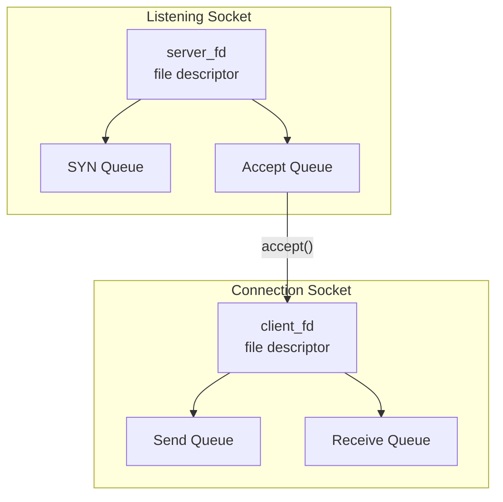
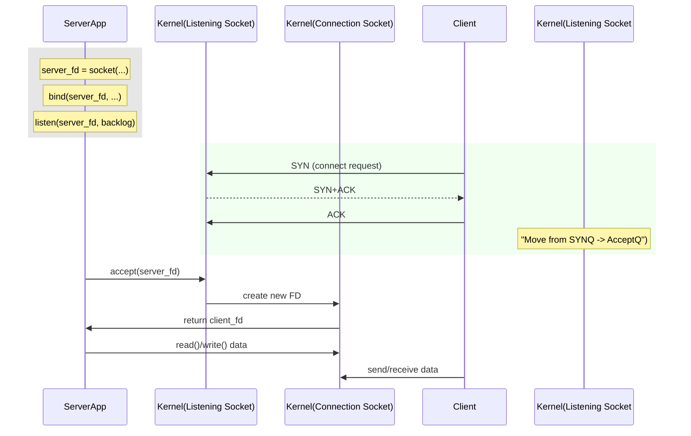

Below is a set of **Obsidian**-formatted notes titled “OS: Sockets, Connections, and Kernel Queues.” These notes walk through the core concepts of **listening sockets**, **TCP connection establishment**, and **kernel data structures** (the SYN queue, accept queue, etc.) used in modern operating systems (focusing on Linux). These notes also include **examples**, **code snippets**, and **visualizations** (via Mermaid diagrams). Feel free to copy/paste them into your Obsidian vault or another Markdown editor.

In this segment, we’ll dig into **TCP/IP** from an operating system’s perspective—focusing on *listening sockets*, *connection sockets*, and the kernel’s internal **queues** that track connection states. We’ll show how a simple *listen-accept* workflow actually interacts with complex kernel data structures.

---

## 1. Overview

1. **Socket**: In Linux, a socket is represented internally by a **`struct socket`** (in kernel space) and is exposed to user space as a **file descriptor** (because “everything is a file” in Unix-like systems).
2. **Listening Socket**: Created by binding to an **IP + port**, then calling `listen()`. This socket has **queues** to track incoming connection states.
3. **Connection Socket**: A **fully established** TCP connection also appears as a file descriptor in the server’s process after an `accept()` call. It has send/receive queues for data.

**Note**: On Windows, sockets are managed by a different subsystem (WinSock) and are not “file descriptors,” but conceptually they’re very similar (handles, kernel objects, etc.).

---

## 2. Listening Socket Lifecycle

### 2.1 Bind and Listen
1. **Bind**: The server chooses an **IP address** (or “all interfaces” 0.0.0.0) and a **TCP port** (e.g., 8080).  
2. **Listen**: Transitions the socket into a passive listening state.

#### Pseudo-C Example
```c
#include <sys/types.h>
#include <sys/socket.h>
#include <netinet/in.h>
#include <unistd.h>
#include <stdio.h>

int main() {
    int server_fd = socket(AF_INET, SOCK_STREAM, 0); // IPv4, TCP
    struct sockaddr_in serv_addr;
    
    serv_addr.sin_family = AF_INET;
    serv_addr.sin_port = htons(8080);        // port 8080
    serv_addr.sin_addr.s_addr = INADDR_ANY;  // 0.0.0.0 (all interfaces)

    bind(server_fd, (struct sockaddr *)&serv_addr, sizeof(serv_addr));
    
    // Listen with backlog=128
    listen(server_fd, 128); 

    // At this point, we have a "listening socket".
    // More logic goes here...
    
    close(server_fd);
    return 0;
}
```

### 2.2 The Kernel Data Structures for Listening
When you call `listen(server_fd, backlog)`, the kernel creates **two** important queues (conceptually) associated with this **listening socket**:

1. **SYN Queue** (aka *incomplete connection queue*):
   - Holds entries for **in-progress** handshake attempts (i.e., after receiving a TCP SYN).
   - Once the 3-way handshake completes, the connection moves from the SYN queue to the accept queue.

2. **Accept Queue** (aka *completed connection queue*):
   - Stores **fully established** connections waiting for the application to call `accept()`.
   - Also limited in size by `backlog`. Once it’s full, new fully established connections might be dropped or refused.

> **Implementation detail**: Internally, Linux doesn’t necessarily use a naive “queue” data structure; it might be a more optimized structure (e.g., hashed or specialized lists). But conceptually, we talk about them as queues.

### 2.3 Backlog
- The **backlog** parameter (128 in our example) effectively caps how many **incomplete** + **complete** connections can be enqueued before being accepted.
- If too many incoming connections arrive, the OS may drop new connections or send RST (reset).

---

## 3. Connection Establishment (Server Side)

Below is a **Mermaid** diagram illustrating how incoming connections transition from the SYN queue to the accept queue, and ultimately to user space via `accept()`.

```mermaid
flowchart LR
    A[SYN arrives<br>(client -> server)] --> B[SYN Queue]
    B --3-way handshake complete--> C[Accept Queue]
    C --Application calls accept()--> D[New Socket<br>FD in user space]
```

1. **SYN arrives** from a client. The kernel places an entry in the **SYN queue**.  
2. The kernel sends **SYN-ACK**, then waits for the final **ACK** from the client.  
3. Once the client’s ACK is received, the connection is **fully established** → moved to **Accept Queue**.  
4. When the application calls `accept()`, the kernel **removes** one connection from the accept queue and returns a **new socket FD** bound to that client-server pair.

---

## 4. Accepting Connections and Connection Socket

### 4.1 Accept Call

**Server code** snippet:
```c
int client_fd = accept(server_fd, NULL, NULL);
// client_fd is a NEW FD representing the actual connection.
```

- **`client_fd`**: A new file descriptor referencing a **connection socket**.  
- This new socket has its own **send queue** and **receive queue** (not to be confused with the listening socket’s SYN/accept queue).

### 4.2 Connection Socket Internals
A **connection socket** tracks:
- **Local IP & Port** (server side)
- **Remote IP & Port** (client side)
- **Send Queue**: Outgoing data from server to client.
- **Receive Queue**: Incoming data from client to server.



After calling `accept()`, the **listening socket** remains open for further connections, while each **accepted** connection has a distinct FD.

---

## 5. The Role of IP + Port + Interface

1. **IP Address**: You can **bind** to a specific interface IP or `INADDR_ANY` (0.0.0.0) to listen on **all** interfaces.  
2. **Port**: The 16-bit port number (1–65535). Typically, 80 or 443 for HTTP/HTTPS.  
3. **Security Concern**: Listening on *all* interfaces can inadvertently expose your service to the public. This is often the cause of accidental data breaches (e.g., open MongoDB or Elasticsearch).

---

## 6. Forking and Socket Sharing

### 6.1 Inheriting File Descriptors
When a process **forks**, the child inherits all **file descriptors** from the parent. This includes:
- The **listening socket** FD
- Potentially any existing **connection** FDs

### 6.2 Multi-Process Servers
A classical design is:
1. **Parent** creates the listening socket.  
2. **Parent** calls `fork()` multiple times to create worker processes.  
3. **Each** child process can `accept()` on the same listening socket.  
4. The kernel load-balances incoming connections among these processes.

> This approach is common in older Apache HTTPD “prefork” mode, or other multi-process servers.

---

## 7. Sockets vs. Connections vs. File Descriptors

1. **Listening Socket**:  
   - 1 FD (server_fd)  
   - Has its own **SYN queue** and **accept queue**.

2. **Connection Socket**:  
   - Created per successful handshake.  
   - Each gets a **new FD** in the server process after `accept()`.  
   - Each has a **send queue** & **receive queue** for data.

3. **Socket == File**: In Linux, a socket is internally an inode-like structure. The process sees an integer FD pointing to that kernel object.

---

## 8. Putting It All Together

### Example Timeline



1. **Server** calls `listen()`: The **listening socket** is ready, complete with SYN and accept queues.  
2. **Client** attempts a **3-way handshake**. The partially established connection sits in the **SYN queue** until the handshake completes.  
3. Completed connection moves to the **accept queue**, awaiting `accept()`.  
4. **Server** calls `accept()`, creating a **new FD** (a “connection socket” with its own read/write queues).  
5. **Server & Client** exchange data using their respective connection sockets.

---

## 9. Quick Demo (Node.js Example)

Even in higher-level languages (like Node.js), the underlying mechanics are similar.

```js
const http = require('http');

const server = http.createServer((req, res) => {
  res.end("Hello from Node\n");
});

server.listen(8080, '127.0.0.1', () => {
  console.log("Server listening on 127.0.0.1:8080");
});
```

- **`server.listen(8080, '127.0.0.1')`**: Under the hood, Node calls:
  1. `socket(...)`
  2. `bind(...)` to IP 127.0.0.1:8080
  3. `listen(..., backlog=511 or so)`

When a client (browser) connects, the OS processes the handshake, places the connection in the accept queue, and Node eventually calls an internal `accept()` to create a new socket FD for that connection.

---

## 10. Key Takeaways

1. **Listening Socket** → has two main kernel queues: **SYN queue** and **accept queue**.  
2. **Connection Socket** → created upon a successful handshake and `accept()` call, each has its own send/receive queues.  
3. **Bind & Listen** → ties the server to a specific IP & port (or multiple interfaces).  
4. **File Descriptors** → Sockets are just special file descriptors in Unix. They can be inherited across `fork()`.  
5. **Backlog** → Limits how many incomplete + completed connections the kernel will hold before `accept()`.  
6. **Security** → Listening on all interfaces (`0.0.0.0`) might expose your service to the public. Always be aware of network interfaces in production environments.

---

## 11. Further Reading

- **TCP/IP Illustrated** by W. Richard Stevens – Detailed explanation of TCP handshake and socket internals.  
- **Linux Kernel Documentation**: [https://www.kernel.org/doc/Documentation/networking/](https://www.kernel.org/doc/Documentation/networking/)  
- **Man Pages**: `man 2 socket`, `man 2 bind`, `man 2 listen`, `man 2 accept`  
- **Beej’s Guide to Network Programming**: [https://beej.us/guide/bgnet/](https://beej.us/guide/bgnet/) – Great tutorial for sockets programming in C.  

**Links to Other Notes in Your Vault**:  
- [[OS: File Storage Management Demo]]  
- [[OS: What Happens in a File I/O]]  
- [[Network Programming: TCP vs UDP]]  

**Tags**:  
- #OperatingSystems  
- #Sockets  
- #Networking  
- #TCPIP  
- #LinuxKernel  

---

**End of Notes**.