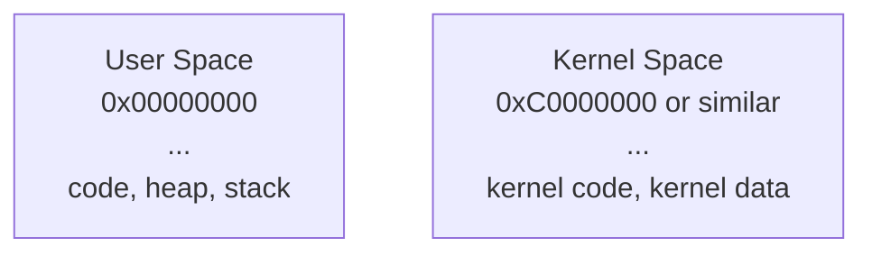
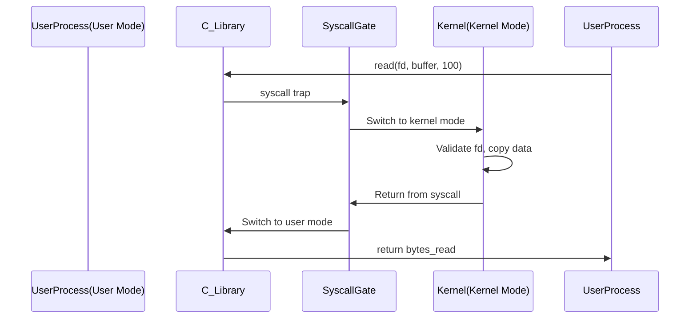

Below is a set of **Obsidian**-formatted notes for a **PhD-level engineer** titled **“OS: Kernel vs. User Space.”** These notes delve into how user-mode and kernel-mode operate, what happens during a mode switch, the cost of system calls, and how memory mapping differs in these two contexts. The explanations incorporate code snippets, diagrams, tables, and detailed commentary.
## 1. Overview

Modern operating systems, like Linux, Windows, and macOS, **separate** processes into two major execution levels:
1. **User Mode** (or **user space**): Where **applications** (processes) run with limited privileges.  
2. **Kernel Mode** (or **kernel space**): Where the **OS kernel** executes with full hardware access (managing memory, CPU, devices, etc.).

The CPU also supports this separation via **privilege levels** (e.g., **ring 0** for kernel mode, **ring 3** for user mode on x86). This distinction ensures robust **protection** and **isolation**: user processes cannot directly manipulate hardware or kernel data structures.

---

## 2. Memory Layout (User vs. Kernel)

### 2.1 Virtual Memory Mapping
Each process has its own **virtual address space**. Typically:



- The lower range of addresses is **user space** (e.g., 0x00000000 up to some cutoff).
- The **top** range is reserved for the **kernel**.
- When in **user mode**, the process can only access addresses in user space.  
- When in **kernel mode**, code can access **both** user-space addresses (if permitted) and kernel-space addresses.

On 64-bit systems, the actual boundary might be different (e.g., half or more of the virtual address space for kernel). But the concept remains: **one contiguous range** for user, another for kernel.

### 2.2 Page Tables and Protections
- The OS uses **page tables** to map virtual pages to physical frames.  
- **Kernel pages** are typically marked non-accessible from user mode.  
- Attempting to access kernel pages while in user mode triggers **protection faults**.

---

## 3. User Mode vs. Kernel Mode

### 3.1 CPU Privilege
- **User Mode**: Limited instructions. No direct hardware I/O. Certain CPU instructions (like enabling/disabling interrupts) are forbidden.  
- **Kernel Mode**: Highest privilege. Can manipulate hardware registers, memory management units (MMU), and more.

**Why?**: Protects system integrity. A buggy/malicious app in user mode can’t crash the whole system by scribbling over kernel data.

### 3.2 Mode Switch
- A **system call** or **interrupt** can trigger a switch **from** user mode **to** kernel mode.  
- The CPU must:
  1. Save relevant registers/program counter (PC).  
  2. Change the privilege level to kernel.  
  3. Jump to a predefined kernel routine (the syscall/interrupt handler).

**Returning** to user mode:
- The kernel routine finishes.  
- CPU restores saved registers/PC.  
- Lowers privilege and resumes user code.

**Overhead** arises from:
1. Saving/restoring CPU context.  
2. Possibly flushing TLB entries if address space changes.  
3. Security checks (valid system call number, etc.).

---

## 4. System Call Path (An Example)

Consider the **read()** call in C:

```c
ssize_t bytes = read(fd, buffer, 100);
```

**Steps**:

1. **User Mode**: Your process calls `read()`.  
2. **C Library** (glibc on Linux) sets up a **trap**/interrupt: e.g., `syscall` on x86_64 with the read system call number in registers.  
3. **Mode Switch**: CPU transitions to kernel mode, loading the kernel’s syscall handler address.  
4. **Kernel**:  
   - Looks up the `read()` handler in the syscall table.  
   - Checks if `fd` is valid, if `buffer` is a valid user address, etc.  
   - Copies data from the kernel’s **receive buffer** (if it’s a socket) or from a file cache into the user’s buffer.  
5. **Return**: Once done, the kernel updates CPU registers for return value and mode-switches back to user mode.  
6. **User Mode**: The `read()` function in libc returns to your code, with the number of bytes read.

**Diagram**:



---

## 5. Page Faults and Kernel Mode

### 5.1 Page Fault
Even outside explicit system calls, a **page fault** can push you into kernel mode:

- If the user process references an unmapped or swapped-out page, the CPU triggers a **fault** (interrupt).
- The OS kernel mode code resolves the fault by:
  - Checking if the address is valid.  
  - Possibly reading data from swap or loading a page from file.  
  - Updating page tables.  
- Then returns to user mode to retry the instruction.

**Each** page fault → mode switch overhead.

---

## 6. Performance: Cost of Mode Switches

### 6.1 Overheads
- **Register Save/Restore**: The CPU must save general-purpose registers, PC, flags, etc.  
- **Security Checking**: Validate system call numbers, user addresses, etc.  
- **Potential TLB impact**: Some architectures might partially flush TLB or reload entries upon switching.

**Time** can range from tens to hundreds of nanoseconds. In tight loops, these add up.

### 6.2 Minimizing Syscalls
High-performance servers or DBs often **batch** operations to reduce frequent kernel calls. E.g.:

- **`sendfile()`** merges read + write in one syscall.  
- **`epoll_wait()`** checks readiness of multiple FDs in one call.  
- **I/O Uring** (Linux) or **IOCP** (Windows) can reduce the frequency of user-kernel transitions.

---

## 7. Kernel vs. User Memory Access

### 7.1 Access Privileges
- **User Mode**: Only user-space addresses are accessible. Attempting to dereference a kernel pointer or device memory triggers a fault.  
- **Kernel Mode**: Can access kernel addresses freely, may also read/write user memory (e.g., copying data to/from user buffers) but must do checks (like `copy_from_user()` in Linux) to avoid unsafe pointers.

### 7.2 One or Multiple Address Spaces?
- Each process has **its own** user space, but the **kernel** is **shared** across processes.  
- **Linux**: The same kernel space is mapped into every process’s address space, but not accessible in user mode.

---

## 8. Is the Kernel a Separate Process?

### 8.1 Common Misconception
Some wonder if **kernel code** is a special process that we “context switch to.” Actually, a **syscall** does not do a full process switch. It stays **within the same process** but **elevates to kernel mode**.

**Contrast**:
- **Process Switch**: Entire CPU context, page directory pointer changes (if switching to another process).  
- **Mode Switch**: The same process, same memory mapping (with the addition of kernel addresses), just a privileged CPU state.  

---

## 9. Tables and Comparisons

| **Aspect**          | **User Mode**               | **Kernel Mode**                  |
|---------------------|-----------------------------|----------------------------------|
| **Privilege Level** | Restricted (cannot do I/O)  | Full (access hardware, MMU, etc.)|
| **Memory Access**   | Only user pages             | Kernel + optional user access    |
| **Trigger**         | Normal program instructions | Syscall / Interrupt / Fault      |
| **Exec. Context**   | Part of a user process      | Part of OS code, same process    |
| **Performance**     | Faster inside user loop     | Syscalls/faults cause overhead   |

---

## 10. Code Example: Checking a System Call Cost

You can measure the overhead of a simple kernel mode transition with C:

```c
#include <stdio.h>
#include <time.h>
#include <sys/time.h>
#include <unistd.h>

#define ITERATIONS 1000000

int main() {
    struct timespec start, end;
    clock_gettime(CLOCK_MONOTONIC, &start);

    for (int i = 0; i < ITERATIONS; i++) {
        // Do a trivial syscall, like getpid()
        getpid();
    }

    clock_gettime(CLOCK_MONOTONIC, &end);

    double duration = (end.tv_sec - start.tv_sec)
        + (end.tv_nsec - start.tv_nsec) / 1000000000.0;
    printf("Time for %d getpid() calls: %f seconds\n", ITERATIONS, duration);
    return 0;
}
```

- Dividing total time by `ITERATIONS` approximates cost per syscall. On modern CPUs, often **~100–300 ns** each.

---

## 11. Summary & Key Takeaways

1. **User Space**: Where regular apps run with restricted access. The process can’t see or touch kernel memory.  
2. **Kernel Space**: Full privilege code (the OS kernel), able to manage hardware and memory.  
3. **Mode Switch**: Required for system calls, interrupts, page faults—**same process** but higher privilege.  
4. **Performance**: Minimizing frequent mode switches can significantly boost efficiency.  
5. **Memory**: The OS enforces separate user + kernel address ranges for security and stability.  

**Understanding** the boundary and cost between user vs. kernel code is crucial for **performance tuning** and **OS design**.

---

## 12. Further Reading

- **Intel/AMD Manuals**: CPU privilege rings, interrupt gates.  
- **Linux Kernel** docs for in-depth coverage of system call handling (`Documentation/sysctl/`, etc.).  
- **W. Richard Stevens**, *“Advanced Programming in the UNIX Environment”*: Great coverage of user-kernel boundary for syscalls.  
- **Beej’s Guide** (networking) for a simpler approach to understanding syscalls (socket, read, etc.).  

**Links to Other Notes**:
- [[OS: Compilers and Linkers]]  
- [[OS: Sockets, Connections, and Kernel Queues]]  
- [[OS: Async IO]]  
- [[OS: File Storage Management Demo]]

**Tags**:
- #OperatingSystems  
- #KernelMode  
- #UserSpace  
- #Syscalls  
- #MemoryManagement  

---

**End of Notes**.