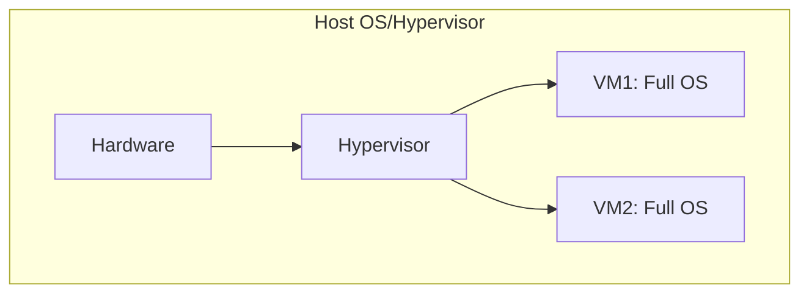
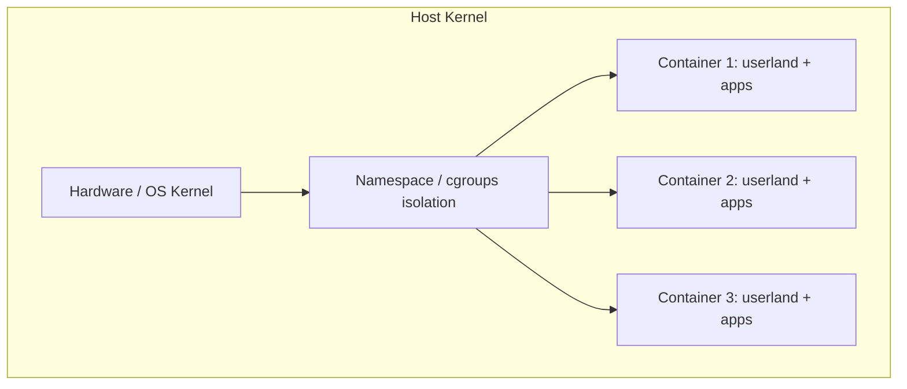

Below is a set of **Obsidian**-formatted notes for a **PhD-level engineer** on **“OS: Virtualization and Containerization.”** These notes give deep coverage of the rationale, mechanisms, and implementation details behind virtual machines and Linux containers (namespaces, cgroups). They include diagrams, tables, detailed explanations, and code examples where appropriated
## 1. Introduction

As modern computing needs expanded (multiple environments, isolated dependencies, multi-tenant cloud hosts), two primary **OS-level techniques** emerged:

1. **Virtual Machines (VMs)**: Running a **full OS** (kernel + user space) on top of a **hypervisor**, which itself runs on a host OS or directly on hardware.
2. **Containers**: Sharing the **host kernel**, but isolating processes via **namespaces** and **cgroups**.

**Goal**: Provide isolation (security, versioning) while efficiently using hardware.

---

## 2. Motivation

1. **Multiple OSes on One Physical Machine**:
   - Different OSes (Windows, Linux distros) or different versions (Node.js v14, v16, v18) on the same host.
   - Avoid conflicts (e.g., library or Python versions).
2. **Resource Isolation**:
   - Prevent one environment from hogging CPU/RAM or conflicting with others.
3. **Deployment Consistency**:
   - Ship self-contained “environments” (dev/test/prod) consistently.

### Old Approach: Multi-Boot
- Multiple partitions, each with a different OS.  
- Only **one** OS can be active at a time → not practical for concurrency or quick switching.

---

## 3. Virtual Machines (VMs)

### 3.1 Concept
A **hypervisor** (or **VMM**) runs on top of the host OS or hardware, exposing **virtual hardware** to each VM. Each VM runs a **full OS** (kernel + user space) believing it has full control.

**Diagram**:



- **Type 1 Hypervisor**: Runs directly on hardware (e.g., VMware ESXi, Microsoft Hyper-V).
- **Type 2 Hypervisor**: Runs as software on top of a host OS (e.g., VirtualBox, VMware Workstation).

### 3.2 How It Works
1. **Virtual CPU**: The hypervisor schedules each VM’s “CPU” onto real CPU cores.
2. **Virtual Memory**: Each VM sees a subset of physical memory. The hypervisor intercepts memory accesses, ensuring isolation.
3. **Virtual Devices**: The hypervisor emulates NICs, disks, etc. or passes them through.

**Pros**:
- **Strong isolation**: Each VM has a **full kernel** + OS.  
- **Flexibility**: Different OS types (Windows, Linux, etc.) simultaneously.

**Cons**:
- **Overhead**: Each VM loads a full OS stack. Larger memory footprint, extra CPU overhead from hypervisor context switches.

---

## 4. Containerization

### 4.1 Key Idea
Containers **share the host kernel**. Instead of multiple kernels, each container has **processes** with restricted views of the system via **namespaces** and resource throttling via **cgroups**.

**Diagram**:



**Example**: Docker, Podman, LXC. The container’s processes remain ordinary processes in the host kernel but with limited access.

### 4.2 Linux Namespaces
Linux introduced **namespaces** to isolate:

1. **Mount (mnt)**: Controls what file system mounts the container sees.  
2. **PID**: Each container sees a separate process ID space (PID 1 inside container might be PID 5001 on host).  
3. **Net**: Dedicated network stack (IP, port bindings).  
4. **UTS**: Hostname, domain name isolation.  
5. **IPC**: Inter-process communication (message queues, semaphores).  
6. **User**: User/group ID mappings.

By combining these namespaces, a container sees **only** its own mounts, network devices, processes, etc.

### 4.3 cgroups (Control Groups)
Manages **resource limits** and **accounting** for CPU, memory, I/O:

- **CPU** limit: e.g., 2 cores or 50% CPU time.  
- **Memory** limit: e.g., 1 GB max usage.  
- **I/O** bandwidth caps.  

The kernel ensures each container (or group of processes) cannot exceed configured resource shares.

**Together**, namespaces + cgroups → container tech like Docker.

---

## 5. Virtual Machines vs. Containers

| **Aspect**            | **Virtual Machines**               | **Containers**                                   |
|-----------------------|------------------------------------|-------------------------------------------------|
| **Kernel**            | Each VM has **own kernel**         | All containers **share host kernel**            |
| **Isolation**         | Very strong (hypervisor-level)     | Less overhead, but rely on host kernel security |
| **OS Overhead**       | Full OS in each VM                 | Minimal extra beyond userland + config          |
| **Startup**           | Slower (boot entire OS)            | Fast (spawn new processes in namespaces)        |
| **Memory Footprint**  | Larger (each OS kernel + userland) | Smaller (shared kernel)                         |
| **Use Cases**         | Multi-OS, strong isolation         | Microservices, ephemeral deployments, dev ops   |

---

## 6. Example: Docker

### 6.1 Docker Architecture
```mermaid
flowchart TB
    subgraph Host OS
    A[Linux Kernel with cgroups + namespaces]
    A --> B[Docker Daemon (container runtime)]
    B --> C[Container 1]
    B --> D[Container 2]
    end
```

1. **Docker Daemon** uses kernel APIs (namespaces, cgroups) to set up container isolation.  
2. **Images** define layered file systems (e.g., Ubuntu base, plus Node.js, plus app code).  
3. A container is launched as a **process** in a new set of namespaces, with limited resources from cgroups.

### 6.2 Dockerfile Example
```dockerfile
FROM ubuntu:20.04
RUN apt-get update && apt-get install -y nodejs
COPY myapp/ /app
WORKDIR /app
CMD ["node", "index.js"]
```
- **FROM**: Start with a base image (Ubuntu).
- **RUN**: Install Node.js (just modifies the image’s file system).
- **COPY**: Copy local files to `/app`.
- **CMD**: Default command when container starts.

When started:
```bash
docker run -p 3000:3000 my-ubuntu-node
```
- Creates new **namespaces** for PID, mount, net, etc.  
- Restricts resources if configured, e.g. `--memory 512m`.

---

## 7. Observing Container Namespaces on Linux

### 7.1 Checking Namespaces
```bash
# For a Docker container ID <CID>:
sudo lsns | grep <CID> 
```
- Shows assigned PID/mnt/UTS namespaces for that container.

### 7.2 Inspecting Cgroups
```bash
cat /sys/fs/cgroup/cpu/docker/<CID>/cpu.stat
```
- Reveals CPU usage stats under cgroups for that container.

---

## 8. Example Code / Syscalls for Namespaces

A more low-level approach can use **`unshare()`** in Linux to create new namespaces (without Docker):

```c
#include <sched.h>
#include <stdio.h>
#include <stdlib.h>
#include <unistd.h>
#include <sys/mount.h>

int main() {
    // Unshare PID and mount namespaces
    if (unshare(CLONE_NEWNS | CLONE_NEWPID) == -1) {
        perror("unshare");
        exit(EXIT_FAILURE);
    }
    // Now we can mount a new root, do chroot, etc.
    // Or fork() and the child sees a new PID 1 in this namespace.
    // ...
    return 0;
}
```

**This** is effectively how container runtimes under the hood manage namespaces.

---

## 9. Hybrid Approaches

### 9.1 Nested VMs and Containers
- Often, a cloud provider runs your “Docker container” inside a **VM**.  
- Each VM has a Linux kernel, and within that kernel, containers.  
- This ensures strong hardware-level isolation + efficient container workflow.

### 9.2 Windows Containers
- **Windows** can run Windows-based containers.  
- For Linux containers on Windows, typically a minimal Linux VM is used under the hood.

---

## 10. Summary & Key Takeaways

1. **Virtual Machines**: Each has a separate kernel, very strong isolation, but heavier resource usage.  
2. **Containers**: Share the host kernel, use **namespaces** + **cgroups** for isolation and resource limiting.  
3. **Namespaces** isolate file systems, processes, networks, etc. from the host.  
4. **cgroups** control CPU, memory, I/O consumption.  
5. **Docker** leverages these kernel features for fast, lightweight deployments.  
6. **Security**: Containers rely on kernel integrity; vulnerabilities in the shared kernel can impact all containers.

---

## 11. Further Reading

- **Linux Namespaces Documentation**: `/usr/src/linux/Documentation/namespaces/`  
- **Docker**: [https://docs.docker.com/](https://docs.docker.com/)  
- **LXC**: [https://linuxcontainers.org/](https://linuxcontainers.org/)  
- **Kubernetes**: Orchestrates containers across clusters, building upon Docker/CRIO.  
- **Advanced**: Look into “gVisor” (sandboxing containers with user-space kernel in Go), “Firecracker” (microVMs for serverless).

**Links to Other Notes**:
- [[OS: Kernel vs. User space]]
- [[OS: Async IO]]
- [[OS: Socket Management Demo]]
- [[OS: Compilers and Linkers]]

**Tags**:
- #OperatingSystems  
- #VirtualMachines  
- #Containers  
- #Namespaces  
- #Cgroups  

---

**End of Notes**.