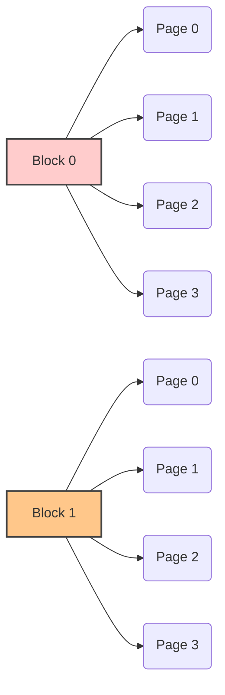

aliases: [HDD vs SSD, LBA, NAND]
tags: [storage, operating-systems, hardware, ssd, nand, hdd, blocks, pages]
## 1. Introduction
Hard disks (HDDs) are far from dead. Despite the proliferation of Solid State Drives (SSDs), we still use HDDs extensively for **long-term storage** because they provide large capacity at a lower cost per GB. Meanwhile, **SSDs** use NAND flash technology, which offers excellent performance but has different constraints. 

This note covers:
- Why HDDs are still relevant.
- How Logical Block Addressing (LBA) helps both HDDs and SSDs.
- Key concepts of NAND flash storage: pages, blocks, and the “no in-place update” rule.
- SSD complexities like wear leveling, garbage collection, and overprovisioning.

> **Note**  
> In Obsidian, you can break these sections into multiple files if you wish (one note per concept), but here they are collected in one place for clarity.

---
## 2. Why HDDs Are Still Around
1. **Long-Term Archival**: HDDs are excellent for cold or “long-lived” data storage.  
2. **Cost-Effectiveness**: $/GB for HDDs is still generally more attractive for large-scale storage.  
3. **Mechanical Evolution**: Even though HDD technology is mechanical (spinning platters, read/write heads), vendors introduced improvements like **Shingled Magnetic Recording (SMR)** to pack data more densely.  
4. **Logical Block Addressing (LBA)** works just fine for HDDs in a simpler manner. On HDDs, one can literally update data in-place if desired, because the geometry (cylinders, heads, sectors) is semi-static.

---

## 3. LBA (Logical Block Addressing)
Originally, HDDs had a physical addressing scheme involving **cylinders**, **tracks**, and **sectors**. Over time, that was abstracted into **LBA**:
- **LBA**: A contiguous numbering scheme from `0` to `N-1`, where each address represents a fixed-size block (often 512 bytes or 4 KB).
- **Independence from Physical Geometry**: LBA has **no direct relationship** with the physical layout (no cylinders or heads). This allows firmware/hardware to handle internal optimizations.
### 3.1 LBA for HDD
- **In-Place Updates**: On a traditional HDD, updating a sector for LBA #X usually writes to the same physical location. No extra remapping tables are strictly needed; the controller (or OS) can assume the LBA maps to a stable physical location.

### 3.2 LBA for SSD
- **Dynamic Mapping**: An SSD must maintain a *mapping table* (in DRAM on the SSD controller) that says “LBA #X → Physical Page #Y in NAND.”  
- **Frequent Remapping**: As data is updated, the mapping to that LBA can change because **no in-place update** is allowed in NAND.  

---

## 4. SSD Fundamentals and NAND Technology
### 4.1 NAND Flash Basics
- **Pages** and **Blocks**:  
  - **Page**: Smallest unit you can **read** or **write** (commonly 4 KB, 8 KB, or 16 KB in modern NAND).  
  - **Block**: A larger grouping of pages (e.g., could contain 64 to hundreds of pages). 
- **Erase Constraints**: You can only **erase** at block granularity (cannot erase a single page).
- **Write Constraints**: You must write (program) a **full page** at a time. You cannot partially write half a page.

### 4.2 Page vs. Block

- Each **Block** (A, B, etc.) has multiple **Pages**.  
- You can only erase blocks as a whole, and you must write a full page at a time.

> **Terminology Overload**  
> - *“Page”* might refer to an SSD NAND page, a database page, or an OS page.  
> - *“Block”* can mean a filesystem block, a memory block, or a NAND block.  

---

## 5. No In-Place Update in NAND
When you update data that already lives on a page:

1. **Invalidation**: The existing page is marked **invalid** (cannot be reused without erasing).
2. **Re-Write Elsewhere**: The updated data is written to a **new** page.
3. **Mapping Update**: The Flash Translation Layer (FTL) updates the LBA → new physical page mapping.

> **Why?**  
> Physically, once bits are written, you cannot simply flip them individually on NAND. You must erase the entire block. Hence the “out-of-place” updates.

### 5.1 Example Scenario
Imagine a simplified SSD with 8 pages total in 2 blocks:
```
Pages: A, B, C, D (in Block 0)
       E, F, G, H (in Block 1)
```
1. **Write LBA#1 → Page A**  
   - LBA#1 maps to physical page A.  

2. **Update LBA#1**  
   - The old page A becomes invalid.  
   - A new physical page (say B) is used to store updated content.  
   - LBA#1 now maps to page B.  

If you keep updating LBA#1 multiple times, pages A, B, C,... become invalid one by one. Eventually, the block gets full of invalid pages. To reuse them, the entire block must be erased.

---

## 6. Write Amplification & Garbage Collection

### 6.1 Write Amplification
**Write Amplification** = The phenomenon where the SSD must perform extra reads/writes/erases in the background to manage a simple user-level write.

For example, if you have no free pages in a block, but you want to write 4 KB more data, the SSD might:
1. Copy valid data out to a temporary location (overprovisioned area).  
2. Erase the entire block.  
3. Copy the valid data back, plus your new 4 KB.  

This process drastically increases internal write operations beyond the user’s single write request.

### 6.2 Garbage Collection (GC)
- The SSD periodically consolidates valid pages into fewer blocks and erases the now-fully-invalid blocks.  
- Helps free up new pages for future writes.  
- Typically scheduled by the SSD firmware; can lead to performance dips if triggered at inopportune times.

---

## 7. Wear Leveling & Overprovisioning

### 7.1 Wear Leveling
NAND cells have a limited number of **Program/Erase** (P/E) cycles. If you keep updating the *same* block, that block will die prematurely. Wear leveling strategies:
1. **Static Wear Leveling**: Move “cold” data around so that the entire SSD gets evenly worn.  
2. **Dynamic Wear Leveling**: As part of garbage collection, shuffle data so that no single block is overused.

### 7.2 Overprovisioning
SSDs reserve some portion of physical flash that the user *cannot* directly see. This space is used for:
- **Garbage Collection**  
- **Mapping Table**  
- **Relocating “cold” data** for wear leveling

Example: You buy a “256 GB” SSD, but the OS might see only ~240 GB of usable space. The remaining ~16 GB is for overprovisioning.

---

## 8. Defragmentation on SSDs
- **On HDDs**: Defragmentation is useful to store files contiguously on spinning platters, reducing head movement.  
- **On SSDs**: There is no mechanical head or rotational delay. Random read is almost as fast as sequential read.  
- Running defrag on an SSD can cause **unnecessary writes** (copying/moving data) and reduce its lifespan. Modern OS tools usually warn against defragmenting SSDs.

---

## 9. Practical Coding Example: Simulating an LBA to PBA Mapping
Below is a **pseudo-code** snippet that demonstrates a simplified approach to maintain LBA → PBA (physical block address) mapping in an SSD simulation.

```cpp
#include <iostream>
#include <unordered_map>
#include <vector>

// A simple simulation of NAND pages
struct Page {
    bool valid;
    int data;
};

// Simulation class
class SsdSimulation {
private:
    std::unordered_map<int, int> LBA_to_PBA; // LBA -> Page index
    std::vector<Page> pages;                 // Physical NAND pages
    int nextFreePage = 0;

public:
    SsdSimulation(int totalPages) {
        pages.resize(totalPages, {false, 0});
    }

    // Write data to an LBA
    void write(int lba, int dataValue) {
        // Mark old page invalid if it exists
        if(LBA_to_PBA.find(lba) != LBA_to_PBA.end()) {
            int oldPageIndex = LBA_to_PBA[lba];
            pages[oldPageIndex].valid = false; // Invalidate old page
        }

        // Find next free page
        if(nextFreePage >= pages.size()) {
            // In a real SSD: trigger GC, wear leveling, etc.
            std::cout << "No free pages left! Need GC.\n";
            // For simplicity, let's skip actual GC here.
            return;
        }

        // Program new page
        pages[nextFreePage].valid = true;
        pages[nextFreePage].data = dataValue;
        LBA_to_PBA[lba] = nextFreePage;
        nextFreePage++;
    }

    // Read data from an LBA
    int read(int lba) {
        if(LBA_to_PBA.find(lba) == LBA_to_PBA.end()) {
            std::cout << "LBA not found!\n";
            return -1; // or some error code
        }
        int pba = LBA_to_PBA[lba];
        if(!pages[pba].valid) {
            std::cout << "Page invalid!\n";
            return -1;
        }
        return pages[pba].data;
    }
};

int main() {
    SsdSimulation mySim(4); // only 4 physical pages

    // Write to LBA 0
    mySim.write(0, 100);
    // Update same LBA 0
    mySim.write(0, 200);

    // Read from LBA 0
    std::cout << "Read from LBA 0: " << mySim.read(0) << "\n";

    // Simulate running out of pages
    mySim.write(1, 300);
    mySim.write(2, 400);
    mySim.write(3, 500); // No free pages left here!
    return 0;
}
```
**Explanation**:
1. **`write(int lba, int dataValue)`**:
   - Invalidates old page if `lba` was previously used.
   - Checks if a free page is available.
   - Writes the data to a new physical page.
   - Updates the `LBA_to_PBA` mapping.
2. **`read(int lba)`**:
   - Retrieves the associated physical page (PBA).
   - Returns the stored data if the page is valid.

> This is a toy model, ignoring block-level erases, wear leveling, and garbage collection. Production SSD firmware is far more complex.

---

## 10. Summary
1. **HDD vs SSD**:  
   - HDD allows **in-place** updates, but is slower for random reads/writes.  
   - SSD uses NAND, is fast, but **no in-place** updates.  

2. **LBA**:  
   - Simplifies storage addressing for OS.  
   - On HDD, typically static mapping to physical location.  
   - On SSD, dynamic mapping needed (FTL) due to NAND constraints.  

3. **NAND Constraints**:  
   - Must write a **full page**.  
   - Must erase at **block** granularity.  
   - **Invalidation** of old pages → background operations like GC.  
   - **Limited** P/E cycles → wear leveling is crucial.  

4. **Wear Leveling & Overprovisioning**:  
   - Distribute writes uniformly to avoid wearing out a single block.  
   - Reserve capacity to help with GC and block erasures.  

5. **Defragmentation**:  
   - Great for HDDs but can shorten SSD lifespan if done unnecessarily.  

**Key Takeaway**: By abstracting everything behind LBAs, the OS sees a “simple block device,” but under the hood, SSD firmware juggles page- and block-level complexities, invalidation, garbage collection, and wear leveling to keep the device healthy and performant.

---

## 11. Further Reading
- [Understanding the Linux Virtual Memory System (4 KB pages)](https://www.kernel.org/doc/html/latest/vm/)
- [Flash Translation Layer (FTL) Basics](https://en.wikipedia.org/wiki/Flash_translation_layer)
- [Wear Leveling Techniques](https://en.wikipedia.org/wiki/Wear_leveling)
- [Shingled Magnetic Recording (SMR) HDDs](https://en.wikipedia.org/wiki/Shingled_magnetic_recording)

---

**End of Notes**  
Feel free to break this into multiple notes within Obsidian, adding your own tags, backlinks, and further references as needed.
```