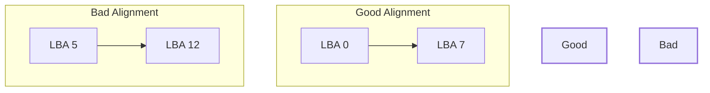

Below is a set of **Obsidian**-formatted notes titled “Operating Systems: File System Storage (Advanced Topics)” that continue the discussion from where we left off. These notes include detailed explanations, examples, code blocks, diagrams, and important considerations about page caching, fsync, partition alignment, and more. Feel free to copy/paste them into your Obsidian vault or any Markdown editor.
## 1. Blocks, Pages, and Cache
### Recap of Terms
- **Logical Sector (LBA)**: The smallest addressable unit exposed by the storage device (e.g., 512B or 4 KB).
- **Physical Sector (PBA)**: The real minimum write unit internally on the device (HDD/SSD). It can be equal to or larger than the LBA.
- **File System Block**: The chunk size at which the file system reads/writes (often 4 KB on Linux, but configurable). Must be a multiple of the LBA size.
- **Virtual Memory Page**: Typically 4 KB on many OSes (Linux, Windows, macOS).
**Key**: Mismatches between these sizes can cause **partial page writes**, **torn pages**, and suboptimal alignment.
---
## 2. Choosing a File System Block Size
When formatting a partition with a file system (like `ext4`, `xfs`, `btrfs`, etc.), you can often specify the **block size** (`-b` option in some `mkfs` tools). 
- **Linux Limitation**: The file system block size **cannot exceed** the OS virtual memory page size (commonly 4 KB).  
- **Why**: Because Linux’s page cache code gets complicated if the file system block is larger than the kernel page size.
### Example Relationship Diagram
Below is a **Mermaid** diagram showing possible relationships among sector sizes and file system block sizes:

```mermaid
flowchart TB
    A[LBA (512B)] --> B[File System Block (4 KB)]
    B --> C[Page Cache (4 KB page)]
    style A stroke:#6fa,stroke-width:2px
    style B stroke:#fa6,stroke-width:2px
    style C stroke:#6af,stroke-width:2px
```

- Each 4 KB **file system block** could comprise **8 LBAs** of 512B each.
- The kernel’s **page cache** is also at 4 KB granularity.

---
## 3. Partial (Torn) Page Writes

### Torn Page Scenario
A **torn page** or **partial write** can occur if the device’s physical write unit (e.g., 4 KB) is larger (or differently aligned) compared to the file system block or the portion of data being written. If a system crash/power loss happens mid-write:

- You might get half of the physical sector updated, the other half not updated → **corruption**.

**Databases** often handle torn page issues themselves by:
- **Checksums**: Each page has a checksum so the DB can detect partial writes.
- **Write-ahead Logging & Double-Writes**: Minimizing corruption risk.
- **Sync** (fsync) calls: Forcing durability at critical points.

---
## 4. Page Cache in Linux

### Overview
- The **page cache** stores disk blocks/pages in memory, avoiding slow re-reads from the physical disk.
- On **read**:
  1. Kernel checks page cache for the block.  
  2. If present (**cache hit**), return immediately to user space.
  3. If absent (**cache miss**), read from disk (LBA → device read), store in page cache, then return data.
- On **write**:
  1. Kernel writes data to page cache and marks it **dirty**.
  2. The OS later **flushes** dirty pages to disk (the exact timing is kernel-dependent).
### Advantages
- Speeds up repeated reads.
- Aggregates many small writes into fewer large writes (reducing disk wear and fragmentation).
### Disadvantages / Challenges
- **Data Loss on Crash**: If the system crashes before a dirty page is synced, data in that page is lost.
- **Inconsistent Latency**: Large flushes can cause performance spikes.
- **Databases** often bypass or carefully manage the page cache (using `O_DIRECT`, `fsync`, etc.) to ensure strong consistency.

---
## 5. `fsync` and Synchronization
- `fsync(fileDescriptor)`: Forces all dirty pages for that file to be written to disk, and also asks the **drive** to flush its internal cache.
- **Expensive Operation**: Repeated or excessive calls to `fsync` degrade performance.  
- **Real-World Example**: [Firefox 3 Bug Report](https://bugzilla.mozilla.org/show_bug.cgi?id=421482) (circa ~2008) indicated heavy `fsync` calls caused severe responsiveness issues.  
### Example with `strace`
```bash
strace -p <firefox_PID> 2>&1 | grep fsync
```
- Observed `fsync()` being called multiple times per page load, leading to massive I/O blocking.
### DB Configurations
- **MySQL (InnoDB)**: `innodb_flush_method` can be `fsync`, `O_DSYNC`, `O_DIRECT`, or combinations.
- **PostgreSQL**: `open_datasync`, `fdatasync`, `fsync`, `fsync_writethrough` are various flush modes, each with trade-offs for performance vs. data safety.
---
## 6. Partitioning & Alignment
### Partitions
- A single physical disk can be split into **multiple partitions**:  
  - e.g., `/dev/sda1`, `/dev/sda2`, `/dev/sda3`  
- Each partition is defined by **start LBA** and **end LBA** within the disk’s overall LBA range.  
- **Logical separation**: Each partition can be formatted with a **different file system** and **block size**.
### Alignment Matters
- **Misaligned partitions** cause partial writes crossing boundary lines:
  - You end up splitting a single file system block across two physical blocks → overhead, extra reads/writes, “write amplification.”
- **Best Practice**: Start partitions on boundaries **multiples** of the disk’s physical sector (e.g., multiples of 4 KB or 1 MB). Many modern partitioning tools (like `parted`) do this automatically.
#### Alignment Diagram

- **Good Alignment**: Partition starts at `LBA 0` (or another round multiple), so file system blocks align perfectly with physical sectors.  
- **Bad Alignment**: Partition starts at `LBA 5`, causing your file system blocks to straddle boundary lines, leading to more I/O.

---
## 7. File System Choice & Performance Pitfalls
### Example: Kafka on `ext4` vs. ZFS
- A user experienced 3-second latency spikes on `ext4` due to journaling + metadata flushing.
- Switching to **ZFS** reduced latencies to ~500 ms max. Possibly:
  - ZFS’s design with different journaling strategies or caching.  
  - `ext4` had overhead for the Kafka write pattern.

> **Lesson**: The **file system** can drastically affect performance depending on the **workload**.

---
## 8. Putting It All Together
### Key Takeaways
1. **Blocks Everywhere**  
   - Physical disk sectors, logical sectors (LBAs), file system blocks, and virtual memory pages must coordinate to avoid partial writes and performance hits.
2. **Page Cache**  
   - Speeds up reads and consolidates writes.  
   - Can cause data loss if the system crashes before flushing.  
   - `fsync` is the “emergency exit” for ensuring durability.
3. **Partition Alignment**  
   - Start partitions at multiples of the physical sector size or at a standard offset (like 1 MB).  
   - Avoid crossing boundaries that cause partial writes in a single file system block.
4. **File System Config**  
   - Choose a **block size** that complements your device’s physical geometry and your OS’s page size constraints.  
   - For large files or big disks, bigger blocks can help; for many small files, smaller blocks can reduce internal fragmentation.
5. **Performance Tuning**  
   - Databases often use `O_DIRECT` or carefully timed `fsync` to control write behavior.  
   - Overuse of `fsync` is a performance killer.  
   - Understanding your file system’s metadata journaling and flush mechanisms is crucial for high-performance or latency-sensitive workloads.

---
## 9. Example Commands & Further Exploration
### Viewing Partition Alignment
```bash
# parted example: unit in sectors, print partition start/end
sudo parted /dev/sda unit s print
```
Look for start/end sector boundaries. They should ideally match multiples of 2048 (commonly 1 MB boundaries) or the device’s physical block size.
### Formatting with a Custom Block Size
```bash
# Ext4 example with 1 KB block size (unusual but possible):
sudo mkfs.ext4 -b 1024 /dev/sda1

# Ext4 example with 4 KB block size (typical):
sudo mkfs.ext4 -b 4096 /dev/sda1
```
> Note: The block size cannot exceed the kernel’s page size on Linux.
### Checking Page Cache Usage
```bash
# Check memory usage, including page cache
free -h

# Or use 'vmstat' to see page in/out
vmstat 1
```
### Disabling/Enabling Write Caching on Disk
```bash
# hdparm on Linux (for certain HDD/SSD):
sudo hdparm -W0 /dev/sda   # disable write cache
sudo hdparm -W1 /dev/sda   # enable write cache
```
> **Warning**: Disabling write cache can drastically slow writes but may reduce risk of corruption on sudden power loss (unless the drive has capacitor/battery-backed cache).
---
## 10. Summary

- **File System Blocks** are allocated and managed via the **page cache** in modern OSes.  
- **Writes** are buffered in RAM (page cache) and flushed lazily to disk for performance, but with potential data-loss on power failure.  
- **Alignment** prevents partial writes crossing physical sector boundaries.  
- **Multiple Partitions** can each have distinct file systems and block sizes.  
- **Choosing** the right file system (ext4, XFS, ZFS, etc.), block size, and caching strategy is critical for optimal performance and reliability in real-world workloads.
---
### Further Reading / References
- **IBM Article on Partition Alignment**: [Aligning partitions for performance](https://www.ibm.com/developerworks/linux/library/l-4kb-sector-disks)
- **Firefox `fsync` Bug**: [Bug 421482 on Mozilla Bugzilla](https://bugzilla.mozilla.org/show_bug.cgi?id=421482)
- **PostgreSQL Tuning**: [PostgreSQL Documentation on WAL and Sync Methods](https://www.postgresql.org/docs/current/wal.html)
- **MySQL InnoDB Flush Methods**: [MySQL Docs - InnoDB flushing](https://dev.mysql.com/doc/refman/8.0/en/innodb-parameters.html#sysvar_innodb_flush_method)
- **ZFS vs. ext4 Discussion**: Commonly found on various Kafka/Hadoop/DBA performance blogs.

**Links to Other Notes in Your Vault**:
- [[Operating Systems: File System Internals]]
- [[Database Write-Ahead Logging and Fsync]]
- [[Kernel Page Cache vs. Buffer Cache]]

**Tags**:
- #OperatingSystems  
- #FileSystems  
- #PageCache  
- #Fsync  
- #Partitioning  
- #StorageAlignment  

---

**End of Notes**.