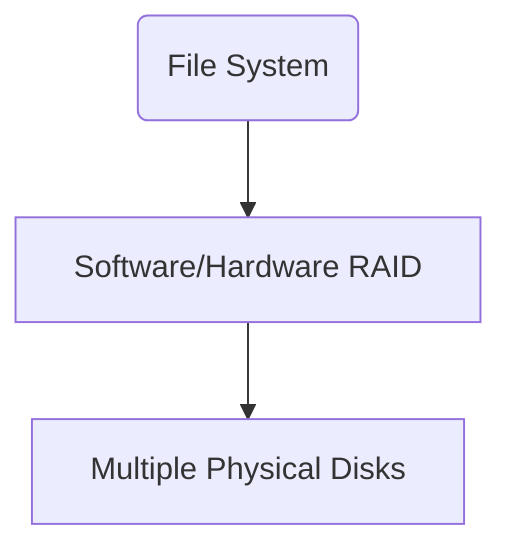

Below is a **continuation** of the “Operating Systems: File System Storage” lecture notes in the same style (detailed Obsidian-friendly Markdown with code, examples, and visualizations). These new sections expand on more advanced and related topics such as **journaling**, **crash consistency**, **RAID** basics, and an introduction to **networked/distributed storage** considerations. Feel free to integrate or reorganize them in your Obsidian vault as you see fit.
## 1. Journaling and Crash Consistency

### 1.1 The Need for Journaling
File systems must handle unexpected power loss, system crashes, or other failures gracefully. Without special care:
- A write might partially update metadata (e.g., directory entries, inodes), leaving the file system in an inconsistent state. 
- **Recovery** (on reboot) might require a full **fsck** (file system check), which can be slow on very large file systems.

**Journaling** addresses this by keeping a log of “intended writes”:
1. Changes are **recorded** in a special on-disk journal before they’re applied to the “real” file system structures.
2. In the event of a crash, upon reboot:
   - The file system replays (or rolls back) journal entries to bring the file system metadata to a consistent state.

### 1.2 How Journaling Works (High-Level)


1. **Write to Journal**: The file system first logs the intended metadata changes (e.g., new inodes, block allocation updates) to a special region on disk (the journal).
2. **Commit Journal Entry**: The changes in the journal are marked as committed.
3. **Flush Journal**: Ensures that the journal data is physically on disk.
4. **Apply Changes**: Eventually, the FS code updates the main structures (inodes, directory data, free block bitmaps, etc.) in place.

If a crash happens after step 3 but before step 4, the system can replay the **committed** changes from the journal. If it happens before step 3, the partial journal entry is ignored because it’s uncommitted, thus preserving consistency.

### 1.3 Types of Journaling

- **Metadata Journaling**: Only metadata changes (inodes, directories, bitmaps) are journaled. File data blocks themselves aren’t usually journaled, but an integrity check is still possible.
- **Full Journaling**: Both metadata **and** file data are written to the journal. More robust but also more I/O overhead.
- **Ordered Journaling**: Data blocks are forced to disk before their associated metadata is committed, ensuring references to new data blocks never point to garbage.

### 1.4 Common Journaling File Systems
- **ext3/ext4** (Linux): ext3 introduced journaling to the ext2 lineage, ext4 improved performance, uses `JBD2` (Journaling Block Device 2).
- **XFS** (Linux): High-performance 64-bit journaling file system, often used on servers.
- **JFS** (IBM’s Journaling File System).
- **ReiserFS** (less common today, but historically relevant).
- **NTFS** (Windows): Also uses a transaction logging system for metadata consistency.

---

## 2. Crash Consistency and Recovery

### 2.1 Crash Consistency

A file system is **crash-consistent** if, after a sudden failure (e.g., power loss), it can recover to a state without “contradictory” metadata. Journaling is one approach; **copy-on-write** (ZFS or btrfs) is another, where new versions of data and metadata are written to new locations rather than overwritten in place.

#### Example: ext4 “Ordered” Mode
1. Data blocks are written (and flushed) first.
2. Metadata references (pointers) to those new data blocks are journaled and committed second.
3. Guarantees that a pointer to data never points to junk.

### 2.2 Recovery Steps
- **Journaling**: On mount, the file system replays or discards incomplete transactions in the journal.
- **Non-journaling file systems** (FAT32, ext2): Must run an **fsck** to scan and fix inconsistencies. This can be slow on large disks.

---

## 3. RAID Basics (Redundant Array of Independent Disks)

Though not purely a “file system” feature, RAID is often used **under** file systems to improve performance or data reliability.

### 3.1 Why RAID?
- **Performance**: Striping data across multiple disks (RAID-0) can increase throughput.
- **Redundancy**: Mirroring or parity (RAID-1, RAID-5, RAID-6) protects against disk failures.
- **Common RAID Levels**:
  - **RAID-0 (Striping)**: No redundancy, improved performance.
  - **RAID-1 (Mirroring)**: Writes are duplicated on both disks; if one fails, the other is still good.
  - **RAID-5 (Striped Parity)**: Data is striped across multiple disks + parity blocks. Tolerates loss of **one** disk.
  - **RAID-6 (Double Parity)**: Tolerates loss of **two** disks.

### 3.2 File System on Top of RAID


- The file system sees one “logical volume” but physically, data is spread out or mirrored across disks. 
- Alignment issues still matter: if the RAID stripe size is 64 KB, for instance, you want your file system block layout to align well with that stripe.

---

## 4. Network/Distributed Storage (Brief Introduction)

While local file systems manage direct-attached storage (SATA, NVMe, etc.), many modern systems deal with **remote** or **distributed** storage:

1. **NFS** (Network File System): A protocol letting clients mount a remote server’s file system over the network.
2. **SMB/CIFS** (Server Message Block): Windows file sharing protocol, also widely used on Samba in Linux.
3. **Distributed File Systems**: 
   - **HDFS** (Hadoop Distributed File System)
   - **CephFS** (Ceph File System)
   - **GlusterFS**
   - **BeeGFS**, etc.

Each has unique consistency models and internal metadata management.  

**Key Concept**: Even though you “mount” these like normal file systems, the underlying storage is managed by a remote server or cluster. Performance depends heavily on network bandwidth and latency.

---

## 5. Advanced Topics / Tuning

### 5.1 Mount Options
Linux file systems have mount options (in `/etc/fstab` or via `mount -o option,… /dev/sdaX /mountpoint`):
- `noatime`, `nodiratime`: Avoid updating file/directory access times for read performance.
- `data=ordered` (ext4): Writes out data blocks first, then commits metadata. Default in ext4.
- `barrier=1` or `barrier=0`: Toggles write barriers, ensuring data flush to stable media for integrity.

### 5.2 Tuning the Journal
- `journal_size` (ext4, XFS): Larger journals can buffer more writes before forcing commits but use more disk space.
- `commit=N`: The interval (seconds) after which data must be written from the page cache to disk.

### 5.3 SSD-Specific Settings
- **TRIM/Discard**: Let the SSD know which blocks are free so it can manage wear leveling more effectively.
- **Alignment**: Still critical. 4 KB physical pages are common on SSDs, but internal page sizes can be larger. Ensuring partitions and file system blocks align to these boundaries prevents write amplification.

---

## 6. Practical Examples

### 6.1 Ext4 Journaling: Checking with `tune2fs`
```bash
# Check ext4 features, including journal size and more
sudo tune2fs -l /dev/sda1

# Example snippet from tune2fs output
Filesystem features:      has_journal ext_attr resize_inode dir_index filetype ...
Default mount options:    user_xattr acl
Journal inode:            8
Journal backup:           inode blocks
```
- **Journal inode**: The file system tracks the journal as a special inode.  
- **has_journal**: Confirms journaling is enabled.

### 6.2 Forcing a Journal Replay
```bash
# Unmount
sudo umount /dev/sda1
# Force fsck with journaling replay
sudo fsck.ext4 -f /dev/sda1
```
- Typically, the FS replays its journal automatically on mount, but you can enforce a check if needed.

---

## 7. Summary and Key Concepts

1. **Journaling** → Better crash resilience; minimal downtime. 
2. **Ordered, Write-Back, or Full** journaling modes → trade-offs in performance vs. data safety. 
3. **Crash Consistency** → Means no contradictory metadata after reboot; journaling or copy-on-write are common solutions. 
4. **RAID** → Used for redundancy or performance at the block level beneath the file system. Align your stripes and file system blocks for best performance. 
5. **Networked Storage** → Introduces additional layers of caching, potential latencies, and distributed consistency concerns. 
6. **Tuning** → A large area; includes mount options, journaling parameters, alignment, and more. Real-world performance can vary drastically with different workloads (DBs, streaming, small files, large files, etc.).

---

## Further Reading

- **ext4 Documentation**: [Kernel.org ext4 documentation](https://www.kernel.org/doc/html/latest/filesystems/ext4/index.html)  
- **XFS**: [XFS documentation](https://docs.kernel.org/filesystems/xfs.html)  
- **ZFS on Linux**: [OpenZFS documentation](https://openzfs.github.io/openzfs-docs/)  
- **RAID**: [Linux RAID HOWTO](https://tldp.org/HOWTO/Software-RAID-HOWTO.html)  
- **Ceph**: [Ceph Documentation](https://docs.ceph.com/en/latest/)  

**Links to Other Notes (If in Your Vault)**:
- [[Operating Systems: File System Internals]]
- [[Advanced Storage Tuning (Kernel Parameters)]]
- [[Database Logging and WAL Internals]]

**Tags**:
- #OperatingSystems  
- #FileSystems  
- #Journaling  
- #CrashConsistency  
- #RAID  
- #NetworkStorage  

---

**End of Notes**.