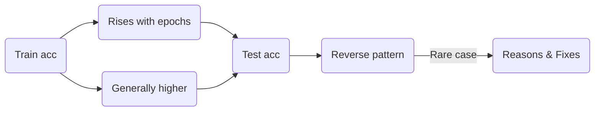

```markdown
---
title: "Measuring Model Performance: Better Performance in Test Than Train?"
tags: [deep-learning, model-performance, debugging, train-test-gap]
date: 2025-01-30

## 1. Overview

In deep learning, we typically expect a model’s **training accuracy** to exceed or at least match its **test accuracy**, particularly as the model begins to **overfit** the training data. However, **sometimes** we see the **reverse**: *test accuracy > train accuracy*. 

**Key Objectives of This Note:**
- Identify reasons why test accuracy might **exceed** training accuracy.  
- Provide **troubleshooting** strategies to isolate potential causes and fix them.  
- Present example **code snippets** to illustrate how such issues might arise or be detected.

---

## 2. Expected vs. Unexpected Patterns

### 2.1 The Usual Pattern
- **Train Accuracy** > **Test Accuracy** with increasing epochs due to **overfitting**.  
- Both curves rise, but test accuracy typically plateaus or lags behind train accuracy.

### 2.2 The “Reverse” Pattern
- **Test Accuracy** > **Train Accuracy** for some or all epochs.  
- May occur:
  - **Consistently** throughout training,  
  - **Transiently** (e.g., only in early epochs), or  
  - **Late** in training (less common, but possible).



---

## 3. Possible Causes of Higher Test Accuracy

1. **Small Sample Size (Statistical Fluke)**  
   - With **few** training samples, it’s possible by random chance that the **test set** is “easier” or does not represent the broader complexity of the domain.  
   - Evaluate whether you have enough training examples; if not, you may see unexpected fluctuations.

2. **Systematically Easier Test Data**  
   - The test set may contain examples that are **simpler** or more **distinct** compared to training.  
   - **Non-random splits**: e.g., training data from one temporal period or distribution, test data from another.  

3. **Incorrect or Inconsistent Normalization**  
   - For instance, normalizing the test set **differently** from the training set.  
   - Example: computing mean/variance **only** on the test set, instead of reusing the training stats.

4. **Initial Epoch Bias**  
   - Early in training, the train accuracy may appear **low** if we measure it *per mini-batch* before the model has converged for the entire epoch, whereas test accuracy is measured **after** the epoch is fully trained.  
   - This can lead to test accuracy being higher in the **first few epochs**.

5. **Architectural Design Features**  
   - **Dropout** or **Batch Normalization** misconfigured for inference.  
   - Regularization modes (e.g. dropout) should be **off** in evaluation mode. If they remain on, results can be unpredictable, possibly boosting test accuracy relative to train accuracy (though less common).

6. **Bugs in the Code**  
   - **Data leakage**: test samples appear in the training set.  
   - **Mix-up** of labels between train and test splits.  
   - Code incorrectly computing train accuracy vs. test accuracy (e.g., references the wrong variable).

---

## 4. What to Do If You Observe Reverse Train/Test Acc

### 4.1 Assess the Magnitude of the Discrepancy

1. **Small** (~1–2% difference):  
   - Often due to **random sampling** quirks. Possibly not an issue.  
   - Could happen if test set is slightly easier.

2. **Moderate** (~5–20% difference):  
   - Likely **systematic**. Investigate possible data or normalization issues.  
   - Verify randomization, check normalization pipeline, examine if your architecture’s *eval mode* is set.  
   - Check code for potential data leak or partial overlap in train/test sets.

3. **Large** (>20–40% difference):  
   - Highly suspicious of **code bug** or major data mismatch.  
   - Double-check **train/test** splits, label correctness, and normalizations. Possibly an extreme anomaly in data distribution.

### 4.2 Practical Debugging Steps

1. **Confirm Proper Splitting**  
   - Shuffle the entire dataset randomly before splitting.  
   - Ensure no overlap (unique IDs in train vs. test).

2. **Check Normalization**  
   - Are you using the **same** mean/variance or min/max for **train** and **test**?  
   - Example (PyTorch snippet):  
     ```python
     # Good practice: Compute training set statistics once
     # and use them for the test set as well.
     ```

3. **Evaluate Architecture in `eval()` Mode**  
   - For PyTorch, ensure `model.train()` is used only in training, and `model.eval()` in testing.  
   - This turns off dropout and adjusts batch norm behavior.

4. **Look for Data Leakage**  
   - Ensure test samples are **not** present in training data.  
   - No partial overlaps or repeated images/labels.

5. **Monitor Early-Epoch Behavior**  
   - If test accuracy is only higher **initially**, consider how you measure training accuracy during the epoch vs. test accuracy after the epoch.

6. **Simplify the Model**  
   - If complexities remain, try a simpler model (fewer layers, fewer regularizations) to see if the discrepancy vanishes.

---

## 5. Example Code Snippet and Visualization

Below is a **synthetic** example demonstrating how a bug in data splitting might inflate test accuracy above training accuracy.

```python
```python
import torch
import torch.nn as nn
import torch.optim as optim
import numpy as np

# Synthetic dataset
N = 1000
X = np.random.rand(N, 10)
y = np.random.randint(0, 2, N)

# INCORRECT SPLIT: Suppose we forget to shuffle
# and the last portion of dataset is easier or
# has different distribution
split_idx = int(0.8*N)
X_train, y_train = X[:split_idx], y[:split_idx]
X_test,  y_test  = X[split_idx:], y[split_idx:]

# (Potentially, these last 20% could be systematically easier)

X_train_t = torch.tensor(X_train, dtype=torch.float32)
y_train_t = torch.tensor(y_train, dtype=torch.long)
X_test_t  = torch.tensor(X_test,  dtype=torch.float32)
y_test_t  = torch.tensor(y_test,  dtype=torch.long)

# Dummy model
model = nn.Sequential(nn.Linear(10, 16),
                      nn.ReLU(),
                      nn.Linear(16, 2))

optimizer = optim.SGD(model.parameters(), lr=0.01)
loss_fn = nn.CrossEntropyLoss()

# Train
epochs = 20
train_acc_hist = []
test_acc_hist  = []

for epoch in range(epochs):
    model.train()
    optimizer.zero_grad()
    y_hat = model(X_train_t)
    loss = loss_fn(y_hat, y_train_t)
    loss.backward()
    optimizer.step()

    # Evaluate train
    train_preds = y_hat.argmax(dim=1)
    train_acc = (train_preds == y_train_t).float().mean().item()
    train_acc_hist.append(train_acc)

    # Evaluate test
    model.eval()
    with torch.no_grad():
        test_preds = model(X_test_t).argmax(dim=1)
        test_acc = (test_preds == y_test_t).float().mean().item()
        test_acc_hist.append(test_acc)

    print(f"Epoch {epoch+1} | Train Acc: {train_acc:.3f}, Test Acc: {test_acc:.3f}")
```
```

**Potential Outcome**:  
- If `X_test` is systematically simpler or has fewer boundary cases, you might observe **Test Acc** > **Train Acc**.

### 5.1. Quick Visualization

```python
```python
import matplotlib.pyplot as plt

epochs_arr = range(1, epochs+1)
plt.plot(epochs_arr, train_acc_hist, label='Train Accuracy')
plt.plot(epochs_arr, test_acc_hist, label='Test Accuracy')
plt.xlabel('Epoch')
plt.ylabel('Accuracy')
plt.legend()
plt.title('Unexpected: Test > Train Accuracy')
plt.show()
```
```

---

## 6. Conclusions and Action Plan

1. **Small Gap?** Possibly just random fluctuation.  
2. **Moderate to Large Gap?** Investigate potential causes:
   - **Data splitting** (randomization, bias)  
   - **Normalization** or **data preprocessing** differences  
   - **Model’s training vs. evaluation** configuration  
   - **Code bugs** (data leakage, label mix-ups)

3. **Take Corrective Steps**:
   - Ensure proper **random** splits and consistent normalizations.  
   - Check that **dropout** and **batch norm** are off during evaluation.  
   - If still unresolved, consider a simpler model or track down possible coding anomalies.

Ultimately, **test > train** can happen—but it often signals **data or code issues**. A thorough debugging process will pinpoint whether it’s benign randomness or a deeper problem in your **pipeline**.

---

## 7. Further Reading

- **Goodfellow, I., Bengio, Y., & Courville, A.**: *Deep Learning* – Chapters on overfitting and optimization.  
- **Deep Learning Regularization**: [https://arxiv.org/abs/1207.0580](https://arxiv.org/abs/1207.0580) (Dropout)  
- **Batch Normalization**: [Original Paper by Ioffe and Szegedy](https://arxiv.org/abs/1502.03167)  
- **Data Leakage** and best practices: *Kaufman et al., 2012*, [https://doi.org/10.1007/s10994-012-5282-5](https://doi.org/10.1007/s10994-012-5282-5)

---

```

**How to Use These Notes in Obsidian**:

1. **Create** a new note in your vault (e.g., `Train_vs_Test_Performance.md`).  
2. **Paste** the entire markdown content (including frontmatter `---`).  
3. Add your **internal links** (e.g. `[[Overfitting]]`, `[[Data Normalization]]`) and rename any headings to suit your style.  

These notes should give you a **structured perspective** on why test accuracy can sometimes exceed training accuracy and guide you toward **troubleshooting** and **fixing** such anomalies.