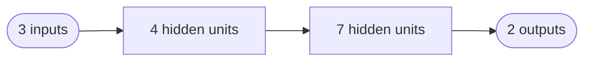

## 1. Overview
In feed-forward deep learning architectures, **weights** between layers are typically stored in **matrices**. Understanding how these matrix **dimensions** relate to network structure is crucial for:
1. Ensuring **correct** model definitions.
2. **Debugging** dimensional errors.
3. Interpreting and **initializing** weights effectively.

This note explores:
- The **conceptual** layout of weight vectors vs. weight matrices.
- How **PyTorch** (and other libraries) store these weights.
- Examples of **correct** and **incorrect** dimensional matching.

---

## 2. Recap: Node-Level Weights

### 2.1. Single Neuron View
A single neuron (unit) in a feed-forward layer computes:

\[
\text{Output} = \sigma \Bigl( \mathbf{W} \cdot \mathbf{X} + b \Bigr),
\]

where:
- \(\mathbf{X}\) is the vector of **inputs** (from the previous layer or the data).  
- \(\mathbf{W}\) is the neuron’s **weight vector** of matching size.  
- \(b\) is the **bias** (often incorporated as an extra dimension in \(\mathbf{X}\) or a separate parameter).  
- \(\sigma(\cdot)\) is a **nonlinear activation** (e.g., ReLU, sigmoid, etc.).

**Key Point**:  
- If there are \(n\) inputs, then **\(\mathbf{W}\)** has **\(n\) elements** (ignoring bias).

### 2.2. Multiple Neurons in a Layer
If a layer has **\(N\) units**, each unit has its own **weight vector** (and bias). Hence, the weights for that layer naturally form an **\(N \times n\)** matrix:
- **\(N\)** = number of **outputs** in that layer (rows).  
- **\(n\)** = number of **inputs** to that layer (columns).

---

## 3. From Graphical to Matrix Form

Consider a simple feed-forward network with:
1. **Input layer**: 3 features
2. **Hidden layer**: 4 units
3. **Another hidden layer**: 7 units
4. **Output layer**: 2 units

You might draw it as:



- The **weight matrix** from `A -> H1` is \(\underbrace{4}_{\text{units}} \times \underbrace{3}_{\text{inputs}}\).  
- The **weight matrix** from `H1 -> H2` is \(\underbrace{7}_{\text{units}} \times \underbrace{4}_{\text{inputs}}\).  
- The **weight matrix** from `H2 -> O` is \(\underbrace{2}_{\text{units}} \times \underbrace{7}_{\text{inputs}}\).

**Why ‘Outputs by Inputs’?**  
Because in matrix multiplication:  
\[
\mathbf{Y} = \mathbf{W}\mathbf{X}, 
\]  
\(\mathbf{Y}\) is an **\(N\)-dimensional output vector, and \(\mathbf{X}\) is an **\(n\)-dimensional input vector, so \(\mathbf{W}\) must be **\(N \times n\)**.

---

## 4. Practical Examples in PyTorch

Below we show how to define a network in **PyTorch** and inspect the weight matrix sizes.

### 4.1. Correct Model

```python
```python
import torch
import torch.nn as nn

# A simple feed-forward model with 3 layers:
#   1) Input size = 10
#   2) Hidden layer size = 14
#   3) Next hidden layer size = 19
#   4) Output layer size = 8

model_correct = nn.Sequential(
    nn.Linear(10, 14),  # 14 outputs, each from 10 inputs -> Weight shape [14, 10]
    nn.Linear(14, 19),  # 19 outputs, each from 14 inputs -> Weight shape [19, 14]
    nn.Linear(19, 8)    # 8 outputs, each from 19 inputs  -> Weight shape [8, 19]
)

# Let's inspect the shapes of these layers
for i, layer in enumerate(model_correct):
    W = layer.weight.data
    print(f"Layer {i}: W.shape = {W.shape}")
```
```
**Expected Output**:

- **Layer 0**: torch.Size(\[14, 10\])  
- **Layer 1**: torch.Size(\[19, 14\])  
- **Layer 2**: torch.Size(\[8, 19\])  

#### Interpretation
- The first layer has **14** neurons, each with **10** inputs. Hence \([14, 10]\).  
- The second layer has **19** neurons, each with **14** inputs. Hence \([19, 14]\).  
- The third (output) layer has **8** neurons, each with **19** inputs. Hence \([8, 19]\).

### 4.2. Feeding Data Through

```python
```python
# Generate fake input data: (batch_size=5, features=10)
X_fake = torch.randn(5, 10)

# Forward pass
y_out = model_correct(X_fake)
print("Output shape:", y_out.shape)
```
```
- The output shape should be **\([5, 8]\)** → 5 examples, each producing 8 outputs.

### 4.3. Incorrect Model (Dimension Mismatch)

Suppose we define:

```python
```python
model_incorrect = nn.Sequential(
    nn.Linear(10, 14), # OK: [14, 10]
    nn.Linear(14, 19), # OK: [19, 14]
    nn.Linear(9, 8)    # WRONG: [8, 9] but we need [8, 19] 
)
```
PyTorch **allows** you to create this object, but once you pass data from the second layer output (19 features) into a layer expecting 9 features, you get an error:

```python
```python
X_fake = torch.randn(5, 10)
y_out_incorrect = model_incorrect(X_fake)
```
This triggers an error like:
```
RuntimeError: mat1 and mat2 shapes cannot be multiplied (5x19 and 9x8)
```
**Why?**  
- The second layer outputs shape **\([5, 19]\)**, but the third layer expects **19** as an input size. Instead, we incorrectly set it to **9**.

---

## 5. Summary of Key Points

1. **Outputs by Inputs**: For a layer with \(n_\text{in}\) inputs and \(n_\text{out}\) outputs (neurons), the weight matrix is \(\underbrace{[n_\text{out}, n_\text{in}]}_{\text{torch.Size}}\).  
2. **Layer Chaining**: The **output** dimension of one layer must match the **input** dimension of the next.  
3. **Matrix Multiplication**: If dimension mismatch occurs, you get a **runtime error** about shapes.  
4. **Biases**: Each layer also has a separate **bias** parameter of size \([n_\text{out}]\).  
5. **Hidden** vs. **Output** Layers: The same principle applies, whether it’s a hidden layer or final output layer.

---

## 6. Visualizing Weight Matrices

For **interpretation** or **debugging**:

- One can **flatten** or **view** the weight tensors (e.g., `layer.weight.view(-1)`) to see all parameters.  
- Tools like **TensorBoard** or custom PyTorch hooks allow you to **visualize** the distribution of weights over training.

**Example** (PyTorch snippet for hooking onto weights):
```python
```python
for name, param in model_correct.named_parameters():
    if 'weight' in name:
        print(f"{name} shape: {param.shape}")
        # Could do histograms or other analysis here
```
```

---

## 7. Conclusion and Next Steps

- Weight matrices reflect the **number of neurons (rows)** and **number of inputs per neuron (columns)**.
- Proper dimensioning ensures **smooth** data flow through the network, avoiding shape errors.
- Next topics:
  - **Weight initialization strategies** (e.g., Xavier, Kaiming).
  - **Freezing layers** (preventing further updates).
  - **Interpreting** how weights evolve during training.

---

## 8. Further Reading

1. **Goodfellow, I., Bengio, Y., & Courville, A.**: *Deep Learning* — Chapter on **linear algebra** basics and **feedforward** networks.  
2. **PyTorch Documentation** on nn.Linear: [https://pytorch.org/docs/stable/generated/torch.nn.Linear.html](https://pytorch.org/docs/stable/generated/torch.nn.Linear.html)  
3. **Matrix Multiplication** refresher: [Linear Algebra Crash Course](https://en.wikipedia.org/wiki/Matrix_multiplication)  
4. **Weight Visualization**: Tools like [TensorBoard for PyTorch](https://pytorch.org/docs/stable/tensorboard.html) or [Weights & Biases](https://docs.wandb.ai/).

---
```

**How to Use These Notes in Obsidian**:

1. **Create a new note** (e.g., `Weight_Matrix_Sizes.md`) and paste the markdown above (including the YAML frontmatter).
2. Adjust or add any **internal links** (e.g. `[[SomeOtherNote]]`) as needed.
3. Optionally add custom tags or rename sections to fit your vault’s structure.

This provides a thorough explanation of **why weight matrix shapes** are set as `[out_features, in_features]` in feed-forward neural networks, plus **practical code** for verifying correctness in PyTorch.