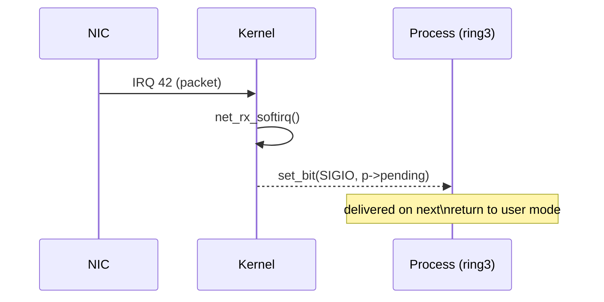

### 14 🛎️ System-Call Fast-Path on x86-64 Linux

|Step|CPU mode|What happens|Code/structure|
|---|---|---|---|
|① User prepares|CPL=3|Put **syscall #** in `RAX` + arguments in order: `RDI, RSI, RDX, R10, R8, R9`|`asm mov $SYS_write, %eax ; #1`|
|② `syscall` instruction|HW microcode raises **vector 0x80**-like event (but faster than `int 0x80`) → loads MSRs `STAR/LSTAR/SFMASK`|—||
|③ Entry trampoline (`entry_64.S` → `__do_syscall_64`)|CPL→0, `swapgs`, saves volatile GPRs on **per-CPU stack**, disables interrupts (`RFLAGS.IF=0`)|`c struct pt_regs *regs = task_pt_regs(cur);`||
|④ Kernel sys-dispatch|Look up `sys_call_table[rax]` (548 entries in v6.2) → `const sys_call_ptr_t *tbl`|`c long ret = tbl[regs->orig_rax](…);`||
|⑤ Work, copy_to/from_user|Scheduler may block here; FPU saved lazily|—||
|⑥ Return (`sysretq`fast-path)|Restore regs, flip GS, CPL=3, set `RCX,R11`, resume user|Hardware re-enables interrupts per `RFLAGS` snapshot||

> **Why `syscall` replaced `int 0x80`**: 1 µs → 150 ns typical latency; avoids IDT indirection & legacy privilege checks.

#### 14.1 Minimal inline assembly demo

```c
#include <unistd.h>
#include <stdint.h>

long write1(const char *s, unsigned len) {
    long ret;
    __asm__ volatile (
        "mov  $1, %%rax \n\t"   /* SYS_write */
        "mov  $1, %%rdi \n\t"   /* fd=stdout */
        "syscall        \n\t"
        : "=a"(ret)
        : "S"(s), "d"(len)
        : "rcx","r11","memory");
    return ret;
}
```

---

### 15 📨 Signals – Asynchronous Kernel → Process



- Delivery point: just before `sysret/iret` the kernel checks `pending & ~blocked`.
    
- Stack frame pushes **SA_SIGINFO** values → user handler runs at user CPL with restorer trampoline.
    

---

### 16 📚 Function-Pointer Tables in the Kernel

```c
/* include/linux/syscalls.h */
asmlinkage long sys_write(unsigned int, const char __user *, size_t);

/* arch/x86/kernel/syscall_table.S (generated) */
ENTRY(sys_call_table)
 .quad sys_read
 .quad sys_write   /* index 1 */
 .quad sys_open
 ...
END(sys_call_table)
```

💡 **Exercise** (C):

```c
typedef long (*sysfn)(long, long, long);
sysfn tbl[3] = { sys0, sys1, sys2 };
long nr = 1;                 // dynamic “rax”
long ret = tbl[nr](a,b,c);   // indirect call
```

> _Data-driven dispatch_ = pointer-chasing overhead vs. massive `switch`.

---

### 17 🔄 Context-Switch Internals

#### 17.1 What must be saved?

|Category|Saved?|Rationale|
|---|---|---|
|GPRs (`rax..r15`)|✅|user visible|
|SIMD/FPU (XSAVE)|_lazy_|only on first use after switch|
|Segment bases (`fs/gs`)|✅|TLS & percpu bases|
|`RIP` / `RFLAGS`|✅|resume point + int-enable bit|
|**Memory** pages|❌|already isolated by MMU (page tables stay)|

```c
struct thread_struct {
    unsigned long rsp0;     // kernel stack top
    unsigned long cr3;      // page-table root
    struct fpu fpu;         // xsave area
    /* … */
};
```

#### 17.2 Switching algorithm (Linux `context_switch()`)

```c
prev->state = TASK_RUNNING;
switch_mm(prev->mm, next->mm, cpu); /* load CR3 if needed */
switch_to(prev, next, &prev);       /* save callee-saved regs, load next */
```

Time cost: **~1500 cycles** on modern Intel (no SMT) ≈ 700 ns @ 2 GHz.

---

### 18 🧳 “Suitcase” Model of a Process

```text
┌─────────────┐
│  Registers  │  ← context
│  PC/RIP     │
│  Flags      │
│─────────────│
│  Page table │  ← pointer to full address space
└─────────────┘
```

_OS moves the suitcase between cores_ → migration touches:  
`switch_mm()` + `flush_tlb_other()` when NUMA node changes (may cost µs).

---

### 19 📉 Why _Batch_ Syscalls

Let:

- `t_s` = 180 ns syscall entry+exit
    
- payload write per call = 4 B
    
- target throughput = 1 GiB/s
    

```python
calls_per_sec = 1_073_741_824 // 4   # 268M
overhead_sec = calls_per_sec * 180e-9
≈ 48.2 s !          # impossible
```

Batch at 4 KiB:

```python
calls_per_sec = 1_073_741_824 // 4096  # 262k
overhead ≈ 0.047 s (4.4%)
```

➡️ **Always buffer user I/O** (glibc does with stdio) and use `writev`, `sendmmsg`, `io_uring`.

---

### 20 ⚖️ Choosing PC vs next-PC on Return

|Trap type|Re-execute current?|Why|
|---|---|---|
|**Page-fault #PF**|✅|after page-in the faulting load/store must run again|
|**Syscall/IRQ**|❌ `RIP = next_pc`|instruction already completed|
|**Debug single-step**|depends|#DB may point back to same instr|

Kernel encodes decision in `pt_regs->rip` before `iret`.

---

### 21 🔐 User vs Kernel vs Hypervisor Processes

|Ring|Typical Software|Can run `hlt`?|Access CR3?|
|---|---|---|---|
|0|kernel thread, ksoftirqd|✅|✅|
|1/2|paravirt guest (rare on x86)|maybe|by VMM policy|
|3|userland, glibc|❌ (#GP)|❌|

> Top’s `PR` column shows `R` if a task currently occupies a core; hopping among `CPU` column IDs demonstrates OS’s suitcase shuffle.

---

### 22 🛠️ Lab Ideas (continued)

1. **Strace batching**: measure `write()` count difference between `cat file` vs `dd if=file bs=4k`.
    
2. **Kernel ftrace**: tracepoint `raw_syscalls:sys_enter` to visualise burst -> flush pattern.
    
3. **Write a tiny module** exporting `syscall_table` pointer, look at entry 17, verify it maps to `sys_nanosleep`.
    

---

### 23 📑 Key Takeaways

- **Syscall** = software-raised interrupt; use `syscall`/`sysenter` fast paths.
    
- **Signals** provide _reverse_ async channel from kernel to user.
    
- Context consists only of **register state + PC**; memory isolation via MMU makes save/restore unnecessary.
    
- Scheduler treats each process as a _movable bag_; CPU affinity ≈ cache warmth hint, not correctness rule.
    
- Heavy syscall/IRQ machinery ⇒ design for **amortisation & batching**.
    

---

### 24 📎 References / Further Study

- Intel SDM vol 3A, ch 6 “System Programming”.
    
- L. Torvalds, _Linux Context Switch Walk-Through_ (lkml thread).
    
- Ulrich Drepper, “What Every Programmer Should Know About Memory”, §7 context switching.
    
- `arch/x86/entry/entry_64.S` & `kernel/signal.c` in Linux-6.x source.
    

---

_(End of extended notes — yell 🐧 if you want a drill-down into the scheduler or hyper-privileged VM-exit paths!)_