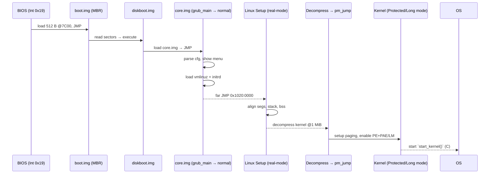

## 0. Quick-Reference Glossary  

| Term | Meaning |
|------|---------|
| **boot.img** | 1-sector (512 B) stub placed in the MBR gap; jumps to **diskboot.img** |
| **diskboot.img** | first part of **core.img**; has enough driver code to read the rest of core.img |
| **core.img** | “GRUB kernel” + FS/driver modules + `grub_main()` |
| **setup header** | 2-KiB real-mode header inside `arch/x86/boot/` (offset `0x1F1`) |
| **CAN_USE_HEAP** | `loadflags` bit 7 → allows setup to use dynamic heap from `_end` up |
| **X** | physical load address of kernel boot sector (default `0x10000`) |

---

## 1. BIOS → GRUB Stage-1

```
          ┌──────────────────────┐
Int 0x19  │ BIOS loads sector 0  │
          │ (MBR / boot.img) @   │  DS:SI = 0000:7C00
          └───────┬──────────────┘
                  │  tiny real-mode stub
                  ▼
          ┌──────────────────────┐
          │  jump to diskboot    │  (sector +1…n)
          └──────────────────────┘
```

* **Constraint**: 512 B, so only a chained jump + a couple of LBA reads.  
* **Storage**: sectors between MBR and first partition.

---

## 2. GRUB Stage-1½ (**diskboot.img**)

* Runs in **real mode** (still under 1 MiB).  
* Knows the disk geometry + has a _minimal_ driver to read the next N sectors of **core.img** into low memory (usually `0x8000` … `0x7E00` range).  
* Transfers to the **core.img entry point**.

---

## 3. GRUB Stage-2 (**core.img**)

### 3.1 High-level algorithm (`grub_main()`)

```c
int grub_main(void)
{
    grub_console_init();              // video/serial/EFI console
    modbase = grub_find_module_area();
    grub_device = grub_guess_root();  // e.g., (hd0,msdos1)
    grub_cfg  = grub_load_config();   // parses /boot/grub/grub.cfg
    grub_load_modules(grub_cfg);      // fs, crypto, gfx, ...
    grub_normal_execute();            // hand to normal mode
}
```

### 3.2 Normal Mode

* Presents **menu** (`grub.cfg` entries).  
* `grub_menu_execute_entry()` parses chosen stanza → runs `linux`, `initrd`, `boot` commands.  
* **Loads Linux kernel + initrd into memory** via filesystem driver (ext4, btrfs, …).  
  * **Linux kernel** (`bzImage`) → placed at `0x100000` (1 MiB) upward.  
  * **Setup** (first 32 KiB of bzImage) → placed at `X = 0x10000`.  
  * **Command line** → anywhere below `X+0x10000`.  
* Populates **setup header** fields (excerpt):

| Offset | Field | Filled by GRUB |
|--------|-------|----------------|
| `0x1FE` | `boot_flag` | `0xAA55` |
| `0x210` | `type_of_loader` | `0x7` (GRUB2) |
| `0x224` | `cmd_line_ptr` | 32-bit phys addr of CLI |
| `0x228` | `ramdisk_image` | initrd base |
| `0x22C` | `ramdisk_size` | initrd size |
| … | … | … |

Finally → **far jump** to **kernel setup entry**  
```
target = X + sizeof(bootsect) + 1   // = 0x10000 + 0x200  (0x10200)
jmp far ptr 0x1020:0x0000
```

---

## 4. Memory Layout After GRUB

```
Phys Addr
┌──────────────────────────────┐ 100000h  Protected-mode kernel (compressed)
│                               │
├──────────────────────────────┤ 0A0000h  VGA hole
│                               │
├──────────────────────────────┤ X+10000  Command-line, initrd, heap
│   ↓ heap  (if CAN_USE_HEAP)   │
├──────────────────────────────┤ X+08000  Stack for real-mode setup
│                               │
├──────────────────────────────┤ X        Kernel setup + bootsect (bzImage hdr)
│                               │
└──────────────────────────────┘ 000800h  MBR, BIOS scratch
```
_Default X = **0x10000**_

---

## 5. Kernel Setup (`arch/x86/boot/`)  

### 5.1 Entry Sequence

```asm
_start:                ; @ 0x10200
    jmp start_of_setup
    ; 510 B header…
start_of_setup:        ; .entrytext
    movw %ds, %ax
    movw %ax, %es
    cld                       ; FPU string ops L→R
```

#### ❶ Align all segment registers

| Register | Before | After |
|----------|--------|-------|
| `cs` | `0x1020` | `0x1000` |
| `ds`/`es`/`fs`/`gs`/`ss` | may differ | `0x1000` |

Accomplished with:

```asm
pushw %ds
pushw $label6
lretw            ; far return → reload CS from stack (ds)
```

#### ❷ Build a **valid stack**

Scenario | Condition | Action
---------|-----------|-------
A | `ss == ds` | Use SP from GRUB (`SP & ~3`); else `0xFFFC`
B | `ss != ds` & `CAN_USE_HEAP=1` | `SS = ds`, `SP = heap_end_ptr + 1 KiB`
C | `ss != ds` & Heap **not** allowed | Tiny 1 KiB stack at `_end`

```asm
testb $CAN_USE_HEAP, loadflags
jnz  use_heap
; fall-back minimal stack…
```

#### ❸ Zero **.bss**

```asm
movw $__bss_start, %di
movw $_end+3, %cx
xor  %eax, %eax
subw %di, %cx
shrw $2, %cx          ; convert bytes → dwords
rep  stosl             ; fill with 0
```

#### ❹ Call **main()** (still real mode)

```asm
calll main              ; arch/x86/boot/main.c
```

---

## 6. Visual Aids  

### 6.1 Stack options (schematic)

```
Case A/B (heap)                       Case C (tiny)
┌──────────────┐ <─ _end+1KiB         ┌──────────────┐ <─ _end+1KiB
│   Stack      │                      │   Heap (✗)   │
│   grows ↓    │                      │              │
└──────────────┘ <─ SP                └──────────────┘ <─ SP (_end)
```

### 6.2 Real-mode Register Map (post-setup)

```
CS = DS = ES = FS = GS = SS = 0x1000
IP = (start_of_setup − 0x10000) = 0x0200
SP = chosen per scenario
```

---

## 7. End-to-End Sequence Diagram  



---
![[Screenshot 2025-05-10 at 1.24.03 PM.png]]
## 8. Key Takeaways  

1. **GRUB Stage-1 (MBR)** is merely a trampoline; real logic lives in core.img.  
2. **core.img** provides a _mini-OS_ capable of filesystem reads, modules, GUI menus.  
3. Bootloader must honour the **Linux boot protocol**: populate header, place images correctly.  
4. Kernel **setup** is still **16-bit real mode**; its only job is to build an execution environment, then hand off to the self-decompressing kernel.  
5. Stack creation varies by `CAN_USE_HEAP`; robustness for quirky firmware.  

---

> **Next in the series:** dive into `arch/x86/boot/main.c` — early `memset`, `memcpy`, earlyprintk, and the transition to 32-bit protected mode.