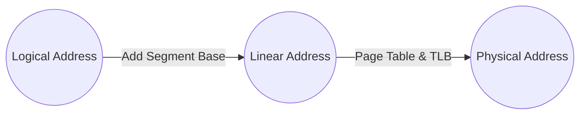

**Lecture:** Operating Systems (Smruti R. Sarangi) – Chapter 2 (Part 5)  
**Topic:** Multi-level Paging, Efficiency of Virtual Memory Translation, and Segmentation (x86)

> **Note**: These notes integrate the lecture transcript with explanatory details, code snippets, diagrams, and references for deeper insights into how modern OS kernels handle memory. The focus is on multi-level paging efficiency, TLB usage, and segmentation in the x86 architecture.

## Table of Contents
1. [Overview of Virtual Memory Efficiency](#overview-of-virtual-memory-efficiency)
2. [Why Multi-level Page Tables?](#why-multi-level-page-tables)
3. [Translation Lookaside Buffer (TLB)](#translation-lookaside-buffer-tlb)
4. [Page Fault Handling and Frame Displacement](#page-fault-handling-and-frame-displacement)
5. [Reverse Mapping and Shared Memory](#reverse-mapping-and-shared-memory)
6. [x86 Segmentation Model](#x86-segmentation-model)
   7. [Logical → Linear → Physical Address](#logical--linear--physical-address)
   8. [Segment Registers](#segment-registers)
   9. [Segment Descriptors](#segment-descriptors)
   10. [Example of Overriding Segment Usage](#example-of-overriding-segment-usage)
7. 11. ditional References](#additional-references)


---
## 1. Overview of Virtual Memory Efficiency

Modern operating systems use virtual memory as an abstraction over physical memory. The CPU issues **virtual addresses**; these are then translated to **physical addresses** through:

1. **Page tables** (hierarchical / multi-level structures in memory).
2. A **Translation Lookaside Buffer (TLB)** that caches recent translations.
3. **Swap space** (on disk) if the required page is not resident in physical memory.

Because of the **large overhead** in performing address translation on each memory access, OS designers use **multi-level page tables** and **TLBs** to optimize translation time and memory usage.

---
## 2. Why Multi-level Page Tables?
A **single-level page table** for a 64-bit address space can become huge (potentially billions of entries). However, most programs use memory **sparsely**:
- The **bottom** region of the address space typically has:
  - **Text** (program instructions)
  - **Data** and **BSS**
  - **Heap**, which grows upwards
- The **top** region of the address space typically is the **stack**, which grows downwards
- The large **gap** between heap and stack is unallocated (sparse)
### Sparsity Example (Conceptual)
Suppose a 64-bit address space is conceptually like a huge range:

```
     +--------------------------------+ 0xFFFF_FFFF_FFFF_FFFF
     |          (S T A C K)           |
     |          grows downward        |
     |                                |
     |  .......unallocated........... |
     |                                |
     |(H E A P) grows upward          |
     +--------------------------------+ 
     | .data + .bss                   |
     | .text                          |
     +--------------------------------+ 0x0000_0000_0000_0000
```

- Only a few regions near the bottom and top are actually populated.
- A single-level page table would still need to account for **all** possible pages in the 64-bit space.
### How Multi-level Paging Helps
- Breaks address translation into multiple steps:
  - **Level-1** page table: Index by top bits
  - **Level-2** page table: Index by next bits
  - ...
  - **Last-level** page table: Contains final frame number + offset
- We **only allocate** page tables in the levels for the subranges that actually exist. This **reduces memory usage**.

Thus, a multi-level page table exploits sparsity, avoiding full allocation of single-level page tables.

---
## 3. Translation Lookaside Buffer (TLB)

- TLB is a **hardware cache** for recent page translations:
  - **Input**: Virtual page number (VPN)
  - **Output**: Physical frame number (PFN)
- **TLB Hit**: If translation is present in the TLB, the CPU retrieves physical address quickly (few CPU cycles).
- **TLB Miss**: The hardware or OS (depending on architecture) **walks** the page table hierarchy (the “page-table walk”) to find the translation. This can take **hundreds of CPU cycles**.
- After resolving a TLB miss, the translation is placed back into the TLB.

### Hardware Page Walker
- Modern x86 CPUs have a **hardware page walker** that automates multi-level table traversal, updating TLB entries upon a miss.

---
## 4. Page Fault Handling and Frame Displacement

When the page table entry indicates the **page is not in memory** (but on disk, e.g., in swap space):
1. The OS triggers a **page fault**.
2. The kernel picks a **victim frame** in physical memory (based on replacement policies).
3. It must **clean up**:
   - Invalidate TLB entries that map the victim frame.
   - Flush or invalidate caches/write buffers if the page is dirty.
   - Update relevant page tables to indicate that this frame is no longer valid.
4. **Load** (swap in) the missing page from disk into the freed frame.
5. **Update** the page table with the new mapping.
6. **Load** the TLB with the new translation.

> **Key point**: Data is **never** directly fetched from disk by the CPU’s load/store instructions. It must first be **brought into physical memory** (RAM), mapped, and then accessed via TLB/caches.

### Reverse Mapping Complexity
- A single physical frame can be shared by multiple processes (shared memory). 
- For each physical frame, the OS must keep track of **which** page tables (across multiple processes) are pointing to it.
- On eviction or modification, the OS updates all referencing page tables and TLBs.

In Linux-like kernels, data structures like the **reverse-mapping (rmap)** or **struct page** help maintain these relationships.

---
## 5. Reverse Mapping and Shared Memory

- **Shared Memory**: Two or more processes map the **same physical frame** into their respective virtual spaces for fast inter-process communication (IPC).
- **Advantage**: Data can be exchanged **without** invoking the OS for each access. This is significantly faster than using system calls.
- When unmapping a shared page, the OS must **decrement** reference counts or remove references from each process’s page tables.

> Detailed coverage of advanced data structures for reverse mapping (e.g., `mm_struct`, `vm_area_struct`, etc.) is found in later OS chapters, but note it is **essential** for modern OS page management.

---
## 6. x86 Segmentation Model

While many modern RISC architectures (ARM, RISC-V) use a **flat** model (virtual → physical), **x86** historically uses a **segmented memory model**:

1. **CPU generates a “logical address.”**
2. Logical address is combined with a **segment base** (from a segment register) to form a **linear address**.
3. The linear address is then translated through the page tables/TLB into a **physical address**.

### 6.1 Logical → Linear → Physical Address

1. **Logical Address**: Generated by instructions (e.g., `%eax + displacement` in x86 assembly).
2. **Segment Base**: The CPU automatically adds the base from the relevant **segment register** (e.g., CS, DS, SS, etc.) to produce a **linear address**.  
3. **Paging Translation**: The linear address is passed through the TLB/page tables, resulting in the final **physical address**.

```
         Logical
           +---------+
           | Offset  | <-- offset the CPU generates
           +---------+
                 |
                 v
       [ Segment Base from segment register ]
                 |
                 v
         Linear Address
                 |
          (via TLB / Page Table)
                 v
         Physical Address
```

> **Note**: In a simplified (or “flat”) model used by many modern 64-bit OSes, segment bases are often configured such that logical == linear. However, segmentation is still present in the architecture specification.

---
### 6.2 Segment Registers

x86 has **six** primary segment registers (traditionally **16-bit**):

1. **CS** (Code Segment)  
2. **DS** (Data Segment)  
3. **SS** (Stack Segment)  
4. **ES**, **FS**, **GS** (additional data segment registers)

In older or more specialized usage:
- **CS** is automatically used for instruction fetch.
- **DS** is automatically used for most data accesses.
- **SS** is automatically used for stack instructions (e.g., `PUSH`, `POP`, etc.).

However, you can override this default usage in assembly by explicitly specifying a segment prefix, such as `FS:` or `GS:`.

---
### 6.3 Segment Descriptors

Each segment register **does not** store just a raw base address. Instead, it stores a **selector** (16 bits) that indexes into a **descriptor table** (e.g., GDT — Global Descriptor Table, or LDT — Local Descriptor Table). Each **segment descriptor** contains:

- **Base**: The linear address base of the segment
- **Limit**: The size / limit of the segment
- **Access rights**, flags, ring level, etc.

In modern x86 long-mode (64-bit), segmentation is mostly simplified/unused, but the mechanism still exists for compatibility:

> **Key fields** in the descriptor:
> - `Base`: 32 bits in older x86; extended forms in 64-bit
> - `Limit`: 20 bits (with scaling, e.g., 4 KB granularity)
> - `Flags`: Access permissions, system bits, etc.

---
### 6.4 Example of Overriding Segment Usage

```assembly
; x86 assembly example:
; Normally, a data load might do:
;   mov eax, [ebx + 4]
; which uses the DS segment by default.

; We can override it by specifying FS segment:
    mov eax, FS:[ebx + 4]

; This instructs the CPU to take the base address from FS,
; add (ebx + 4) as the offset, producing the final linear address.
; Then it uses the TLB/page tables to get the physical address.
```

Modern Linux often uses **FS** or **GS** for Thread Local Storage (TLS). Each thread has a unique FS or GS base pointing to its thread-local data area.

---
## 7. Additional References

1. **Intel Manuals** (Intel® 64 and IA-32 Architectures Software Developer’s Manual) – Detailed description of segmentation and paging:
   - [Intel SDM Volume 3A](https://www.intel.com/content/www/us/en/developer/articles/technical/intel-sdm.html)
2. **AMD64 Architecture Programmer’s Manual** – For 64-bit AMD details, which also discuss segmentation in long mode.
3. **Operating System Concepts** by Silberschatz et al. – Chapter on Memory Management.
4. **Linux Kernel Development** by Robert Love – Walkthrough of Linux memory management data structures.
5. **Understanding the Linux Virtual Memory Manager** by Mel Gorman – In-depth coverage of rmap, shared memory, and advanced paging topics.

---

## Visual Summary


- **Logical → Linear**: Done by adding segment base from registers (CS, DS, FS, etc.).
- **Linear → Physical**: Done by paging (multi-level page tables) and the TLB.

---

### Key Takeaways

- **Multi-level page tables** significantly reduce memory usage by allocating only the portions of the page table that are needed (exploiting sparsity).
- **TLBs** are crucial for performance; a TLB miss triggers a potentially expensive hardware or software page table walk.
- **Page faults** require OS intervention to bring pages from swap to RAM, potentially evicting others. This involves cache/TLB invalidations and updates.
- **Segmentation** on x86 adds an additional address translation layer: logical → linear (segment base offset) → physical (through paging).
- Though segmentation is less emphasized on modern 64-bit systems (they often use “flat” segment descriptors), it still exists in the x86 ISA and is used for special purposes (e.g., thread-local storage via FS or GS).

---

> **End of Notes**: These comprehensive notes combine the lecture’s transcript with illustrative code, diagrams, and additional OS kernel detail to serve as a thorough reference for graduate-level or advanced self-study on OS kernel internals related to memory translation and segmentation.
```