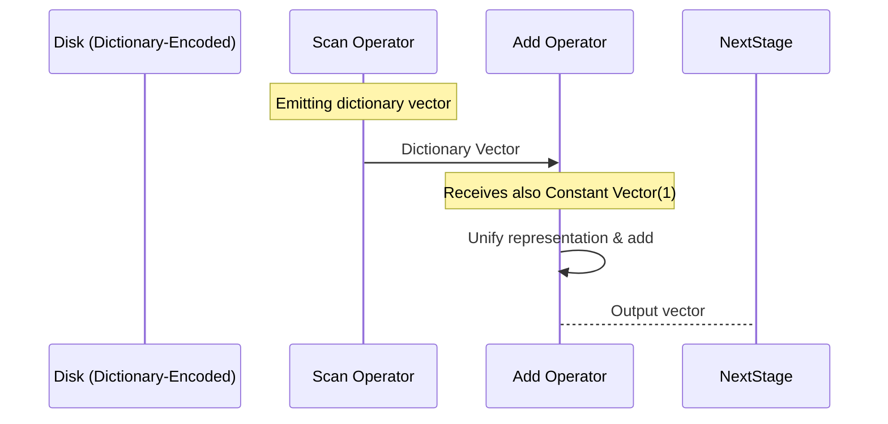

https://www.youtube.com/watch?v=bZOvAKGkzpQ
### Overview

DuckDB is a **column-store relational database** often compared to SQLite in terms of its single-file model. Its internals emphasize **vectorized processing** and **push-based execution**, enabling efficient analytics workloads. While it shares some conceptual overlap with Apache Arrow or Velox, DuckDB maintains its own **execution-focused** in-memory vector format and single-file disk storage format.

**Key points from the talk**:
- Columnar storage.
- Vectorized (push-based) processing engine.
- Single-file storage format (similar to SQLite, unlike many multi-file DBs).
- ART Index (Adaptive Radix Tree) for indexing.
- MVCC for transaction management.
- Written in C++.
- Uses the **FleX** or **FLEX** parser for SQL (referred to as a “full stress parser” in the talk—though commonly it’s referred to as the “Parser Frontier,” but the key is that it’s a robust SQL parser).
- Focus of these notes: **Processing** (execution model, vector format) & **Storage**. MVCC will be briefly mentioned.
---
## 1. High-Level Architecture

```mermaid
flowchart LR
    A[SQL Parser] --> B[Logical Planner]
    B --> C[Optimizer]
    C --> D[Physical Execution Plan]
    D --> E[Execution Engine (Vectorized)]
    E -->|Reads/Writes| F[Single-File Storage]
```

- **Single-File Storage**: All data resides in a single `.duckdb` file (conceptually similar to `.sqlite` files).
- **Execution Engine**: Vectorized, push-based. Operates on data in **vectors** rather than row-by-row.
- **Index**: ART index used for indexing structures.
- **Transaction Model**: MVCC ensures concurrency and consistency.

---

## 2. Vectorized Processing Engine

### 2.1 Vectorized Push-Based Model

- **Push-based** means that data flows (pushed) through operators in **chunks (vectors)**.
- **Vector**: The fundamental unit of data in DuckDB’s execution layer.
    - Each vector represents a *slice of a column* (homogeneous data type).
    - The default vector size in many vectorized systems is something like 1024 or 2048 rows. DuckDB also uses a dynamically sized vector but often 1024 is a common chunk size.


#### Why Vectorized?
- Amortizes function call overhead over many rows.
- Enables **SIMD** optimizations and other hardware-friendly designs.
- Reduces **branch misprediction** vs. naive row-at-a-time iteration.

---

## 3. DuckDB’s Vector Format

### 3.1 Relationship to Arrow / Velox

- DuckDB’s vector format is *similar* to Arrow in concept but **optimized for execution** rather than data interchange.
- Velox (Meta’s C++ data processing library) uses the *same* vector format design as DuckDB.

### 3.2 Vector Types

DuckDB defines multiple **physical** vector types, each sharing the same **logical** interface but differing in representation to facilitate compression or constant-time operations:

1. **Flat/Uncompressed Vector**  
   - Essentially a simple array of values.
   - Example: A flat integer vector `[1, 2, 3, 4, 5]`.

2. **Constant Vector**  
   - All entries logically have the *same* value. Physically, only one value is stored.  
   - Example logical view: `[1, 1, 1, 1, 1]`, but physically stores just `[1]`.  
   - **Use Cases**:
     - Literals in SQL (e.g., `SELECT * FROM table WHERE col = 42` => “42” is a constant vector).
     - Null vectors that are entirely `NULL`.

3. **Dictionary Vector**  
   - Contains a set of *unique* values (the dictionary) plus an *index array* referencing these unique values.
   - Example:
     - Logical data: `['a', 'b', 'a', 'a', 'b']`
     - Dictionary: `['a', 'b']`
     - Index array: `[0, 1, 0, 0, 1]`
   - **Use Cases**:
     - Reading *dictionary-encoded* Parquet columns directly into DuckDB’s vector format.
     - Allows skipping repeated computation (e.g., hashing identical strings just once).

4. **Sequence Vector** *(less common)*  
   - Stores a *base* and *increment* to represent sequences without storing all elements.
   - Example: `[1, 2, 3, 4, 5]` stored as base=1, increment=1.

> [!tip]+ **Compression for Execution**  
> Using these specialized vector types during execution means DuckDB can avoid decompressing or expanding the data when operators can handle them directly. E.g., a `constant + constant` operation only needs to add the single stored value once.

---

## 4. Unifying Vector Representation

### 4.1 The Challenge
- Many operators in a database engine want a **single** way to iterate over data, e.g., `operator(input_vector1, input_vector2)`.
- But we have many vector types: (Flat, Constant, Dictionary, Sequence…).  
- A naive approach: code explosion (“combinatorial explosion”) of specialized methods for each pair of vector types → not maintainable or feasible.

### 4.2 The Unified “Selection + Data” Format

DuckDB solves this with a “unified view” approach:
- **Data array**: The underlying array of values (for flat vectors) or dictionary values (for dictionary vectors).
- **Selection vector**: An array of integer *indexes* used to map logical row positions to physical positions in the `data array`.

**Examples**:

1. **Flat Vector**:  
   - Data: `[10, 20, 30, 40]`  
   - Selection Vector: `[0, 1, 2, 3]` (identity)
2. **Constant Vector**:  
   - Data (single value): `[1]`  
   - Selection Vector: `[0, 0, 0, 0]` (all points to index 0)
3. **Dictionary Vector**:  
   - Dictionary: `[ 'a', 'b' ]`  
   - Index array: `[0, 1, 0, 0, 1]`  
   - That index array effectively *is* the selection vector. The “data array” is `[ 'a', 'b' ]`.

**Benefits**:
- No copying or allocation needed to “flatten” data just to process it.
- Operators can remain generic: e.g., `Add(left_vector, right_vector)` can unify both to `(data_ptr, selection_vector)` combos.

> [!important]  
> This approach significantly simplifies implementing new functions and operators. Instead of enumerating every possible combination of vector types, the engine can unify representations on-the-fly.

---

## 5. Storage Format

Although much of the talk focuses on vectors in-memory, DuckDB also has a **compressed single-file** storage format:
- *One file* holds the entire database.
- Different compression strategies can be chosen *column by column* (e.g., bit-packing, RLE, dictionary compression, etc.).
- Upon reading from disk, DuckDB can emit the **appropriate vector type** (dictionary, constant, etc.) to the execution engine if beneficial.
**Example**:
```plaintext
+-------------------+
| DuckDB File (.db) |
+---------+---------+
          |
          v
     [ Column1 ] -- dictionary encoding -> Dictionary Vector
     [ Column2 ] -- RLE or bit-pack -> Possibly becomes flat vector
     ...
```

> [!info]  
> If the storage layer detects that a column has low cardinality or many repeated values, it may choose **dictionary compression**. Then, at read time, a **dictionary vector** is fed directly into the execution pipeline—**no** need to expand to a flat vector if not required.

---

## 6. MVCC (Multi-Version Concurrency Control)

- DuckDB uses **MVCC** for transactional guarantees and concurrency.
- **High-level**:
  - On writes, new versions of rows are generated without overwriting older versions immediately.
  - Readers can continue to see consistent snapshots.
- In-depth coverage is beyond this talk’s scope, but it’s noteworthy that advanced concurrency control is *built-in* (unlike SQLite’s single writer constraint).

---
## 7. Example: How Vector Types Appear in a Query Pipeline

**Step-by-step** (simple example: `SELECT col1 + 1 FROM table`):

1. **Scan**:  
   - Disk layer returns `col1` as a dictionary vector (because on disk that column is dictionary-encoded).
2. **Constant**:  
   - The literal `1` is a **constant vector**.
3. **Add Operator**:  
   - Operator sees `(dictionary_vector, constant_vector)`.
   - Unifies representation:  
     - Data1 = dictionary’s data, Selection1 = index array.  
     - Data2 = `[1]`, Selection2 = `[0,0,0,...]`.
   - Performs the addition without fully expanding the dictionary → **no** large-scale copying.
4. **Output**:  
   - Possibly a flat vector to feed subsequent operators (or remain dictionary if next operator benefits from that).



---

## 8. Code & Pseudocode Illustrations

### 8.1 Defining a Vector in C++ (High-Level Sketch)

```cpp
// Simplified pseudocode

enum class VectorType {
    FLAT,
    CONSTANT,
    DICTIONARY,
    SEQUENCE
    // ...
};

struct Vector {
    VectorType type;
    LogicalType logical_type;  // e.g. INT32, VARCHAR, etc.
    union {
        // FLAT: points to an array
        // CONSTANT: single value
        // DICTIONARY: pointer to dictionary + index array
        // ...
    } data;

    // A selection vector pointer if needed
    SelectionVector* sel_vector;
};
```

### 8.2 Unified Access Example

```cpp
// A generic operator "Add" for integer vectors
void AddVectors(const Vector &left, const Vector &right, Vector &result) {
    // unify left => data_ptr_left, sel_left
    auto [data_ptr_left, sel_left] = left.Unify();
    auto [data_ptr_right, sel_right] = right.Unify();

    // result is typically a FLAT vector
    int *result_data = result.GetDataPtr<int>();

    for (idx_t i = 0; i < vector_size; i++) {
        // sel_left[i] points to correct index in left data
        // sel_right[i] points to correct index in right data
        int lval = data_ptr_left[ sel_left[i] ];
        int rval = data_ptr_right[ sel_right[i] ];
        result_data[i] = lval + rval;
    }
}
```

- Notice how we *did not* do a special case for dictionary vs. constant vs. flat. The “`Unify()`” concept handles that behind the scenes.

---

## 9. Performance & Engineering Considerations

- **Less Code Duplication**: Thanks to the unified format approach, DuckDB avoids writing specialized code paths for every combination of vector types.
- **Hot Loops**: By unrolling or using SIMD intrinsics in these vector loops, performance can be maximized for CPU-bound analytics.
- **Code Footprint**: Minimizing code bloat is key, especially since DuckDB is embedded in many applications (like Python packages, R, etc.).

---

## 10. References & Further Reading

- [DuckDB Official Website](https://duckdb.org/)  
- [DuckDB GitHub Repository](https://github.com/duckdb/duckdb)  
- [Velox Project (Meta)](https://github.com/facebookincubator/velox) - for cross-referencing the shared vector format concept.  
- [SQLite Single-File Model](https://www.sqlite.org/onefile.html) - comparison for single-file design.  
- [MVCC Overview](https://en.wikipedia.org/wiki/Multiversion_concurrency_control)  
- [“Column-Oriented Database Systems” Paper by Abadi et al.](https://cs.brown.edu/~ugur/cs227-527/AbadiColumnDB.pdf) - general background on column stores.  

---

## 11. Summary

DuckDB combines:
1. **Columnar, Vectorized Execution** → *fast, analytical performance*.
2. **Single-file Storage** → *portability, ease of deployment*.
3. **Compressed Vector Types** → *execution-level compression + minimal overhead*.
4. **Unified Vector Representation** → *reduced code duplication, seamless dictionary usage*.

This architecture, plus built-in MVCC, indexing, and advanced SQL support, makes DuckDB a unique, high-performance embedded database engine suited for data analytics.

---

> [!quote] **Key Takeaway**  
> *The essence of DuckDB’s performance lies in its careful design around vector representation and processing—where it can leverage dictionary/compressed formats seamlessly within its vectorized engine.*

---

**End of Notes**