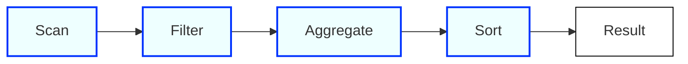
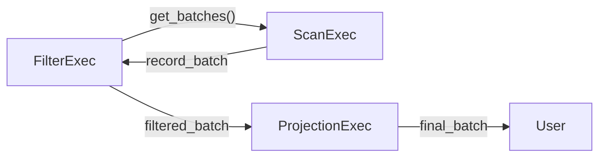

## 1. High-Level Planning Flow

DataFusion’s approach to planning a SQL query mirrors that of a typical relational database engine:

1. **SQL Text** → **SQL Parser** → **Logical Plan**  
2. **Logical Optimization** → (Rule-based rewrites)  
3. **Physical Planning** → (Choice of algorithms, partitioning) → **Physical Plan**  
4. **Execution** → (Operators run arrow kernels) → **RecordBatches**  

### 1.1 From SQL to Logical Plan

1. **SQL Text**  
   - You issue a SQL query string like `SELECT x, count(*) FROM table GROUP BY x;`.  
   - DataFusion uses its SQL parser (based on [`sqlparser-rs`](https://github.com/sqlparser-rs/sqlparser-rs)) to convert text → AST (abstract syntax tree).

2. **Planner**  
   - The AST is converted into a **logical plan** consisting of high-level relational operators: 
     - `Scan`, `Filter`, `Aggregate`, `Join`, etc.  
   - This is analogous to the “query tree” or “query graph” in traditional systems (e.g., PostgreSQL).

3. **LogicalPlan** Examples  
   ```rust
   // (Pseudocode) Building a LogicalPlan from DataFusion's DataFrame API
   let df = ctx.table("my_table")?
       .filter(col("year").eq(lit(2022))) // year = 2022
       .aggregate(vec![col("region")], vec![count(col("*"))])
       .sort(vec![col("region")]);
   // Under the hood -> a LogicalPlan with SCAN -> FILTER -> AGGREGATE -> SORT
   ```

### 1.2 DataFrames & Custom Frontends
- **DataFrame API**  
  - Similar to Spark or Pandas-like DSL.  
  - Underneath, it still produces the **same** `LogicalPlan`.  
- **Custom Query Languages**  
  - You can bypass DataFusion’s SQL parser entirely.  
  - Just construct your own logical plan via DataFusion’s builder API:
    ```rust
    // Minimal example of building a logical plan in Rust
    use datafusion::logical_expr::{LogicalPlanBuilder, col, lit};

    let scan = LogicalPlanBuilder::scan_csv(
        "my_data.csv", /* other params */
    )?;

    let plan = scan
      .filter(col("year").eq(lit(2022)))?
      .project(vec![col("region"), col("sales")])?
      .build()?;
    ```
  - Once you have a `LogicalPlan`, the same downstream optimizations and execution rules apply.

---
## 2. Logical Plans in DataFusion
### 2.1 Logical Operators
- **Common Nodes**  
  - `Scan`, `Projection`, `Filter`, `Aggregate`, `Window`, `Sort`, `Limit`, `Join`, etc.  
- **Extension Nodes**  
  - If your use case needs additional functionality, you can introduce a **logical extension node**.  
  - Example: a custom time-series aggregator or custom graph operator.



- In DataFusion, the leaves (e.g. `Scan`) are at the bottom, with data **flowing** upward through each relational operator.
### 2.2 Data Representations
- **RecordBatches**:  
  - The canonical Apache Arrow construct for a batch of rows in columnar format.  
- **Arrays vs. Scalars**:  
  - Internally, DataFusion differentiates between a full Arrow column array and a single scalar value (constant).  
  - The optimizer can replace constant expressions with a “scalar” node to avoid overhead.

---
## 3. Catalog API and Table Providers

### 3.1 Catalog API
- **What is a Catalog?**  
  - Stores metadata about databases, schemas, tables, etc.  
  - DataFusion provides a memory-based catalog and a file/directory-based catalog out-of-the-box.  
- **Async Catalog Interface**  
  - The core trait is asynchronous (`async fn`) to allow remote catalogs (e.g., object store, Hive metastore, Iceberg catalog).
### 3.2 Table Providers & Hive-Style Partitions
- **TableProvider Trait**  
  - Interface to push down filters, projections, limits into the data source.  
  - Returns an **execution plan** for scanning the data.  
- **Examples**  
  - Built-in providers for CSV, Parquet, JSON, Arrow IPC.  
  - Community ones for MySQL, SQLite, or custom IoT data sources.  

```mermaid
flowchart TB
    A[DataFusion Planner] -->|"projection pushdown, filter pushdown, limit pushdown"| B[TableProvider::scan()]
    B --> C[Custom ExecutionPlan]
```

- **Hive-Style Partitioning**  
  - A directory structure like `/mytable/date=2023-01-01/file.parquet` is recognized. 
  - DataFusion infers a partition column (e.g., `date`), and can prune subdirectories based on predicates.

### 3.3 Advanced Parquet I/O

- DataFusion’s Parquet reader is highly optimized:  
  - **Predicate pushdown** using row group, page-level statistics.  
  - **Late materialization**: read only needed columns first, skip irrelevant pages.  
  - **External indexes**: can be hooked in to skip chunks of data.  

---

## 4. Logical Query Optimization
After constructing the initial `LogicalPlan`, DataFusion applies **logical rewrites**:
1. **Rule-Based** Optimizations
   - Projection pushdown (remove unused columns).  
   - Filter pushdown.  
   - Constant folding & expression simplifications.  
   - Subquery de-correlation.
1. **Join Reordering** (experimental)
   - Handled as a separate pass.  
   - Potentially expensive combinatorial search; can be disabled or enabled by user flags.

3. **API for Custom Optimizer Rules**
   - If you have domain-specific rewrites (e.g., advanced time-series indexing), you can insert your own **logical optimization rule**:
     ```rust
     pub trait OptimizerRule {
       fn optimize(&self, plan: &LogicalPlan) -> Result<LogicalPlan>;
     }
     ```
   - Implement and register your own transformations.

---
## 5. Physical Planning
### 5.1 From Logical Plan to Physical Plan
- **Key Difference**: A physical plan specifies *how* each operator is implemented:
  - Hash join vs. nested loop join vs. merge join, etc.  
  - How many *partitions* (parallelism) to use.

- **Default: Hash-Based**  
  - DataFusion primarily implements hash joins, partitioned aggregations, and partial merges.  
  - Nested-loop or merge joins exist in partial form but are less mature.

### 5.2 Physical Plan Rewrites
- DataFusion performs additional “physical” rewrites:
  - E.g., push a filter below a projection if feasible in the chosen physical operators.  
  - Insert “local” or “partial” operators vs. “global” or “final” operators.

### 5.3 Physical Operators

Common physical operators in DataFusion:
1. **Projection**  
   - Evaluate one or more expressions over input batches (producing new columns).  
1. **Filter**  
   - Apply a boolean predicate.  
   - Internally calls Arrow’s optimized `filter` kernel which copies qualifying rows into a new contiguous array (no selection vector).  

3. **Limit**  
   - `LocalLimit` operator: stops reading input after N rows in each partition.  
   - `GlobalLimit` operator: merges partial results to get the total top-N or limit across partitions.

4. **Aggregate**  
   - Partitioned aggregator with local + global phases.  
   - E.g., partial aggregator can keep track of partial group states, then merge them.  
   - Handles distinct by merging states in a final aggregator.

5. **Window**  
   - Standard window functions (e.g., row_number, rank).  

6. **Join**  
   - Primarily “partitioned” hash join.  
   - Builds partial hash tables in each partition, merges them.  
   - External “Grace-style” approach if build side does not fit into memory.  
   - Broadcast join also supported in some scenarios.

7. **Sort**  
   - Partial sort or top-K sort in each partition, then a global merge.  
   - Fallback to external sorting if data does not fit into memory.

8. **Repartition / Exchange**  
   - Distributes data across partitions (e.g., hash partitioning, round-robin).  
   - Required for distributed or multi-threaded operation.
---
## 6. Execution & Streams

1. **Async Stream Model**  
   - DataFusion’s physical operators implement an async interface:  
     ```rust
     async fn execute(&self, partition_idx: usize, ctx: TaskContext) 
       -> Result<SendableRecordBatchStream>;
     ```
   - Operators produce a *stream of Arrow `RecordBatch`es*.  

2. **Pull-Based Iteration**  
   - Each operator “pulls” the next batch from its child operator.  
   - Supports pipelining (so partial results can flow through the chain).  
   - Stateful operators (join, group-by, sort) may buffer data if needed.

3. **Collecting Results**  
   - Typically, the user calls `df.collect().await?` to gather all final results in-memory (returns a `Vec<RecordBatch>`).  
   - For large data sets, a custom streaming approach is possible instead of reading everything at once.

4. **Concurrency**  
   - Each partition can execute in parallel (spawn tasks on separate threads in [Tokio](https://tokio.rs/)).  
   - A query with multiple Parquet files can read them in parallel.  
   - Merging or final aggregation is typically done in one or more subsequent tasks.

---

## 7. Functions (Built-In & User-Defined)

### 7.1 Single Unified API
- **Scalar, Aggregate, Window, and Table Functions**  
- All user-defined functions (UDFs) and built-ins share the same internal traits.  
- No performance disadvantage for a “custom” function vs. “built-in.”

### 7.2 Example: Simple Scalar UDF

```rust
use datafusion::prelude::*;
use datafusion::arrow::array::{Int32Array, ArrayRef};
use std::sync::Arc;

fn my_add_one(args: &[ArrayRef]) -> datafusion::error::Result<ArrayRef> {
    // Expect exactly one Int32 column
    let in_arr = args[0]
        .as_any()
        .downcast_ref::<Int32Array>()
        .expect("input must be Int32Array");
    // Build output array
    let mut builder = Int32Array::builder(in_arr.len());
    for i in 0..in_arr.len() {
        if in_arr.is_null(i) {
            builder.append_null()?;
        } else {
            builder.append_value(in_arr.value(i) + 1)?;
        }
    }
    Ok(Arc::new(builder.finish()))
}

#[tokio::main]
async fn main() -> datafusion::error::Result<()> {
    let mut ctx = SessionContext::new();

    // Register our scalar UDF
    let udf = create_udf(
        "my_add_one",
        vec![DataType::Int32],
        Arc::new(DataType::Int32),
        Volatility::Immutable,
        Arc::new(my_add_one),
    );
    ctx.register_udf(udf);

    // Use the UDF in SQL
    let df = ctx.sql("SELECT my_add_one(id) FROM mytable").await?;
    let results = df.collect().await?;

    // Print or process results
    for batch in &results {
        println!("{:?}", batch);
    }
    Ok(())
}
```

- **Complex Types**:  
  - Arrays, structs, lists, etc. are simply different Arrow array types.  
  - The same approach applies, though more elaborate indexing is required.

---

## 8. Putting It All Together

**Final DataFusion Workflow**  
1. **Plan** (logical)  
2. **Optimize** (logical rewrites)  
3. **Plan** (physical)  
4. **Optimize** (physical rewrites)  
5. **Execute** (async pipeline of Arrow `RecordBatch`es)

```mermaid
flowchart TB
    A[SQL Text] --> B[SQL Parser]
    B --> C[Logical Plan]
    C --> D[Logical Optimizer]
    D --> E[Physical Planner]
    E --> F[Physical Plan]
    F --> G[Physical Optimizer]
    G --> H[Execution Operators]
    H --> I[Final Results (RecordBatches)]
```

---

## 9. Additional Topics

### 9.1 No Selection Vectors

- **Why not use selection vectors for filters?**  
  - DataFusion chooses to **copy** the qualifying rows to a contiguous array, rather than maintaining a separate bitmap or index array.  
  - Pros: downstream operators see a standard, contiguous Arrow array.  
  - Cons: potential overhead from copying large arrays repeatedly.  
  - Could be improved in the future with different design choices or code-generation.

### 9.2 Catalog APIs & Partitioning

- **Directory-based partitioning**:
  - Example:  
    ```
    /mytable
      ├── date=2023-06-01
      │   ├── file1.parquet
      │   └── file2.parquet
      └── date=2023-06-02
          ├── file3.parquet
          └── file4.parquet
    ```
  - DataFusion injects a partition column `date` and prunes directories using predicates like `date = '2023-06-02'`.

### 9.3 Pushdown
- DataFusion tries to push filters/projections as close to the data source as possible:
  - **Logical** pushdown in the `LogicalPlan`.  
  - **Physical** pushdown in the `TableProvider::scan()` method, letting the custom data source skip reading irrelevant data.
### 9.4 Memory / External Sorting & Join
- For big data sets that do not fit in memory:  
  - **External Sort**: merges sorted runs on disk.  
  - **Grace Hash Join**: partitions data to disk, merges partitions iteratively.
---
## 10. Performance Highlights
- **TPC-H Benchmarks**  
  - Scale Factor 100 on a single node.  
  - DataFusion and Polars are in the same ballpark performance-wise.  
  - ClickHouse is ~1.5x faster than DataFusion on many queries (likely due to highly specialized C++ code).  
  - Results differ by query, but DataFusion is considered “fast enough” for many production workloads.
---
## 11. Roadmap & Future Work
- **Advanced Code Generation**  
  - Currently some codegen is available (experimental).  
  - Potentially incorporate adaptive compilation (LLVM or Cranelift).
- **Cost-Based Optimization (CBO)**  
  - Join reordering is available but naive.  
  - A full-blown CBO is an open problem and a great area for research.
- **Vector / Columnar Pass-Through**  
  - Investigate skipping array copies for intermediate expressions, or using selection vectors.
- **Extended GPU Support**  
  - Custom operators can offload to GPUs, but more official GPU support is an exciting frontier.
- **Transactional Capabilities**  
  - Snapshot isolation, concurrency control, or incremental updates in a bigger system.  
  - Typically left to the user’s custom integration.

---

## 12. Conclusions & Key Takeaways

1. **DataFusion** is a modular, embeddable OLAP engine providing a standard design (logical → physical → execution).  
2. **Arrow-Centric**: All operators exchange data as Arrow `RecordBatch`es.  
3. **Extension Points**:  
   - Custom frontends, catalogs, table providers, logical nodes, physical operators, and user-defined functions.  
   - Lets you add advanced or domain-specific functionality without forked rewrites of the entire engine.  
4. **Performance** is competitive with other Rust-based columnar frameworks and not far behind specialized C++ systems.  
5. **Active Community** & used in production by multiple companies (InfluxDB IOx, etc.).

> **Quote from Andrew Lamb:**  
> “We basically have a typical O-LAP design, but as a modular, high-quality open source project. If you want to build your own database system, you can pick it up and focus on whatever your domain is.”

---

## 13. Further References

- **[Apache Arrow DataFusion (GitHub)](https://github.com/apache/arrow-datafusion)**  
- **DataFusion Paper**: 
  - *“DataFusion: A Fast, Embeddable, and Modular Query Engine Built on Apache Arrow”* (SIGMOD 2023).  
- **[Substrait I/O](https://github.com/apache/arrow-datafusion/tree/master/substrait)** and [DataFusion Common](https://github.com/apache/arrow-datafusion/tree/master/datafusion-common).  
- **[DataFusion Python Binding](https://github.com/apache/arrow-datafusion-python)**.  
- **Related Projects**: 
  - *VegaFusion* (compiles Vega specs to DataFusion),  
  - *Ballista* (distributed DataFusion),  
  - *DataFusion Comet* (Spark front-end to DataFusion execution).

---

## Appendix: Example Operator Diagrams

### A. Logical Plan vs. Physical Plan

```mermaid
flowchart TB
    subgraph Logical Plan
        L1[Scan table: my_parquet] --> L2[Filter colA > 100]
        L2 --> L3[Aggregate: Group by colB, SUM(colC)]
    end

    subgraph Physical Plan
        P1[ParquetExec <br/> (Pushdown colA > 100?)] --> P2[PartialHashAggregate]
        P2 --> P3[MergeHashAggregate]
        P3 --> P4[FinalOutput]
    end

    Logical Plan --> Physical Plan
```

- **Logical** operators are more abstract (e.g., “Aggregate”).  
- **Physical** picks specific algorithms (e.g., “PartialHashAggregate” + “MergeHashAggregate”).

### B. Pull-Based Pipeline



- Each operator requests (pulls) the next `RecordBatch`.  
- Can pipeline in memory: no full materialization unless required (sort/aggregate states).

---

**End of Notes**  
```