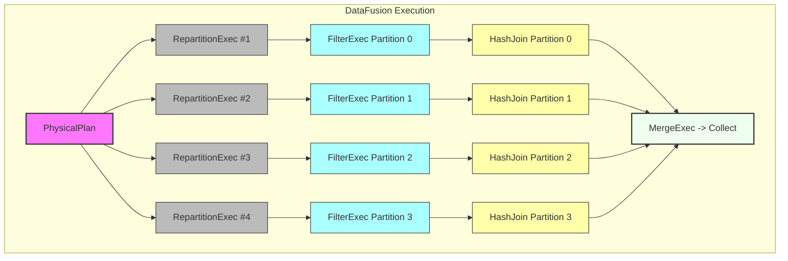

## 1. Questions from the Audience

Below are more audience questions and Andrew Lamb’s answers or clarifications.

### 1.1 Question: Handling Real-Time or Streaming Data

> **Q:** Does DataFusion support true streaming ingestion, or do you have plans to incorporate something like incremental processing (where results update continuously as new data arrives)?

**Andrew’s Answer**  
- **DataFusion** today is primarily a batch-oriented system, but people have built streaming-like solutions by repeatedly running incremental queries.  
- There’s also the concept of *tail-ing* a table: you might store data in some external system that continuously updates, and your DataFusion queries run regularly (micro-batch approach).  
- True event-at-a-time streaming would require deeper changes (e.g., continuous operator scheduling, checkpointing, watermark handling). That’s not a core focus.  
- You could build a specialized extension or custom operators—some community experiments exist.

### 1.2 Question: Spark vs. DataFusion / Arrow “Comet”

> **Q:** What about bridging DataFusion with other big data ecosystems like Spark? I’ve heard about something called **DataFusion Comet**—what’s that?

**Andrew’s Answer**  
- **DataFusion Comet** is Andy Grove’s (and others’) project to integrate Spark’s front-end with DataFusion’s execution engine.  
- The idea: Spark developers can keep using the Spark SQL interface, but behind the scenes, it delegates to DataFusion’s Rust-based engine for certain queries (often for performance or specialized operations).  
- You can think of it like a “plugin” or accelerator for Spark.  
- It’s still evolving. Next week, Andy Grove will present more details on it.

### 1.3 Question: Vectorized UDF “Code Generation”

> **Q:** Are there hooks to do code generation for user-defined functions so they run as efficiently as built-in functions?

**Andrew’s Answer**  
- Yes. DataFusion’s user-defined function (UDF) model is all in Rust. If you want to do full code generation (e.g., via [Cranelift](https://github.com/bytecodealliance/wasmtime/tree/main/cranelift) or LLVM), you’d need to build an integration around that.  
- At the moment, everything is function calls to compiled Rust code. We do partial inlining and standard Rust optimization.  
- With the DataFusion trait-based model, you *could* plug in a specialized “JIT” operator that compiles your UDF at runtime. That’s not in core, but we’d welcome contributions or POCs.

### 1.4 Question: Interoperability with Polars or Other Rust Data Tools

> **Q:** How does DataFusion compare or interoperate with [Polars](https://pola-rs.github.io/polars-book/) or other Rust-based data libraries?

**Andrew’s Answer**  
- **Polars** is also an Arrow-native library, but it’s more akin to a *DataFrame library* with a single-process design.  
- DataFusion has a “SQL engine” orientation—parsing, planning, optimizing, multiple data sources, etc.  
- People sometimes embed Polars code in a DataFusion plan or vice versa. They share Arrow at the boundary.  
- There’s no official “Polars connector” in DataFusion, but it should be straightforward to exchange Arrow `RecordBatch`es between them.

### 1.5 Question: Substrait & Interchange Formats

> **Q:** Is DataFusion integrated with [Substrait](https://substrait.io/) for a common plan interchange format?

**Andrew’s Answer**  
- Yes, DataFusion has some support for Substrait. You can convert (some subset) of a DataFusion logical plan to a Substrait plan, or vice versa.  
- The coverage is still incomplete but growing. We want to see Substrait become the “standard” intermediate representation for query plans across multiple engines.  
- Long term, you could have DataFusion read a plan from another engine (e.g., Spark or Trino) and then execute in Rust using DataFusion’s physical operators.

---

## 2. Final Wrap-Up and Key Takeaways

1. **DataFusion’s Modular Architecture**  
   - Catalog, table providers, planner, execution: each layer is customizable.  
   - Many real-world systems embed DataFusion, from time-series databases (InfluxDB IOx) to big data file format libraries (Iceberg, Delta, etc.).

2. **Performance is Largely an Engineering Problem**  
   - The system’s design is sound for high concurrency, large parallelism, and wide analytics.  
   - Additional performance improvements can come from specialized data structures (e.g., improved group-bys) or advanced cost-based optimizers.

3. **Rust & Tokio**  
   - Rust’s ownership rules greatly reduce memory and concurrency bugs.  
   - Tokio’s async runtime eliminates the need for a custom scheduler, handles I/O + CPU tasks, and scales well.

4. **Join Ordering & CBO**  
   - Basic, semantic-based approach: DataFusion respects the user-specified join order.  
   - No built-in cost-based approach yet, but open extension points for custom.  
   - Potential future projects: more advanced cardinality estimation, caching stats in the catalog, advanced join reordering, or partial MIG to a new “OPD” cost-based engine.

5. **Future Directions**  
   - More advanced external memory (spilling) optimization.  
   - GPU acceleration.  
   - Automatic or more robust code generation for UDFs.  
   - Substrait-based multi-engine workflows.  
   - “DataFusion Comet” bridging with Spark.

**Andrew Lamb’s Closing Comment** (paraphrased):  
> “A big thanks to everyone for their interest. DataFusion is moving quickly, and the community is always happy to guide new contributors. If you’re building the next specialized analytics system, come check us out and see if you can build it on DataFusion!”

---

## 3. Links & Resources

- **[Apache Arrow DataFusion (GitHub)](https://github.com/apache/arrow-datafusion)**  
- **[Apache Arrow DataFusion User Guide](https://arrow.apache.org/docs/datafusion/)**  
- **[Tokio Async Runtime](https://tokio.rs/)**  
- **[Substrait Project](https://substrait.io/)**  
- **“DataFusion Comet”** (Andy Grove’s talk in the same seminar series).

---

## 4. Example: Building a Rust Prototype with DataFusion

Below is a hypothetical snippet of Rust code showcasing how you might spin up DataFusion, read some data, and then run queries with incremental re-planning (mimicking micro-batches).

```rust
use datafusion::prelude::*;
use datafusion::execution::context::SessionContext;
use datafusion::arrow::util::pretty::print_batches;

#[tokio::main]
async fn main() -> datafusion::error::Result<()> {
    // Create the execution context
    let mut ctx = SessionContext::new();

    // Let's assume we have repeatedly updated CSV or Parquet
    let file_path = "/path/to/continuous_data.parquet";

    // Register a table
    ctx.register_parquet("realtime", file_path, ParquetReadOptions::default()).await?;

    // Possibly run queries in a loop to simulate streaming
    for _ in 0..10 {
        let df = ctx.sql("
            SELECT
                category,
                COUNT(*) as cnt,
                AVG(value) as avg_val
            FROM realtime
            GROUP BY category
        ").await?;

        let results = df.collect().await?;
        println!("--- Query iteration ---");
        print_batches(&results)?;
        // Sleep or wait for external triggers
        std::thread::sleep(std::time::Duration::from_secs(5));
    }

    Ok(())
}
```

- **Micro-Batch Approach**  
  - This code re-registers or re-queries the same table as it changes (assuming external writes).  
  - For real-time dashboards, you could run queries every few seconds or in response to an event.

---

## 5. Example Visualization: DataFusion’s Parallelism



- **Partitions**: Each RepartitionExec spawns multiple parallel threads.  
- **Operators**: `FilterExec`, `HashJoin` each run in parallel partitions. Eventually, a `MergeExec` or “coalesce to single stream” merges outputs for the final result.

---

## 6. Concluding Remarks

- **DataFusion** is an active, fast-evolving project offering a robust query engine “building block” for Rust-based analytics.  
- **Q&A** reaffirms the broad interest in connecting DataFusion with Spark, Substrait, streaming frameworks, and advanced cost-based optimization.  
- **Community** welcomes contributions or new use cases—whether building a brand-new database or adding just-in-time codegen, an advanced aggregator, a specialized data source, etc.  