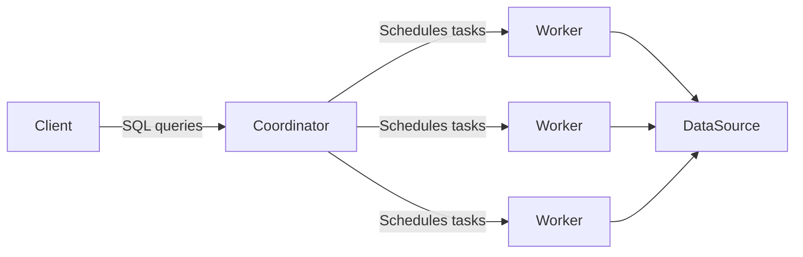
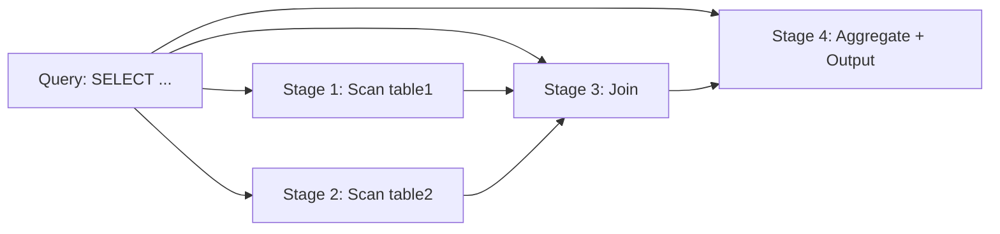
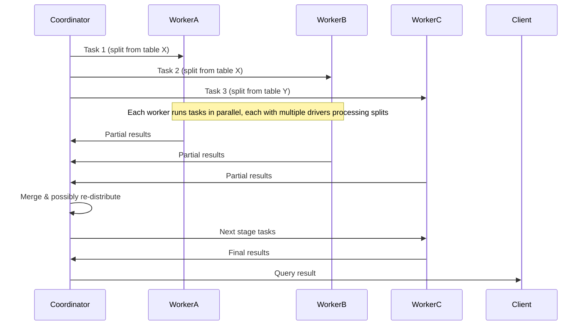

This document provides a *step-by-step*, *PhD-level* explanation of **Trino**’s fundamental concepts, from the high-level architecture (cluster, coordinator, worker, client) down to the low-level execution model (stages, tasks, splits, drivers, and operators). Understanding these concepts is essential for both **end-users** who want to write efficient queries and **Trino administrators/contributors** who need to manage or optimize Trino at scale.

---
## 1. Architecture

### 1.1 Trino Cluster

**Cluster**: A set of Trino nodes—**one** coordinator and **zero or more** workers.  
- Each node is a Java process running Trino.  
- Queries are *orchestrated* by the coordinator, which *distributes* the work to all workers.  
- All nodes access data sources (e.g., databases, data lakes) via **connectors**, which are configured in *catalogs*.

**Visualization**:

1. **Coordinator**: Receives SQL queries from the client, analyzes them, and breaks them into distributed tasks.
2. **Workers**: Execute the tasks assigned, fetch data from data sources, and perform the actual data processing.
3. **Data Sources**: External systems (e.g., Hive, PostgreSQL) that store the data. Trino workers connect to these systems through **connectors**.

### 1.2 Node

A **node** is any Trino process in a cluster. Because Trino recommends one Java process per physical machine (or container), you often hear “node” used to refer to the physical or virtual machine itself.

### 1.3 Coordinator

The “brain” of Trino:
- **Parses** SQL statements.
- **Plans** queries into a distributed execution plan.
- **Manages** worker nodes (which tasks run where).
- **Returns** final results to clients.

### 1.4 Worker

Workers are the “muscles” of Trino:
- Each worker executes parts of the query plan (tasks).
- Pulls data from external data sources or from other stages.
- Returns partial results back to the coordinator or next stage.

### 1.5 Client

Any application or tool that:
- **Submits** SQL statements to Trino.
- **Receives** results (in JSON, tabular, or other formats).

Clients can be:
- Command-line interfaces (e.g., `trino` CLI).
- BI/analytics tools (Tableau, Power BI).
- Custom applications using JDBC/ODBC drivers.

---

## 2. Data Sources, Connectors, and Catalogs

Trino is a **federated query engine**, meaning it can query data across disparate systems:

1. **Data Source**: The external system storing your data (e.g., Hive, Iceberg, PostgreSQL, Cassandra).
2. **Connector**: Adapts Trino’s SPI (Service Provider Interface) to a particular data source. Think of it like a “driver.”
3. **Catalog**: A named configuration in Trino describing how to connect to one data source via a particular connector. For example:
   - `etc/hive.properties` → `hive` catalog  
   - `etc/mysql.properties` → `mysql` catalog  

### 2.1 Schema

Within each **catalog**, you can have multiple **schemas** that further organize your **tables**, **views**, etc.  
For example, if you have a catalog named `hive`, and a schema named `analytics`, you might reference tables as `hive.analytics.mytable`.

### 2.2 Table

A **table** in Trino is an unordered set of rows with named columns. The columns and their types are defined by the connector’s mapping from the underlying data source types to Trino’s SQL types.

---

## 3. Query Execution Model

When you send a query (an ANSI-compatible SQL **statement**) to Trino, it performs the following:

1. **Parse** the statement text.
2. **Plan** the query (logical and distributed plan).
3. **Dispatch** tasks to workers.
4. **Execute** the tasks in parallel.
5. **Return** results to the client.

### 3.1 Statement vs. Query

- **Statement**: The raw SQL text you submit, e.g., `SELECT * FROM hive.default.orders;`.  
- **Query**: The *actual set* of stages, tasks, splits, etc. that Trino instantiates to run that statement.

### 3.2 Stage

Trino breaks a **query** into a **hierarchy** of stages:
- Each stage represents a **portion** of the distributed plan.  
- Stages are *logical constructs* on the coordinator side; they do *not* directly run on workers.

**Example**:

### 3.3 Task

Stages become **tasks** on Trino workers:
- A single stage can run **multiple tasks** in parallel.
- The tasks are the *runnable units* that actually process data (scan, join, aggregate).

### 3.4 Split

**Splits** define the “data chunk” that a task processes at one time:
- If a table is large, Trino will split it into many logical sections (splits) for parallel processing.  
- E.g., reading 10 files from S3 might produce 10 splits.

**Scheduling**: The coordinator assigns splits to tasks running on workers. Each task processes a *subset* of the data.

### 3.5 Driver

Inside each task, **drivers** are the *lowest-level* units of parallelism:
- A driver is a sequence of **operators** that transform data from an input to an output.
- You can have multiple parallel drivers in one task.

### 3.6 Operator

An operator is a data transformation step:
- **Table Scan Operator**: Reads data from a connector.
- **Filter Operator**: Applies a predicate, dropping rows that don’t match.
- **Join Operator**, **Aggregation Operator**, etc.

### 3.7 Exchange

**Exchanges** transfer data between stages, potentially across different workers:
- One stage *produces* data that’s consumed by another.
- Data flows from task outputs to the next stage’s *exchange client*.

---

## 4. Putting It All Together

**High-Level Data Flow** (Example)
![[Screenshot 2025-02-12 at 5.31.24 PM.png]]

1. The **coordinator** receives a statement.  
2. It **parses** and **plans** the query → building stages.  
3. Stages are **scheduled** as tasks on multiple workers (WorkerA, WorkerB, WorkerC).  
4. Each task processes assigned splits.  
5. Results flow back to the coordinator or onward to another stage.  
6. The **coordinator** merges final results and sends them to the client.

---

## 5. Why These Concepts Matter

- **Performance**: Understanding how data is split and processed in parallel helps you tune queries (e.g., partitioning data to maximize parallelism).
- **Troubleshooting**: If a query is slow, analyzing how tasks and splits are scheduled can show imbalances or bottlenecks.
- **Monitoring**: Tools like the Trino web UI or logs show you stages, tasks, memory usage, splits, etc.
- **Extensions**: Connectors, custom operators, or advanced scheduling rely on understanding these internals.

---

## 6. Summary

1. **Trino is distributed**: You have a coordinator node orchestrating multiple worker nodes.  
2. **Data Sources**: Trino connects to a variety of systems via **connectors**. A **catalog** configures a specific data source.  
3. **Queries** are turned into **stages**, which become **tasks** on workers.  
4. **Splits** define how data is chunked for parallel processing.  
5. **Drivers** inside tasks run **operators**, which transform data.  
6. **Exchanges** pass data between stages (often across nodes).

Armed with this knowledge, you can better reason about **how** Trino executes queries, how to optimize them, and how to diagnose performance issues in a distributed environment.