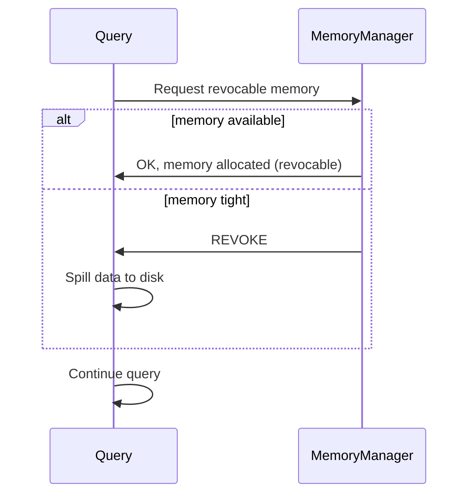

https://trino.io/docs/current/admin/spill.html

This document provides a *comprehensive*, *PhD-level* explanation of **Spill to Disk** (a legacy feature) in Trino. It covers:

1. **Conceptual Overview** of how and why Trino spills data to disk  
2. **Interaction** with Trino memory management  
3. **Performance Implications**, including disk IO, multiple spill paths, compression, and encryption  
4. **Supported Operations** (Joins, Aggregations, Sorts, Window functions)  
5. **Comparison** to fault-tolerant execution with a *task retry policy*

> **Note**: The **spill-to-disk** mechanism is **legacy** in Trino. For large-scale fault tolerance, see [Fault-tolerant Execution](../fault-tolerant-execution) with an exchange manager configured.

---

## 1. High-Level Overview

When a query’s intermediate data exceeds the memory limit (per query or per node), Trino can:

1. **Spill** data from memory to local disk on the worker.
2. **Free** memory for other processes or queries.
3. **Re-load** the spilled data from disk later in the query plan as necessary.

This is analogous to operating system “page swapping,” but implemented at the application/query level to handle Trino-specific needs.
### 1.1 Why Spill?
Without spill:
- Trino **kills** queries that surpass `query_max_memory` or `query_max_memory_per_node`.
- This ensures concurrency fairness but is *inefficient* for large queries that might otherwise succeed if partial data could be temporarily offloaded from memory.
With spill:
- A query can **borrow** “revocable memory,” meaning data in memory can be *revoked* (spilled to disk) at any time if memory becomes constrained.
- The query continues but uses disk-based intermediate storage.
### 1.2 Caveats & Warnings
- **Legacy**: For truly large or fault-tolerant workloads, consider the **task retry** policy with an **exchange manager**. 
- **Still not guaranteed** to complete massive queries. If the data chunk needed at once is too large, Trino can still fail with `Out of memory`.  
- Spilling typically **slows** queries by orders of magnitude due to disk I/O overhead.  
- You must ensure sufficient **disk capacity** and **IO bandwidth** for the spill paths.

---
## 2. Memory Management & Spill

### 2.1 Default Behavior (No Spill)
Under default settings:
1. A query requests memory. 
2. If the memory request would exceed the configured limits (`query_max_memory`, `query_max_memory_per_node`), the query is **terminated**.
### 2.2 Revocable Memory
**Revocable memory** is an advanced concept:
- It **does not** count toward memory limits initially.
- The memory manager can revoke it at any time, forcing the operator(s) to spill data to disk.
Example Flow:



If multiple queries demand memory, the memory manager can forcibly reclaim “revocable” memory and instruct the query to spill.
### 2.3 Practical Outcome
- If the cluster is idle or has abundant memory, a large query might remain fully in-memory, thus *faster*.
- If memory is constrained or many queries run concurrently, the same large query might frequently spill to disk, severely impacting performance.

---

## 3. Spill Disk Space

**Disk I/O** can become the bottleneck for queries that spill heavily. Hence:

1. Provide **multiple spill paths** on separate physical disks. This is akin to “JBOD” approach: 
 
   spiller-spill-path=/mnt/spill1,/mnt/spill2
     
1. **Avoid** using the system OS drive (especially not the same partition as logs). This could degrade both query performance and system stability.
2. **Monitor** disk utilization (space & IOPS) on these devices.

---
## 4. Compression & Encryption
### 4.1 Compression
When **spill compression** is enabled (`spill-compression-codec`):
- Pages are **compressed** before writing to disk, reducing I/O volume but increasing CPU usage.
- Decompressed when loaded back from disk.

This is a trade-off between **CPU overhead** vs. **faster** disk read/write (less data physically written).
### 4.2 Encryption
When **spill encryption** is enabled (`spill-encryption-enabled`):
- Each spill file is encrypted with a random key.
- Prevents unauthorized data recovery from spilled files.
- Increases CPU overhead and reduces I/O throughput.
- If used, consider lowering `memory-revoking-threshold` to account for the extra time spent encrypting/decrypting spills.

---
## 5. Supported Operations
Not all Trino operators can spill to disk, and the behavior can vary:
### 5.1 Joins

- Spilling is done for the **build side** of the join (the table that must be fully hashed/stored in memory).
- If `task.concurrency > 1`, the build side is **partitioned**. Trino can spill selected partitions (and corresponding rows in the probe side), then read them back one-by-one.
- This effectively reduces peak memory usage to “size of largest partition.” 
  - Example: with `task.concurrency = 4` and no data skew, each partition ~25% of total build size.

### 5.2 Aggregations

- Large grouping sets or partial aggregations can require storing many intermediate group rows.
- If memory is tight, the intermediate aggregation results are **spilled**, then re-loaded and merged in smaller chunks.

### 5.3 Order By (Sorting)

- For large sorts, the operator can write intermediate sorted runs to disk.
- On merge, it re-reads those runs, merges them in memory.

### 5.4 Window Functions

- Window operators buffer data rows to apply the window logic (e.g., running totals).
- If the window is large, the operator can spill to disk.  
- **Current limitation**: Not all window patterns are spillable. A very large single partition may still cause OOM if it can’t be chunked.

---

## 6. Example Code & Flow

### 6.1 Pseudocode for a Spilling Join Operator

```java
public class SpillingHashJoinOperator
{
    private MemoryAllocator revocableMemory;
    private List<Partition> buildPartitions;
    private SpillHandler spillHandler;
    private boolean memoryRevoked = false;

    public void addBuildRow(Row row) {
        // If memory is low, the memory manager triggers spill
        if (memoryRevoked) {
            spillPartition(...);
        }
        // else store in-memory
        ...
    }

    private void spillPartition(Partition partition) {
        spillHandler.writeToDisk(partition);
        partition.clearInMemory();
    }

    @Override
    public void memoryRevocationRequested() {
        this.memoryRevoked = true;
    }
}
```

### 6.2 Visualization

```mermaid
flowchart LR
    A[Trino Worker Node] -->|Query Execution| B[HashJoin Build Table]
    B --> C{Memory Low?}
    C -- No -->|Continue in-memory| D[Output partial result]
    C -- Yes -->|Spill| E[Write Partition to Disk]
    E --> F[Disk files]
    F --> B[Reload partition later]
    B --> D[Output partial result]
```

1. The join operator tries to store the build side in memory.  
2. If memory is ample, no spill occurs.  
3. If memory is tight, some partitions are **spilled** to disk and later re-read.

---

## 7. Performance Considerations

1. **Disk Throughput**: Spilling can cause significant disk I/O. Queries may become bound by disk speed.  
2. **Task Concurrency**: For joins, a higher concurrency means more partitions → smaller partitions on average → less memory usage but more overhead in partition management.  
3. **Compression & Encryption**: Improves data confidentiality and reduces I/O, but at extra CPU cost.  
4. **Partial Failure**: If the operator can’t break data down small enough to fit in memory, the query can still fail with OOM.

---

## 8. Comparison to Fault-Tolerant Execution

| **Feature**        | **Spill to Disk**          | **Fault-tolerant (Task Retry) Execution**        |
|--------------------|----------------------------|--------------------------------------------------|
| **Mechanism**      | Writes intermediate data on the same node’s local disk | Spools intermediate data (often to external object storage) |
| **Granularity**    | Operator-level spill for join, aggregation, etc. | Full task-level re-execution if a node fails or runs OOM |
| **Resilience**     | If a node dies, spilled data on that node is lost | If a node dies, data is in external spool, re-runs task on another node |
| **Performance**    | Potentially large disk overhead on local node. | Potential network overhead, but more robust scaling.       |
| **Recommendation** | Legacy approach for partial memory relief.        | For large queries, recommended approach with `TASK` retry. |

---

## 9. Summary

**Spill-to-disk** allows Trino to handle queries that exceed in-memory limits by temporarily offloading intermediate data to local disk. This:

- Minimizes query failures caused by memory constraints.  
- Potentially *greatly* slows queries due to I/O overhead.  
- Requires thoughtful disk planning (multiple local drives, no OS drive collision).  
- Works selectively for joins, aggregations, sorts, and window functions.  

In modern Trino deployments, especially at large scale or needing robust fault tolerance, **`retry-policy=TASK`** with an **exchange manager** is often preferred. Still, spill-to-disk remains a valuable fallback for certain specialized or legacy configurations.
```