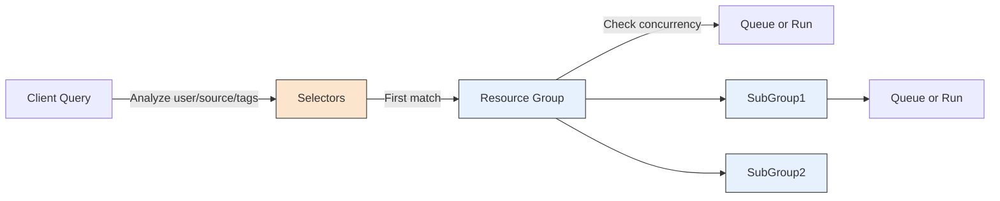

This document provides a *comprehensive*, *PhD-level* introduction to **resource groups** in Trino. Resource groups allow fine-grained **control** of how queries use resources (CPU, memory, concurrency) and enable **queueing** and **prioritization** across different sets of queries.

---
## 1. Overview
**Resource Groups**:
- Provide limits on query concurrency, memory usage, and queueing depth.
- A single query belongs to one resource group.
- When a resource group’s limit is reached, **new queries** go into a queue (they do not fail), until resources free up.
- Resource groups can be **nested**, forming a hierarchy. A resource group may either:
  - **Contain** sub-groups, or
  - **Directly accept** queries, but **not** both.

You can dynamically configure resource groups via a *configurable manager*, either:
1. **File-based**: reading a JSON config.
2. **Database-based**: loading from tables in MySQL, PostgreSQL, or Oracle.

---

## 2. Configuration Managers

### 2.1 File Resource Group Manager

```ini
resource-groups.configuration-manager=file
resource-groups.config-file=etc/resource-groups.json
```

- The manager reads a JSON file at `etc/resource-groups.json` (path relative to Trino’s data directory, or absolute).
- The JSON defines a **tree** of resource groups, plus **selectors** to decide which queries go into which group.

### 2.2 Database Resource Group Manager

```ini
resource-groups.configuration-manager=db
resource-groups.config-db-url=jdbc:mysql://localhost:3306/resource_groups
resource-groups.config-db-user=username
resource-groups.config-db-password=password
```

- Loads configuration from tables named:
  - `resource_groups_global_properties`  
  - `resource_groups`  
  - `selectors`
- If these tables don’t exist, Trino **creates** them on startup.
- The manager **reloads** configuration every `resource-groups.refresh-interval` (default 1s).

---

## 3. Key Resource Group Properties

Each resource group has:

1. **`name`** (required): A unique identifier; can contain templates like `${USER}` or `${SOURCE}`.
2. **`maxQueued`** (required): Limit of queued queries before new queries are **rejected**.
3. **`softConcurrencyLimit`** (optional): # of running queries after which new queries only run if peers are not eligible or also above the limit.
4. **`hardConcurrencyLimit`** (required): Absolute max # of running queries.
5. **`softMemoryLimit`** (required): The fraction or absolute memory limit for running queries. Exceeding this queues new queries until usage drops.
6. **`softCpuLimit`** and **`hardCpuLimit`** (optional): CPU usage quotas over a time window `cpuQuotaPeriod`. Exceeding the soft limit reduces concurrency. Hitting the hard limit blocks new queries from starting.
7. **`schedulingPolicy`** (optional):
   - **`fair`**: Round-robin among sub-groups in first-in-first-out order.
   - **`weighted_fair`**: Weighted by `schedulingWeight`; sub-groups with fewer concurrent queries relative to their weight get the next query slot.
   - **`weighted`**: Queries are picked in proportion to their `query_priority`, sub-groups are picked in proportion to `schedulingWeight`.
   - **`query_priority`**: Strict ordering by `query_priority`. Sub-groups also must have this property set.
8. **`schedulingWeight`** (optional): Weight factor used in the `weighted` or `weighted_fair` policies (default 1).
9. **`jmxExport`** (optional): Expose metrics in JMX if `true`.

### 3.1 CPU Quota Period

**`cpuQuotaPeriod`** is a top-level *global* property, not specific to an individual group. This sets the time window over which CPU usage is tracked for `softCpuLimit` and `hardCpuLimit`.

---

## 4. Selector Rules

A **selector** determines which resource group a query belongs to. Multiple fields can match:

- **`user`**: Java regex on user name.
- **`userGroup`**: Java regex on user groups that user belongs to.
- **`source`**: Java regex on the `source` property of the query (e.g. CLI `--source`, or a JDBC property).
- **`queryType`**: e.g. `SELECT`, `INSERT`, `DELETE`, `UPDATE`, etc.
- **`clientTags`**: A list of tags that must all match.
- **`group`**: The resource group that matched queries should run in.

Selectors are processed **in order**, and the **first match** is used. Named regex capturing groups can dynamically create sub-group names like `bi-${toolname}`.

---

## 5. Example JSON Configuration (File Manager)

```json
{
  "rootGroups": [
    {
      "name": "global",
      "softMemoryLimit": "80%",
      "hardConcurrencyLimit": 100,
      "maxQueued": 1000,
      "schedulingPolicy": "weighted",
      "jmxExport": true,
      "subGroups": [
        {
          "name": "data_definition",
          "softMemoryLimit": "10%",
          "hardConcurrencyLimit": 5,
          "maxQueued": 100,
          "schedulingWeight": 1
        },
        {
          "name": "adhoc",
          "softMemoryLimit": "10%",
          "hardConcurrencyLimit": 50,
          "maxQueued": 1,
          "schedulingWeight": 10,
          "subGroups": [
            {
              "name": "other",
              "softMemoryLimit": "10%",
              "hardConcurrencyLimit": 2,
              "maxQueued": 1,
              "schedulingWeight": 10,
              "schedulingPolicy": "weighted_fair",
              "subGroups": [
                {
                  "name": "${USER}",
                  "softMemoryLimit": "10%",
                  "hardConcurrencyLimit": 1,
                  "maxQueued": 100
                }
              ]
            },
            {
              "name": "bi-${toolname}",
              "softMemoryLimit": "10%",
              "hardConcurrencyLimit": 10,
              "maxQueued": 100,
              "schedulingWeight": 10,
              "schedulingPolicy": "weighted_fair",
              "subGroups": [
                {
                  "name": "${USER}",
                  "softMemoryLimit": "10%",
                  "hardConcurrencyLimit": 3,
                  "maxQueued": 10
                }
              ]
            }
          ]
        },
        {
          "name": "pipeline",
          "softMemoryLimit": "80%",
          "hardConcurrencyLimit": 45,
          "maxQueued": 100,
          "schedulingWeight": 1,
          "jmxExport": true,
          "subGroups": [
            {
              "name": "pipeline_${USER}",
              "softMemoryLimit": "50%",
              "hardConcurrencyLimit": 5,
              "maxQueued": 100
            }
          ]
        }
      ]
    },
    {
      "name": "admin",
      "softMemoryLimit": "100%",
      "hardConcurrencyLimit": 50,
      "maxQueued": 100,
      "schedulingPolicy": "query_priority",
      "jmxExport": true
    }
  ],
  "selectors": [
    {
      "user": "bob",
      "group": "admin"
    },
    {
      "userGroup": "admin",
      "group": "admin"
    },
    {
      "source": ".*pipeline.*",
      "queryType": "DATA_DEFINITION",
      "group": "global.data_definition"
    },
    {
      "source": ".*pipeline.*",
      "group": "global.pipeline.pipeline_${USER}"
    },
    {
      "source": "jdbc#(?<toolname>.*)",
      "clientTags": ["hipri"],
      "group": "global.adhoc.bi-${toolname}.${USER}"
    },
    {
      "group": "global.adhoc.other.${USER}"
    }
  ],
  "cpuQuotaPeriod": "1h"
}
```

### 5.1 Explanation

1. **Global** group:
   - `hardConcurrencyLimit=100` → total concurrency across sub-groups is at most 100.  
   - `softMemoryLimit=80%` → once 80% of cluster memory is in use by queries in `global`, new queries queue.  
2. **Sub-group: `data_definition`**:
   - For DDL queries from a pipeline source.  
   - Up to 5 concurrent queries, memory limit 10% of cluster.  
3. **Sub-group: `adhoc`**:
   - Has child sub-groups `other` and `bi-${toolname}`.  
   - Weighted concurrency with 10 vs 1 for other sub-groups in `global`.  
4. **Sub-group: `pipeline`**:
   - Up to 45 concurrent queries, 80% memory limit.  
   - Each user gets a dynamic sub-group (`pipeline_${USER}`) with 5 concurrency.

**Selectors**:
1. The user `bob` or user group `admin` → `admin` group (high concurrency, `query_priority` scheduling).  
2. If `source` has `pipeline`, query type is `DATA_DEFINITION` → `global.data_definition`.  
3. If `source` has `pipeline`, else → `global.pipeline.pipeline_${USER}`.  
4. If `source` matches `jdbc#(?<toolname>.*)` and has clientTags = `[hipri]`, → `global.adhoc.bi-${toolname}.${USER}`.  
5. Everything else → `global.adhoc.other.${USER}`.

---

## 6. Scheduling Weight Example

Consider two sub-groups under the same parent:

```json
{
  "name": "pipeline",
  "schedulingWeight": 350
},
{
  "name": "adhoc",
  "schedulingWeight": 150
}
```

- Total weight = 350 + 150 = 500.
- “Pipeline” sub-group gets ~70% of concurrency slots, “adhoc” ~30%.
- If both sub-groups are saturated, 7 out of 10 queries start in pipeline, 3 out of 10 in adhoc.

---

## 7. Database Resource Group Manager Example

A MySQL-based config. The manager reads from three tables:

1. `resource_groups_global_properties` → set `cpu_quota_period` to `1h`.
2. `resource_groups` → hierarchical definitions with parent-child references.
3. `selectors` → rules for user, source, etc.

**Table Insertion**:
```sql
INSERT INTO resource_groups_global_properties (name, value) VALUES ('cpu_quota_period', '1h');
-- root group 'global' with concurrency=100
INSERT INTO resource_groups (...) VALUES ('global','80%',100,1000,'weighted',true,'test_environment',NULL);
-- 'data_definition', 'adhoc', 'pipeline' sub-groups, referencing parent=global
-- sub-sub groups like 'other', 'bi-${toolname}', 'pipeline_${USER}' referencing their parent IDs
-- ...
```

**Selectors**:
```sql
INSERT INTO selectors (resource_group_id, user_regex, priority)
  VALUES ((SELECT resource_group_id FROM resource_groups WHERE name='admin'), 'bob', 6);
-- etc.
```

Trino **polls** the database every `resource-groups.refresh-interval` seconds. If the DB is unreachable for `resource-groups.max-refresh-interval`, queries will fail due to stale config.

---

## 8. Query Flow Visualization



1. **Selector** logic chooses which resource group the query belongs to.
2. The query either:
   - **Runs** if concurrency/memory is under the limit, or
   - **Queues** otherwise, up to `maxQueued`.

---

## 9. Operational Tips

1. **Template Groups**: Use `${USER}`, `${SOURCE}`, or custom named capture groups `(?<toolname>.*)` to create dynamic sub-groups.
2. **Monitor**:
   - If `jmxExport=true`, you can track concurrency, queued counts, etc. in JMX.  
3. **Priorities**:
   - The `query_priority` scheduling policy enforces strict ordering of queries by their session `query_priority`.
   - Weighted policies (`weighted_fair`, `weighted`) distribute concurrency proportionally to `schedulingWeight`.
4. **Memory**:
   - The `softMemoryLimit` (e.g., `80%`) is a fraction of total *distributed* memory. Exceeding it queues new queries.
5. **CPU**:
   - The `softCpuLimit` and `hardCpuLimit` track CPU usage over `cpuQuotaPeriod`. If you exceed `softCpuLimit`, concurrency is penalized. At `hardCpuLimit`, new queries cannot start.

---

## 10. Conclusion

**Resource groups** provide powerful **governance** for how queries run in a Trino cluster, preventing resource starvation and ensuring fairness or priority. By **nesting** groups, you can define complex policies:

- Per-user concurrency  
- Weighted fair scheduling  
- CPU time quotas  
- Memory-based queueing  

**Selectors** tie queries to these groups using user, group, source, query type, or tags. This can be managed either in a **JSON config file** or a **relational database** for dynamic updates.
