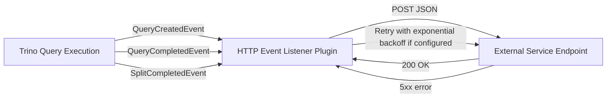

https://trino.io/docs/current/admin/event-listeners-http.html

This document provides a *comprehensive*, *PhD-level* overview of the **HTTP Event Listener** plugin in Trino. The plugin streams query events (e.g., query creation, completion, split events) to an external service by **POSTing** JSON payloads to a configured HTTP/S endpoint.

---
## 1. Rationale & Overview
- **Why?**  
  - Trino exposes *rich* metrics and details about each query’s usage (CPU, memory, data access patterns).  
  - **Capturing** these events externally (e.g., in a logging service, data pipeline, or monitoring system) provides insights into query workloads.  
  - Running the ingestion separately from Trino reduces overhead on the query engine and avoids downtime for non-client-facing updates.
- **How?**  
  - Trino triggers the **HTTP event listener** plugin with query events.  
  - The plugin **encodes** events as JSON, and **POSTs** them to a configured remote URI.
---
## 2. Requirements & Setup
1. **HTTP Ingestion Service**  
   - Provide an endpoint (HTTP or HTTPS) that accepts `POST` requests with JSON bodies.  
   - You can build your own microservice or use a logging solution (e.g., Splunk, Elasticsearch, etc.) with a suitable HTTP endpoint.
2. **Trino Configuration**  
   - **Enable** the HTTP event listener plugin.  
   - **Specify** the remote ingest URI (e.g., `http-event-listener.connect-ingest-uri=http://my.service/event`).
   - **Choose** which events to log (created, completed, split).
### 2.1 Minimal Steps
1. **Create** `etc/http-event-listener.properties`:
   ```ini
   event-listener.name=http

   # The type of events to log
   http-event-listener.log-created=true
   http-event-listener.log-completed=false
   http-event-listener.log-split=false

   # The remote endpoint
   http-event-listener.connect-ingest-uri=http://myeventservice:8080/trinoEvents

   # Optional: custom headers
   http-event-listener.connect-http-headers="Authorization:Bearer mytoken"
   ```
2. **Update** Trino config to load this file as part of `event-listener.config-files` in `etc/config.properties`:
   ```ini
   event-listener.config-files=etc/http-event-listener.properties
   ```
3. **Restart** Trino if necessary to pick up the new event listener plugin.

---

## 3. Configuration Properties

Below is a table summarizing key properties:

| **Property**                                        | **Description**                                                                  | **Default** |
|-----------------------------------------------------|----------------------------------------------------------------------------------|------------|
| `http-event-listener.log-created`                   | Whether to POST `QueryCreatedEvent` events                                      | `false`    |
| `http-event-listener.log-completed`                 | Whether to POST `QueryCompletedEvent` events                                    | `false`    |
| `http-event-listener.log-split`                     | Whether to POST `SplitCompletedEvent` events                                    | `false`    |
| `http-event-listener.connect-ingest-uri`            | URI to which events are posted (required)                                       | _None_     |
| `http-event-listener.connect-http-headers`          | Comma-separated list of custom headers                                          | (empty)    |
| `http-event-listener.connect-retry-count`           | Number of retries on **server error** (>=500)                                   | `0`        |
| `http-event-listener.connect-retry-delay`           | Delay between retries (time unit, e.g. `1s`)                                    | `1s`       |
| `http-event-listener.connect-backoff-base`          | Exponential backoff base factor. E.g. if `2`, then attemptDelay = retryDelay * 2^attempt.  | `2`        |
| `http-event-listener.connect-max-delay`             | Maximum cap for the delay between retries                                       | `1m`       |
| `http-event-listener.connect-*`                     | Additional custom config passed to underlying HTTP client                       |            |

### 3.1 Retry Logic

When `connect-retry-count` is set, the plugin will attempt to resend the event if the service responds with an **HTTP 5xx** error. The formula for the next attempt’s delay:

\[
\text{attemptDelay} = \text{retryDelay} \times \text{backoffBase}^{\text{attemptCount}}
\]

If `connect-backoff-base` = 1 or empty, it becomes a constant delay. If you set `connect-backoff-base` = 2, each attempt delay will double up to `connect-max-delay`.

---

## 4. Example Code Snippets

### 4.1 HTTP Endpoint

**Pseudo-code** for a minimal Java-based ingestion service using Spring Boot:

```java
@RestController
public class TrinoEventController {

    @PostMapping("/trinoEvents")
    public ResponseEntity<String> receiveTrinoEvent(@RequestBody String eventJson) {
        // Parse or store JSON
        // e.g. send to Kafka, or log to Splunk
        System.out.println("Received event from Trino:\n" + eventJson);

        // Return 2xx to indicate success
        return ResponseEntity.ok("Event processed");
    }
}
```

### 4.2 Trino Plugin Config

Example `http-event-listener.properties`:

```ini
event-listener.name=http

# We want to log query creation and completion
http-event-listener.log-created=true
http-event-listener.log-completed=true

# Post events to our local ingestion service
http-event-listener.connect-ingest-uri=http://localhost:8080/trinoEvents

# Add an auth header
http-event-listener.connect-http-headers="Authorization:Bearer supersecret"

# Retry 3 times with an exponential backoff
http-event-listener.connect-retry-count=3
http-event-listener.connect-backoff-base=2
http-event-listener.connect-max-delay=60s
```

With the above config, you get:

- **Created** event as soon as a query is registered.  
- **Completed** event when it finishes (success or failure).  
- The plugin attempts **up to 3** times on `5xx` errors, doubling the delay each time (start at 1s, 2s, 4s, etc.), capping at 60s.

---

## 5. Visualization



1. Trino detects a new query or a completed query (or completed split).  
2. If **log-created** or **log-completed** or **log-split** is enabled, the plugin creates a JSON payload.  
3. The plugin **POSTs** this payload to the configured URI.  
4. On success, do nothing. On 5xx error, the plugin may **retry** if configured.

---

## 6. Custom HTTP Headers

You can send additional metadata to the ingestion service using `connect-http-headers`. For example:

```ini
http-event-listener.connect-http-headers="Tenant-Id:trino_tenant,User-Agent:TrinoEventListener"
```

If you need to include commas or colons, escape them with `\`.

---

## 7. Performance Considerations

- The plugin runs in the **Trino coordinator** process.  
- If the ingestion endpoint is slow or frequently failing, it could cause overhead or queued events.  
- The plugin posts events asynchronously, but if reattempts are many or large, it can degrade performance.  
- Use **short timeouts** or an internal queue if your ingestion system can be slow or prone to failures.

---

## 8. Use Cases

1. **Audit / Usage Monitoring**  
   - Track which columns or tables are frequently queried.  
   - Identify slow queries, large memory usage, or suspicious activity.

2. **Billing & Chargeback**  
   - In a multi-tenant environment, log usage events with tenant labels.  
   - Bill or allocate costs based on query usage.

3. **Real-Time Dashboards**  
   - Visualize query concurrency, success/failure rates, etc.  
   - Provide immediate feedback to platform operators.

4. **Offline Logging**  
   - Collect logs in Splunk/Elasticsearch for post-processing and anomaly detection.

---

## 9. Conclusion

The **HTTP event listener** plugin is a straightforward mechanism to:

- **Capture** query-level or split-level events in real time.  
- **Push** them to an external system for analytics, auditing, or cost tracking.  
- Configure **retries** and **custom headers** to adapt to your ingestion pipeline.

By carefully setting properties such as `log-created`, `log-completed`, or `log-split`, you control exactly which events are captured. Combine this with a robust ingestion endpoint for an end-to-end monitoring or auditing pipeline that runs independently of the Trino engine.
```