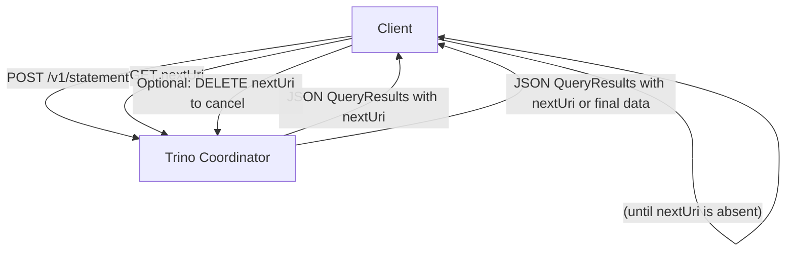

## 1. HTTP Methods

### 1.1 `POST /v1/statement`
- **Action**: Submits a query to the Trino cluster.
- **Body**: Contains the SQL query string (plain text).
- **Returns**: A JSON document containing:
  - The _first batch of query results_ in a field named `data`, if available.
  - A `nextUri` field if there are more results.
  - Various headers to track session state, including any potential cookies or session-specific values that must be echoed in subsequent requests.

### 1.2 `GET nextUri`
- **Action**: Fetches the _next batch of query results_.
- **Returns**: Another JSON document with a `data` field (if there is more data) and potentially another `nextUri`.
- When the returned JSON does **not** contain `nextUri`, the query has finished (successfully or with an error).

### 1.3 `DELETE nextUri`
- **Action**: Terminates a running query early. Useful if the client no longer needs the results or wants to abort execution.

---

## 2. Overview of Query Processing

### 2.1 Initial Request Flow

1. **Client issues an HTTP POST** to `/v1/statement`, sending:
   ```http
   POST /v1/statement
   Content-Type: text/plain
   
   SELECT * FROM some_table;
   ```
2. **Client request headers**:  
   - These can set session properties, trace tokens, and various other client context parameters.  
   - **Important**: These headers are primarily required on the **initial** request (the `POST`). Subsequent requests may not need them unless explicitly stated.

3. **Server Response**:
   - A JSON document, typically of type **`QueryResults`**:
     ```json
     {
       "id": "query_id",
       "infoUri": "http://...",
       "nextUri": "http://...",
       "columns": [
         {
           "name": "column1",
           "type": "varchar"
         }
         // ...
       ],
       "data": [
         [ "value1", ... ],
         [ "value2", ... ]
       ]
       // If an error occurs:
       // "error": { "message": "...", "errorCode":  ... }
     }
     ```
   - Some **HTTP response headers** may be included (for example, session management headers).  
   - If `nextUri` is **absent**, the query is complete. If `nextUri` is present, the client must continue fetching more data batches.

### 2.2 Ongoing Requests for Additional Data
- **Client GET** to the `nextUri`:
  - Continues the data retrieval process in smaller batches.
  - Each response can contain a `nextUri` for subsequent results.
- **Loop**:
  1. GET `nextUri`
  2. Inspect JSON for new `data` and another `nextUri`
  3. Repeat until there is **no** `nextUri`

### 2.3 Query Termination
- If the client chooses to stop retrieving data before the query naturally completes:
  - **`DELETE nextUri`**: This explicitly instructs Trino to **cancel** the query.

---

## 3. Handling HTTP Status Codes

### 3.1 Intermittent Errors (502, 503, 504)
- **Meaning**: Usually a problem with load balancers or network proxies in front of Trino.  
- **Client Action**:  
  - Wait 50–100 ms  
  - Retry the request to the same `nextUri` or to the `/v1/statement` endpoint if it was the initial request.

### 3.2 Rate Limiting (429)
- **Meaning**: The server indicated too many requests or resource constraints.  
- **Client Action**:  
  - Respect the `Retry-After` header.  
  - Wait for the specified duration before resending the request.

### 3.3 Other Failures (Any status besides 200, 429, 502, 503, 504)
- **Meaning**: Query has failed.  
- **Client Action**:  
  - Stop further attempts, examine the JSON `error` object for more details on failure.

---

## 4. Response Format Details

### 4.1 `QueryResults` JSON

| Field           | Description                                                                              |
|-----------------|------------------------------------------------------------------------------------------|
| `id`            | The internal ID assigned to the query by Trino.                                          |
| `infoUri`       | A URL pointing to a human-friendly query information page (often the Web UI).            |
| `nextUri`       | The URL to retrieve the next set of query results. Absent if no more data is available.  |
| `columns`       | An array describing the columns of the returned data.                                    |
| `data`          | A 2D array containing the actual row data. Each sub-array corresponds to a row.          |
| `stats`         | Contains basic statistics about query execution (time elapsed, bytes processed, etc.).   |
| `error`         | If present, indicates the query has failed. Includes message, error code, and stack info.|
| `status`        | A textual hint about the query state. **Not** reliable for programmatic checks.          |

### 4.2 Example Successful Response

```json
{
  "id": "20230211_123456_00001_abcdef",
  "infoUri": "http://trino.example.com/ui/query.html?20230211_123456_00001_abcdef",
  "nextUri": "http://trino.example.com/v1/statement/20230211_123456_00001_abcdef/2",
  "columns": [
    { "name": "employee_id", "type": "bigint" },
    { "name": "employee_name", "type": "varchar" }
  ],
  "data": [
    [123, "Jane Doe"],
    [456, "John Smith"]
  ],
  "stats": {
    "state": "RUNNING",
    "queued": false,
    "completedSplits": 10,
    "totalSplits": 100
  },
  "status": "RUNNING"
}
```

### 4.3 Example Failure Response

```json
{
  "id": "20230211_123456_00001_abcdef",
  "error": {
    "message": "Syntax error at line 1: ...",
    "errorCode": 1,
    "errorName": "SYNTAX_ERROR",
    "errorType": "USER_ERROR",
    "failureInfo": {
      // stack trace details, if available
    }
  },
  "stats": {
    "state": "FAILED",
    "queued": false,
    "completedSplits": 0,
    "totalSplits": 0
  }
}
```

---

## 5. Visualizing the Workflow



1. **Step A → B**: Client submits initial query via POST to `/v1/statement`.  
2. **Step B → A**: Trino responds with the **first batch** of rows (in `data`), possibly with a `nextUri`.  
3. **Step A → B**: Client sends `GET` to `nextUri`.  
4. **Repeated** until `nextUri` is **absent** (query finished) or the client sends a `DELETE` request to terminate.  

---

## 6. Practical Tips

1. **Session Management**:  
   - The response headers from Trino must be echoed back by the client in subsequent requests. These may include session cookies or other tokens that track the query’s status.

2. **Error Recovery**:  
   - Check for **502, 503, 504** (network/time-out/proxy errors) → Retry.  
   - Check for **429** (rate-limited) → Use `Retry-After` header.  
   - Otherwise, the query has **failed** or is complete.

3. **Performance**:  
   - The size of each batch returned can be configured in Trino. Larger result sets mean more `GET` calls to retrieve all results.

4. **Status Field**:  
   - Only for user-friendly hints (like “RUNNING”, “QUEUED”, “FINISHED”).  
   - **Do not** rely on `status` to determine if the query has finished. **Use absence of `nextUri`**.

---

## 7. Summary

1. **POST** the SQL to `/v1/statement`.
2. Read initial results, gather session and header info, note `nextUri`.
3. **Loop**:  
   - `GET nextUri`, parse results, repeat.
4. If needed, **`DELETE nextUri`** to cancel.
5. Handle all **HTTP status codes** appropriately, especially 429 and 502–504.

These endpoints and the process allow a client to interact in a stateful manner with Trino for large-scale SQL queries over HTTP, providing partial results incrementally and robust mechanisms for handling retry and cancellation scenarios.
```