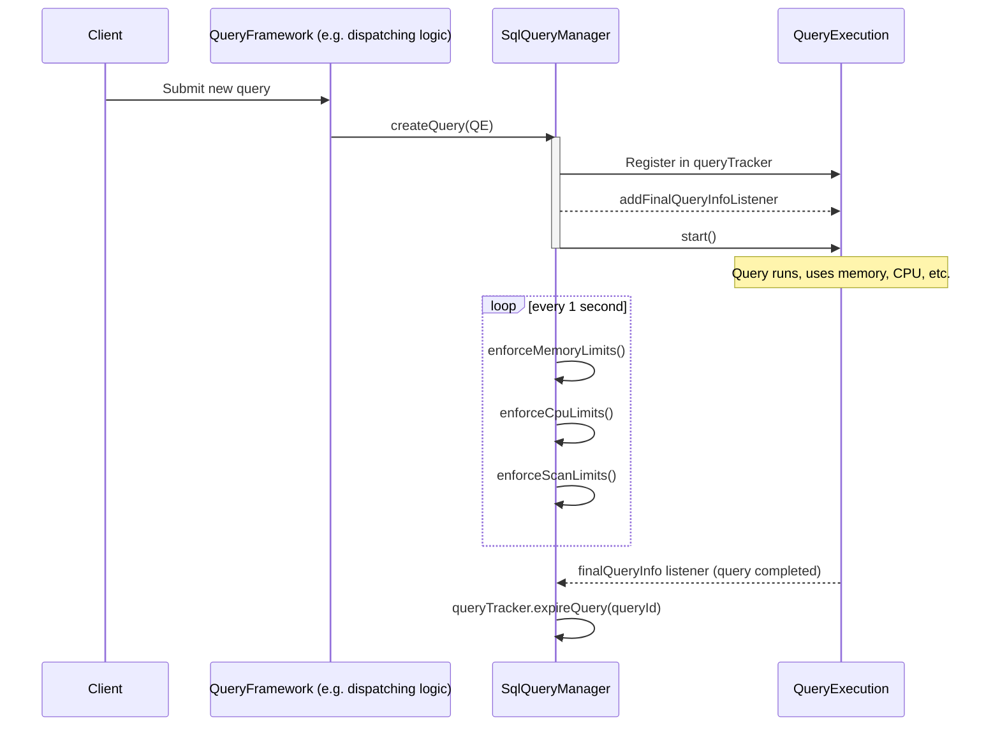
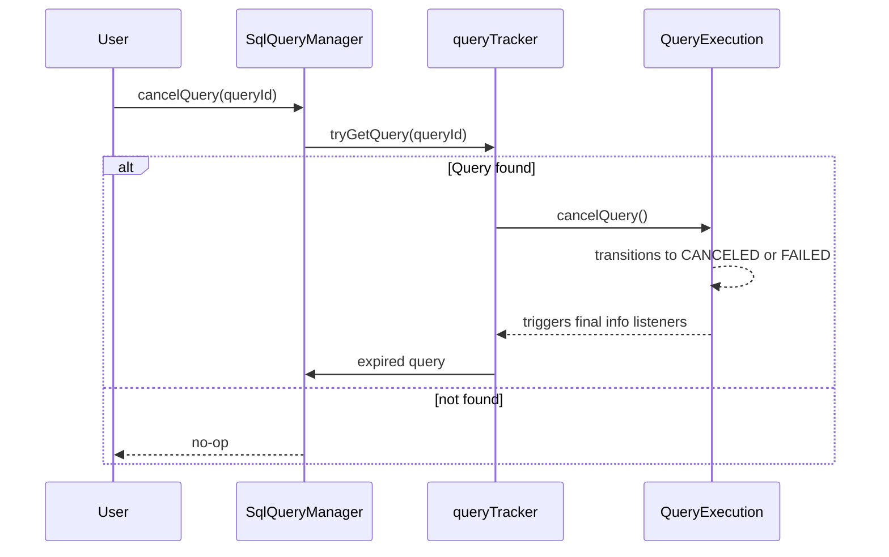

This document provides a *comprehensive* look into the **`SqlQueryManager`** class, part of Trino’s internal query execution subsystem. We’ll explore:

1. **Purpose of `SqlQueryManager`**  
2. **Construction and Configuration**  
3. **Lifecycle Hooks** (`@PostConstruct`, `@PreDestroy`)  
4. **Query Lifecycle** (creation, tracking, enforcement)  
5. **Key Methods** for query limits, state management, and concurrency  
6. **Examples and Visual Diagrams**

---

## 1. Purpose of `SqlQueryManager`

`SqlQueryManager` is responsible for:
- **Managing the lifecycle of queries**: from creation (`createQuery`) to final state (successful completion or failure).  
- **Tracking queries** via an internal `QueryTracker<QueryExecution>` object.  
- **Enforcing resource limits** (CPU time, memory usage, scan data size).  
- **Exposing** query statistics and states (e.g., for UI, monitoring tools).  
- **Orchestrating concurrency** through internal executors that schedule query tasks.

It implements the **`QueryManager`** interface, meaning it provides all necessary methods for clients (or other internal components) to observe and manipulate query states.

---
## 2. Construction and Configuration

```java
@Inject
public SqlQueryManager(ClusterMemoryManager memoryManager, Tracer tracer, QueryManagerConfig queryManagerConfig)
{
    this.memoryManager = requireNonNull(memoryManager, "memoryManager is null");
    this.tracer = requireNonNull(tracer, "tracer is null");

    this.maxQueryCpuTime = queryManagerConfig.getQueryMaxCpuTime();
    this.maxQueryScanPhysicalBytes = queryManagerConfig.getQueryMaxScanPhysicalBytes();

    this.queryExecutor = newCachedThreadPool(threadsNamed("query-scheduler-%s"));
    this.queryExecutorMBean = new ThreadPoolExecutorMBean((ThreadPoolExecutor) queryExecutor);

    this.queryManagementExecutor = newScheduledThreadPool(
        queryManagerConfig.getQueryManagerExecutorPoolSize(),
        threadsNamed("query-management-%s")
    );
    this.queryManagementExecutorMBean = new ThreadPoolExecutorMBean((ThreadPoolExecutor) queryManagementExecutor);

    this.queryTracker = new QueryTracker<>(queryManagerConfig, queryManagementExecutor);
}
```

### 2.1 Key Fields

1. **`ClusterMemoryManager memoryManager`**: Adjusts/monitors cluster-level memory usage across queries.  
2. **`Tracer tracer`**: For OpenTelemetry tracing (spans) around query operations.  
3. **`maxQueryCpuTime` / `maxQueryScanPhysicalBytes`**: Global (server-level) CPU and scan-size limits.  
4. **`queryExecutor`**: A `CachedThreadPool` for scheduling query tasks.  
   - **`ThreadPoolExecutorMBean`** (via `queryExecutorMBean`) provides JMX monitoring/management of the thread pool.  
5. **`queryManagementExecutor`**: A **scheduled** executor used for periodic tasks like enforcing resource limits.  
   - Also has an MBean (`queryManagementExecutorMBean`) for JMX.  
6. **`queryTracker<QueryExecution>`**: Keeps track of all active queries, providing concurrency control, state changes, and eventual expiration.

---

## 3. Lifecycle Hooks

### 3.1 `@PostConstruct start()`

```java
@PostConstruct
public void start()
{
    queryTracker.start();
    queryManagementExecutor.scheduleWithFixedDelay(() -> {
        try {
            enforceMemoryLimits();
        }
        // ...
        try {
            enforceCpuLimits();
        }
        // ...
        try {
            enforceScanLimits();
        }
        // ...
    }, 1, 1, TimeUnit.SECONDS);
}
```

- **Starts** the `queryTracker`, enabling it to track queries and schedule internal tasks.  
- **Schedules** a **repeating** job every 1 second to:
  - `enforceMemoryLimits()`
  - `enforceCpuLimits()`
  - `enforceScanLimits()`

This ensures that queries exceeding memory, CPU, or scan-size constraints are *promptly aborted*.

### 3.2 `@PreDestroy stop()`

```java
@PreDestroy
public void stop()
{
    queryTracker.stop();
    queryManagementExecutor.shutdownNow();
    queryExecutor.shutdownNow();
}
```

- Stops tracking further queries.  
- **Shuts down** executors so no new tasks can be scheduled, and running tasks are interrupted.

---

## 4. Query Lifecycle

**`SqlQueryManager`** coordinates the entire lifecycle of a query using `QueryExecution` objects (each representing a single query). The states flow roughly:

1. **Create**: `createQuery(...)` registers a new query in `queryTracker`.
2. **Start**: The query moves to an active state (often `RUNNING`).
3. **Monitoring**: The manager enforces resource limits and listens for state changes.
4. **Completion** (success or failure) triggers final info listeners and subsequent resource cleanup.

### 4.1 Creating a Query

```java
@Override
public void createQuery(QueryExecution queryExecution)
{
    requireNonNull(queryExecution, "queryExecution is null");

    if (!queryTracker.addQuery(queryExecution)) {
        throw new TrinoException(GENERIC_INTERNAL_ERROR, format("Query %s already registered", queryExecution.getQueryId()));
    }

    queryExecution.addFinalQueryInfoListener(finalQueryInfo -> {
        queryTracker.expireQuery(queryExecution.getQueryId());
    });

    try (SetThreadName _ = new SetThreadName("Query-" + queryExecution.getQueryId())) {
        try (var ignoredStartScope = scopedSpan(tracer.spanBuilder("query-start")
                .setParent(Context.current().with(queryExecution.getSession().getQuerySpan()))
                .startSpan())) {
            // Start the query execution asynchronously
            queryExecution.start();
        }
    }
}
```

- **Registers** the `QueryExecution` with the `queryTracker`.  
- Adds a **final info listener** so that once the query is done, `expireQuery(...)` is called, removing it from active tracking.  
- Wraps the entire process in *scoped spans* for telemetry (`scopedSpan` and `tracer` usage).  
- Finally, calls `queryExecution.start()`, which actually begins the execution in background threads.

### 4.2 Query Tracker

```java
private final QueryTracker<QueryExecution> queryTracker;
```

- Manages concurrency and lifetime of `QueryExecution` objects.  
- Each `QueryExecution` can register state listeners, finalize on completion, etc.

---

## 5. Key Methods

### 5.1 Getting Query Info

**`SqlQueryManager`** implements `QueryManager` interface methods to:

- **Retrieve basic info**: `getQueryInfo(queryId)`, `getFullQueryInfo(queryId)`, `getResultQueryInfo(queryId)`
- **Get session**: `getQuerySession(queryId)`
- **Check if query exists**: `hasQuery(queryId)`

```java
@Override
public BasicQueryInfo getQueryInfo(QueryId queryId)
{
    return queryTracker.getQuery(queryId).getBasicQueryInfo();
}
```

Each method delegates to the tracked `QueryExecution` object.

### 5.2 State Management (Listeners, Heartbeats, etc.)

```java
@Override
public void addStateChangeListener(QueryId queryId, StateChangeListener<QueryState> listener)
{
    queryTracker.getQuery(queryId).addStateChangeListener(listener);
}

@Override
public void recordHeartbeat(QueryId queryId)
{
    queryTracker.tryGetQuery(queryId)
            .ifPresent(QueryExecution::recordHeartbeat);
}
```

- A **state change listener** can be added to get callbacks whenever a query transitions from `QUEUED` to `RUNNING`, `FINISHED`, `FAILED`, etc.  
- **Heartbeats** let the manager know a query is still alive, preventing it from being considered idle or abandoned.

### 5.3 Cancelling or Failing a Query

```java
@Override
public void cancelQuery(QueryId queryId)
{
    queryTracker.tryGetQuery(queryId)
            .ifPresent(QueryExecution::cancelQuery);
}

@Override
public void cancelStage(StageId stageId)
{
    // look up the query by stageId.getQueryId()
    // call query.cancelStage(stageId)
}
```

1. **Entire query** cancellation: `cancelQuery(queryId)` → transitions the query to `FAILED` or `CANCELED` state.  
2. **Stage-based** cancellation: `cancelStage(stageId)` → partial cancellation for large distributed queries.

### 5.4 Enforcing Limits

Every second, `enforceMemoryLimits()`, `enforceCpuLimits()`, and `enforceScanLimits()` are called.

#### 5.4.1 Memory Limits

```java
private void enforceMemoryLimits()
{
    List<QueryExecution> runningQueries = queryTracker.getAllQueries().stream()
            .filter(query -> query.getState() == RUNNING)
            .collect(toImmutableList());
    memoryManager.process(runningQueries, this::getQueries);
}
```

- Delegates to a `ClusterMemoryManager` to handle queries. The manager might kill or throttle queries if they exceed memory policies.

#### 5.4.2 CPU Time Limits

```java
private void enforceCpuLimits()
{
    for (QueryExecution query : queryTracker.getAllQueries()) {
        Duration cpuTime = query.getTotalCpuTime();
        Duration sessionLimit = getQueryMaxCpuTime(query.getSession());
        Duration limit = Ordering.natural().min(maxQueryCpuTime, sessionLimit);
        if (cpuTime.compareTo(limit) > 0) {
            query.fail(new ExceededCpuLimitException(limit));
        }
    }
}
```

- Compares each query’s accumulated CPU time with the *minimum* of:
  - The **system** CPU limit `maxQueryCpuTime` and  
  - The **session** CPU limit from `getQueryMaxCpuTime(...)`.  
- If usage is beyond the limit, the query is **failed** with `ExceededCpuLimitException`.

#### 5.4.3 Scan Size Limits

```java
private void enforceScanLimits()
{
    for (QueryExecution query : queryTracker.getAllQueries()) {
        Optional<DataSize> limitOpt = getQueryMaxScanPhysicalBytes(query.getSession());
        if (maxQueryScanPhysicalBytes.isPresent()) {
            limitOpt = limitOpt
                    .flatMap(sessionLimit -> maxQueryScanPhysicalBytes.map(serverLimit -> Ordering.natural().min(serverLimit, sessionLimit)))
                    .or(() -> maxQueryScanPhysicalBytes);
        }

        limitOpt.ifPresent(limit -> {
            DataSize scan = query.getBasicQueryInfo().getQueryStats().getPhysicalInputDataSize();
            if (scan.compareTo(limit) > 0) {
                query.fail(new ExceededScanLimitException(limit));
            }
        });
    }
}
```

- Checks each query’s **physical input data size** (the amount of data scanned from storage).  
- Uses a combination of **server** and **session** limits (taking the *minimum*).  
- If the scan bytes exceed the limit, the query fails with `ExceededScanLimitException`.

---

## 6. Examples and Visual Diagram

### 6.1 Typical Flow for a New Query



1. The **client** (or a dispatch manager) calls `createQuery(...)` on `SqlQueryManager`.  
2. `SqlQueryManager` **registers** the `QueryExecution` with `queryTracker`.  
3. The **query** runs in background threads (allocated via `queryExecutor`).  
4. Periodically, `SqlQueryManager` checks resource usage; if thresholds are exceeded, it aborts the query.  
5. On completion, `queryTracker` is updated to expire the query.

### 6.2 Cancelling a Query



- If the query is found, `QE.cancelQuery()` transitions its state, eventually removing it from `queryTracker`.

---

## 7. Key Takeaways

1. **`SqlQueryManager`** is the *primary orchestrator* of query execution in Trino.  
2. It uses a **`QueryTracker`** to maintain a collection of `QueryExecution` objects.  
3. **Resource enforcement** (memory, CPU time, scanned bytes) runs on a scheduled loop, ensuring fairness and preventing runaway queries.  
4. **Concurrency** is managed by two main executors:
   - `queryExecutor` (to schedule query tasks)
   - `queryManagementExecutor` (to schedule repeated limit checks, plus the `QueryTracker`’s own tasks).  
5. **Queries** are expired once they reach a final state, ensuring no memory leaks or indefinite references.

---

## 8. Conclusion

`SqlQueryManager` is central to Trino’s runtime. It:

- **Starts** queries and tracks them from creation to completion.  
- **Keeps** them within resource constraints (memory, CPU, scan bytes).  
- **Coordinates** concurrency with dedicated thread pools and a `QueryTracker`.  
- **Exposes** query states and metadata to external components (UI, client, other server modules).  

By understanding **`SqlQueryManager`**, one gains crucial insight into **Trino’s** *core query execution lifecycle* and how the platform ensures *robustness* and *fair resource usage*.
```