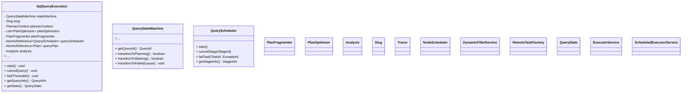
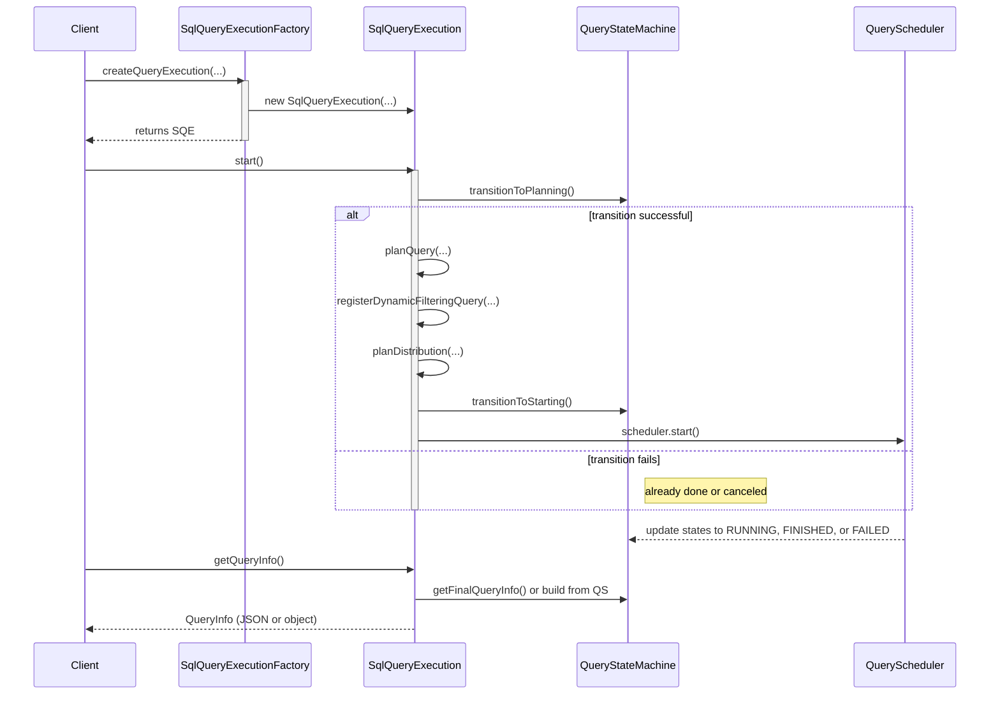

This document provides a detailed explanation of the **`SqlQueryExecution`** class and its associated factory. It explains how a query is analyzed, planned, and ultimately executed. The code is central to understanding Trino’s internal query lifecycle.

---

## 1. Overview of `SqlQueryExecution`

`SqlQueryExecution` is a **core** class that implements the [`QueryExecution`](./QueryExecution.java) interface. It orchestrates the **entire lifecycle** of a SQL query:

1. **Analysis**:
   - Binds parameters, runs the parser and analyzer, and checks for errors (like stack overflows).
2. **Planning**:
   - Applies a sequence of **plan optimizers**.
   - Fragments the logical plan into stages (`PlanFragment` / `SubPlan`).
3. **Distribution Setup**:
   - Determines how the work is **distributed** across nodes.
   - Might enable **dynamic filtering** (reducing data scanned).
4. **Scheduling**:
   - Creates a `QueryScheduler` to schedule splits, tasks, and stages.
5. **Execution**:
   - Orchestrates parallel tasks (via the `RemoteTaskFactory` and scheduler).
6. **Finalization**:
   - Collects query stats, sets final states, ensures resources are cleaned up.

`SqlQueryExecution` holds references to many collaborator objects (e.g., `NodeScheduler`, `DynamicFilterService`, `SplitSourceFactory`, `PlanOptimizers`, etc.) that each perform distinct roles in query execution.

---

## 2. Class Diagram



---

## 3. Constructor and Fields

### 3.1 Constructor

```java
private SqlQueryExecution(
        PreparedQuery preparedQuery,
        QueryStateMachine stateMachine,
        Slug slug,
        Tracer tracer,
        PlannerContext plannerContext,
        AnalyzerFactory analyzerFactory,
        // ...
        ExchangeManagerRegistry exchangeManagerRegistry,
        EventDrivenTaskSourceFactory eventDrivenTaskSourceFactory,
        TaskDescriptorStorage taskDescriptorStorage)
{
    try (SetThreadName _ = new SetThreadName("Query-" + stateMachine.getQueryId())) {
        this.slug = requireNonNull(slug, "slug is null");
        this.tracer = requireNonNull(tracer, "tracer is null");
        this.plannerContext = requireNonNull(plannerContext, "plannerContext is null");
        // ...
        this.stateMachine = requireNonNull(stateMachine, "stateMachine is null");

        // analyze query
        this.analysis = analyze(
            preparedQuery,
            stateMachine,
            warningCollector,
            planOptimizersStatsCollector,
            analyzerFactory);

        // ...
        // create memory-tracking remote task factory, references to other services
        // register cleanup tasks for dynamic filtering
        // ...
    }
}
```

When the **`SqlQueryExecution`** object is created:

1. It stores all relevant collaborators (e.g., `plannerContext`, `nodeScheduler`).
2. **Analyzes** the SQL statement via `analyze(...)`.
3. Registers callbacks so that **once the query is done**, dynamic filtering and table execution contexts are unregistered (cleaned up).

### 3.2 Key Fields

- **`QueryStateMachine stateMachine`**  
  Tracks the query’s lifecycle states (PLANNING, RUNNING, FINISHED, FAILED, etc.).  
- **`Slug slug`**  
  Cryptographic “slug” for verifying requests from the client.  
- **`analysis`**  
  Result of the **analyzer** phase, containing resolved tables, columns, types, etc.  
- **`planOptimizers`** and **`planFragmenter`**  
  A pipeline of optimization rules and a fragmenter that breaks the plan into stages.  
- **`AtomicReference<QueryScheduler> queryScheduler`**  
  The *distributed scheduler* that schedules tasks/stages once planning is complete.  
- **`AtomicReference<Plan> queryPlan`**  
  Stores the final logical plan for potential debugging or introspection.

---

## 4. Lifecycle Methods

### 4.1 `start()`

```java
@Override
public void start()
{
    try (SetThreadName _ = new SetThreadName("Query-" + stateMachine.getQueryId())) {
        try {
            if (!stateMachine.transitionToPlanning()) {
                return; // query already started or finished
            }

            // Possibly interrupt if query is canceled mid-planning
            AtomicReference<Thread> planningThread = new AtomicReference<>(currentThread());
            stateMachine.getStateChange(PLANNING).addListener(() -> {
                if (stateMachine.getQueryState() == FAILED) {
                    synchronized (planningThread) {
                        Thread thread = planningThread.get();
                        if (thread != null) {
                            thread.interrupt();
                        }
                    }
                }
            }, directExecutor());

            // 1) plan
            PlanRoot plan = planQuery(tableStatsProvider);

            // 2) register for dynamic filtering
            registerDynamicFilteringQuery(plan);

            // 3) plan distribution
            planDistribution(plan, tableStatsProvider);

            // exit PLANNING, begin STARTING
            if (!stateMachine.transitionToStarting()) {
                return;
            }

            // 4) start the scheduler
            QueryScheduler scheduler = queryScheduler.get();
            if (!stateMachine.isDone()) {
                scheduler.start();
            }
        }
        catch (Throwable e) {
            fail(e);
            // ...
        }
    }
}
```

**High-level flow**:
1. **Check** if the query can move to PLANNING state (or if it’s already done).  
2. **Plan** the query (`planQuery(...)`).  
3. **Dynamic Filtering** registration if enabled.  
4. **Plan Distribution**: The plan is “fragmented” into stages, assigned to the chosen `QueryScheduler`.  
5. **Transition** to STARTING state, then call `scheduler.start()` if not canceled.  
6. If something goes wrong, `fail(e)` transitions the query to a FAILED state.

### 4.2 `cancelQuery()` and `fail(Throwable)`

```java
@Override
public void cancelQuery()
{
    stateMachine.transitionToCanceled();
}

@Override
public void fail(Throwable cause)
{
    requireNonNull(cause, "cause is null");
    stateMachine.transitionToFailed(cause);
}
```

- **Cancel** or **fail** the query by updating the `stateMachine`.  
- The query eventually triggers cleanup, memory release, and job termination.

---

## 5. Plan and Distribution

### 5.1 `planQuery(...)`

```java
private PlanRoot planQuery(CachingTableStatsProvider tableStatsProvider)
{
    Span span = tracer.spanBuilder("planner")
            .setParent(Context.current().with(getSession().getQuerySpan()))
            .startSpan();
    try (var _ = scopedSpan(span)) {
        return doPlanQuery(tableStatsProvider);
    }
    catch (StackOverflowError e) {
        throw new TrinoException(STACK_OVERFLOW, "...", e);
    }
}
```

1. **Creates** a new OpenTelemetry span (`planner`).  
2. **Delegates** to `doPlanQuery(...)`.  
3. Catches **StackOverflowError** if the query is extremely large or too complex.

**Inside `doPlanQuery(...)`**:
- Instantiates a `LogicalPlanner`.
- Applies `planOptimizers`.
- Generates a `SubPlan` via `planFragmenter.createSubPlans(...)`.
- Extracts input tables (for `stateMachine.setInputs(...)`).

The final result is a `PlanRoot` containing the top-level `SubPlan`.

### 5.2 `planDistribution(PlanRoot, ...)`

```java
private void planDistribution(PlanRoot plan, CachingTableStatsProvider tableStatsProvider)
{
    // if query was canceled, skip creating scheduler
    if (stateMachine.isDone()) {
        return;
    }

    // set columns from root fragment
    PlanFragment rootFragment = plan.getRoot().getFragment();
    stateMachine.setColumns(
        ((OutputNode) rootFragment.getRoot()).getColumnNames(),
        rootFragment.getTypes());

    // choose retry policy
    RetryPolicy retryPolicy = getRetryPolicy(getSession());
    QueryScheduler scheduler = switch (retryPolicy) {
        case QUERY, NONE -> new PipelinedQueryScheduler(...);
        case TASK -> new EventDrivenFaultTolerantQueryScheduler(...);
    };

    queryScheduler.set(scheduler);
}
```

- **Determines** which `QueryScheduler` implementation to use (e.g., `PipelinedQueryScheduler` or `EventDrivenFaultTolerantQueryScheduler`), based on **retry policy**.  
- Sets the newly created scheduler in `queryScheduler`.

---

## 6. Dynamic Filtering Hooks

- If the session has **`enable_dynamic_filtering`** turned on, `SqlQueryExecution` calls:
  ```java
  dynamicFilterService.registerQuery(this, plan.getRoot());
  // ...
  dynamicFilterService.removeQuery(stateMachine.getQueryId());
  ```
- This ensures that at runtime, the engine can collect stats on data distribution *before scanning entire tables*, thereby *pruning* irrelevant partitions.

---

## 7. Execution and Scheduling

Once `start()` is called successfully:

1. The **query scheduler** starts distributing tasks and splits to worker nodes.
2. **Progress** is monitored by `SqlQueryExecution`; it can be canceled or suspended if needed.
3. **State transitions** (`QueryStateMachine`) reflect changes from `PLANNING` → `STARTING` → `RUNNING` → `FINISHED` or `FAILED`.

---

## 8. Retrieving Query Info

### 8.1 `getQueryInfo()`

```java
@Override
public QueryInfo getQueryInfo()
{
    // reference to scheduler
    QueryScheduler scheduler = queryScheduler.get();

    // if there's a final info, return it
    // otherwise, build an updated snapshot
    return stateMachine.getFinalQueryInfo().orElseGet(() -> buildQueryInfo(scheduler));
}

private QueryInfo buildQueryInfo(QueryScheduler scheduler)
{
    Optional<StageInfo> stageInfo = Optional.empty();
    if (scheduler != null) {
        stageInfo = Optional.ofNullable(scheduler.getStageInfo());
    }
    return stateMachine.updateQueryInfo(stageInfo);
}
```

- If the query is **complete**, `finalQueryInfo` is returned.  
- Otherwise, the method fetches partial or ongoing status from the active `QueryScheduler` (stage-wise progress).

### 8.2 Other Info (Memory, CPU, etc.)

`SqlQueryExecution` also implements methods like:
- `getUserMemoryReservation()`  
- `getTotalMemoryReservation()`  
- `getTotalCpuTime()`  

They either read from the `finalQueryInfo` or retrieve them from the current scheduler.

---

## 9. Example: Putting It All Together

### 9.1 Sequence Diagram
![[Screenshot 2025-02-12 at 5.05.30 PM.png]]


1. The factory creates a `SqlQueryExecution`.  
2. `start()` triggers planning, dynamic filter registration, distribution planning, and eventually scheduling.  
3. The `QueryScheduler` moves the query from STARTING to RUNNING, then FINISHED or FAILED.  
4. The client can poll `getQueryInfo()`, `getState()`, etc. to track progress.

---

## 10. `SqlQueryExecutionFactory`

**`SqlQueryExecutionFactory`** is an **`@Inject`able** factory that wires up all dependencies. It implements:

```java
public class SqlQueryExecutionFactory
        implements QueryExecutionFactory<QueryExecution>
{
    @Override
    public QueryExecution createQueryExecution(
            PreparedQuery preparedQuery,
            QueryStateMachine stateMachine,
            Slug slug,
            WarningCollector warningCollector,
            PlanOptimizersStatsCollector planOptimizersStatsCollector)
    {
        // load "executionPolicy" from session
        // create new SqlQueryExecution(...)
    }
}
```

**Key roles**:
- Gathers all required services (`NodeScheduler`, `NodePartitioningManager`, `SplitSourceFactory`, etc.).  
- Instantiates a `SqlQueryExecution` with the correct `ExecutionPolicy` (e.g., “phased scheduling” vs. “fault-tolerant scheduling”).

---

## 11. Key Takeaways

1. **Single Query Orchestrator**: `SqlQueryExecution` represents *one query’s entire lifecycle*, from analysis to final results.  
2. **States** are tracked by a `QueryStateMachine` (e.g., PLANNING, RUNNING, FINISHED, FAILED).  
3. **Dynamic Filtering** can prune data early if the engine can discover selective filters from other stages.  
4. **Retry Policies** determine the type of `QueryScheduler`: *pipelined* vs. *fault-tolerant*.  
5. **Plan Optimization** includes multiple layers of **logical** and **adaptive** plan optimizers.  
6. The **factory** pattern (`SqlQueryExecutionFactory`) is used to **assemble** all dependencies, making the code modular and testable.

---

## 12. Summary

`SqlQueryExecution` is a cornerstone class in Trino’s engine:

- It **analyzes** SQL statements.
- **Optimizes** and **fragments** them into stages.
- Chooses a **scheduling** strategy (fault-tolerant or pipelined).
- **Orchestrates** the entire execution across the cluster.
- **Monitors** progress, enforces limits, and handles finalization.

By studying this class, one gains insight into how Trino transforms SQL text into a distributed plan, schedules that plan, and ultimately executes it to retrieve results at scale.
```