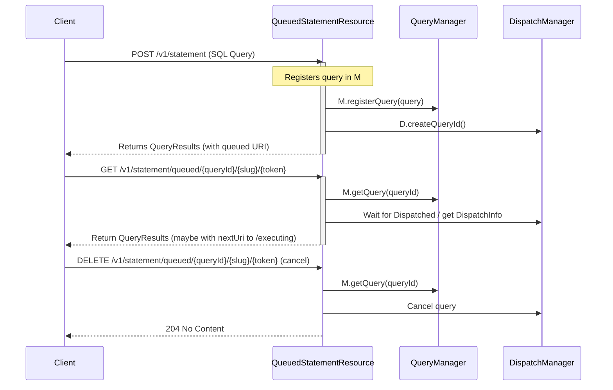

## 1. Overview

The `QueuedStatementResource` is a **JAX-RS resource** (exposed at `@Path("/v1/statement")`) handling queries in a **queued** state before they execute. When a client issues an HTTP `POST` to run a query, the query is placed in a queue (via a `DispatchManager`) and tracked by this resource until it has either been:

1. **Submitted** to a coordinator node and started execution
2. **Canceled** by a client
3. **Timed out** or finished

As soon as the query leaves the queued state to execute on a coordinator, this resource redirects the client to a different endpoint (`/v1/statement/executing/...`).

Key classes involved:
- **`DispatchManager`**: Handles the *scheduling*, *dispatching*, and *lifecycle* of Trino queries.
- **`QueryManager`** (inner utility class in this file): Tracks queries created by this resource. Periodically checks if queries should be purged (e.g., if they timed out or were canceled).
- **`Query`** (inner class): Represents the queued query’s lifecycle, token management for result pages, and references to essential query objects (like spans, session context, etc.).

---
## 2. Class Structure
```java
@Path("/v1/statement")
public class QueuedStatementResource
{
    private static final Logger log = Logger.get(QueuedStatementResource.class);
    private static final Duration MAX_WAIT_TIME = new Duration(1, SECONDS);
    // ...
    
    // Dependencies injected
    private final HttpRequestSessionContextFactory sessionContextFactory;
    private final DispatchManager dispatchManager;
    private final Tracer tracer;
    private final QueryInfoUrlFactory queryInfoUrlFactory;
    private final Executor responseExecutor;
    private final ScheduledExecutorService timeoutExecutor;
    private final boolean compressionEnabled;
    private final QueryManager queryManager;

    @Inject
    public QueuedStatementResource(
            HttpRequestSessionContextFactory sessionContextFactory,
            DispatchManager dispatchManager,
            Tracer tracer,
            DispatchExecutor executor,
            QueryInfoUrlFactory queryInfoUrlTemplate,
            ServerConfig serverConfig,
            QueryManagerConfig queryManagerConfig)
    {
        // Constructor wires up the resource
    }

    @PostConstruct
    public void start()
    {
        // Called once the resource is initialized
        queryManager.initialize(dispatchManager);
    }

    @PreDestroy
    public void stop()
    {
        // Called before the resource is torn down
        queryManager.destroy();
    }

    // HTTP endpoints below
    @ResourceSecurity(AUTHENTICATED_USER)
    @POST
    @Produces(APPLICATION_JSON)
    public Response postStatement(...)
    {
        // Handle an incoming query POST
    }

    @ResourceSecurity(PUBLIC)
    @GET
    @Path("queued/{queryId}/{slug}/{token}")
    @Produces(APPLICATION_JSON)
    public void getStatus(...)
    {
        // Return the status of the queued query
    }

    @ResourceSecurity(PUBLIC)
    @DELETE
    @Path("queued/{queryId}/{slug}/{token}")
    @Produces(APPLICATION_JSON)
    public Response cancelQuery(...)
    {
        // Cancel the query
    }

    // Internal utility methods (createQueryResultsResponse, getQuery, etc.)

    private static final class Query
    {
        // Encapsulates a single query's state while queued
    }

    @ThreadSafe
    private static class QueryManager
    {
        // Maintains a map of QueryId -> Query
        // Periodically purges stale / abandoned queries
    }
}
```

The `QueuedStatementResource` is composed of:

1. **Lifecycle Hooks**:
   - `@PostConstruct start()` and `@PreDestroy stop()`
2. **HTTP Endpoints** for queries in a *queued* state:
   - `POST /v1/statement` — to register a query for dispatch
   - `GET /v1/statement/queued/{queryId}/{slug}/{token}` — to poll the status
   - `DELETE /v1/statement/queued/{queryId}/{slug}/{token}` — to cancel

3. **Internal Utilities** for constructing response payloads, building URIs, verifying tokens, etc.

---

## 3. Sequence Diagram

Below is a **Mermaid** diagram showing how a client interacts with this resource:
![[Screenshot 2025-02-12 at 4.11.09 PM.png]]


1. **POST**: Registers the query, returns an initial `QueryResults` object with a `nextUri` pointing to the queued resource path.
2. **GET**: Poll for status. If the query is still queued, returns updated status. If it transitions to dispatched, it redirects the client to an `/executing` endpoint.
3. **DELETE**: Cancels the query from queued state, no further processing occurs.

---
## 4. Endpoints in Detail

### 4.1 `POST /v1/statement`
```java
@PostConstruct
public Response postStatement(
        String statement,
        @Context HttpServletRequest servletRequest,
        @Context HttpHeaders httpHeaders,
        @BeanParam ExternalUriInfo externalUriInfo)
{
    if (isNullOrEmpty(statement)) {
        throw new BadRequestException("SQL statement is empty");
    }

    Query query = registerQuery(statement, servletRequest, httpHeaders);
    return createQueryResultsResponse(
        query.getQueryResults(query.getLastToken(), externalUriInfo),
        query.sessionContext.getQueryDataEncoding()
    );
}
```

1. **Reads** the SQL `statement` from the request body.
2. **Creates** a new `Query` via `registerQuery(...)`.
   - This sets up authentication, session context, etc.
3. **Returns** an HTTP `200 OK` with a **`QueryResults`** payload containing:
   - `nextUri` pointing to `GET /v1/statement/queued/{queryId}/{slug}/{token}`.

### 4.2 `GET /v1/statement/queued/{queryId}/{slug}/{token}`
```java
@GET
@Path("queued/{queryId}/{slug}/{token}")
@Produces(APPLICATION_JSON)
public void getStatus(
        @PathParam("queryId") QueryId queryId,
        @PathParam("slug") String slug,
        @PathParam("token") long token,
        @QueryParam("maxWait") Duration maxWait,
        @BeanParam ExternalUriInfo externalUriInfo,
        @Suspended AsyncResponse asyncResponse)
{
    Query query = getQuery(queryId, slug, token);
    ListenableFuture<Response> future = getStatus(query, token, maxWait, externalUriInfo);
    bindAsyncResponse(asyncResponse, future, responseExecutor);
}
```
- Retrieves the `Query` from the `QueryManager` by ID.
- Waits up to `maxWait` (bounded by `MAX_WAIT_TIME`) for the query’s state to change (dispatched or fail).
- If the query is *still queued*, returns updated `QueryResults`.
- If the query is *dispatched*, the `QueryResults` contains a redirection to `.../executing`.
- The final JSON document includes status, any error info, or `nextUri`.

### 4.3 `DELETE /v1/statement/queued/{queryId}/{slug}/{token}`
```java
@DELETE
@Path("queued/{queryId}/{slug}/{token}")
@Produces(APPLICATION_JSON)
public Response cancelQuery(
        @PathParam("queryId") QueryId queryId,
        @PathParam("slug") String slug,
        @PathParam("token") long token)
{
    getQuery(queryId, slug, token).cancel();
    return Response.noContent().build();
}
```
- Allows clients to explicitly **cancel** a queued query.
- If successful, returns `204 No Content`.

---

## 5. The `Query` Inner Class

```java
private static final class Query
{
    private final String query;
    private final SessionContext sessionContext;
    private final DispatchManager dispatchManager;
    private final QueryId queryId;
    private final Optional<URI> queryInfoUrl;
    private final Span querySpan;
    private final Slug slug = Slug.createNew();
    private final AtomicLong lastToken = new AtomicLong();

    private final long initTime = System.nanoTime();
    private final AtomicReference<Boolean> submissionGate = new AtomicReference<>();
    private final SettableFuture<Void> creationFuture = SettableFuture.create();

    public Query(
            String query,
            SessionContext sessionContext,
            DispatchManager dispatchManager,
            QueryInfoUrlFactory queryInfoUrlFactory,
            Tracer tracer)
    {
        // ...
    }

    public QueryResults getQueryResults(long token, ExternalUriInfo externalUriInfo)
    {
        // returns query progress or a redirect to /executing
    }

    public void cancel()
    {
        // triggers cancellation in DispatchManager
    }

    // ...
}
```

### 5.1 Purpose

1. **Tracks**:
   - The text of the SQL `query`.
   - A `SessionContext` containing user identity, query session properties, etc.
   - A unique `QueryId`.
   - A `Span` for telemetry (OpenTelemetry) to trace query lifetime.
2. **Holds** an internal `creationFuture` representing the asynchronous process of query creation in `DispatchManager`.
3. **Maintains** a `submissionGate` to avoid re-submitting the same query more than once.

### 5.2 Lifecycle

- **Instantiation**: The `Query` is created upon the `POST /v1/statement` call.
- **Submission**: `submitIfNeeded()` is called to register the query with the `DispatchManager`, obtaining a `QueryId`.
- **Polling**:
  - When a client polls with `GET queued/{queryId}/{slug}/{token}`, it calls `getQueryResults(...)`.
  - If the dispatch process is not done, the method returns a `QueryResults` object indicating that the query is still queued.
  - If it is dispatched, it sets a `nextUri` to redirect the client to `/v1/statement/executing`.
- **Cancellation**: Calling `cancel()` triggers `dispatchManager.cancelQuery(queryId)`.
- **Destruction**: The `QueryManager` eventually removes the `Query` from its map and calls `query.destroy()` to release resources.

---

## 6. The `QueryManager` Inner Class

```java
@ThreadSafe
private static class QueryManager
{
    private final ConcurrentMap<QueryId, Query> queries = new ConcurrentHashMap<>();
    private final ScheduledExecutorService scheduledExecutorService =
        newSingleThreadScheduledExecutor(daemonThreadsNamed("drain-state-query-manager"));

    private final Duration querySubmissionTimeout;

    public QueryManager(Duration querySubmissionTimeout) {
        this.querySubmissionTimeout = requireNonNull(querySubmissionTimeout, "querySubmissionTimeout is null");
    }

    public void initialize(DispatchManager dispatchManager) {
        scheduledExecutorService.scheduleWithFixedDelay(() -> {
            try {
                syncWith(dispatchManager);
            }
            catch (Throwable e) {
                // log error
            }
        }, 200, 200, MILLISECONDS);
    }

    public void destroy() {
        scheduledExecutorService.shutdownNow();
    }

    public void registerQuery(Query query) {
        // put Query object in the map
    }

    @Nullable
    public Query getQuery(QueryId queryId) {
        return queries.get(queryId);
    }

    private void syncWith(DispatchManager dispatchManager) {
        queries.forEach((queryId, query) -> {
            if (shouldBePurged(dispatchManager, query)) {
                removeQuery(queryId);
            }
        });
    }

    private boolean shouldBePurged(DispatchManager dispatchManager, Query query) {
        // logic to decide if a query is no longer needed
    }
}
```

### 6.1 Function

1. **Registers** new `Query` objects in an internal `ConcurrentMap`.
2. **Periodically checks** whether queries are stale or should be purged:
   - If a query is *abandoned* (not submitted in time or canceled).
   - If a query is fully dispatched and no longer tracked by the `DispatchManager`.
3. **Purges** unneeded queries from the in-memory map and destroys them (to free resources).

### 6.2 Key Methods

- **`initialize(...)`**: Sets up a repeating task every 200 ms that calls `syncWith(dispatchManager)`.
- **`syncWith(dispatchManager)`**: For each query in `queries`, calls `shouldBePurged(...)`.
- **`removeQuery(queryId)`**: Removes the query from the map and calls `destroyQuietly(query)`.

This ensures that the resource’s local query tracking does not grow unbounded and stale queries are cleaned up.

---

## 7. Putting It All Together

1. A **client** submits a query (POST).  
2. This resource **registers** the query with `QueryManager`.  
3. The query enters a queued state in `DispatchManager`.  
4. The client **polls** the queue endpoint to see if it has been dispatched.  
5. Once the query transitions to an **executing** state, the `GET` response instructs the client to fetch results from the `/v1/statement/executing/...` endpoint.  
6. The **`QueryManager`** runs in the background to **purge** queries that are canceled, failed, or timed out.  

### High-Level Flow Diagram

```mermaid
flowchart LR
    A[POST /v1/statement] -- Register Query --> B[QueuedStatementResource]
    B -- Put in Map --> C[QueryManager]
    B -- Create QueryID --> D[DispatchManager]

    B <--> D
    C <--> D

    E[GET /v1/statement/queued] -- Poll --> B
    B -- Return JSON => E

    E[DELETE /v1/statement/queued] -- Cancel --> B
    B -- Cancel --> D

    C -- Periodic Cleanup --> D
```

---

## 8. Code Example: Typical Client Interaction

Below is a simplified pseudocode showing how a client might interact with this resource:

```java
// 1. POST the SQL query
HttpResponse<QueryResults> initialResponse = httpClient.post(
    "/v1/statement", 
    "SELECT * FROM some_table"
);

// 2. Check for nextUri
String nextUri = initialResponse.getBody().getNextUri();
while (nextUri != null) {
    HttpResponse<QueryResults> nextResponse = httpClient.get(nextUri);
    QueryResults results = nextResponse.getBody();
    
    if (results.isFinished()) {
        break;
    }
    nextUri = results.getNextUri();
}

// 3. (Optional) If user stops early:
httpClient.delete(nextUri);
```

---

## 9. Key Takeaways

1. **Stateful Resource**: `QueuedStatementResource` tracks queries in a *queued* state before redirecting them to an *executing* endpoint.
2. **Asynchronous**: Uses Futures (`ListenableFuture`) and an async JAX-RS model (`@Suspended AsyncResponse`).
3. **Concurrency Handling**:
   - A `ConcurrentHashMap` for storing queries.
   - A scheduled executor to purge stale queries.
4. **Tokens & Slugs**:
   - Each poll must provide a valid `token` and `slug` to ensure correct ordering and security (avoiding replay or out-of-order requests).
5. **Observability**: Integrates with OpenTelemetry (`Span`, `Tracer`) to track query lifecycle.

---

## 10. Conclusion

The `QueuedStatementResource` is a crucial part of **Trino’s** **dispatcher** logic. It:

- Receives an incoming SQL statement.
- Registers a `Query` for dispatch.
- Exposes endpoints to **poll** the queue status and **cancel** the query.
- Cooperates with the `DispatchManager` to *eventually* redirect clients to the actual query execution endpoint.

All of this happens asynchronously, making Trino a robust system for distributing queries across multiple coordinators and managing states from **QUEUED** → **EXECUTING** → **FINISHED** (or **FAILED**).

---

**References**:
- Trino codebase: [GitHub: trino](https://github.com/trinodb/trino)
- JAX-RS specification: [Jakarta RESTful Web Services](https://jakarta.ee/specifications/restful-ws/)
- OpenTelemetry: [OpenTelemetry Java](https://opentelemetry.io/docs/instrumentation/java/)

```