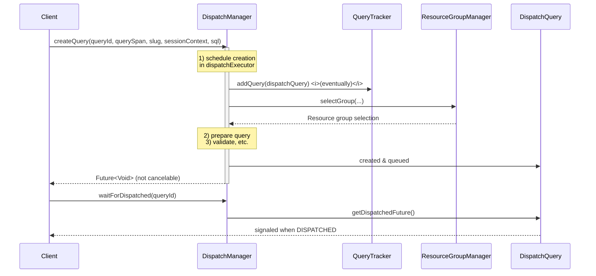

This document provides a *comprehensive*, *step-by-step* explanation of Trino’s `DispatchManager` class. It is intended for those studying Trino internals and covers:

1. **Role of `DispatchManager`**  
2. **How queries flow through the dispatcher**  
3. **Key dependencies** and collaboration with other Trino components  
4. **Methods and concurrency details**  
5. **Examples, code snippets, and visual diagrams**

---

## 1. Purpose of `DispatchManager`

The **`DispatchManager`** is responsible for:
- Generating new **query IDs** (`QueryId`) for incoming requests.
- **Preparing** queries (parsing SQL, applying session defaults, verifying access).
- **Creating** and **tracking** `DispatchQuery` objects (one per query).
- Submitting queries to a **resource group manager** to determine resource allocation and queueing policy.
- Managing query states from initial creation up to dispatch or failure.
- Providing **metrics** (e.g., queued queries, running queries) to the broader system.

Essentially, the `DispatchManager` is a *controller* that orchestrates the entire *lifecycle* of a query before it transitions into active execution.

---

## 2. High-Level Architecture

Below is a **Mermaid** diagram illustrating how a query flows through the `DispatchManager`:![[Screenshot 2025-02-12 at 4.27.29 PM.png]]



1. **Client** calls `createQuery(...)`, providing:
   - A `QueryId`
   - A `Span` (for tracing)
   - A `SessionContext`
   - The SQL statement
2. `DispatchManager` schedules the creation process on a bounded executor to avoid flooding the system with too many concurrent dispatches.
3. **Once creation completes**, the query is registered in the `QueryTracker`.  
4. **Resource group selection** happens to decide how/where to queue the query.  
5. The system returns a **future** to the client, which is completed after the query finishes the initial creation phase (but not necessarily after it is fully executed).

---

## 3. Key Fields and Dependencies

**Fields in `DispatchManager`:**

```java
private final QueryIdGenerator queryIdGenerator;
private final QueryPreparer queryPreparer;
private final ResourceGroupManager<?> resourceGroupManager;
private final DispatchQueryFactory dispatchQueryFactory;
private final FailedDispatchQueryFactory failedDispatchQueryFactory;
private final AccessControl accessControl;
private final SessionSupplier sessionSupplier;
private final SessionPropertyDefaults sessionPropertyDefaults;
private final SessionPropertyManager sessionPropertyManager;
private final Tracer tracer;

private final int maxQueryLength;
private final Executor dispatchExecutor;
private final QueryTracker<DispatchQuery> queryTracker;
private final QueryManagerStats stats;
private final QueryMonitor queryMonitor;
private final ScheduledExecutorService statsUpdaterExecutor;
```

- **`queryIdGenerator`**: Generates new unique IDs (`QueryId`) for queries.
- **`queryPreparer`**: Prepares (parses) SQL into a `PreparedQuery`.
- **`resourceGroupManager`**: Determines how queries are queued and dispatched to compute resources.
- **`dispatchQueryFactory`** / **`failedDispatchQueryFactory`**: Creates a `DispatchQuery` instance (or a failed one if something goes wrong).
- **`accessControl`**: Checks whether the user is allowed to execute the query.
- **`sessionSupplier`** / **`sessionPropertyDefaults`**: Build a `Session` from `SessionContext`, applying default properties and user overrides.
- **`sessionPropertyManager`**: Central place storing known session property definitions.
- **`tracer`**: For *OpenTelemetry* instrumentation (spans and context).
- **`dispatchExecutor`**: A *bounded executor* to control concurrency during dispatch.
- **`queryTracker`**: Tracks `DispatchQuery` objects for the lifetime of the query.
- **`queryMonitor`**: Fires query events for logging, user monitoring, etc.
- **`statsUpdaterExecutor`**: Periodically updates driver statistics (running queries, queued queries, etc.).

### 3.1 Construction

```java
@Inject
public DispatchManager(
        QueryIdGenerator queryIdGenerator,
        QueryPreparer queryPreparer,
        ResourceGroupManager<?> resourceGroupManager,
        DispatchQueryFactory dispatchQueryFactory,
        FailedDispatchQueryFactory failedDispatchQueryFactory,
        AccessControl accessControl,
        SessionSupplier sessionSupplier,
        SessionPropertyDefaults sessionPropertyDefaults,
        SessionPropertyManager sessionPropertyManager,
        Tracer tracer,
        QueryManagerConfig queryManagerConfig,
        DispatchExecutor dispatchExecutor,
        QueryMonitor queryMonitor)
{
    // initialize fields
    this.dispatchExecutor = new BoundedExecutor(
        dispatchExecutor.getExecutor(),
        queryManagerConfig.getDispatcherQueryPoolSize()
    );
    // ...
    this.queryTracker = new QueryTracker<>(queryManagerConfig, dispatchExecutor.getScheduledExecutor());
}
```

- Notice how `dispatchExecutor` is wrapped by a `BoundedExecutor`, limiting the number of concurrent dispatch tasks.

---

## 4. Lifecycle Methods

### 4.1 `@PostConstruct start()`

```java
@PostConstruct
public void start()
{
    queryTracker.start();
    statsUpdaterExecutor.scheduleWithFixedDelay(() -> {
        try {
            stats.updateDriverStats(queryTracker);
        }
        catch (Throwable e) {
            log.error(e, "Error while updating driver stats");
        }
    }, 0, 10, SECONDS);
}
```
- **Starts** the `queryTracker`.
- **Schedules** a periodic task every 10s to update driver statistics in `stats`.

### 4.2 `@PreDestroy stop()`

```java
@PreDestroy
public void stop()
{
    queryTracker.stop();
    statsUpdaterExecutor.shutdownNow();
}
```
- **Stops** the `queryTracker` (no more queries can be tracked).
- **Shuts down** the stats executor.

---

## 5. Creating a Query

The main entry point for query creation is `createQuery(...)`:

```java
public QueryId createQueryId()
{
    return queryIdGenerator.createNextQueryId();
}

public ListenableFuture<Void> createQuery(QueryId queryId, Span querySpan, Slug slug, SessionContext sessionContext, String query)
{
    // ...
    DispatchQueryCreationFuture queryCreationFuture = new DispatchQueryCreationFuture();
    dispatchExecutor.execute(Context.current().wrap(() -> {
        Span span = tracer.spanBuilder("dispatch")
                .addLink(Span.current().getSpanContext())
                .setParent(Context.current().with(querySpan))
                .startSpan();
        try (var _ = scopedSpan(span)) {
            createQueryInternal(queryId, querySpan, slug, sessionContext, query, resourceGroupManager);
        }
        finally {
            queryCreationFuture.set(null);
        }
    }));
    return queryCreationFuture;
}
```

1. **`createQueryId()`**: obtains a new `QueryId`.
2. **Validations**: Checks that the SQL query is non-empty, and ensures no existing query with that ID is currently tracked.
3. **Scheduling**: The method runs the actual creation logic (`createQueryInternal(...)`) in the background on the **bounded** `dispatchExecutor`.
4. **Returns**: a *custom future* (`DispatchQueryCreationFuture`) that:
   - **Cannot be canceled** from the client side (`cancel()` is overridden to always return `false`).
   - Completes when the creation process finishes, but *does not* represent *full query execution*.

### 5.1 Internal Creation Logic

```java
private <C> void createQueryInternal(
    QueryId queryId,
    Span querySpan,
    Slug slug,
    SessionContext sessionContext,
    String query,
    ResourceGroupManager<C> resourceGroupManager)
{
    Session session = null;
    PreparedQuery preparedQuery = null;
    try {
        // 1) Validate length
        if (query.length() > maxQueryLength) {
            // throw if longer than max allowed
        }

        // 2) Build session
        session = sessionSupplier.createSession(queryId, querySpan, sessionContext);

        // 3) Access control
        accessControl.checkCanExecuteQuery(sessionContext.getIdentity(), queryId);

        // 4) Prepare query
        preparedQuery = queryPreparer.prepareQuery(session, query);

        // 5) Resource group selection
        Optional<String> queryType = getQueryType(preparedQuery.getStatement()).map(Enum::name);
        SelectionContext<C> selectionContext = resourceGroupManager.selectGroup(
            new SelectionCriteria(
                sessionContext.getIdentity().getPrincipal().isPresent(),
                sessionContext.getIdentity().getUser(),
                sessionContext.getIdentity().getGroups(),
                sessionContext.getSource(),
                sessionContext.getClientTags(),
                sessionContext.getResourceEstimates(),
                queryType
            )
        );

        // 6) Apply default session properties
        session = sessionPropertyDefaults.newSessionWithDefaultProperties(session, queryType, selectionContext.getResourceGroupId());

        // 7) Create dispatch query
        DispatchQuery dispatchQuery = dispatchQueryFactory.createDispatchQuery(
            session,
            sessionContext.getTransactionId(),
            query,
            preparedQuery,
            slug,
            selectionContext.getResourceGroupId()
        );

        // 8) Register in QueryTracker
        boolean queryAdded = queryCreated(dispatchQuery);
        if (queryAdded && !dispatchQuery.isDone()) {
            try {
                resourceGroupManager.submit(dispatchQuery, selectionContext, dispatchExecutor);
            }
            catch (Throwable e) {
                dispatchQuery.fail(e);
            }
        }
    }
    catch (Throwable throwable) {
        // if any failure occurs, register a "failed" dispatch query
        // ...
    }
}
```

**Breakdown**:

1. **Length Check**: If the query text is too large, throw a `TrinoException(QUERY_TEXT_TOO_LARGE)`.
2. **Session**: Creates a `Session` from the `SessionContext`. This populates user identity, user agent, client info, etc.
3. **Access Control**: Ensures the user can execute the query.
4. **Prepare Query**: Parse and analyze the SQL, producing a `PreparedQuery`.
5. **Resource Group Selection**: The `ResourceGroupManager` picks which group the query belongs to (used for concurrency and fairness).
6. **Apply Default Properties**: The system sets additional default session properties if needed.
7. **Create** a `DispatchQuery`: This is a specialized object that manages a query from *dispatch* to *finish*.
8. **Register** in the `QueryTracker`. If the query is successfully added, the `resourceGroupManager` schedules it for actual execution. If scheduling fails, the query is *marked as failed*.

### 5.2 Registering the Query

```java
private boolean queryCreated(DispatchQuery dispatchQuery)
{
    boolean queryAdded = queryTracker.addQuery(dispatchQuery);

    if (queryAdded) {
        dispatchQuery.addStateChangeListener(newState -> {
            if (newState.isDone()) {
                queryTracker.expireQuery(dispatchQuery.getQueryId());
            }
        });
        stats.trackQueryStats(dispatchQuery);
    }
    return queryAdded;
}
```

- The `QueryTracker` ensures we only hold *one* query object per `QueryId`.  
- A state listener is added to `DispatchQuery`: once the query is **done**, it triggers `expireQuery(...)`, removing it from active tracking to avoid memory leaks.
- The manager updates relevant *statistics* in `stats`.

---

## 6. Tracking Query Dispatch

### 6.1 `waitForDispatched(...)`

Clients or other components might call:

```java
public ListenableFuture<Void> waitForDispatched(QueryId queryId)
{
    return queryTracker.tryGetQuery(queryId)
            .map(dispatchQuery -> {
                dispatchQuery.recordHeartbeat();
                return dispatchQuery.getDispatchedFuture();
            })
            .orElseGet(Futures::immediateVoidFuture);
}
```

- Looks up the `DispatchQuery` in the `QueryTracker`.
- Returns a future that completes when the query transitions from `CREATED` or `QUEUED` to a *dispatched* state.  
- If the query is unknown, the method returns an already-completed future (no wait).

### 6.2 Accessing Query Info

- **`getQueries()`** returns basic info (`List<BasicQueryInfo>`) about all queries in the system.
- **`getQueryInfo(queryId)`** returns a single query’s info.
- **`getFullQueryInfo(queryId)`** returns detailed `QueryInfo` if available.
- **`getDispatchInfo(queryId)`** returns an internal `DispatchInfo` object used by the queued statement resource, etc.

---

## 7. Canceling or Failing a Query

- **`cancelQuery(queryId)`**: Looks up the `DispatchQuery` and calls `cancel()`.
- **`failQuery(queryId, cause)`**: Marks the query as failed with the specified `Throwable`.

```java
public void cancelQuery(QueryId queryId)
{
    queryTracker.tryGetQuery(queryId)
            .ifPresent(DispatchQuery::cancel);
}

public void failQuery(QueryId queryId, Throwable cause)
{
    queryTracker.tryGetQuery(queryId)
            .ifPresent(query -> query.fail(cause));
}
```

Once canceled or failed, the query transitions to a done state, triggers any cleanup, and eventually gets removed from `QueryTracker`.

---

## 8. Managed Metrics

The `@Managed` annotations expose JMX or REST metrics for external monitoring:

- **`getQueuedQueries()`**: number of queries with `QUEUED` state.
- **`getRunningQueries()`**: queries in `RUNNING` state.
- **`getFinishingQueries()`**: queries in `FINISHING` state.
- **`getProgressingQueries()`**: subset of `RUNNING` queries not fully blocked.

---

## 9. `DispatchQueryCreationFuture`

```java
private static class DispatchQueryCreationFuture
        extends AbstractFuture<Void>
{
    @Override
    public boolean cancel(boolean mayInterruptIfRunning)
    {
        // query submission cannot be canceled
        return false;
    }
}
```

- **Subclass** of `AbstractFuture<Void>` from Guava.
- Ignores any `cancel(...)` calls. This ensures that once the dispatch creation is scheduled, it cannot be preemptively canceled by the caller.

---

## 10. Putting It All Together

### 10.1 End-to-End Example

**Hypothetical** code snippet:

```java
// Suppose we want to dispatch a query:
QueryId queryId = dispatchManager.createQueryId();
Span querySpan = tracer.spanBuilder("query-span").startSpan();
Slug slug = Slug.createNew();
SessionContext sessionContext = ...;  // built from HTTP headers, identity, etc.
String sql = "SELECT * FROM nation";

// 1) Create a query (async)
ListenableFuture<Void> creationFuture = dispatchManager.createQuery(
    queryId, 
    querySpan, 
    slug, 
    sessionContext, 
    sql
);

// 2) The future completes when the query is fully registered (or fails)
Futures.addCallback(
    creationFuture, 
    new FutureCallback<Void>() {
        @Override
        public void onSuccess(Void result) {
            // Query creation done, we can wait for dispatch
            ListenableFuture<Void> dispatched = dispatchManager.waitForDispatched(queryId);
            ...
        }

        @Override
        public void onFailure(Throwable t) {
            // Query creation or registration failed
            ...
        }
    }, 
    directExecutor()
);
```

- When `onSuccess` is invoked, the query is already in the `QueryTracker`.  
- The client can now poll `waitForDispatched(...)` to see if it’s moved beyond the queued state.  
- If the query fails or is canceled, the `onFailure` callback triggers.

### 10.2 Visualization

```mermaid
flowchart TB
    A[createQuery()] --> B[createQueryInternal()]
    B -->|Length check| C
    B -->|Build session| D
    B -->|Access control| E
    B -->|Prepare query| F
    B -->|Select resource group| G
    B -->|Apply defaults| H
    B -->|Create DispatchQuery| I
    I -->|Register to QueryTracker| J[queryCreated()]
    J -->K[Add state listener]
    B -->|Submit to resource group| L[submit(...)]

    style A fill:#e7f1fe,stroke:#333,stroke-width:1px
    style B fill:#e7f1fe,stroke:#333,stroke-width:1px
    style J fill:#fce5cd,stroke:#333,stroke-width:1px
    style L fill:#fce5cd,stroke:#333,stroke-width:1px
```

---

## 11. Key Takeaways

1. **Concurrent Dispatch**: The `DispatchManager` uses a *bounded* pool (`BoundedExecutor`) to avoid dispatch overload.
2. **Separation of Concerns**:
   - `DispatchManager` oversees scheduling and resource group assignment.
   - `DispatchQuery` handles the *lifecycle* of the query from creation to execution.
   - `QueryTracker` tracks all active `DispatchQuery`s.
3. **Fail-safe Registration**: If any step fails during creation, `DispatchManager` registers a **failed** dispatch query, so the system always has a consistent record of attempted queries.
4. **No Cancel on Creation**: Once the creation logic is started, it cannot be canceled; the system ensures a consistent query record.

---

## 12. Conclusion

The `DispatchManager` is central to Trino’s **front-end** query lifecycle. It:

- Assigns *unique IDs* to queries.
- *Validates* and *prepares* queries.
- Registers them with the **Resource Group Manager** for queueing and resource management.
- Exposes **futures** for the creation and dispatch events, letting the rest of the system (e.g., `QueuedStatementResource`) track progress.
- Provides crucial **metrics** to observe system load.

Understanding `DispatchManager` is essential for grasping how Trino orchestrates queries from the initial user request to full execution in a scalable, concurrent environment.
```