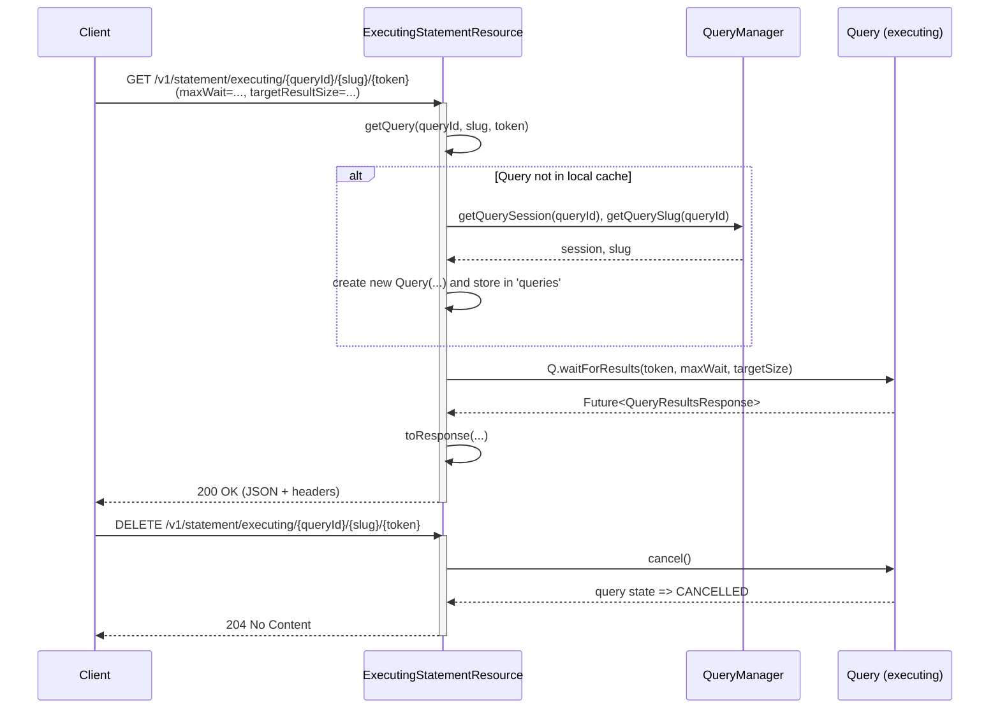

This document provides a *PhD-level*, *step-by-step* overview of the **`ExecutingStatementResource`** class from Trino’s server protocol package. It explains how Trino handles requests once a query is in the **executing** phase (as opposed to the **queued** phase handled by `QueuedStatementResource`). We will explore:

1. **Class Purpose and Role**  
2. **Endpoints and Their Responsibilities**  
3. **Query Tracking and the `Query` Object**  
4. **Integration with `QueryManager`**  
5. **Handling of Asynchronous GET Requests**  
6. **Partial Cancellations**  
7. **Examples, code snippets, and diagrams**  

---

## 1. Purpose of `ExecutingStatementResource`

When a Trino query has moved beyond **queued** and is actively executing:

- The **client** (or another part of Trino) uses **HTTP** GET/DELETE requests on `.../v1/statement/executing/{queryId}/{slug}/{token}` to:
  - **Poll** for the next batch of results.
  - **Cancel** the query (entirely or partially).
- This resource ensures that:
  1. *The query is recognized* and *active* on the current coordinator.
  2. *Tokens* and *slugs* are *validated* for request authenticity and ordering.
  3. **Response** data (JSON or spooled format) is provided back to the client with all necessary protocol headers.
In short, **`ExecutingStatementResource`** manages in-flight queries that have left the queue and are retrieving actual data.

---

## 2. Class Structure and Key Fields

```java
@Path("/v1/statement/executing")
public class ExecutingStatementResource
{
    private static final Logger log = Logger.get(ExecutingStatementResource.class);
    // ...
    private final QueryManager queryManager;
    private final QueryDataEncoders encoders;
    private final DirectExchangeClientSupplier directExchangeClientSupplier;
    private final ExchangeManagerRegistry exchangeManagerRegistry;
    private final BlockEncodingSerde blockEncodingSerde;
    private final QueryInfoUrlFactory queryInfoUrlFactory;
    private final BoundedExecutor responseExecutor;
    private final ScheduledExecutorService timeoutExecutor;

    private final ConcurrentMap<QueryId, Query> queries = new ConcurrentHashMap<>();
    private final ScheduledExecutorService queryPurger = newSingleThreadScheduledExecutor(...);
    private final PreparedStatementEncoder preparedStatementEncoder;
    private final boolean compressionEnabled;
    // ...
}
```

- **`QueryManager queryManager`**: Central manager for queries (start, cancel, retrieve info).  
- **`QueryDataEncoders encoders`**: Capable of providing various data-encoding strategies (e.g., JSON, spooled binary).  
- **`queries`** (map of `QueryId -> Query`) caches query objects that are actively retrieving result sets.  
- **`queryPurger`** periodically checks for queries to remove from this resource if they are no longer needed (or no longer exist in `QueryManager`).  
- **`PreparedStatementEncoder`** helps with returning prepared statement info in response headers.  
- **`compressionEnabled`** indicates whether to compress result payloads.  
- **`BoundedExecutor responseExecutor`** ensures concurrency control on how many response tasks can run.  
- **`ScheduledExecutorService timeoutExecutor`** used for time-based operations (e.g., *waiting* for next results up to a maximum wait time).

### 2.1 Construction

```java
@Inject
public ExecutingStatementResource(
        QueryManager queryManager,
        QueryDataEncoders encoders,
        DirectExchangeClientSupplier directExchangeClientSupplier,
        ExchangeManagerRegistry exchangeManagerRegistry,
        BlockEncodingSerde blockEncodingSerde,
        QueryInfoUrlFactory queryInfoUrlTemplate,
        @ForStatementResource BoundedExecutor responseExecutor,
        @ForStatementResource ScheduledExecutorService timeoutExecutor,
        PreparedStatementEncoder preparedStatementEncoder,
        ServerConfig serverConfig)
{
    // Assign fields
    // Periodically purge defunct queries from 'queries' map
    queryPurger.scheduleWithFixedDelay(..., 200, 200, MILLISECONDS);
}
```

- The **purger** runs every 200 ms to:
  1. Remove entries from `queries` that `queryManager` no longer tracks.
  2. Mark queries as “results consumed” if they’re complete but not yet acknowledged.

---

## 3. Endpoints and Responsibilities

### 3.1 `@GET /v1/statement/executing/{queryId}/{slug}/{token}`

```java
@GET
@Path("{queryId}/{slug}/{token}")
@Produces(MediaType.APPLICATION_JSON)
public void getQueryResults(
        @PathParam("queryId") QueryId queryId,
        @PathParam("slug") String slug,
        @PathParam("token") long token,
        @QueryParam("maxWait") Duration maxWait,
        @QueryParam("targetResultSize") DataSize targetResultSize,
        @BeanParam ExternalUriInfo externalUriInfo,
        @Suspended AsyncResponse asyncResponse)
{
    Query query = getQuery(queryId, slug, token);
    asyncQueryResults(query, token, maxWait, targetResultSize, externalUriInfo, asyncResponse);
}
```

**Key steps**:

1. **Fetch** the `Query` object from the local `queries` map or lazily create it (`getQuery(...)`).
2. **Validate** the `slug` and `token` to ensure legitimate requests.
3. **Asynchronously** fetch the **next batch** of results:
   - `maxWait` sets how long to block if no results are available yet (similar to a *long polling* technique).
   - `targetResultSize` helps control how many bytes are returned in each response.

### 3.2 `@DELETE /v1/statement/executing/{queryId}/{slug}/{token}`

```java
@DELETE
@Path("{queryId}/{slug}/{token}")
@Produces(MediaType.APPLICATION_JSON)
public Response cancelQuery(
        @PathParam("queryId") QueryId queryId,
        @PathParam("slug") String slug,
        @PathParam("token") long token)
{
    // Look up or validate slug
    // Cancel the query either by the local Query object or by the QueryManager
    // Return 204 No Content
}
```

- **Cancels** the query by calling `query.cancel()` if the local resource has it in the map, otherwise calls `queryManager.cancelQuery(...)`.

### 3.3 `@DELETE /v1/statement/executing/partialCancel/{queryId}/{stage}/{slug}/{token}`

```java
@DELETE
@Path("partialCancel/{queryId}/{stage}/{slug}/{token}")
public void partialCancel(
        @PathParam("queryId") QueryId queryId,
        @PathParam("stage") int stage,
        @PathParam("slug") String slug,
        @PathParam("token") long token)
{
    Query query = getQuery(queryId, slug, token);
    query.partialCancel(stage);
}
```

- Allows *partial* cancellation, typically meaning the client wants to *kill* or *stop* a *specific stage* or sub-task in a query.  
- Useful for advanced orchestration or when partial results are acceptable.

---

## 4. The `Query` Object and Caching Logic

### 4.1 Retrieving or Creating a `Query` Object

```java
protected Query getQuery(QueryId queryId, String slug, long token)
{
    Query query = queries.get(queryId);
    if (query != null) {
        // validate
        if (!query.isSlugValid(slug, token)) {
            throw new NotFoundException("Query not found");
        }
        return query;
    }

    // first time on this coordinator
    Session session = queryManager.getQuerySession(queryId);
    Slug querySlug = queryManager.getQuerySlug(queryId);
    if (!querySlug.isValid(EXECUTING_QUERY, slug, token)) {
        throw new NotFoundException("Query not found");
    }

    Optional<QueryDataEncoder.Factory> encoderFactory = session.getQueryDataEncoding().map(encoders::get);

    query = queries.computeIfAbsent(queryId, _ -> Query.create(
            session,
            querySlug,
            queryManager,
            encoderFactory
                    .map(SpooledQueryDataProducer::createSpooledQueryDataProducer)
                    .orElseGet(JsonBytesQueryDataProducer::new),
            queryInfoUrlFactory.getQueryInfoUrl(queryId),
            directExchangeClientSupplier,
            exchangeManagerRegistry,
            responseExecutor,
            timeoutExecutor,
            blockEncodingSerde));
    return query;
}
```

1. If it’s *already known* in the local `queries` map, **validate** the slug and return.
2. If *not known*, tries to:
   - Get the *Session* and the *Slug* from `QueryManager`.
   - Validate that the slug matches (`isValid(EXECUTING_QUERY, slug, token)`).
   - Construct a new `Query` instance with the chosen data encoding (JSON or spooled).
   - **Store** it in the `queries` map (thread-safe via `computeIfAbsent(...)`).

### 4.2 The `Query` Class (High-Level)

Internally, `Query` handles:

- **Token-based** iteration through result batches.  
- **Wait** logic to poll for next data chunk up to a certain size or time limit.  
- **Cancellation** (`cancel()`, `partialCancel(...)`).  
- **Spooled** or **direct** data production (i.e., chunking result sets).

You may see references to `JsonBytesQueryDataProducer` or `SpooledQueryDataProducer` inside the `Query` constructor. These producers control how results are actually retrieved and written out:

- **`JsonBytesQueryDataProducer`**: Writes out data in JSON chunks.  
- **`SpooledQueryDataProducer`**: Streams binary data to disk or memory, then sends references or chunks to the client.

---

## 5. Handling of Asynchronous GET Requests

### 5.1 Asynchronous Response Flow

```java
private void asyncQueryResults(
        Query query,
        long token,
        Duration maxWait,
        DataSize targetResultSize,
        ExternalUriInfo externalUriInfo,
        AsyncResponse asyncResponse)
{
    Duration wait = WAIT_ORDERING.min(MAX_WAIT_TIME, maxWait);
    DataSize resultSize = ...
    ListenableFuture<QueryResultsResponse> queryResultsFuture = query.waitForResults(token, externalUriInfo, wait, resultSize);

    ListenableFuture<Response> response = Futures.transform(
        queryResultsFuture,
        results -> toResponse(results, query.getQueryInfo().getSession().getQueryDataEncoding()),
        directExecutor()
    );

    bindAsyncResponse(asyncResponse, response, responseExecutor);
}
```

1. Calls `query.waitForResults(token, ...)` to get a future that completes when:
   - More data arrives, or
   - The query finishes/fails, or
   - The `maxWait` (a.k.a. *long poll duration*) expires.
2. Uses `Futures.transform` to build a final `Response` object from the `QueryResultsResponse`.
3. Invokes `bindAsyncResponse` from Airlift’s JAX-RS helpers, so the request thread is *not blocked*. The result is *asynchronous* to the caller.

### 5.2 Building the `Response`

```java
private Response toResponse(QueryResultsResponse resultsResponse, Optional<String> queryDataEncoding)
{
    ResponseBuilder response = Response.ok(resultsResponse.queryResults());
    ProtocolHeaders protocolHeaders = resultsResponse.protocolHeaders();

    // Various optional headers
    resultsResponse.setCatalog().ifPresent(c -> response.header(protocolHeaders.responseSetCatalog(), c));
    // ...
    // Manage session properties
    // Manage prepared statements, transactions, etc.

    if (!compressionEnabled) {
        response.encoding("identity");
    }

    queryDataEncoding.ifPresent(encoding ->
        response.header(ProtocolHeaders.TRINO_HEADERS.responseQueryDataEncoding(), encoding)
    );

    return response.build();
}
```

Trino’s protocol has specific **HTTP headers** (for setting session properties, catalogs, schemas, etc.). This method translates the `QueryResultsResponse` object into the final HTTP response with JSON data plus any protocol headers.

---

## 6. Partial Query Cancellation

**`@DELETE /v1/statement/executing/partialCancel/{queryId}/{stage}/{slug}/{token}`**:

- Allows the client to *only cancel a specific stage* (in `query.partialCancel(stage)`).  
- Minimizes overhead if the rest of the query can proceed, or if a specific part of the execution is no longer needed.

This is an advanced feature, typically used in large, multi-stage queries where certain sub-stages might be pruned.

---

## 7. Periodic Cleanup

```java
queryPurger.scheduleWithFixedDelay(
    () -> {
        for (QueryId queryId : queries.keySet()) {
            // remove old queries not in QueryManager
        }
        for (Query query : queries.values()) {
            // if a query is done, mark results consumed
        }
    },
    200,
    200,
    MILLISECONDS);
```

Every 200ms:

1. **Removes** queries from this map if `QueryManager` no longer recognizes them.  
2. For queries that have *finished*, calls `query.markResultsConsumedIfReady()` to finalize or free resources.

This ensures the map remains consistent and memory usage does not grow unbounded.

---

## 8. Example Sequence Diagram

Below is a **Mermaid** sequence diagram illustrating the client interaction with the *executing* resource:


![[Screenshot 2025-02-12 at 4.53.29 PM.png]]
1. The client makes a **GET** to fetch results.  
2. Resource checks for an existing local `Query`. If absent, it fetches from `QueryManager` to create a new one.  
3. The *async* flow fetches data or waits up to `maxWait`.  
4. The client can **DELETE** to cancel, returning `204`.

---

## 9. Practical Usage Example

**Client perspective** in pseudo-code:

```java
String uri = "/v1/statement/executing/" + queryId + "/" + slug + "/" + token;

// Poll for next results
HttpResponse response = httpClient.get(uri + "?maxWait=5000&targetResultSize=2MB");
if (response.getStatus() == 200) {
    QueryResults results = parseJson(response.getBody());
    // Inspect data, nextUri, etc.
} else {
    // handle errors
}

// Cancel partial stage
String partialCancelUri = "/v1/statement/executing/partialCancel/" + queryId + "/" + stage + "/" + slug + "/" + token;
httpClient.delete(partialCancelUri);
```

---
## 10. Key Takeaways

1. **Manages Actively Executing Queries**  
   - Once a query leaves the queue, requests to fetch results (or cancel) go through `ExecutingStatementResource`.
2. **Slug and Token Validation**  
   - Uses `slug.isValid(...)` to ensure only legitimate or *correctly ordered* requests are accepted.
3. **Asynchronous**  
   - Uses `@Suspended AsyncResponse` and `ListenableFuture` to handle *long polling* for data.
4. **Flexible Data Encodings**  
   - Can return JSON or a *spooled* (binary) format depending on session settings.
5. **Robust Cleanup**  
   - Periodic purging ensures references to finished or abandoned queries are removed.
6. **Partial Cancels**  
   - Provides advanced capability to cancel just a portion of a query, which can be crucial in large distributed queries.
---
## 11. Conclusion
`ExecutingStatementResource` is a crucial endpoint in Trino’s **HTTP-based** protocol for queries that are currently running. It integrates with:
- **`QueryManager`** for global query state,
- **`Query`** objects for local result retrieval,
- **`Slug`** checks for security/validity,
- **Encoders** for efficient or spooled data transfer.

By understanding how this resource works—especially its asynchronous polling model, slug validation, and query purging—one gains deeper insights into **Trino’s** overall *query execution lifecycle* and *protocol design*.