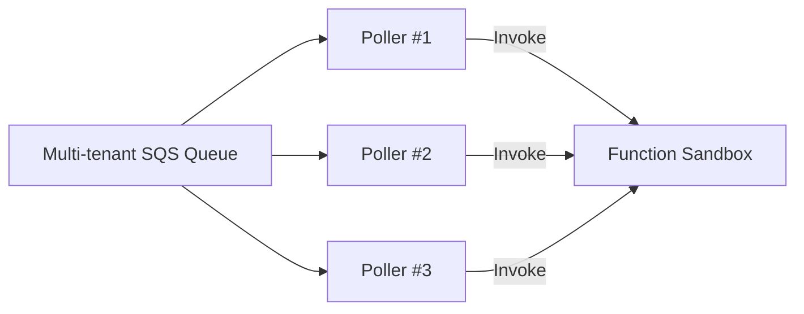

## 13. Idempotency and Event Duplication Challenges

### 13.1 Why Duplicates Arise

AWS Lambda provides **at-least-once** delivery when dealing with events (particularly in asynchronous flows). This means your function **could** see the same event multiple times. Duplicates happen if:

1. The message is successfully **enqueued** (e.g., from S3 event to internal SQS) but the Lambda poller does not receive an acknowledgment after running your code (maybe the network glitch or the container crashed).
2. The message fails partially through your function, forcing a retry.
3. The underlying event source (S3, SNS, etc.) retries automatically for reliability.

**Core Guarantee**: Lambda ensures no event is lost. But idempotency is the **application's responsibility**.

> **Key Insight**: “At-least-once” is simpler to scale in a distributed system than “exactly-once.” You trade possible duplicates for near-guaranteed durability and reliability.

### 13.2 Simple Pattern for Idempotent Processing

Below is a **pseudo-code** snippet that might help handle duplication. You store a `request_id` or `object_key` in a table (e.g., DynamoDB) and skip processing if it is already present:

```python
import boto3
dynamodb = boto3.resource('dynamodb')
dedup_table = dynamodb.Table('dedupTable')

def lambda_handler(event, context):
    # parse S3 event
    record = event['Records'][0]
    bucket = record['s3']['bucket']['name']
    key    = record['s3']['object']['key']
    
    # Construct an idempotent key
    dedup_key = f"{bucket}/{key}/{record['eventTime']}"

    # Check if we've already processed
    if is_already_processed(dedup_key):
        print(f"Duplicate event. Skip processing: {dedup_key}")
        return

    # Mark as processed
    record_event(dedup_key)
    
    # Actual logic
    process_file(bucket, key)
    
def is_already_processed(dedup_key):
    response = dedup_table.get_item(Key={'id': dedup_key})
    return 'Item' in response

def record_event(dedup_key):
    dedup_table.put_item(Item={'id': dedup_key, 'processed': True})

def process_file(bucket, key):
    # The real business logic
    print(f"Processing file {bucket}/{key}")
    # Possibly call Transcribe, store results, etc.
```

> **Tip**: Some folks use advanced patterns with unique hash keys or multi-attribute dedup. The approach depends on your throughput and cost constraints.

---

## 14. Multi-Tenant Queue Distribution (Revisited)

### 14.1 Simplifying the Design

- **Key**: The simplest approach can sometimes be the most robust.  
- Lambda’s internal design uses a **Best-of-Two** strategy (a variant of [Power of Two Choices](https://en.wikipedia.org/wiki/Power_of_two_choices)) to distribute incoming events across a set of SQS queues.
- **Hashing Key**: They primarily use the **AWS Account ID** (i.e., the “customer ID”). By default, the system does *not* differentiate further on event type or source (like S3 vs. SNS).
  - This keeps the distribution mechanism simpler and reduces overhead.
  - Additional advanced routing or priority-based distribution can be added in exceptional cases.

### 14.2 Fairness Considerations

Even with best-of-two, some queues can become “hot.” Example:
- A single large event might take 15 minutes to process, blocking a poller’s message slot.  
- The solution is to have multiple pollers/processors for the same queue, distributing the load across them.

**Mermaid Diagram**: High-level look at how each queue might have multiple pollers for concurrency and fairness.



The **distributed pollers** ensure that one “long” event doesn’t starve other events behind it. Each poller can fetch messages in parallel, so your function receives events more evenly.

---

## 15. Cold Starts and Performance Optimization

### 15.1 Understanding the Cold Start

A **cold start** occurs when Lambda needs to:
1. Provision a **Firecracker microVM** or reuse an existing host.
2. Download and deploy your function code + dependencies.
3. Initialize the runtime environment (e.g., Python, Node.js).
4. Initialize any global variables or static code in your function.

If your function is not invoked for **minutes or hours** (like the podcast example), the container may be spun down, requiring a fresh start later.

> **Note**: Cold starts are typically only noticeable on **first** invoke. **Subsequent** invocations on the same container are “warm” and incur negligible overhead.

### 15.2 Mitigating Cold Start

- **Provisioned Concurrency**: Pay a bit more to keep some “pre-warmed” environments always ready. This is recommended for mission-critical or latency-sensitive apps.
- **Minimize Dependencies**: The larger your deployment package, the slower initialization.
- **Use Smaller Runtimes**: For instance, a minimal Node.js environment vs. a large Java app can reduce cold start time.
- **SnapStart** (for Java): A feature that takes a snapshot after the Java runtime initialization. This can drastically reduce cold start times if your code is Java-based.

#### Example: Provisioned Concurrency with Python

```bash
aws lambda put-provisioned-concurrency-config \
  --function-name myFunc \
  --qualifier 1 \
  --provisioned-concurrent-executions 5
```
This ensures 5 concurrent environments are always “warm.”

### 15.3 Trade-Offs

- **No Idle = No Cost**: If you do **not** use Provisioned Concurrency, you pay only when your function runs. That’s the beauty of serverless.
- **Pay for Warmth**: If low-latency, on-demand responses are crucial, you can pay for concurrency or snapshot technologies.  

> **A helpful mnemonic**:
> 1. “**Cold** is cheap.” (No usage, no cost)  
> 2. “**Warm** is fast.” (You pay for readiness.)

---

## 16. Sandbox Internals & Firecracker

### 16.1 Firecracker Overview

- **Firecracker** is a lightweight **microVM** technology originally created by AWS for Lambda and Fargate.
- Provides strong **isolation** and security boundaries in a multi-tenant environment.
- Launches microVMs in **milliseconds**, enabling ephemeral containers to spin up quickly.

> **Resource**: Check the [Firecracker GitHub Repo](https://github.com/firecracker-microvm/firecracker) and Mark Brooker’s [re:Invent talk](https://www.youtube.com/watch?v=U9Vq2GydK0U) on Firecracker for deeper technical details.

### 16.2 Snapshots and Rehydration

Some internal AWS services (Aurora Serverless, for instance) use **snapshotting** of their memory state to reduce start-up times. Lambda also has a feature called **SnapStart** for Java, which similarly snapshots the MicroVM state.

- **Workflow**: 
  1. Initialize the runtime (Java).
  2. Take a snapshot of memory after the function’s static init code.  
  3. For future invocations, quickly load the snapshot → drastically reduced cold start.

> This concept is more advanced and may not apply to every runtime but is particularly beneficial for heavier runtimes like Java or .NET.

---

## 17. Putting It All Together (Extended Example)

**Scenario**: Infrequent podcast uploads

1. **Inactive Period** (cold)  
   - No new S3 uploads → Lambda spins down.  
   - No cost to the user.

2. **New Audio Upload**  
   - S3 generates an event → S3 calls Lambda’s async front end.  
   - Lambda’s front end enqueues it in a multi-tenant SQS queue, picking the queue with the lowest depth among two candidates.  
   - A poller retrieves the event from SQS.  
   - Since your function was idle, Lambda must **cold start** a Firecracker microVM, load your code, etc.

3. **Function Execution**  
   - The function receives the event, checks a dedup table, and proceeds with transcription logic.  
   - On success, the poller acknowledges and removes the message from SQS.  

4. **Subsequent Upload** (still warm)  
   - If another upload occurs soon, the same microVM environment is often reused.  
   - Very fast “warm” invocation.

> If you want to avoid that first cold start, set **Provisioned Concurrency** for your busiest times (say a known release schedule of your podcast).

---

## 18. Visual Note: High-Level System Flow

Below is a slightly more **comprehensive** mermaid diagram capturing the entire journey from S3 event to function completion, including where cold start might occur:

```mermaid
flowchart LR
    A[S3 Bucket: User Upload] --> B[S3 triggers Async Invoke to Lambda Front]
    B --> C[Lambda Async Front-End <br> (Multi-Tenant Enqueue)]
    C --> D{Multi-tenant SQS-based Queues <br> Best-of-Two Strategy}
    D --> E[Poller/Worker Fleet <br> (multiple pollers per queue)]
    E --> F[Firecracker MicroVM <br> + Sandbox Initialization]
    F --> G[Lambda Handler Executes <br> (Idempotency logic)]
    G --> H[Ack + Remove from SQS]
    H --> I[Done: No duplicates if ack success]
    F -->|If idle for too long| J[MicroVM spun down -> Potential Cold Start next time]
```

- **Dark Blue** edges represent event flow.  
- **Red** arrow (not shown above) would show a duplicate path if an ack fails or times out.  

---

## 19. Extended Best Practices Recap

1. **Design for Idempotency**  
   - Implement dedup in your function or an external store.  
   - Embrace at-least-once semantics.

2. **Leverage Provisioned Concurrency / SnapStart**  
   - If your workloads are latencysensitive, consider paying for “always on” environments.  

3. **Keep It Simple**  
   - Overengineering queue distribution might not yield net benefits. The “best-of-two + account-based hashing” approach is a proven sweet spot at AWS scale.  

4. **Size Your Functions Correctly**  
   - More memory = higher cost, but can reduce run time. Evaluate cost vs. performance carefully.  

5. **Balance Big Jobs vs. Timely Processing**  
   - If you have “long-running” tasks (like a 15-minute transcode or large DB operation), consider partitioning them or using Step Functions for better orchestration.  

6. **Monitor & Observe**  
   - Use [CloudWatch Alarms](https://docs.aws.amazon.com/AmazonCloudWatch/latest/monitoring/AlarmThatSendsEmail.html) for errors, throttles, concurrency usage.  
   - Log function execution times & memory usage to optimize.  

---

## 20. Additional References & Where to Go Next

- **AWS Docs**: [Lambda Asynchronous Invocation](https://docs.aws.amazon.com/lambda/latest/dg/invocation-async.html)  
- **Firecracker**: [GitHub](https://github.com/firecracker-microvm/firecracker), [AWS re:Invent Talk](https://www.youtube.com/watch?v=U9Vq2GydK0U)  
- **SnapStart** for Java: [AWS Announcement Blog](https://aws.amazon.com/blogs/aws/new-for-aws-lambda-accelerate-your-java-functions-with-lambda-snapstart/)  
- **Lambda Powertools** (for idempotency, logging, tracing): [AWS Labs GitHub](https://github.com/awslabs/aws-lambda-powertools-python)  

---

## 21. Key Takeaways

1. **Event Duplication is Normal**: Embrace “at-least-once” and make your app idempotent.  
2. **Cold Starts**: You pay only when your code runs, but you can mitigate start-up time with provisioned concurrency or SnapStart.  
3. **Multi-Tenancy**: Simple hashing (by account ID) plus a “best-of-two” approach is robust at AWS scale.  
4. **You Own the Final State**: AWS manages the infrastructure, but application logic, dedup, error handling, and advanced concurrency settings remain in the developer’s control.  

> “Simplicity is often enough. Gather real data before complicating your system design.” – Rajesh Pandai

---

```markdown
**Next Steps**:  
- Try setting up a real Lambda triggered by S3, artificially introduce random errors to see duplicates.  
- Measure cold start vs. provisioned concurrency.  
- Explore advanced orchestration with Step Functions for long-running tasks.
```
