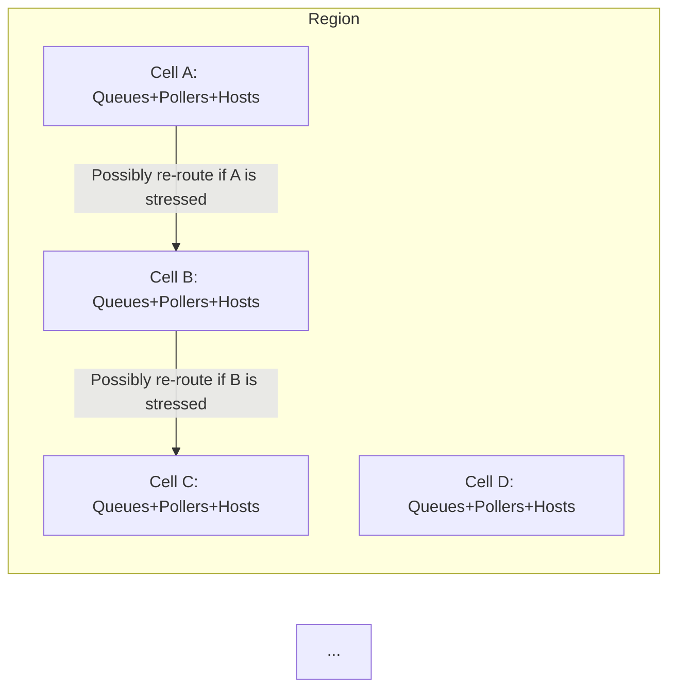

## 22. Statelessness in Lambda Functions

### 22.1 Why Stateless?

- **Scalability**: A stateless Lambda can easily scale from 1 instance to thousands or millions. The underlying infrastructure can spin up new microVMs without worrying about syncing or replicating local state.  
- **Reliability & Simplicity**: When a Lambda terminates or is replaced, no local state is lost because your logic defers data persistence to external services (e.g., S3, DynamoDB, RDS, or Step Functions).  

> **Tip**: If your use-case is truly stateful (e.g., continuous streaming for hours, or multi-step stateful tasks), you typically pair Lambda with a persistent store or a workflow orchestrator like **AWS Step Functions**.

### 22.2 The 15-Minute Execution Limit

- **Hard Timeout**: A single Lambda invocation can only run for up to 15 minutes.  
- **Implication**: For extremely long tasks (like GPU-based training of large language models), Lambda is not ideal unless you break it down into smaller steps.  
- For typical tasks under 15 minutes (e.g., data transformation, media encoding segments, image resizing, ETL tasks), Lambda is perfect.

#### Code Snippet: Example for Step-Fn Retry

```yaml
# Sample AWS Step Functions state machine snippet (YAML)
# Break a big job into multiple Lambda invocations, each under 15 minutes.
States:
  StartTask:
    Type: Task
    Resource: arn:aws:states:::lambda:invoke
    Parameters:
      FunctionName: myLongRunningFunction
    TimeoutSeconds: 900
    Next: PossiblyAnotherTask
PossiblyAnotherTask:
    Type: Task
    ...
```

---

## 23. Resource Provisioning in AWS Lambda

### 23.1 Memory (and CPU) Configuration

- **Lambda Memory Setting**: You choose a memory allocation (e.g., 128MB up to 10GB).  
- **CPU Allocation**: Automatically scales proportionally with the chosen memory.  
  - More memory → more CPU share.  
  - This is how you “tune” your function for heavier compute tasks.

> “If you require more CPU, you give your function more memory, effectively unlocking additional CPU resources.”

### 23.2 Placement Service (aka the Placement Component)

When a new Lambda invocation **requires** a fresh environment (a “cold start” scenario), an internal placement service:

1. Looks at your function’s configuration (memory, concurrency limits, etc.).  
2. Checks for a host (bare metal) with enough capacity to run a new Firecracker **microVM** that meets your specs.  
3. Launches or reuses a microVM with your code, then hands over your event.

After this “init” process, subsequent requests can reuse that microVM until it’s evicted or times out from inactivity.

**Visualization**:

```mermaid
flowchart LR
    A[Lambda Invocation Request] --> B[Placement Service]
    B -->|Check config & concurrency| C[Find a suitable host<br>(bare metal server)]
    C -->|Launch or reuse| D[Firecracker microVM]
    D --> E[Load your code, init runtime]
    E --> F[Execute your function handler]
```

---

## 24. Resource Management Best Practices

1. **Right-size Memory**  
   - If your function is CPU-bound, try increasing memory.  
   - Watch CloudWatch metrics for `Max Memory Used` to avoid over- or under-provisioning.

2. **Use External Storage**  
   - Lambda is **ephemeral** and has limited `/tmp` space (up to 10GB). Store large data or persistent state externally (S3, EFS, DynamoDB).

3. **Split Larger Tasks**  
   - If near or over 15 minutes, break up the job with Step Functions or other orchestration.

4. **Test & Benchmark**  
   - Use the generous free tier to experiment with different memory settings, measure speed and cost.

---

## 25. Distributed Fairness & Throttling

### 25.1 Token Bucket or “Bucket of Capacity”

AWS Lambda’s internal system employs **token-bucket-like** algorithms to ensure fairness among customers:

- Each account has a certain capacity (tokens).  
- Every time you invoke functions or push large amounts of events, you consume tokens.  
- If you run out of tokens, you must wait (or get throttled) until you accumulate more tokens.  

> This ensures no single “noisy neighbor” can starve resources at scale.

### 25.2 Cell-Based Architecture

To limit **blast radius** and improve reliability, Lambda’s infrastructure is **“cellularized.”**

- **Cell**: A segment of AWS Lambda’s overall region, containing its own set of queues, pollers, and compute hosts.  
- If one cell encounters hardware or network issues, workloads can be shifted to healthy cells.  
- Balancing capacity across cells uses real-time data on load, queue depth, error rates, etc.

**Illustration**:



**Goal**: If Cell A’s pollers or hosts degrade (e.g., an AZ issue or hardware fault), the system can apply **back pressure** or route some traffic to Cell B, C, or D.

---

## 26. Back Pressure & Scaling Down Failures

### 26.1 Handling Overload or Partial Outage

- **Back Pressure** means slowing the incoming event rate when the system is near capacity or encountering errors.  
- Instead of letting one cell saturate completely, Lambda might temporarily reduce event throughput from the front end, queue more messages, or re-route traffic to another cell.

> **“We apply back pressure across all customers, so no single user is fully impacted.”**  
> – The system might cause a small latency spike for many customers rather than a major outage for a subset.

### 26.2 Combining Techniques

The talk references trying multiple algorithms over the years:  
- **Exponential Backoff**  
- **AIMD** (Additive Increase, Multiplicative Decrease)  
- **Circuit Breakers**  

The final production approach is a **blend** of these. For example:  
- If a poller sees too many failures or timeouts, it triggers a circuit breaker to pause pulling from that queue.  
- The system reevaluates after a cooldown, or may move the workload to another cell.

**Pseudo-code** (very high-level conceptual snippet for back-pressure logic):

```python
def poller_loop(queue, capacity):
    failures = 0
    success = 0
    while True:
        if circuit_breaker_engaged(queue):
            time.sleep(COOL_DOWN_PERIOD)
            continue
        
        messages = queue.fetch(batch_size=compute_batch(capacity))
        
        for msg in messages:
            result = process_message(msg)
            if result == 'failure':
                failures += 1
            else:
                success += 1

        # Evaluate triggers for circuit breaker
        if failures > THRESHOLD:
            engage_circuit_breaker(queue)
        
        # Possibly scale down or up capacity for the queue
        adjust_capacity_based_on_metrics(success, failures)
```

---

## 27. Statelessness vs. “Serverful” Use-Cases

### 27.1 Use “Serverless” When:

1. You have highly spiky workloads (podcast upload once a week).  
2. You want to handle stateless transformations (image resizing, transcription, reading/writing from S3).  
3. You prefer not to manage underlying servers, OS patches, etc.

### 27.2 Provisioned Concurrency or Dedicated Infrastructure

If your requirements demand:
- Ultra-low latency **and** constant usage, or  
- More than 15 minutes of continuous compute time,  

Consider:
1. **Provisioned Concurrency** (still serverless, but you pay for “warm” environments).  
2. A more “serverful” approach (EC2, EKS) if you truly have 24/7 high concurrency or specialized hardware needs (GPU, HPC, massive memory).

---

## 28. Practical Examples and Code

### 28.1 Uploading & Processing Large Files

**Scenario**: You have a large audio/video file that needs heavy transformation.

1. **Store** the file on S3.  
2. **Trigger** a Lambda that checks file metadata, perhaps splits the file into smaller chunks for parallel processing (using Step Functions or an SQS fan-out pattern).  
3. **Write** partial results back to S3 or another store.  
4. **Aggregate** final results.

```python
def lambda_handler(event, context):
    record = event['Records'][0]
    bucket = record['s3']['bucket']['name']
    key = record['s3']['object']['key']
    
    # Check file size
    size_mb = get_object_size(bucket, key)
    if size_mb > 1024:  # 1GB
        # Possibly push to Step Functions to chunk
        initiate_chunked_processing(bucket, key)
    else:
        # Process in a single shot if we can finish < 15 minutes
        process_file(bucket, key)
```

### 28.2 Handling State Externally

**Example**: Storing partial transcripts in DynamoDB.

```python
def process_chunk(bucket, key, start_ms, end_ms):
    # Download chunk or read from S3
    # Run partial transcription
    partial_text = run_transcription(chunk_data)
    
    # Save partial text in DynamoDB
    save_partial_transcript(start_ms, end_ms, partial_text)

def save_partial_transcript(start_ms, end_ms, partial_text):
    dynamodb = boto3.resource("dynamodb")
    table = dynamodb.Table("transcripts")
    table.put_item(Item={
        "fileId": "unique_file_identifier",
        "start": start_ms,
        "end": end_ms,
        "text": partial_text
    })
```

> This is how you keep ephemeral compute (Lambda) but persistent data (DynamoDB).

---

## 29. Monitoring and Observability

### 29.1 Key Metrics

- **Concurrent Executions**: Monitor if you’re hitting concurrency limits.  
- **Throttles**: Indicates your concurrency or account-level limits might be set too low (or your load is too high).  
- **Execution Duration**: If approaching 15 minutes often, you might need Step Functions or more memory to reduce execution time.  
- **Max Memory Used**: Check if you’re near the limit. If yes, consider giving your function more memory.

### 29.2 CloudWatch & X-Ray

- **CloudWatch**: Standard logs for each invocation, plus built-in metrics for invocations, errors, durations.  
- **AWS X-Ray**: You can instrument your Lambda code for more granular tracing of external calls and performance bottlenecks.

---

## 30. Key Takeaways & Next Steps

1. **Statelessness**: Embrace ephemeral compute. Store state externally for reliability and easy scaling.  
2. **Resource Provisioning**: Choose memory to scale CPU. Use the placement service’s transparent logic—**you** just specify memory.  
3. **Cell Architecture**: AWS Lambda is partitioned to minimize blast radius. Internal re-routes + back pressure keep the system stable.  
4. **Token Bucket**: Fairness and concurrency controls ensure no single user hogs resources.  
5. **15-Minute Limit**: Great for short-living tasks; break up bigger jobs or use Step Functions for orchestration.  
6. **Monitoring**: Watch your concurrency, memory usage, and durations to fine-tune your Lambda cost-performance balance.

> “It’s stateless by design, giving you unstoppable scale. Use the rest of AWS (S3, Dynamo, Step Functions) to handle stateful aspects as needed.” — Summarized from the conversation

```markdown
**Possible Next Steps**:
1. Configure concurrency limits to see how your function scales under load.
2. Experiment with backoff patterns in your code to handle rate-limited external APIs (like OpenAI).
3. Explore AWS Step Functions for multi-step or long-running workflows that exceed 15 minutes in total.
4. Read up on advanced techniques for building HPC or GPU-based solutions if your workload demands it.
```
