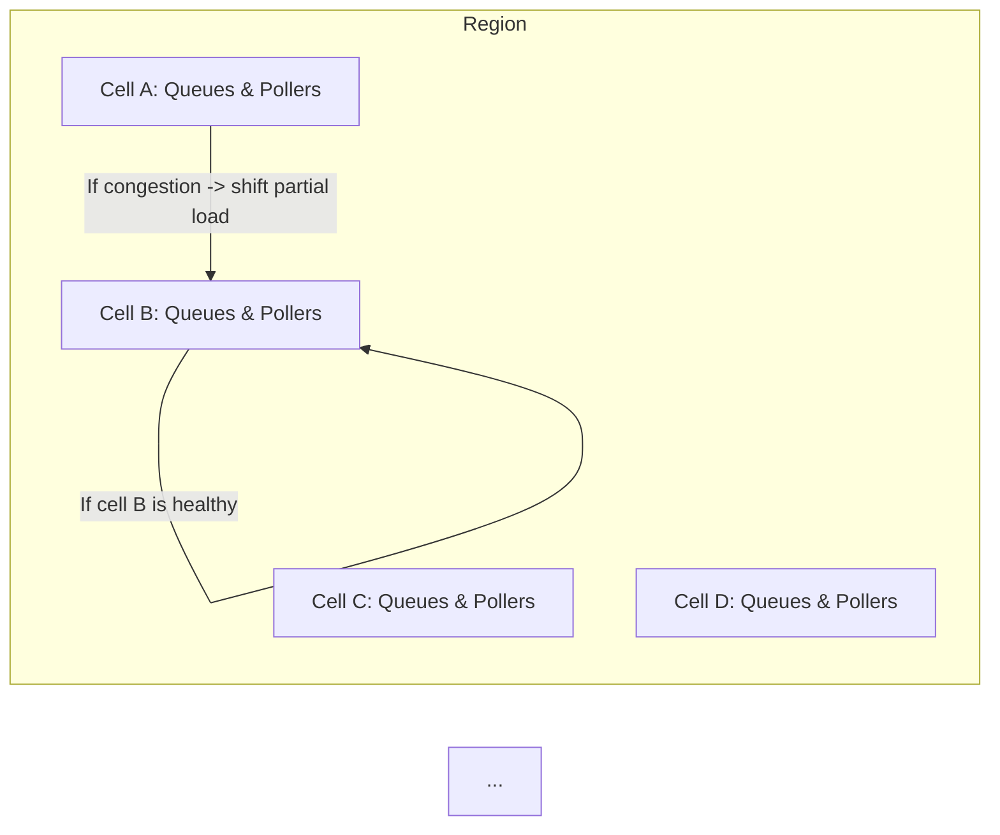

> **Context**  
> These notes summarize the discussion from **timecode 51:34** to the end of the transcript. We focus on how AWS Lambda uses **cellular architecture**, **shuffle sharding**, and advanced resource allocation/fairness strategies to ensure resilient operation at massive scale. We also discuss problematic (poison pill) events, operational readiness, and how AWS tests Lambda for reliability.

Some **typoss** included to simulate real note-taking.

---

## 31. Cellular Architecture in AWS Lambda

### 31.1 Containing Blast Radius

- **Cellular Architecture**: AWS Lambda divides each region into multiple **cells**.  
  - Each cell has its own set of queues, pollers, and compute hosts (Firecracker microVM hosts).  
  - If one cell experiences issues (e.g., hardware/network fault), it’s **isolated** from the others.  
- **Customer Partitioning**: Customer workloads are hashed across these cells, reducing the chance that a single cell’s issue affects all customers.  

**Visualization**:



> **Outcome**: Minimizes outage impact. If **Cell A** goes down, AWS can shift or reduce load in that cell, keep the rest running smoothly.

### 31.2 Shuffle Sharding & Best-of-Two

A technique to **distribute** load while isolating problem “neighbors”:

1. **Shuffle Sharding**: Randomly assigning each customer to a subset of resources (queues) with minimal overlap.  
2. **Best-of-Two**: When an event arrives, pick **2** candidate queues out of N, choose the emptiest (lowest depth). This drastically reduces collisions of “noisy” customers with others.

> **Example**: Overlaps become exponentially rare. If a big burst or infinite loop hits one queue, the chance of also affecting many other queues is low.

---

## 32. Handling Problematic Events & Poison Pills

### 32.1 Infinite Loops & Side-Lining

- **Infinite Loop Scenario**:  
  1. Customer’s Lambda writes processed data **back to the same S3 bucket**.  
  2. S3 generates another event, re-invokes the same Lambda → infinite recursion.  
- **Sideline or Separate**: If the system detects repeated errors/bursts from a single account, it can **move** that account’s traffic into dedicated queues or cells temporarily. This prevents large-scale cross-tenant impact.

> **Accidental vs. Intentional**: Some customers intentionally create continuous loops for iterative processing. Others do it by mistake. AWS Lambda now offers features to **break** the loop or detect it automatically.

### 32.2 Poison Pill Records

- **Ordered Streams** (e.g., Kafka, Kinesis, DynamoDB Streams) can get “stuck” on a bad record.  
- **Poison Pill**: A record that consistently fails your Lambda logic (e.g., invalid schema, invalid JSON).  
- **Dead-Letter / On-Failure** Destinations:
  - You can configure Lambda to move a failing record to a side queue (SQS or SNS).  
  - This ensures you don’t block the entire partition/stream from progressing.  
  - Meanwhile, operators can investigate the problematic record offline.

**Pseudo-code** (stream configuration):

```bash
aws lambda create-event-source-mapping \
  --function-name MyLambda \
  --batch-size 100 \
  --maximum-retry-attempts 2 \
  --destination-config '{"OnFailure":{"Destination":"arn:aws:sqs:us-east-1:12345:myDLQ"}}' \
  --event-source-arn arn:aws:kinesis:us-east-1:12345:stream/myStream
```

---

## 33. Operational Readiness & Observability

### 33.1 Observability Tools

- **CloudWatch Metrics**: Track invocation counts, error counts, duration, concurrency usage, and more.  
- **CloudWatch Logs**: Lambda automatically streams `stdout` and `stderr` for each invocation to CloudWatch.  
- **AWS X-Ray**: Enable distributed tracing for deeper insight into function calls, external API latency, etc.  
- **Lambda Extensions**: Pipe logs to third-party tools (e.g., Datadog, Splunk, etc.).  

> **Newer Features**:
> - **Live Tailing** in the Lambda console to see logs in near real-time.  
> - **Metric Filters** in CloudWatch can create custom dashboards or set alarms on specific log patterns.

### 33.2 Testing & Chaos Engineering

AWS has a **rigorous** operational readiness plan:
1. **Security Review**: Every new feature or permission change is thoroughly audited by specialized teams.  
2. **Performance/Load Testing**: Large-scale stress tests that simulate massive concurrency.  
3. **Chaos Scenarios**: Intentionally introduce network blips, cache failures, or partial AZ outages to confirm the system auto-recovers.  
4. **Steady State Testing**: Sustained high-throughput tests to ensure no hidden memory or performance regressions.

> **Design Principle**: “Baked-in” resilience. They assume certain things will fail **regularly**, so the system is designed to handle them automatically before customers notice.

### 33.3 Operational Checklists

- **Security**: Zero-trust approach, microVM isolation, continuous scanning for vulnerabilities.  
- **Availability**: The cell-based design ensures partial failures don’t become full-region outages.  
- **Latency**: Evaluate p99 (99th percentile) latencies for function invocations, poller scheduling, queue operations, etc.  
- **Latency vs. Throughput Trade-offs**: Tuning back pressure to avoid flooding or starving.

---

## 34. Large Events & Peak Traffic

### 34.1 No “Special” Prep for Black Friday?

- **Massive Scale**: AWS sees so many events worldwide that typical “peak events” (e.g., Black Friday, Prime Day) are just part of the baseline load.  
- **Peaks and Troughs** often overlap across time zones and different customers.  
- The system is designed to handle large surges with the same cell-based, dynamic scaling approach.

### 34.2 Provision Concurrency for Individual Customers

Even though AWS as a whole doesn’t do a special “Black Friday warmup,” **customers** can:

```bash
aws lambda put-provisioned-concurrency-config \
  --function-name critical-checkout \
  --qualifier 1 \
  --provisioned-concurrent-executions 50
```

- This ensures 50 instances are always “warm” during peak shopping times.

---

## 35. Biggest Challenges & Lessons Learned

### 35.1 Back Pressure & Fairness

- **One of the trickiest** problems at huge scale is balancing load among millions of accounts:
  - If you “underflow,” some functions see increased latency.  
  - If you “overflow,” some services are starved or hammered.  
  - Achieving the perfect “Goldilocks” zone requires advanced algorithms (e.g., circuit breakers, AIMD, exponential backoff).  
- **No Single Knob**: The system iterates with multiple partial solutions, blending best-of-two sharding, dedicated queueing for “noisy neighbors,” token buckets, etc.

### 35.2 Testing at Scale

- Doing something “billions of times” turns even a simple +1 operation into an engineering challenge.  
- **Cache invalidation, cross-cell data sharing, partial AZ outages** must be tested regularly, not just theoretical.

### 35.3 Simplicity Matters

- **Keep the design as simple as possible**. E.g., best-of-two is simpler than best-of-10 or best-of-100, but works well at scale.  
- Complexity grows fast; small changes can drastically affect multi-tenant fairness.

> “Some events we see are corner cases we never anticipated. Building robust fallback logic and chaos tests are essential.”  
> — Summarized from the conversation

---

## 36. Concluding Remarks

1. **Cellular Architecture** keeps the system resilient by isolating failures.  
2. **Shuffle Sharding** & best-of-two queues minimize cross-customer collisions.  
3. **Poison Pill** events get sidelined or dead-lettered, preventing entire streams from getting stuck.  
4. **Observability & Testing** are first-class: from unit tests to chaos engineering.  
5. **Scale is Constantly Evolving**: AWS aims to handle surges without special pre-warming, but you can use **Provisioned Concurrency** if you have guaranteed spikes.

```markdown
**Next Steps**:  
- Review advanced queueing patterns like shuffle sharding for your own multi-tenant systems.  
- Explore Poison Pill handling in your event-driven architecture (DLQ, re-drive, etc.).  
- Dive into AWS Step Functions for orchestrating multi-step or long-running workflows beyond 15 minutes.  
- Investigate the relevant re:Invent talks on cellular architecture and chaos engineering at AWS for deeper insights.
```

---

## 37. Additional References

- **AWS Official Docs**: 
  - [AWS Lambda Developer Guide](https://docs.aws.amazon.com/lambda/latest/dg/welcome.html)  
  - [Invoking Lambda Functions](https://docs.aws.amazon.com/lambda/latest/dg/invoking-lambda.html)  
- **Shuffle Sharding**: [Blog Post by AWS](https://aws.amazon.com/builders-library/shuffle-sharding)  
- **Poison Pill Handling**: [Event Source Mapping DLQ config](https://docs.aws.amazon.com/lambda/latest/dg/invocation-async.html#dlq)  
- **Chaos Engineering**: [Netflix Chaos Monkey blog](https://netflix.github.io/chaosmonkey/) (conceptual background)  
- **Andrew Warfield** Talk: *“Peaks and Troughs at Large Scale”* (concept referenced in the conversation).